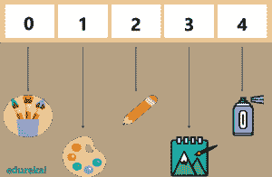
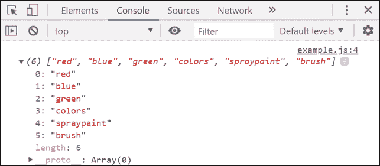
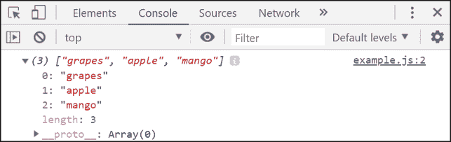
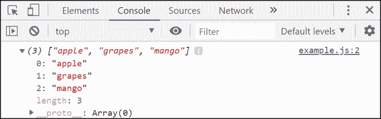
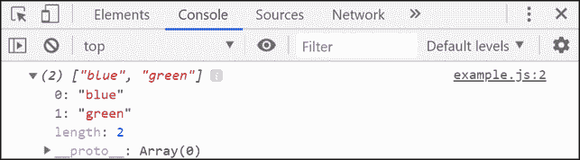

# 关于 JavaScript 数组方法您需要知道的一切

> 原文：<https://www.edureka.co/blog/javascript-array/>

[web 开发](https://www.edureka.co/masters-program/full-stack-developer-training)或者说 Web 编程催生了动态 Web 应用。随着网络的兴起，JavaScript 已经成为当今世界最重要的语言之一**。本期 **JavaScript 数组**文章将按以下顺序带你深入探讨 JavaScript 中的数组方法:**

*   [JavaScript 简介](#javascript)
*   [JavaScript 基础知识](#javascriptfundamentals)
*   [JavaScript 数组](#javascriptarray)
*   [数组和对象之间的差异](#arrayandobject)
*   [JavaScript 数组方法](#arraymethods)

## **JavaScript 简介**

JavaScript 是一种高级的、解释性的编程语言，用于使网页更具交互性。这是一个非常强大的客户端脚本语言，使您的网页更加生动和互动。


它是一种编程语言，可以帮助你在网页上实现复杂而漂亮的设计。如果你想让你的网页看起来活灵活现，不只是呆呆地看着你，JavaScript 是必须的。

## **JavaScript 基础知识**

如果你是这门语言的新手，你需要了解一些 JavaScript 的**基础知识，这将有助于你开始编写代码。基本要素包括:**

*   [变量](https://www.edureka.co/blog/javascript-tutorial/#variables)
*   [常数](https://www.edureka.co/blog/javascript-tutorial/#constants)
*   [数据类型](https://www.edureka.co/blog/javascript-tutorial/#datatypes)
*   [物体](https://www.edureka.co/blog/javascript-tutorial/#objects)
*   数组
*   [功能](https://www.edureka.co/blog/javascript-tutorial/#functions)
*   [条件语句](https://www.edureka.co/blog/javascript-tutorial/#conditionalstatements)
*   [循环](https://www.edureka.co/blog/javascript-tutorial/#loops)
*   [开关盒](https://www.edureka.co/blog/javascript-tutorial/#switchcase)

您可以查看 JavaScript 教程来深入了解 JavaScript 的这些基本概念和基础。在这篇 JavaScript Array 文章中，我们将重点关注用于定义项目列表的不同数组方法。

## **JavaScript 数组**

数组是一个 **数据结构** ，它包含一个元素列表，该列表在单个变量下存储多个值。

要在 JavaScript 中声明一个数组，请使用带有方括号的“”关键字，并将所有元素括起来。语法如下:

```

let ListItems=[];
ListItems=['shoes','watch','bag'];

```

也可以声明为:

```

let ListItems=['shoes','watch','bag'];

```

## **数组和对象之间的差异**

JavaScript 变量可以是对象。数组被认为是特殊类型的对象。因此，在同一个数组中可以有不同类型的变量。

```

myArray[0] = Date.now;
myArray[1] = myFunction;
myArray[2] = myItems;

```

在 JavaScript 中，**数组**使用**编号的索引**。而**对象**被用作**命名索引**。

## **JavaScript 数组方法**

使用**数组**的目的是将**多个值**存储在一个声明变量的**单个实体**中。当我们想用单个变量有序地访问元素时，就要用到数组。人们可以在一个数组中存储字符串、布尔值和数字。



有不同的 **JavaScript 数组方法**来执行各种任务，例如:

*   **push()**–在使用数组时，很容易删除元素和添加新元素。push()方法**将一个 **新元素** 添加到一个数组的**结尾。返回值是新的数组长度。****

****举例:****

```
 let listItems = ['bag','shoes','dress'];
console.log(listItems.push('watch')); 
```

****输出:****

```
4
```

**Push()不返回已经添加到数组中的值。它只返回数组的新长度。**

***   **pop()–**pop()方法用于**从数组中移除**最后一个元素。它返回已经弹出的值。** 

****举例:****

```
let listItems = ['bag','shoes','dress'];
console.log(listItems.pop()); 
```

****输出:****

```
dress
```

**Pop()返回被删除的值，而不是像 Push()那样返回数组长度。**

***   **shift()**–shift 类似于 popping，作用于第一个元素而不是最后一个元素。shift()方法用于**移除**第一个数组元素**并将所有其他元素移动到一个更低的索引。它将返回你已经移出的字符串。**** 

****举例:****

```
 let listItems = ['bag','shoes','dress'];
console.log(listItems.shift()); 
```

****输出:****

```
bag
```

**Shift()的工作方式与 pop()相同，但它返回数组的第一个元素，而不是最后一个元素。**

***   **unshift()**—[un shift()](https://www.edureka.co/blog/unshift-javascript-array-method/)方法**在数组**的**开头添加**新元素，并对旧元素进行 un shift。它类似于 Push()并返回新的数组长度。** 

****举例:****

```
 let listItems = ['bag','shoes','dress','watch'];
console.log(listItems.unshift('phone')); 
```

****输出:****

```
5
```

**Unshift()将把新元素添加到数组中，并返回新数组的长度。**

***   –concat()方法通过**连接**或合并现有数组来创建一个新数组。它不修改现有数组，总是返回一个新数组。** 

****举例:****

```
 let arr1 = ['red','blue','green'];
let arr2 = ['colors','spraypaint', 'brush'];
let newArr = arr1.concat(arr2);
console.log(newArr); 
```

****输出:****

****

***   **toString()**–toString()方法用于**将数组**转换为数组值的**字符串**，用逗号分隔。** 

****举例:****

```
 let colors = ['red','blue','green'];
console.log(colors.toString()); 
```

****输出:****

```
red,blue,green
```

***   **join()**–join()方法的工作原理与 toString()相同。它用于**将**所有数组元素连接成一个**字符串**，但是除此之外，你还可以指定**分隔符**。** 

****举例:****

```
 let colors = ['red','blue','green'];
console.log(colors.join("+")); 
```

****输出:****

```
red+blue+green
```

***   **reverse()**–reverse()方法用于**反转**数组中元素的**顺序**。它将改变原始数组并交换元素的顺序。** 

****举例:****

```
 let fruits = ['mango','apple','grapes'];
console.log(fruits.reverse()); 
```

****输出:****

****

***   **sort()**–使用 sort()方法对**中的**数组**按字母顺序**排序。默认情况下，该函数将值排序为字符串。** 

****举例:****

```
 let fruits = ['mango','apple','grapes'];
console.log(fruits.sort()); 
```

****输出:****

****

***   –slice()方法用于**切片**出一个数组的一片到一个新的数组中。它创建一个新数组，而不从源数组中移除任何元素。它将返回从数组中分割出来的值。** 

****举例:****

```
 let colors = ['red','blue','green','yellow','orange'];
console.log(colors.slice(1,3)); 
```

****输出:****

****

**这些是一些最常用的 JavaScript 数组方法。说到这里，我们的文章就到此为止了。我希望您理解了 JavaScript 中如何使用数组方法。**

***既然你已经了解了 JavaScript 数组方法，那就去看看 Edureka 的 **[Web 开发认证培训](https://www.edureka.co/complete-web-developer)** 。* *Web 开发认证培训将帮助您学习如何使用 HTML5、CSS3、Twitter Bootstrap 3、jQuery 和 Google APIs 创建令人印象深刻的网站，并将其部署到亚马逊简单存储服务(S3)。***

***有问题吗？请在“JavaScript 数组”的评论部分提到它，我们会回复您。***