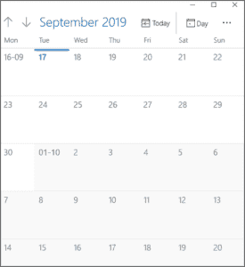

# 如何实现 JavaScript 日期方法？

> 原文：<https://www.edureka.co/blog/javascript-date-methods/>

当我们需要在 JavaScript 中处理日期和时间时，我们寻找像 *Date-fns* 和 *Moment* 这样的[库](https://www.edureka.co/blog/javascript-libraries/)。但是您可以在用 [JavaScript](https://www.edureka.co/blog/javascript-tutorial/) 编写代码时使用内置的 date 对象来访问当前日期或时间。在本文中，我们将按以下顺序讨论如何实现 JavaScript 日期对象:

*   [JavaScript 日期](#date)
*   [JavaScript 日期方法](#method)
*   [示例:JavaScript 中的日期](#example)

## **JavaScript 日期**

JavaScript date 对象用于获取年、月和日。借助 JavaScript date 对象，可以在网页上显示计时器。此外，您可以使用不同的日期构造函数来创建日期对象。这提供了获取和设置日、月、年、小时、分钟和秒的方法。



使用 Date()构造函数创建 Date 对象有不同的方法。

**语法:**

```
new Date( )
new Date(milliseconds)
new Date(datestring)
new Date(year,month,date[,hour,minute,second,millisecond ])
```

**参数:**

*   **无参数**—Date()构造函数创建一个设置为当前日期和时间的 Date 对象。
*   **毫秒**—当传递一个数字参数时，它被视为以毫秒为单位的日期的内部数字表示。
*   **datestring**——它是日期的字符串表示，格式为 **Date.parse()** 方法所接受的格式。
*   **年份**—该整数值代表年份。您应该始终指定完整的年份。
*   **月**—表示月份，从 0 表示 1 月，到 11 表示 12 月。
*   **日期**—日期用于表示一个月中的某一天。
*   **小时**—该整数值代表一天中的小时(24 小时制)。
*   **分钟**—表示时间读数的分钟段。
*   **秒**—这代表时间读数的第二段。
*   **毫秒**—这代表时间读数的毫秒段。

现在您已经知道了 JavaScript date 中使用的不同参数，让我们继续讨论不同的 JavaScript date [方法](https://www.edureka.co/blog/javascript-methods/)。

## **JavaScript 日期方法**

有不同的 JavaScript 日期方法，下面列出了它们的描述:

| **属性** | **描述** |
| **日期()** | 它返回今天的日期和时间。 |
| **getDate()** | 它根据本地时间返回指定日期中的某一天。 |
| **getDay()** | 这将根据本地时间给出指定日期的星期几。 |
| **年满期()** | 这将根据本地时间返回指定日期的年份。 |
| **getHours()** | 它根据本地时间返回指定日期中的小时。 |
| **getMilliseconds()** | 根据本地时间显示指定日期中的毫秒数。 |
| **getMinutes()** | 这将根据本地时间返回指定日期的分钟数。 |
| ** getMonth()** | 它根据本地时间返回指定日期的月份。 |
| **getSeconds()** | 根据本地时间返回指定日期中的秒。 |
| **getTime()** | 这将以自 1970 年 1 月 1 日 00:00:00 UTC 以来的毫秒数返回指定日期的数值。 |
| **getTimezoneOffset()** | 这将返回当前区域设置的时区偏移量，以分钟为单位。 |
| **年数()** | 它根据本地时间返回指定日期的年份。 |
| **设置日期()** | 用于根据本地时间为指定日期设置一个月中的某一天。 |
| **setFullYear()** | 它根据本地时间设置指定日期的整年。 |
| **setHours()** | 它根据本地时间设置指定日期的小时数。 |
| **setMilliseconds()** | 这将根据本地时间设置指定日期的毫秒数。 |
| **setMinutes()** | 根据本地时间设置指定日期的分钟数。 |
| ** setMonth()** | 它根据本地时间为指定日期设置月份。 |
| **setSeconds()** | 它根据本地时间设置指定日期的秒数。 |
| **setTime()** | 这会将 Date 对象设置为自 1970 年 1 月 1 日 00:00:00 UTC 以来以毫秒数表示的时间。 |

这些是一些最常用的日期方法。现在让我们举个例子，看看 JavaScript 中是如何使用日期对象的。

## **示例:JavaScript 中的日期**

让我们以打印日期/月份/年份为例:

```
<script>
var date=new Date();
var day=date.getDate();
var month=date.getMonth()+1;
var year=date.getFullYear();
document.write("<br>Date is: "+day+"/"+month+"/"+year);
</script>
```

**输出:**

```
Date is: 17/9/2019
```

现在，让我们举另一个例子来打印系统的当前时间:

```
Current Time: <span id="txt"></span>
<script>
var today=new Date();
var h=today.getHours();
var m=today.getMinutes();
var s=today.getSeconds();
document.getElementById('txt').innerHTML=h+":"+m+":"+s;
</script>
```

**输出:**

```
Current Time: 17:56:8
```

说到这里，我们的文章就到此为止了。我希望您了解 JavaScript 日期对象是如何使用的。

*查看我们的  [全栈 Web 开发人员硕士课程](https://www.edureka.co/masters-program/full-stack-developer-training) ，该课程包含讲师指导的现场培训和真实项目体验。本培训使您精通使用后端和前端 web 技术的技能。它包括关于 Web 开发、jQuery、Angular、NodeJS、ExpressJS 和 MongoDB 的培训。*

有问题要问我们吗？请在“JavaScript Date”博客的评论部分提到它，我们会给你回复。