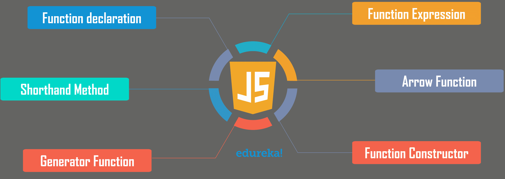

# 您需要了解的重要 JavaScript 函数

> 原文：<https://www.edureka.co/blog/javascript-functions/>

动态 web 应用是在 [Web 开发](https://www.edureka.co/masters-program/full-stack-developer-training)诞生后出现的。随着网络应用的日益流行， **JavaScript** 已经成为当今世界最重要的语言之一。这篇 JavaScript 函数的文章将按以下顺序解释在 JavaScript 中定义函数的不同方法:

*   [JavaScript 简介](#javascript)
*   [JavaScript 基础知识](#fundamentals)
*   [JavaScript 函数](#javascriptfunction)
*   [预定义功能](#predefinedfunction)
*   [定义 JavaScript 函数的不同方式](#definefunction)

## **JavaScript 简介**

JavaScript 是一种**高级**，**解释的编程语言**，用于使网页更具交互性。这是一个非常强大的客户端脚本语言，使您的网页更加生动和互动。


它是一种编程语言，可以帮助你在网页上实现复杂而美观的设计。如果你想让你的网页看起来活灵活现，不只是呆呆地看着你，JavaScript 是必须的。

## **JavaScript 基础知识**

如果你是这门语言的新手，你需要了解一些 JavaScript 的基础知识，这将有助于你开始编写代码。基本要素包括:

*   [变量](https://www.edureka.co/blog/javascript-tutorial/#variables)
*   [常数](https://www.edureka.co/blog/javascript-tutorial/#constants)
*   [数据类型](https://www.edureka.co/blog/javascript-tutorial/#datatypes)
*   [物体](https://www.edureka.co/blog/javascript-tutorial/#objects)
*   [阵列](https://www.edureka.co/blog/javascript-array/)
*   功能
*   [条件语句](https://www.edureka.co/blog/javascript-tutorial/#conditionalstatements)
*   [循环](https://www.edureka.co/blog/javascript-tutorial/#loops)
*   [开关盒](https://www.edureka.co/blog/javascript-tutorial/#switchcase)

可以查看  [JavaScript 教程](https://www.edureka.co/blog/javascript-tutorial/) 深入了解 JavaScript 的这些基本概念和基础知识。在这篇 JavaScript 函数文章中，我们将关注定义函数的不同方法。

## **JavaScript 函数**

JavaScript 函数是设计用来执行任何特定任务的代码块。您可以通过调用函数来执行它。这被称为**调用**或**调用**函数。

要使用一个函数，你必须在你希望调用它的范围内的某个地方定义它。这个想法是把一些经常执行的任务放在一起，组成一个函数，这样我们就可以调用那个特定的函数，而不是为不同的输入反复编写相同的代码。

在 JavaScript 中创建函数的基本**语法**如下:

```

function functionName(Parameter1, Parameter2, ..)
{
// Function body
}

```

JavaScript 由各种内置或**预定义的函数**组成。但是，它也允许我们创建用户定义的函数。因此，让我们继续，看看一些常用的预定义函数。

## **预定义功能**

JavaScript 有几个顶级内置函数。让我们来看看语言内置的一些函数。

| **功能** | **描述** |
| eval | 计算字符串/算术表达式并返回值。 |
| **ParseInt** | 分析字符串参数并返回指定基数的整数。 |
| **ParseFloat** | 分析字符串参数并返回浮点数。 |
| **逃跑** | 返回参数的十六进制编码。 |
| **联合国教科文组织** | 返回指定值的 ASCII 字符串。 |

让我们举个例子，看看这些预定义函数在 JavaScript 中是如何工作的:

```

var x = 10;
var y = 20;
var a = eval("x * y")  // Eval

var b = parseInt("10.00")  // ParseInt

var c = parseFloat("10")  // ParseFloat

escape("Welcome to Edureka") // Escape

unescape("Welcome to Edureka") // Unescape

```

## **定义 JavaScript 函数的不同方式**



可以用各种方法定义函数。检查函数如何与外部组件和调用类型交互是很重要的。不同的方式包括:

### **功能声明**

一个函数声明由一个**函数关键字**、一个强制函数名、一对括号中的一列**参数**和一对界定主体代码的花括号组成。

它被定义为:

```

// function declaration
function isEven(num) {
return num % 2 === 0;
}
isEven(24); // => true
isEven(11); // => false

```

函数 *isEven(num)* 是一个函数声明，用来判断一个数是否为偶数。

### **函数表达式**

函数表达式由一个**函数关键字**决定，后面跟着一个可选的函数名、一对括号中的参数列表和一对限定主体代码的花括号。

它被定义为:

```

const count = function(array) { // Function expression
return array.length;
}
const methods = {
numbers: [2, 5, 8],
sum: function() { // Function expression
return this.numbers.reduce(function(acc, num) { // func. expression
return acc + num;
});
}
}
count([1, 7, 2]); // => 3
methods.sum(); // => 15

```

函数表达式创建一个函数对象，可用于各种情况，如:

*   可以作为**对象:** count = function(…) {…}赋给**变量**
*   在对象 sum: function() {…}上创建一个**方法**
*   使用**函数**作为**回调:**。reduce(函数(…) {…})

### **速记方法定义**

速记方法定义在**对象文字**和 ES6 类的方法声明中使用。您可以使用一个名为的**函数来定义它们，后面是一系列**参数**，它们在一对括号和一对大括号中，用于限定主体语句。**

以下示例在对象文本中使用速记方法定义:

```

const collection = {
items: [],
add(...items) {
this.items.push(...items);
},
get(index) {
return this.items[index];
}
};
collection.add('edureka','Online', 'JavaScript');
collection.get(1) // => 'edureka'

```

相对于传统的财产定义，简写方法有几个好处，比如:

*   它有一个更短的语法,这使得它更容易读写。
*   这将创建命名函数，与函数表达式相反。对于**调试很有用。**

### **箭头功能**

使用一对包含参数列表的括号，后跟一个**粗箭头** (= >)和一对用于分隔主体语句的花括号来定义箭头函数。

下面的例子展示了箭头函数的基本用法:

```

const absValue = (number) => {
if (number < 0) { return -number; } return number; } absValue(-21); // => 21
absValue(7); // => 7

```

这里， *absValue* 是一个箭头函数，计算一个数的绝对值。

### **发电机功能**

JavaScript 中的 generator 函数返回一个**生成器**对象。语法类似于函数表达式、函数声明或方法声明。但这需要一个**明星人物(*)** 。

生成器函数可以用以下形式声明:

*   **函数声明表单函数* <名称> ():**

```

function* indexGenerator(){
var index = 0;
while(true) {
yield index++;
}
}
const g = indexGenerator();
console.log(g.next().value); // => 0
console.log(g.next().value); // => 1

```

*   **函数表达式形式函数* ():**

```

const indexGenerator = function* () {
let index = 0;
while(true) {
yield index++;
}
};
const g = indexGenerator();
console.log(g.next().value); // => 0
console.log(g.next().value); // => 1

```

*   **速记方法定义表* <姓名> ():**

```

const obj = {
*indexGenerator() {
var index = 0;
while(true) {
yield index++;
}
}
}
const g = obj.indexGenerator();
console.log(g.next().value); // => 0
console.log(g.next().value); // => 1

```

在所有三种情况下，生成器函数都返回对象 g 。然后用它来产生一系列递增的数字。

### **函数构造器**

当函数作为构造函数被调用时，一个**新函数**被创建。传递给构造函数的参数成为新函数的参数名。这里，最后一个参数被用作**函数体**代码。

例如:

```

function sum1(a, b) {
return a + b;
}
const sum2 = function(a, b) {
return a + b;
}
const sum3 = (a, b) => a + b;
console.log(typeof sum1 === 'function'); // => true
console.log(typeof sum2 === 'function'); // => true
console.log(typeof sum3 === 'function'); // => true

```

这些是在 JavaScript 中定义函数的不同方法。说到这里，我们的文章就到此为止了。我希望你了解什么是 JavaScript 函数以及定义它们的不同方法。

*既然你已经了解了 JavaScript 函数，那就去看看 Edureka 的 **[Web 开发认证培训](https://www.edureka.co/complete-web-developer)** 。* *Web 开发认证培训将帮助您学习如何使用 HTML5、CSS3、Twitter Bootstrap 3、jQuery 和 Google APIs 创建令人印象深刻的网站，并将其部署到亚马逊简单存储服务(S3)。*

*有问题吗？请在“JavaScript 函数”的评论部分提到它，我们会给你回复。*