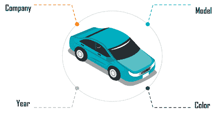

# 关于 JavaScript 对象，您需要知道的是

> 原文：<https://www.edureka.co/blog/javascript-object/>

JavaScript 是一种面向对象的编程语言。对象形成了被认为是编程语言最重要的数据类型的构建模块。这篇文章将提供关于 JavaScript 对象的深入知识，它们是如何按照以下顺序创建和定义的:

*   [JavaScript 对象](#javascriptobject)
*   [如何创建新对象？](#createnewobject)
*   [属性](#properties)
*   [方法](#methods)
*   [访问者](#accessors)
*   [原型](#prototypes)

## **JavaScript 对象**

对象类似于现实生活中的对象，由不同的属性和特性组成。这些对象被定义为相关数据的无序集合，属于原始或引用类型。这些是以“键:值”对的形式定义的。


这些键是变量或[函数](https://www.edureka.co/blog/javascript-functions/)，它们被称为对象的属性和方法。你可以创建一个 JavaScript 对象如下:

```

let ObjectName = {
Property1 : "Value",
Property2 : "Value",
...
...
}

```

## **如何创建新对象？**

创建新对象有三种方式:

*   **按对象文字**

**语法:**

```

object={property1:value1,property2:value2.....propertyN:valueN}

```

**举例:**

```
<script>  
employee={id:700,name:"Evan",salary:30000}  
document.write(employee.id+" "+employee.name+" "+employee.salary);  
</script>  

```

**输出:**

```
700 Evan 30000
```

*   **通过创建对象**的实例

**语法:**

```

var objectname=new Object();

```

**举例:**

```
<script>  
var emp=new Object();  
emp.id=701;  
emp.name="Karan";  
emp.salary=40000;  
document.write(emp.id+" "+emp.name+" "+emp.salary);  
</script>  

```

**输出:**

```
701 Karan 40000
```

*   **通过使用对象构造函数**

函数是用参数创建的。每个参数值可以在当前对象中通过使用**这个**关键字来赋值。

**举例:**

```
<script>  
function employee(id,name,salary){  
this.id=id;  
this.name=name;  
this.salary=salary;  
}  
emp=new employee(702,"Neha",35000);  

document.write(emp.id+" "+emp.name+" "+emp.salary);  
</script>  

```

**输出:**

```
702 Neha 35000
```

## **属性**

一个对象的**属性**是一个**变量**附加到该对象上。除了对对象的附加之外，它们基本上与 JavaScript 变量相同。



对象的属性定义了对象的特征。您可以使用简单的点符号来访问对象的属性，例如:

```

objectName.propertyName

```

您可以通过为属性赋值来定义属性。例如，让我们创建一个名为 *Car* 的对象，并赋予它类似 *company、*model 和 *color* 的属性。可以定义为:

```

var Car = new Object();
Car.company = 'Ford';
Car.model = 'Mustang';
Car.color = 'Red';

```

## **方法**

一个**方法**是一个与对象相关联的**函数**。它也是一个对象的属性。方法被定义为普通的函数，但是它们必须被指定为对象的**属性**。

可以通过以下方式访问 object 方法:

```

objectName.methodName()

```

**举例:**

```

var person = {
firstName: "Tessa",
lastName : "Den",
empid : 7100,
fullName : function() {
return this.firstName + " " + this.lastName;
}
};

```

**输出:**

```
Tessa Den
```

一些常用的内置方法有:

| **方法** | **描述** |
| **Object.assign()** | 用于将源对象的可枚举属性和自身属性复制到目标对象 |
| **Object.create()** | 它用于创建具有指定原型对象和属性的新对象 |
| **Object.defineProperty()** | 它用于定义属性的行为属性 |
| **Object.entries()** | 它返回一个带有键&值对的[数组](https://www.edureka.co/blog/javascript-array/) |
| **Object.freeze()** | 它防止现有属性被删除 |

**访问者**

JavaScript 访问器由用于定义对象访问器的**获取器**和**设置器**组成。

*   **Get 关键字**

让我们举个例子，看看如何使用 **Getters** 来**获取**属性的任何值:

```

var person = {
firstName: "Daisy",
lastName : "Green",
empid : 401,
get id() {
return this.empid;
}
};
document.getElementById("demo").innerHTML = person.id;

```

**输出:**

```
401

```

*   **设置关键字**

让我们举一个例子，看看**设置器**是如何用于**设置**属性的任何值的:

```

var person = {
firstName: "Daisy",
lastName : "Green",
empid : 00,
set id(value) {
this.empid = value;
}
};
person.id = 401;
document.getElementById("demo").innerHTML = person.empid;

```

**输出:**

```
401
```

## **原型**

所有 JavaScript 对象都从原型继承属性和方法。例如:

*   **日期**对象继承自**日期.原型**
*   **数组**对象继承自**数组.原型**
*   **人物**对象继承自**人物.原型**

JavaScript **原型**属性用于向对象构造函数添加新属性。

**举例:**

```

function Person(first, last, id, age) {
this.firstName = first;
this.lastName = last;
this.empid = id;
this.age = age;
}

Person.prototype.nationality = "Indian";

```

prototype 属性还允许您向对象构造函数添加新方法。

**举例:**

```

function Person(first, last, id, age) {  //Adding methods to constructors
this.firstName = first;
this.lastName = last;
this.empid = id;
this.age = age;
}
Person.prototype.name = function() {
return this.firstName + " " + this.lastName;
};

```

您可以修改自己的原型，但不能修改标准 JavaScript 对象的原型。

说到这里，我们的文章就到此为止了。我希望您理解了 JavaScript 对象和定义它们的不同方法。

*既然你已经了解了 JavaScript 对象，那就来看看 Edureka 的 **[Web 开发认证培训](https://www.edureka.co/complete-web-developer)** 。* *Web 开发认证培训将帮助您学习如何使用 HTML5、CSS3、Twitter Bootstrap 3、jQuery 和 Google APIs 创建令人印象深刻的网站，并将其部署到亚马逊简单存储服务(S3)。*

*有问题吗？请在“JavaScript 对象”的评论部分提到它，我们会回复您。*