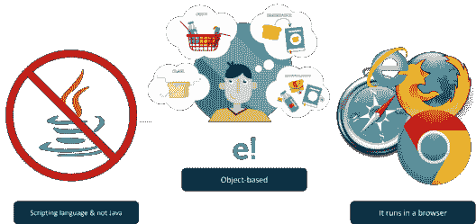
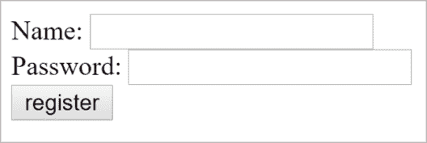
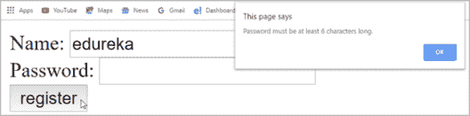
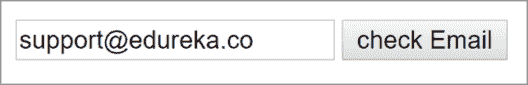

# JavaScript 验证:关于验证表单和电子邮件您需要知道的一切

> 原文：<https://www.edureka.co/blog/javascript-validation/>

JavaScript 是全栈 T2、前端和后端开发中最流行的语言之一。它被用来创建设计精美的网站。在 JavaScript 中，验证用于认证用户。在这篇 **JavaScript 验证**文章中，您将按以下顺序学习表单验证:

*   [JavaScript 是什么？](#javascript)
*   [JavaScript 中的函数](#javascriptfunctions)
*   什么是验证？
*   [JavaScript 表单验证](#validationexample)
*   [JavaScript 电子邮件验证](#emailvalidation)

## **JavaScript 是什么？**

[JavaScript](https://www.edureka.co/blog/javascript-tutorial/) 是一种**高级，解释型**编程语言，用来使网页更具交互性。它是一种非常强大的**客户端**脚本语言 让你的网页更加生动，更具互动性。


它是一种编程语言，帮助你在**网页**上实现**复杂的**和漂亮的设计。如果你想让你的网页看起来活灵活现，不只是呆呆地看着你，JavaScript 是必须的。

### **JavaScript 的特性:**



*   它是一种脚本语言，与 [Java](https://www.edureka.co/blog/java-tutorial/) 无关。最初命名为**摩卡**，后来改为 **LiveScript** ，最后命名为 **JavaScript** 。

*   JavaScript 是一种基于对象的编程语言，支持多态、封装和继承。

*   你不仅可以在**浏览器**中运行 JavaScript，还可以在**服务器**和任何有 JavaScript 引擎的设备上运行。

## **JavaScript 函数**

JavaScript 中基本的**构件**被称为**函数**。它基本上是一组执行任务或计算值的语句。要使用一个函数，应该在你希望调用它的作用域中的某个地方定义它。


函数定义由 function 关键字组成，后跟:

*   函数的**名**。

*   函数的**参数**列表，用括号括起来，用逗号分隔。

*   定义函数的 JavaScript **语句**，用花括号括起来，{ }。

让我们举个例子，看看如何定义一个名为 **add** 的函数:

```

function add(a,b) {
return a+b;
}

```

现在，为了验证用户，使用了一个验证函数。因此，让我们继续学习更多关于 JavaScript 验证的知识。

### 什么是验证？

验证是一种对用户进行认证的方法。JavaScript 提供了在客户端验证表单的工具，因此数据处理将比服务器端验证更快。这是大多数 web 开发人员的首选。通过 JavaScript，我们可以验证姓名、密码、电子邮件、日期、手机号码和更多字段。


**客户端**验证防止客户端在重新加载页面之前知道表单是否可以。然而，**服务器端的**验证非常重要，因为客户端的验证可以通过关闭 JavaScript 来完全绕过。

现在让我们继续我们的 JavaScript 验证文章，看看表单验证的例子。

## **JavaScript 验证:示例**

以下示例是用 HTML、CSS 和 JavaScript 编写的代码，用于验证表单，其中:

1.  **HTML** 用于**创建**表单。
2.  **JavaScript** 用于**验证**表单。

FormValidation.html

```
<html>
 <head>
  <title>form validation</title>
    <script>  
     /**/
     </script> 
 </head> 
<body>
 <form name="myform" method="post" action="Text.html" onsubmit="return validateform()"
 Name: <input type="text" name="name"><br/>
 Password: <input type="password" name="password"><br/>
 <input type="submit" value="register"></form>
</body>

```

这将产生以下输出:



现在，你需要创建另一个文件，在点击**提交**按钮后，**将页面重定向**到一个新的页面。

Text.html

```
<html>
 <head>
  <title>Form Validation</title>
   <script type="text/javascript">
   /**/
   </script>
 </head>
 <body> 
 <h1> Welcome to Edureka </h1>
 </body>
</html>

```

它将重定向到另一个页面，并给出以下**输出**:


现在，我们需要在 JavaScipt 中添加一个**函数**来链接输入 id。如果任何字段留空，将弹出一条**警告**消息。

```
function validateform(){
 var name=document.myform.name.value;
 var password=document.myform.password.value;
if (name==null || name==""){
 alert("Name can't be blank");
return false;
}
else if(password.length<6){
 alert("Password must be atleast 6 characters long.");
return false;
}
}

```

当**名称字段**为空时，将弹出以下**警报**:


接下来，如果您输入姓名，并将**密码字段**留空，将弹出以下**警报**:



一旦您以正确的格式添加了用户名和密码，该页面将被重定向到**最终输出的 Text.html 页面。**

**表单验证**的完整代码如下:

```
<html>
 <head>
  <title>form validation</title>
   <script>  
     function validateform(){
       var name=document.myform.name.value;
       var password=document.myform.password.value;
if (name==null || name==""){
 alert("Name can't be blank");
return false;
}
else if(password.length<6){
 alert("Password must be atleast 6 characters long.");
return false;
}
}
  </script> 
 </head> 
<body>
 <form name="myform" method="post" action="Text.html" onsubmit="return validateform()"
   Name: <input type="text" name="name"><br/>
   Password: <input type="password" name="password"><br/>
  <input type="submit" value="register">
 </form>
</body>

```

这是 JavaScript 中表单验证的一个例子。我们还可以验证电子邮件 id，密码，手机号码和更多。

因此，让我们再举一个例子，看看如何使用 JavaScript 验证**电子邮件 id** 。

## **JavaScript 电子邮件验证**

Email.html

```

function ValidateEmail(inputText)
{
 var mailformat = /^w+([.-]?w+)*@w+([.-]?w+)*(.w{2,3})+$/;
  if(inputText.value.match(mailformat))
{
document.form1.text1.focus();
return true;
}
else
{
 alert("You have entered an invalid email address!");
 document.form1.text1.focus();
return false;
}
}

```

**输出**



至此，我们已经结束了 JavaScript 验证文章。我希望您发现这篇博客内容丰富，并对 JavaScript 验证有了基本的了解。

此外，不要忘记查看由 Edureka 提供的[全栈网络开发人员硕士项目](https://www.edureka.co/masters-program/full-stack-developer-training)。*有问题吗？请在“JavaScript 验证”的评论部分提到它，我们会回复您。*