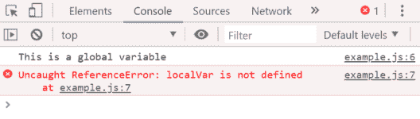

# 什么是 JavaScript 变量，如何声明？

> 原文：<https://www.edureka.co/blog/javascript-variable/>

就像在代数中一样，我们在编程语言中使用变量来保存值。 [JavaScript](https://www.edureka.co/blog/javascript-tutorial/) 包含用于保存数据值的变量，并且可以随时更改。在本文中，我们将讨论不同的 JavaScript 变量，以及这些保留关键字如何按以下顺序用作变量:

*   [什么是 JavaScript 变量？](#variable)
*   [如何声明一个变量？](#declare)
*   [标识符](#identifiers)
*   [JavaScript 变量范围](#scope)
*   [保留字](#reservedwords)

## **什么是 JavaScript 变量？**

变量可以作为命名容器来调用。您可以将数据放入这些容器中，然后通过命名容器来引用数据。它保存可重用的数据，也称为程序中的基本存储单元。

*   存储在变量中的值可以在程序执行期间更改。
*   变量只是给一个内存位置的名字。所有对变量的操作都会影响内存位置。
*   变量必须先声明，然后才能在 JavaScript 中使用。

您可以在 JavaScript 中创建变量，如下所示:

```

var var_name;
var x;

```

这里，x 是一个变量名，可以用来存储任何值。也可以将多个变量声明为:

```

var name, title, empid;

```

## **如何声明一个 JavaScript 变量？**

JavaScript 也允许没有 var 关键字的变量声明。但是，当您声明一个没有 var 关键字的变量时，您必须赋值。

```

empid = 701;

```

虽然，不建议声明没有 var 关键字的变量。它可能会意外覆盖现有的全局变量。

## **JavaScript 标识符**

您需要用唯一的名称来标识 JavaScript 变量。这些唯一的名称称为标识符。您可以为您的标识符提供简称或描述性名称。在命名 JavaScript 标识符时，您必须记住一些规则:

*   名称可以包含字母、数字、下划线和美元符号
*   名称必须以字母开头
*   标识符名称也可以以$和 _
*   名称区分大小写。因此，Y 和 Y 是不同的变量
*   保留字不能用作名称

## **JavaScript 变量作用域**

变量的作用域是程序中可以直接访问变量的部分。JavaScript 中有两种类型的作用域:

**全局范围**–全局变量具有全局范围，这意味着它可以在 JavaScript 代码中的任何地方定义。

**举例:**

```

<script>  
var data=100;//gloabal variable  
function one(){  
document.writeln(data);  
}  
function two(){  
document.writeln(data);  
}  
one();//calling JavaScript function  
two();  
</script> 

```

**局部范围**–局部变量只在定义它的函数中可见。函数参数总是该函数的局部参数。

**举例:**

```

<script>
function localvar(){
var x=20;//local variable
}
</script>

Let&rsquo;s have a look at the following example:

let globalVar = "This is a global variable";
function fun() {
let localVar = "This is a local variable";
}
fun();
console.log(globalVar);
console.log(localVar);

```

它将给出如下输出:



console.log 语句出现在全局范围内，它们可以访问全局变量，但不能访问局部变量。

## **保留字**

保留字不能用作 JavaScript 变量、[函数](https://www.edureka.co/blog/javascript-functions/)、[方法](https://www.edureka.co/blog/javascript-array/)、[循环](https://www.edureka.co/blog/javascript-loops/)标签或任何[对象](https://www.edureka.co/blog/javascript-object/)名称。以下是 JavaScript 中此类保留字的列表:

| **摘要** | **字节** | **最后** | **功能** | **实现** |
| **否则** | **延伸** | **null** | **受保护的** | **短** |
| **的实例** | **龙** | **真** | **在**处 | **而** |
| **开关** | **投掷** | **类** | **调试器** | **做** |
| **布尔型** | **假** | **浮动** | **转到** | **导入** |
| **枚举** | **原生** | **包** | **公共** | **静态** |
| **int** | **投掷** | **试试** | **作废** | **同** |
| **同步** | **接住** | **常数** | **默认** | **double** |
| **突破** | **决赛** | **为** | **如果** | 中的 |
| **导出** | **新** | **私人** | **返回** | **超级** |
| **界面** | **瞬态** | **类型** | **易挥发** |  |
| **这个** | **字符** | **继续** | **删除** |  |

说到这里，我们的文章就到此为止了。我希望你明白什么是 JavaScript 变量，以及如何使用它。

*既然你已经了解了 JavaScript 循环，那就去看看 Edureka 的 **[Web 开发认证培训](https://www.edureka.co/complete-web-developer)** 。* *Web 开发认证培训将帮助您学习如何使用 HTML5、CSS3、Twitter Bootstrap 3、jQuery 和 Google APIs 创建令人印象深刻的网站，并将其部署到亚马逊简单存储服务(S3)。*

*有问题吗？请在“JavaScript 变量”的评论部分提到它，我们会给你回复。*