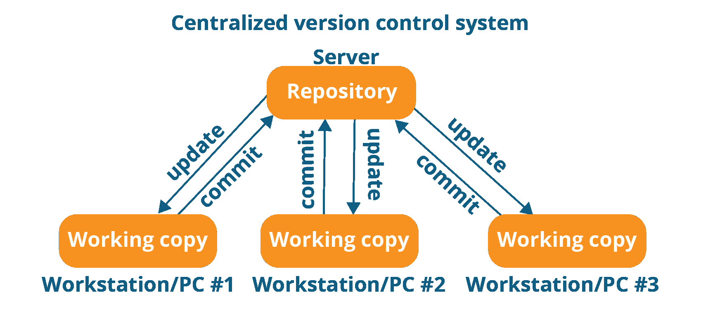
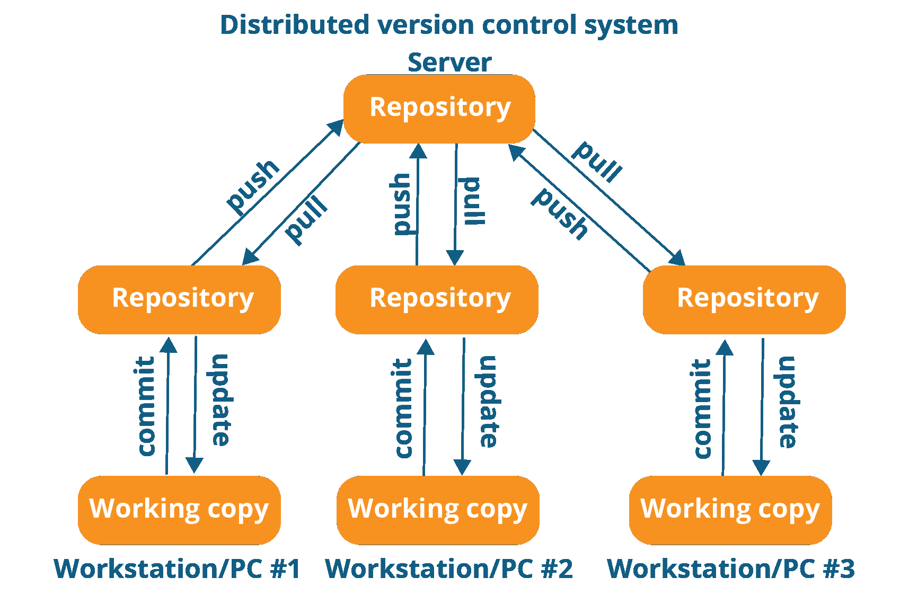
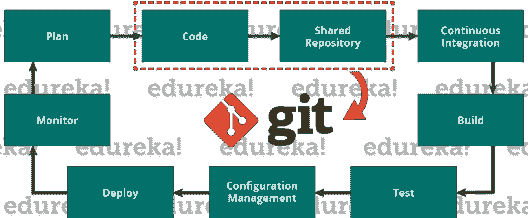
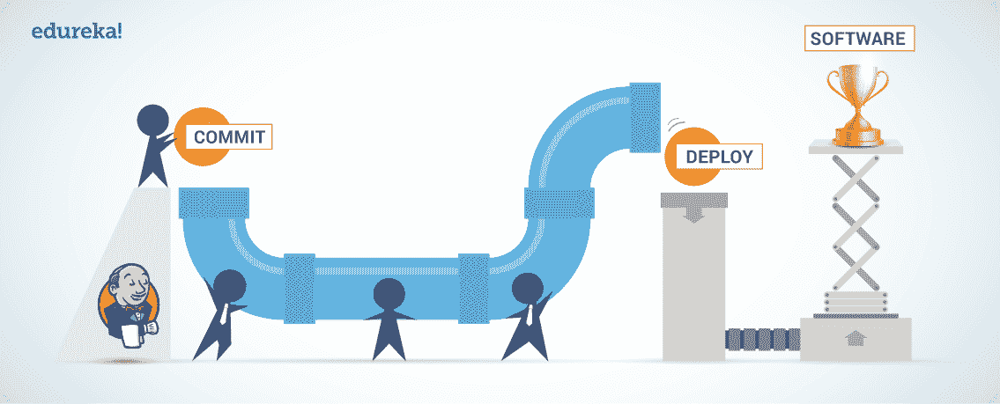

# Jenkins Git 集成–对每个 DevOps 专业人员都有用

> 原文：<https://www.edureka.co/blog/jenkins-git-integration/>

*[DevOps](https://www.edureka.co/devops-certification-training)* 没有詹金斯肯定是不完整的。Jenkins 和 Git 是一个很好的组合。所以在这篇文章中，我将谈谈 Jenkins Git 集成及其优势。我们将要涉及的要点如下:

*   [Git 是什么？](#git)
*   [詹金斯是什么？](#jenkins)
*   [为什么詹金斯和 Git 一起使用？](#why)
*   [演示。](#demo)

让我们从第一个话题开始。

## **什么是 Git——为什么 Git** **会出现？** 

我们都知道“需要是所有发明之母”。类似地，Git 的出现是为了满足开发人员在 Git 出现之前所面临的某些需求。所以，让我们后退一步来了解版本控制系统(VCS)以及 Git 是如何出现的。

**版本控制**是对文档、计算机程序、大型网站和其他信息集合的更改的管理。

VCS 有两种类型:

*   集中版本控制系统(CVCS)

*   分布式版本控制系统(DVCS)

### 集权的 VCS

集中式版本控制系统(CVCS)使用中央服务器来存储所有文件并支持团队协作。它在单个存储库上工作，用户可以直接访问中央服务器。

请参考下图，更好地了解 CVCS:

上图中的存储库表示一个中央服务器，它可以是本地的，也可以是远程的，直接连接到每个程序员的工作站。

每个程序员都可以用存储库中的数据提取或更新他们的工作站。他们还可以对数据进行修改，或者**将**提交给存储库。每个操作都是直接在存储库上执行的。

尽管维护一个单一的存储库似乎很方便，但它有一些主要的缺点。其中有:

*   当地没有；这意味着您总是需要连接到网络才能执行任何操作。

*   由于一切都是集中的，在任何情况下，中央服务器崩溃或损坏都会导致项目的全部数据丢失。

这就是分布式 VCS 解决问题的地方。

### **分发 VCS**

这些系统不一定依赖中央服务器来存储项目文件的所有版本。 在分布式 VCS 中，每个贡献者都有一个主存储库的本地副本或“克隆”。在这里，每个人都维护自己的本地存储库，其中包含主存储库中的所有文件和元数据。

参考下图，你会更好地理解它:

正如你在上面的图表中看到的，每个程序员都维护着自己的本地存储库，它实际上是中央存储库在他们硬盘上的拷贝或克隆。他们可以不受任何干扰地提交和更新他们的本地存储库。

他们可以通过名为“**拉**的操作，用来自中央服务器的新数据更新他们的本地存储库，并通过名为“**推**的操作，从他们的本地存储库影响对主存储库的更改。

现在让我们试着了解一下 Git 的定义。

*   Git 是一个分布式版本控制工具，它通过为开发高质量软件提供数据保证来支持分布式非线性工作流。像 Git 这样的工具支持开发和操作团队之间的交流。

*   通常，当你开发一个大项目时，你会有大量的合作者。因此，在项目中进行变更时，合作者之间的沟通非常重要。

*   Git 中的提交消息在团队交流中扮演着非常重要的角色。除了交流之外，使用 Git 最重要的原因是您总是随身携带代码的稳定版本。

*   因此，Git 在 DevOps 的成功中起着至关重要的作用。

## **詹金斯是什么？**

## ****

Jenkins 是一个用 Java 编写的开源自动化工具，带有用于持续集成的插件。Jenkins 用于不断构建和测试您的软件项目，使开发人员更容易将更改集成到项目中，并使用户更容易获得新版本。它还允许您通过集成大量的测试和部署技术来持续地交付您的软件。

有了 Jenkins，组织可以通过自动化加速软件开发过程。Jenkins 集成了所有类型的开发生命周期过程，包括构建、文档、测试、打包、登台、部署、静态分析等等。

Jenkins 借助插件实现持续集成。插件允许集成各种 DevOps 阶段。如果你想集成一个特定的工具，你需要安装这个工具的插件。比如 Git，Maven 2 项目，亚马逊 EC2，HTML publisher 等。

### **詹金斯的优势包括:**

*   这是一款开源工具，拥有强大的社区支持。

*   太容易安装。

*   它有 1000 多个插件来简化你的工作。如果一个插件不存在，你可以把它编码并分享给社区。

*   这是免费的。

*   它是用 Java 构建的，因此可以移植到所有主流平台上。

您现在知道 Jenkins 如何克服传统 SDLC 的缺点。下表是“詹金斯前后”的对比。

| 在詹金斯之前 | 在詹金斯之后 |
| 整个源代码被构建，然后被测试。在构建和测试失败的情况下定位和修复 bug 是困难和耗时的，这反过来又会减慢软件交付过程。 | 源代码中的每个提交都经过构建和测试。因此，开发人员只需要关注特定的提交，而不是检查整个源代码。这导致了频繁的新软件发布。 |
| 开发人员必须等待测试结果 | 开发人员知道运行时源代码中每一次提交的测试结果。 |
| 整个过程都是手动的 | 你只需要提交对源代码的修改，Jenkins 会为你自动完成剩下的过程。 |

## **为什么詹金斯和 Git 一起使用？**

如前所述， [Git](https://git-scm.com/) 是一个源代码管理器。这是您保存源代码的地方，用于跟踪所有随时间发生的代码变更，并在版本准备好发布时为其建立基线。

[詹金斯](https://jenkins.io/)则相反，是一个持续集成的解决方案。它被设计用来自动化开发人员在开发新应用程序时必须完成的大部分任务(代码质量检查、构建、构建工件的归档、集成测试、部署到各种环境等)。)没有 CI 解决方案，开发人员必须花费大量时间来做这些重复性的非生产性任务。

### **优点:**

*   Git 和 Jenkins 都非常强大，但是强大的力量也意味着巨大的责任。仅仅因为可以，就证明构建管道中不必要的**复杂性是合理的，这是很常见的。**
*   虽然 Jenkins 有很多巧妙的技巧，但是很容易利用 Git 的特性，因为随着时间的推移，它使发布管理和 **bug 跟踪变得更加容易**。
*   我们可以通过小心我们构建的代码版本并适当地标记它们来做到这一点。这使得**发布相关的信息接近代码**，而不是依赖于 Jenkins 构建号或其他名字。
*   保护 Git 分支**降低了人为错误的风险**，并且尽可能多地自动化任务减少了我们不得不纠缠(或等待)那些人的频率。

### **举例:**

让我们以 web 应用程序中的新功能为例。开发人员将被确定并分配到任务中，他从源代码控制中获取现有的代码库——比如 Git，进行更改，执行单元测试，手动确保代码质量，并将新代码签入 Git。

然后，他必须构建代码，将其部署到集成实例中，运行集成测试，一旦更改看起来令人满意，就提出生产部署的请求。现在，如果我们有一个仆人来负责这个测试、构建、质量检查和部署部分，可怜的开发人员可以更好地专注于他真正擅长的事情——实现和改进功能的逻辑。

这个宠臣是詹金斯。一旦变更被签入到源代码控制(Git)中，它就作为一个协调器来运行所有这些活动，从而向开发人员提供快速反馈，以确定他所做的变更是否足以用于生产部署。这是一款极其灵活的开源软件，拥有大量的插件，几乎可以做任何你想让它做的事情。

## **演示**

在这里，我们将看到如何集成 Git 和 Jenkins。您必须遵循 5 个步骤:

### **1。创建一个示例程序:**

你可以创建任何你想要的示例程序，如 Java 或 Python 或任何其他程序。这里我们将编写一个简单的 **Python 程序**打印 Hello，World！

### **2。创建一个詹金斯作业:**

*   这里首先你需要使用命令提示符**启动 Jenkins** 。

*   为此，首先需要导航到系统上的 Jenkins 位置，并使用命令 **java -jar jenkins.war**

*   运行这个命令后，打开 web 浏览器，使用链接 **localhost:8080** 转到 Jenkins 的主页。这是默认端口号。

*   通过**输入用户名和密码打开 Jenkins 主页。**

*   创建项目时，点击**新项目**，输入**项目名称**，选择**自由式项目**。**点击确定。**

### **3。将此程序添加到 Github:**

*   在你的系统上打开 git bash 。**导航**到您的程序所在的位置。使用命令 **git init** 初始化一个空的存储库。

*   使用命令 **git add。**将文件从工作目录添加到暂存区。

*   现在使用命令**git commit-m " demo . py file added "**将文件添加到本地存储库中。

*   现在您必须**将这个文件推**到远程存储库。为此，请访问您的 GitHub 帐户并创建一个新的公共存储库。现在复制这个存储库的位置并转到 git bash 终端。在这里输入命令**git remote add origin<location-of-repository>**。既然现在您已经连接到了远程存储库，那么现在您可以使用命令 **git push -u origin master 将您的代码推送到那里。**要验证这一点，请访问 GitHub 帐户并刷新页面。您将看到文件被添加到那里。

### **4。在 Jenkins 中添加 Git 插件:**

*   在 Jenkins 的主页上，进入**管理 Jenkins** 。

*   接下来点击**管理插件**。在这里检查在安装部分得到 Git 插件。如果此处没有，请在可用部分搜索并下载。

### **5。配置 Jenkins 作业以触发构建:**

*   转到我们在步骤 2 中创建的 Jenkins 中的项目。在源代码管理部分，**选择 git** 并输入您在步骤 3 中创建的公共存储库的链接。接下来在**构建触发器部分**，点击**轮询 SCM 选项**。在 Schedule 部分，您必须输入五个星号，用空格隔开。这只是您工作的 cron 语法。这意味着 Jenkins 将每分钟检查源代码中的任何变化，如果有任何变化，它将触发 Jenkins 构建。

*   点击**应用**，然后点击**保存**。接下来在你的项目主页上点击**立即构建**。这将运行项目，在控制台输出中，您可以看到您的程序输出您的 Jenkins 作业的状态。如果一切正常，它将显示为**成功**。

这就是 Jenkins Git 集成的完成方式。至此，我们结束了这篇关于 Jenkins Git 集成的文章。我希望你喜欢这篇文章。

现在您已经了解了什么是 *Jenkins Git Integration* ，请查看 Edureka 的 [DevOps 培训](https://www.edureka.co/devops-certification-training)，edu reka 是一家值得信赖的在线学习公司，在全球拥有超过 250，000 名满意的学习者。Edureka DevOps 认证培训课程帮助学员了解什么是 DevOps，并获得各种 DevOps 流程和工具方面的专业知识，例如 Puppet、Jenkins、Nagios、Ansible、Chef、Saltstack 和 GIT，用于自动化 SDLC 中的多个步骤。

有问题要问我们吗？请在评论区提及，我们会尽快回复您