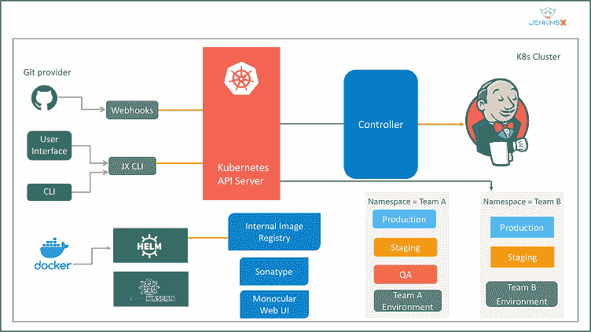

# 詹金斯 X 是什么，和詹金斯有什么不同？

> 原文：<https://www.edureka.co/blog/jenkins-x/>

Jenkins 是最著名的持续集成工具之一，也是 DevOps 不可或缺的一部分，经常用来集成各种 ***[DevOps 阶段](https://www.edureka.co/devops-certification-training)*** 。随着詹金斯的成功，一个新版本的詹金斯最近被称为詹金斯 X (JX)。它向 [Kubernetes](https://www.edureka.co/blog/kubernetes-tutorial/) 提供持续集成、自动化测试和持续交付。通过这篇文章，我将为您提供对 Jenkins X 的全面了解，我们将涉及的主题如下:

*   [詹金斯 X 是什么？](#what)
*   [詹金斯 Vs 詹金斯 X](#jvsjx)
*   [詹金斯 X 的特征](#features)
*   [詹金斯 X 是如何工作的？](#how)
*   [安装詹金斯 X](#install)

让我们从第一个话题开始。

## **詹金斯 X 是什么？**

 Jenkins X 由 James strach an(Groovy，Apache Camel 的创造者)于 2018 年 3 月首次推出。它被从头设计成一个云原生的、只支持 Kubernetes 的应用程序，不仅支持 [CI/CD](https://www.edureka.co/blog/ci-cd-pipeline/) ，还尽可能简化与 Kubernetes 的合作。只需一个命令，您就可以创建一个 Kubernetes 集群，安装管理应用程序所需的所有工具。您还可以创建构建和部署管道，并将您的应用程序部署到各种环境中。

Jenkins 被描述为一个*“可扩展自动化服务器”*，它通过插件被配置为一个持续集成服务器、[持续部署中心](https://www.edureka.co/blog/continuous-deployment/)，或者是一个自动化任何软件任务的工具。JX 提供了 Jenkins 的具体配置，这意味着你不需要知道建立 CI/CD 管道需要哪些插件。它还将许多应用程序部署到 Kubernetes，以支持构建 docker 容器，将容器存储在 [docker](https://www.edureka.co/blog/docker-explained/) 注册表中，并将其部署到 Kubernetes。

## **詹金斯 Vs 詹金斯 X**

| 詹金斯 | 詹金斯 X |
| 詹金斯持不赞成的观点 | 詹金斯 X 采取了固执己见的观点 |
| 在 Jenkins 中，您需要几个集成和插件来配置 | 它简化了配置 |
| 詹金斯根据要求适应了这一过程 | 定义流程 |
| 它使用第一个 GUI 方法，通过 UI 进行配置，并且严重依赖插件。 | 它采用 CLI/API 优先的方法，并依赖配置作为代码来包含外部工具 |

想了解更多，可以参考以下文章:[詹金斯 Vs 詹金斯 X](https://www.edureka.co/blog/jenkins-vs-jenkins-x/) 。

## **詹金斯 X 的特征**

**自动化 CI /CD:** Jenkins X 提供了一个时尚的 jx 命令行工具，它允许 Jenkins X 安装在现有的或新的 [Kubernetes](https://www.edureka.co/blog/kubernetes-tutorial/) 集群中，导入项目，并引导新的应用程序。此外，Jenkins X 会自动为项目创建管道。

**通过 GitOps 进行环境升级:** Jenkins X 允许创建不同的虚拟环境，用于开发、试运行和生产等。使用 Kubernetes 名称空间。每个环境都有其特定的配置，存储在 [Git 库](https://www.edureka.co/blog/videos/what-is-git/)中的版本化应用程序和配置列表。如果您遵循 GitOps 实践，您可以在这些环境之间自动升级新版本的应用程序。此外，您还可以手动将代码从一个环境提升到另一个环境，并根据需要更改或配置新的环境。

**扩展:**很有可能为 Jenkins X 创建扩展。扩展只不过是在 CI/CD 流程中特定时间运行的代码。您还可以通过扩展提供代码，该代码在安装、卸载扩展时以及在每个管道之前和之后运行。

**无服务器 Jenkins:** 无需运行持续消耗大量 CPU 和内存资源的 Jenkins web 应用程序，您可以仅在需要时运行 Jenkins。在过去的一年中，Jenkins 社区创建了一个版本的 Jenkins，它可以通过命令行运行经典的 Jenkins 管道，其配置由代码定义，而不是通常的 HTML 表单。

**预览环境:**虽然可以手动创建预览环境，但是 Jenkins X 会自动为每个拉取请求创建预览环境。这提供了一个在合并它们之前查看变更效果的机会。此外，Jenkins X 在 Pull 请求中添加了一条注释，并为团队成员提供了预览链接。

## **詹金斯 X 是如何工作的？**

1.  开发人员将变更提交并推送到项目的 Git 存储库。

2.  JX 得到通知，并在一个 [Docker 映像](https://www.edureka.co/blog/docker-explained/#Docker%20File,Images,Containers)中运行项目的管道。这包括项目的语言和支持框架。

3.  项目管道构建、测试，并将项目的舵图推送到海图博物馆，将其 Docker 图像推送到注册中心。

4.  项目管道创建一个 PR，其中包含将项目添加到试运行环境所需的更改。

5.  Jenkins X 自动将 PR 合并到 Master。

6.  Jenkins X 得到通知并运行登台管道。

7.  staging pipeline 运行 Helm，后者部署环境，从海图博物馆提取 Helm 海图，从 Docker 注册表提取 Docker 图像。Kubernetes 创建项目的资源，通常是 pod、服务和入口。

现在你已经了解了 Jenkins X 的架构，让我们看看如何安装 Jenkins X。

## **安装詹金斯 X**

在这一节中，我将向您展示如何在 Linux 和 Windows 操作系统上安装 Jenkins X。

### **1。Linux**

要在 Linux 上安装 JX，下载  `.tar` 文件，解压到可以运行  `jx` 命令的目录下。

1.  Download the `jx` binary archive using `curl` and pipe (`|`) the compressed archive to the `tar` command:

    ```
    curl -L "https://github.com/jenkins-x/jx/releases/download/$(curl --silent https://api.github.com/repos/jenkins-x/jx/releases/latest | jq -r '.tag_name')/jx-linux-amd64.tar.gz" | tar xzv "jx" 
    ```

    或者，如果没有安装  `jq` :

    ```
    curl -L "https://github.com/jenkins-x/jx/releases/download/$(curl --silent "https://github.com/jenkins-x/jx/releases/latest" | sed 's#.*tag/(.*)\".*#1#')/jx-linux-amd64.tar.gz" | tar xzv "jx" 
    ```

2.  使用  `mv` 命令:

    ```
    sudo mv jx /usr/local/bin 
    ```

    将  `jx` 二进制文件移动到您的可执行文件路径中的某个位置
3.  运行  `jx --version` 以确保你处于最新的稳定版本

    ```
    jx --version 
    ```

## **2。Windows**

你可以通过 [Chocolatey](https://chocolatey.org/) 在 Windows 上安装。这是一个第三方包管理系统，为本地 Jenkins X 安装和升级提供了方便的一步命令。

使用管理外壳安装 Chocolatey 软件包管理系统:

1.  右键菜单:开始[命令提示符(Admin)]。

2.  在 shell 提示符下，执行  `powershell.exe` 命令，下载并安装  `choco` 二进制文件，并设置安装路径，以便可以执行该二进制文件:

    `@"%SystemRoot%System32WindowsPowerShellv1.0powershell.exe" -NoProfile -InputFormat None -ExecutionPolicy Bypass -Command "iex ((New-Object System.Net.WebClient).DownloadString('https://chocolatey.org/install.ps1'))" && SET "PATH=%PATH%;%ALLUSERSPROFILE%chocolateybin"`

3.  使用巧克力安装 JX:

    `choco install jenkins-x`

您可以使用 Chocolatey 更新至 Jenkins X 的最新版本:

`choco upgrade jenkins-x`

*   如果您使用  [勺](https://scoop.sh/)，那么就有一个  清单可用。

安装  `jx` 二进制运行:

`scoop install jx`

升级  `jx` 二进制运行:

`scoop update jx`

这就是安装过程的全部内容。

说到这里，我们来结束这篇文章。如果您发现这篇文章相关，请查看 Edureka 提供的 [***DevOps 培训，这是一家值得信赖的在线学习公司，在全球拥有超过 450，000 名满意的学习者。Edureka DevOps 认证培训课程帮助学员获得各种 DevOps 流程和工具方面的专业知识。其中包括 Puppet、Jenkins、Docker、Nagios、Ansible 和 GIT，用于自动化 SDLC 中的多个步骤。***](https://www.edureka.co/devops-certification-training)