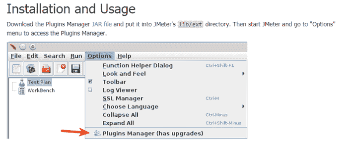
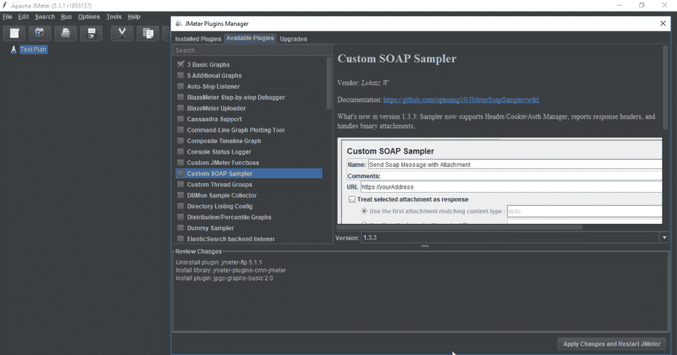
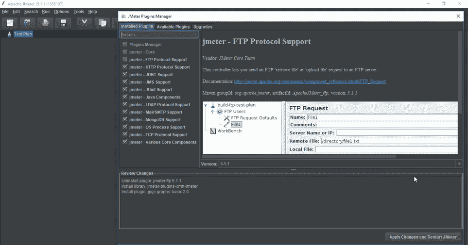
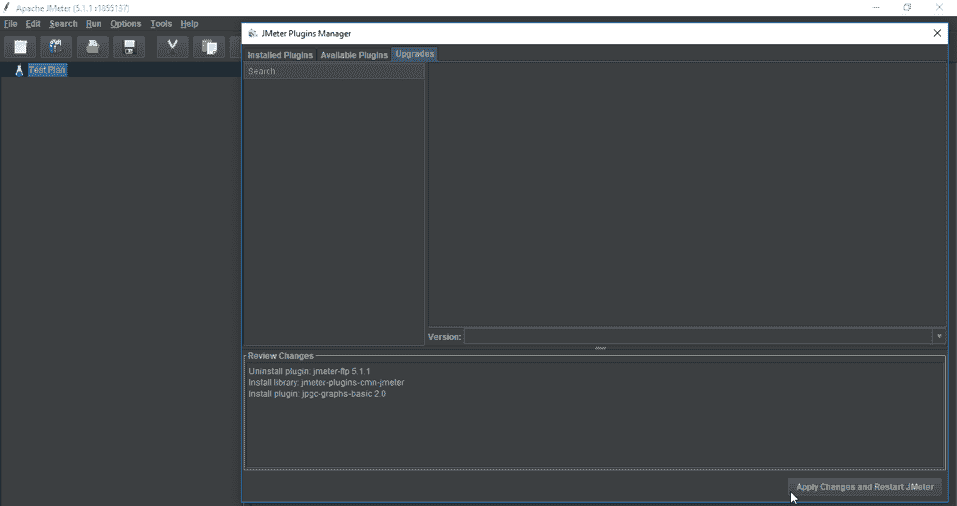
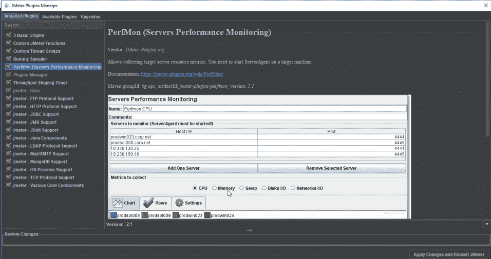
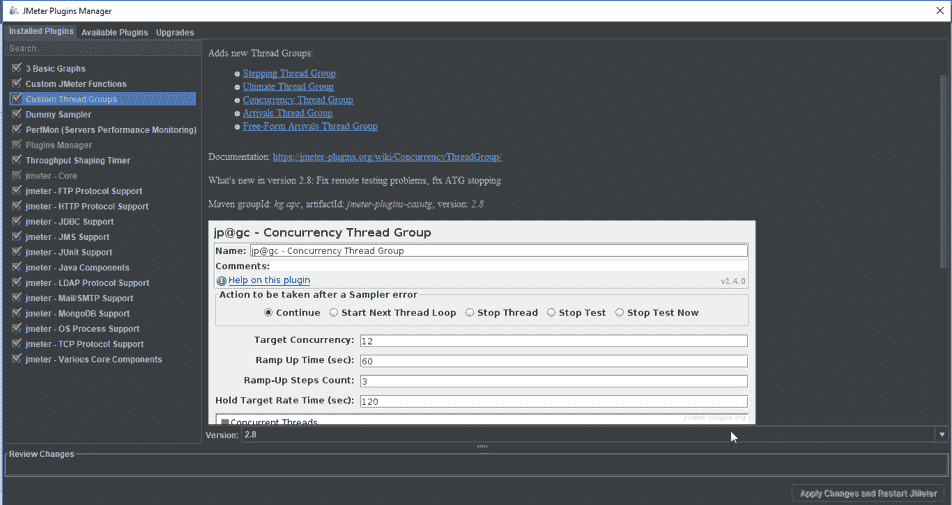
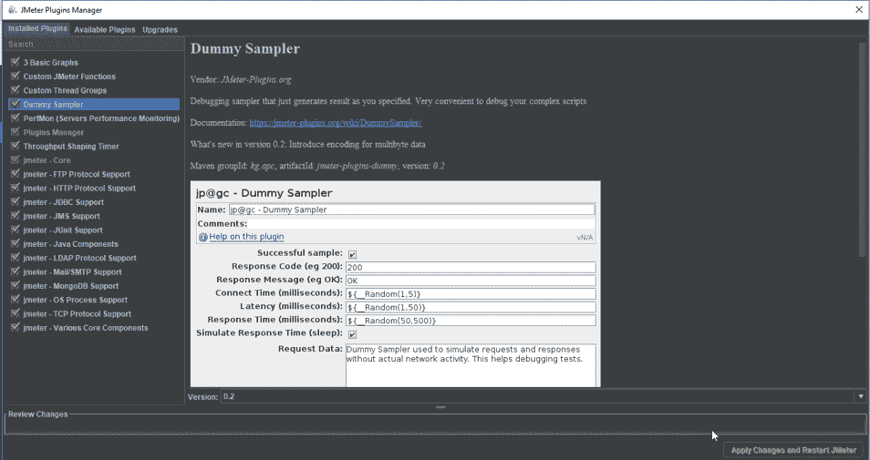
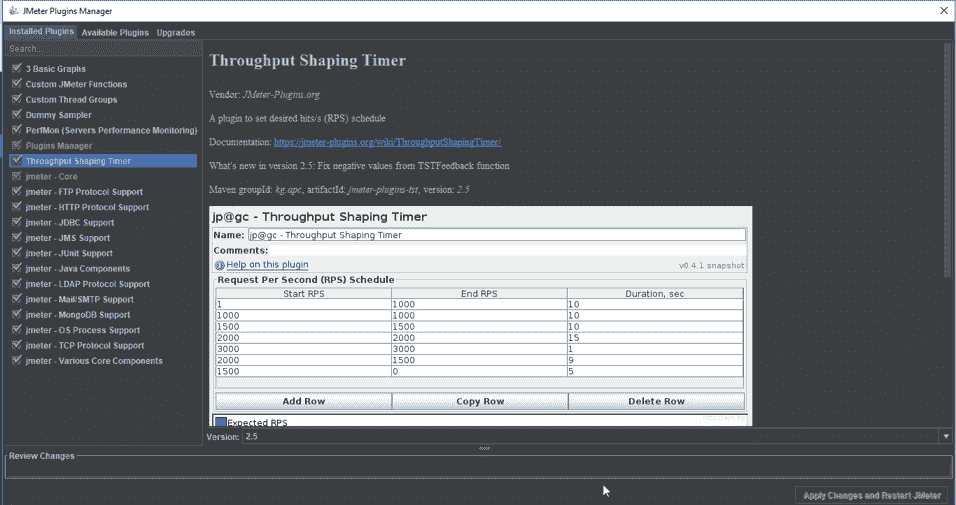
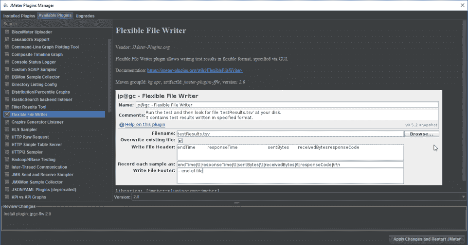

# JMeter 插件:关于插件管理器你需要知道的一切

> 原文：<https://www.edureka.co/blog/jmeter-plugins/>

确保软件应用的有效性能很重要，而[软件测试](https://www.edureka.co/software-testing-certification-courses)是确保应用无故障运行的关键。插件使每个人都能为程序做出贡献。基本上，它们是用来提高软件性能的。在这篇“ **JMeter 插件**”文章中，我们将看到它们是如何按照以下顺序工作的:

*   [JMeter 简介](#jmeter)
*   [JMeter 插件介绍](#jmeterplugins)
*   [安装插件管理器的步骤](#installjmeterplugins)
*   [手动安装/卸载插件](#manualplugins)
*   [排名前五的 JMeter 插件](#topjmeterplugins)

## **JMeter简介**

[Apache JMeter](https://www.edureka.co/blog/jmeter-tutorial/) 是一个测试工具，用于分析和测量不同软件服务和产品的性能。这是一个纯 Java 开源软件，用于测试 Web 应用程序或 FTP 应用程序。

用于执行 web 应用的[性能测试](https://www.edureka.co/blog/performance-testing-tutorial/)、[负载测试](https://www.edureka.co/blog/load-testing-using-jmeter/)和[功能测试](https://www.edureka.co/blog/what-is-functional-testing/)。JMeter 还可以通过为 web 服务器创建大量虚拟并发用户来模拟服务器上的重负载。

## **JMeter 插件介绍**

JMeter 插件是用于通过扩展能力和插入功能来定制程序的软件组件。Apache JMeter 是一个强大的负载测试工具。 [JMeter](https://www.edureka.co/blog/how-to-install-jmeter/) 有很多特性，但 JMeter 最好的一点是它是开源软件。因此，任何感兴趣的团体都可以开发扩展其功能和插入功能的附加物。这些附加物被称为插件。

 在 JMeter 中，插件有多种用途，从图形工具、监听器到开发者工具。插件管理器为用户安装、升级和卸载插件，使插件安装过程更加流畅和方便。

**JMeter 插件教程| Edureka**

[//www.youtube.com/embed/m5ACGZIigsM?rel=0&showinfo=0](//www.youtube.com/embed/m5ACGZIigsM?rel=0&showinfo=0)

这个关于“JMeter 插件”的 edureka 视频将为您提供关于如何安装插件管理器的深入知识。它将帮助你理解在 JMeter 中安装和卸载不同插件的过程。

## **安装插件管理器的步骤**

安装插件管理器的步骤包括:

*   您需要从以下链接下载插件管理器 Jar 文件:

[https://jmeter-plugins.org/wiki/PluginsManager/](https://jmeter-plugins.org/wiki/PluginsManager/)

*   第二步，您需要将 jar 文件放在 JMeter 的 lib/ext 目录中

*   现在重启 JMeter
*   点击**选项**，然后点击**插件管理器**，会出现插件列表。

## **手动安装/卸载插件**

插件管理器可以执行以下任务:

*   **从可用插件中安装新插件**

*   **从已安装插件列表中卸载旧插件**

*   **如果有任何可用的更新，请升级您现有的插件**

现在我们已经完成了安装过程，让我们来看看几个在业界广泛使用的插件。

## **排名前五的 JMeter 插件**

开发人员已经创建了大量有用的插件以及强大的 JMeter 社区。插件网站列出了很多 JMeter 可用的插件。在网站上，你可以搜索所有可用的插件，找到符合你需求的插件。

让我们来看看 JMeter 中最常用的 5 个插件:

### **1。PerfMon 服务器性能监控**

这个插件用 PerfMon 服务器性能监控监听器扩展了 JMeter。这个监听器允许我们监控加载的服务器的 CPU、内存、交换、磁盘 I/O 和网络 I/O。

要查找，点击: ***测试计划- >添加- >监听器->jp @ GC–PerfMon 度量收集器***

### **2。自定义线程组**

自定义线程组插件增加了五种线程组类型:

*   步进螺纹组
*   终极线程组
*   并发线程组
*   到达线程组
*   自由形式到达线程组

这五个线程组为创建测试运行所需的时间表提供了巨大的可能性。

要查找，点击: ***测试计划- >添加- >线程(用户)->jp @ GC-终极线程组***

## 

### **3。虚拟采样器**

虚拟采样器模拟请求和响应的工作，而不实际运行请求。请求和响应数据在采样器的字段中定义。这是调试后处理器和提取器的一种非常方便的方法。

要查找，点击: ***线程组- >添加- >采样器->jp @ GC-虚拟采样器***

### **4。吞吐量整形定时器**

该插件为 JMeter 增加了以下功能:吞吐量整形定时器、特殊属性处理、调度反馈功能。这些元素使我们能够限制测试吞吐量，确保我们不会超过我们需要的吞吐量值。

这个有趣的计时器被设计成在测试运行期间控制每秒钟对服务器的请求。

要查找，点击: ***线程组- >添加- >定时器->jp @ GC-吞吐量整形定时器***

### **5。灵活的文件编写者**

这个插件用灵活的文件写入器监听器扩展了 JMeter。这个监听器被设计成以灵活的格式将测试结果写入文件，这可以通过 JMeter GUI 来指定。

要查找，点击: ***测试计划- >添加- >监听器->jp @ GC-灵活文件编写器***

这些是 JMeter 中最常用的插件。说到这里，我们的文章就到此为止了。我希望你们喜欢这个，并且理解 JMeter 插件是如何在测试计划中安装和使用的。

*既然你已经理解了什么是 JMeter 插件，那就来看看由 Edureka 提供的使用 [JMeter 课程](https://www.edureka.co/jmeter-training-performance-testing) 进行的**性能测试吧，Edureka 是一家值得信赖的在线学习公司，拥有遍布全球的 250，000 多名满意的学习者。本课程让您深入了解工作负载期间的软件行为。在本课程中，您将学习如何检查软件的响应时间和延迟，以及测试软件包是否能够高效扩展。本课程将帮助您检查强度并分析应用在不同负载类型下的整体性能。***

有问题要问我们吗？请在“JMeter 插件”的评论部分提到它，我们会给你回复。