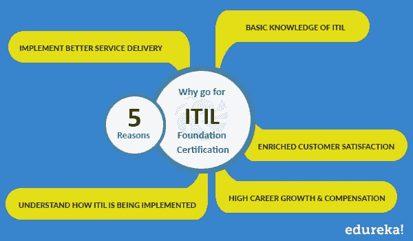
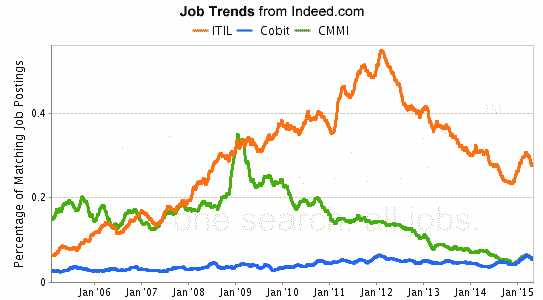
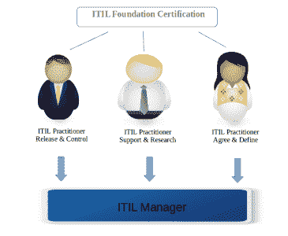

# 通过 ITIL 4 基金会认证开始您的职业生涯

> 原文：<https://www.edureka.co/blog/jumpstart-your-career-with-itil-foundation-certification>

让我们先简单介绍一下 ITIL 的真实情况。ITIL(以前称为信息技术基础设施库)是一套针对 IT 服务管理(ITSM)的实践，侧重于协调 IT 服务与业务需求。ITIL 描述了不特定于组织的过程、程序、任务和清单。组织可以实现这些标准，以启动与组织策略的集成，交付价值，并保持最低水平的能力。它允许组织建立一个基线，从这个基线开始计划、实施和度量。它用于证明合规性和衡量改进。

ITIL 最早于 20 年前在英国开发，旨在创建一套用于政府数据中心的权威最佳实践。此后，ITIL 被采用、修订并扩展为一个广泛的框架，用于管理各种规模和各行各业的组织的 IT 服务交付。你甚至可以通过 [PRINCE2 基金会](https://www.edureka.co/prince2-foundation-and-practitioner-certification-training)查看 PRINCE2 的详情。

*让我们来讨论一下 ITIL 认证对专业人士和企业的好处:*

## **ITIL 培训给企业带来的主要好处**

ITIL 现在被认为是服务管理行业中被广泛接受和最接近的最佳实践，并已被全球无数组织实施。ITIL 认证的众多好处使其非常受欢迎和受欢迎。它在服务生命周期等几个领域的深厚知识使其有别于其他 it 服务管理认证。

*以下是 ITIL 给企业带来的一些好处:*

**1。更好地理解企业内部的 IT:**

ITIL 框架帮助 IT 专业人员确定流程、确定优先级和管理服务改进机会，以满足业务需求。

**2。常用词汇:**

有了 ITIL 知识，ITSM (IT 服务管理)将有一个通用的词汇，这样就不会因为沟通不畅而出现失误。

**3。高效团队:**

ITIL 认证员工可以自动执行标准任务，并将最佳实践原则应用于 ITSM 流程，从而提高流程和任务的效率。

**4。提高客户满意度:**

ITIL 框架使 ITSM 的专业人员能够随时随地提供服务，满足客户的需求和期望。

**5。精通变革管理团队:**

ITIL 框架有助于为即将发布的版本提供清晰的沟通渠道，这有助于宣布新的和更新的 IT 服务。

**6。IT 服务中断较少:**

ITIL 框架确保备用服务选项到位，以减少由于各种原因造成的业务中断的影响，因为任何中断都会对组织产生负面影响。

**7。以经济高效的方式预测和响应:**

通过使用 ITIL 框架中的需求管理和容量管理技术，如用户概况、非高峰定价和建模，认证员工可以提供最佳的容量水平，并管理波动的需求。

**8。支持新技术趋势:**

ITIL 不仅支持现有的 IT 基础设施，还支持新的和即将到来的技术趋势，如 SMAC 技术堆栈。

**9。适用于非 IT 目的:**

ITSM 的 ITIL 方法也可以应用于非 IT 业务职能，如设施、人力资源、客户服务/支持、培训和金融服务。

10。与项目管理配合良好:

ITIL 可以与项目管理方法相结合，以取得进步的业务成果。ITIL 在开始一个项目时帮助项目管理。

## **为什么要去 ITIL 基金会认证:**

它不断更新新技术，认证是 IT 专业人员跟上当前趋势并迎接新机遇的方法之一。信息技术基础设施库(ITIL)已经成为 IT 服务管理框架的最切实的标准，ITIL 认证将验证您的技能，并为您的职业生涯提供额外的优势。

各种组织都在寻找 ITIL 认证专家，因为他们对 IT 领域有着广泛的了解，并且能够快速发现任何问题点。ITIL 认证对于 IT 服务行业的 IT 项目经理来说是一个很有价值的证书。

*以下是您申请 ITIL 基金会认证的理由:*

*   **ITIL 基础知识:**

该认证将提供 IT 服务管理的概念、理论和原则的基本知识。

*   **了解 ITIL 是如何实施的:**

培训将帮助您了解 ITIL 在组织中的实施情况，从而提高您的绩效。

*   **高职业成长&薪酬**

认证专家因其知识和技能而与众不同。结果，他们得到了更好的补偿。他们的专业知识使他们比未经认证的人更受欢迎。

*   **实施更好的服务交付**

ITIL 以多种方式帮助组织，例如通过优化使用人员、流程和技术来提高质量和降低成本。ITIL 为其所有管理流程提供了一致性，从而提高了服务交付的效率。

*   **丰富的客户满意度**

ITIL 法规支持服务提供商根据服务水平协议(SLA)持续提供服务。在 ITIL 的帮助下，专业人员将能够更快地恢复服务，并最终减少向客户提供服务的中断时间。

## **ITIL 就业趋势对比:**

ITIL 很受欢迎，很受欢迎，但是它和其他人相比如何呢？让我们看看 ITIL 与其他类似的框架相比表现如何。下面的比较来自 Indeed，它将 ITIL 与其他框架如 Cobit 和 CMMI 进行了比较。

很明显，ITIL 做得非常好，接受这方面的培训将对你的职业生涯有益。

**ITIL 薪资与对比:**

根据 Global Knowledge 和 Windows IT Pro 进行的 2015 年 IT 技能和工资调查，ITIL 是十大支付认证之一。如果你在寻找更好的报酬，那么 ITIL 是添加到你简历中的最佳技能/证书。

根据 Indeed 的数据，ITIL 专业人士的平均工资比 CMMI 专业人士的平均工资高出 121%。

需要更多在 ITIL 获得认证的理由吗？请继续阅读…

**需要 ITIL 技能的职位:**

根据你的经验，有许多职位和空缺；比如‘入门级’和‘中级’。他们的职称如下:

**入门级:**

*   流程协调员
*   事故协调员
*   变革协调员
*   配置分析师

流程协调员有责任确保流程中的管理活动按计划进行。

**中级:**

*   问题经理
*   发布经理
*   服务台经理

一名中层管理人员将负责端到端的流程管理，并有协调员向其汇报。他们将负责确保服务管理中的活动符合流程。

*以下是更多认证专业人士的职位:*

*   ITIL 配置管理器
*   ITIL 发布经理
*   IT 开发人员
*   信息技术工程师
*   项目管理人
*   商业分析员
*   虚拟化架构师
*   SQL DBA
*   IT 报告和指标分析师
*   ITIL 教练

**寻找 ITIL 基础技能的公司:**

以前，只有大型组织实施 ITIL 框架，但现在许多中小型企业正在意识到拥有 ITIL 认证员工的优势。主要原因是，没有组织希望其 IT 项目失败，小公司无法承受由于管理不善和缺乏流程而造成的生产力、时间和金钱损失。

这里有一些公司，无论大小，都在寻找有技能的 ITIL 专业人士:

*   创新健康
*   优利系统
*   布朗兄弟哈里曼
*   三一工业
*   大功率(High Power)ˌ高压(High Pressure)ˌ高性能(High Performance)ˌ高聚物(High Polymer)
*   美国运通
*   通用动力公司
*   武田制药
*   埃森哲
*   世界银行
*   电磁兼容性

**谁可以参加 ITIL 基础课程:**

ITIL 是每个有志于在 IT 服务管理行业发展的专业人士的理想之选。ITIL 是为那些想知道如何提高组织内的 IT 服务管理质量的专业人士设计的。首席信息官、IT 经理、系统管理员、IT 支持团队、数据库管理员、系统分析师、应用程序管理团队、应用程序开发团队、流程负责人、流程从业者以及任何需要了解并参与持续服务改进计划的人都可以申请该认证。

It 经理、架构师和工程师不一定要成为 ITIL 大师，但是 ITIL 框架的基本知识可以帮助他们理解和支持这个过程。

## **ITIL 基金会认证的先决条件**

在 IT 服务交付、服务管理或服务台环境中工作的任何人，或者在 IT 服务是核心能力的环境中工作的任何人，都可以参加该认证。先前的信息技术知识足以进行考试。根据你的专业经验，ITIL 会给你不同的结果。

## **ITIL 基金会认证后的下一步——ITIL 职业道路:**

许多大型国际组织，如微软、IBM、Atos、卡特彼勒、壳牌石油、波音公司等都实施了 ITIL，并取得了巨大的成功，从而产生了对 ITIL 技能的巨大需求。雇主们正在寻找拥有[ITIL](https://www.edureka.co/itil4-foundation-certification-training)课程的专业人士来管理他们的 ITIL 框架。因此，这是一个在 ITIL 基金会接受培训的好时机，可以获得非凡的职业发展和工作机会。

有问题要问我们吗？在评论区提到它们，我们会给你回复。