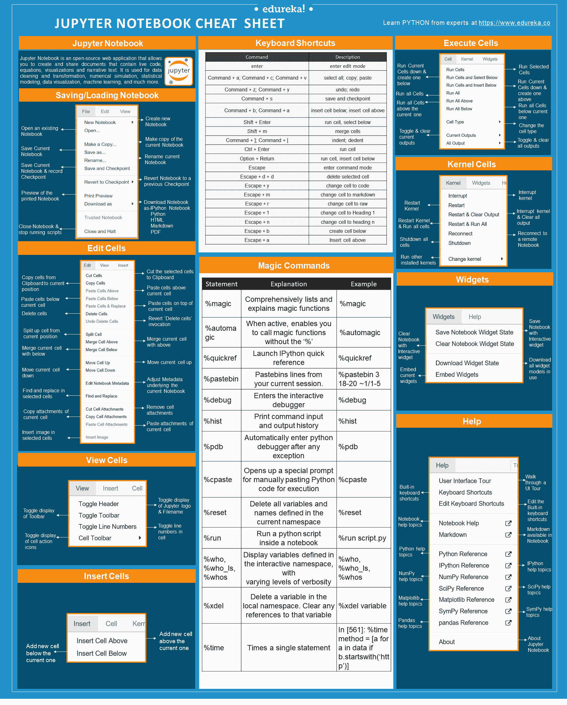
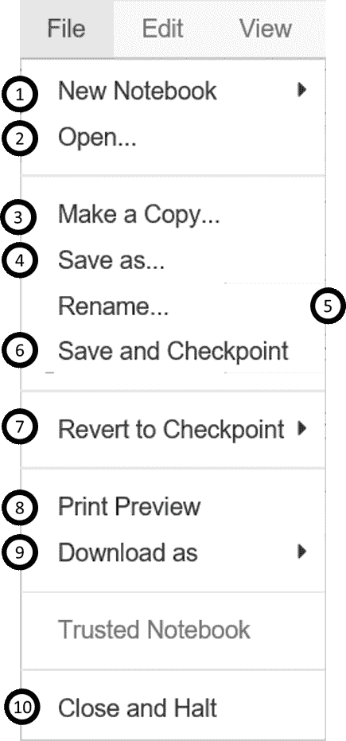
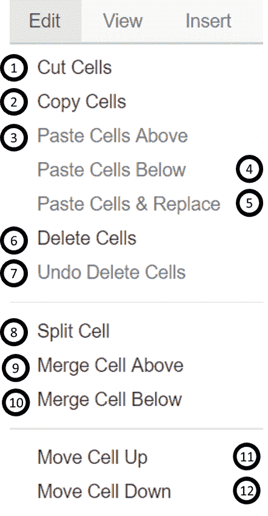
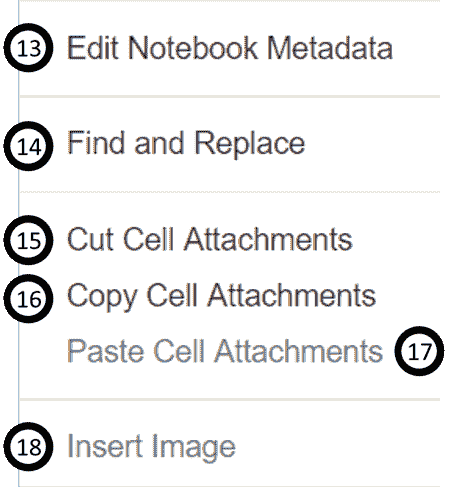
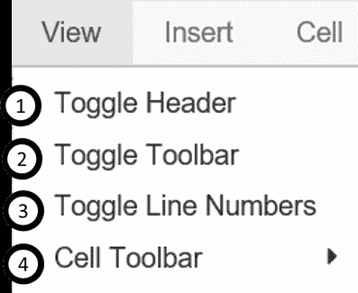
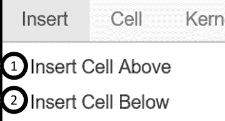
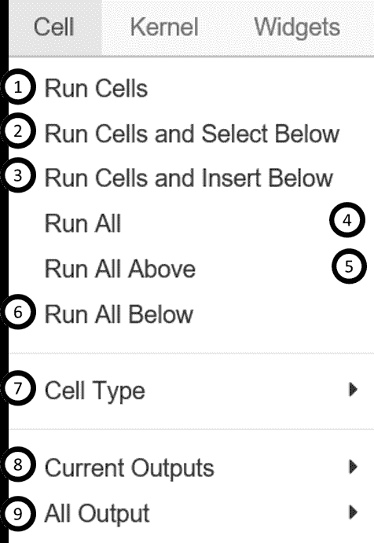
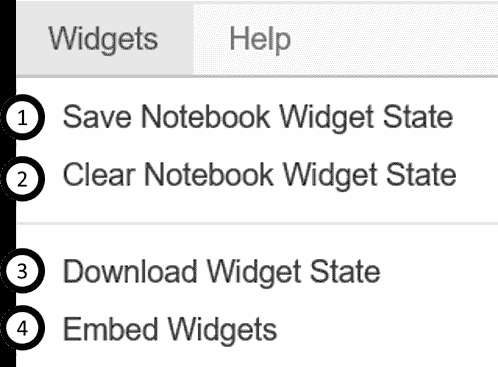
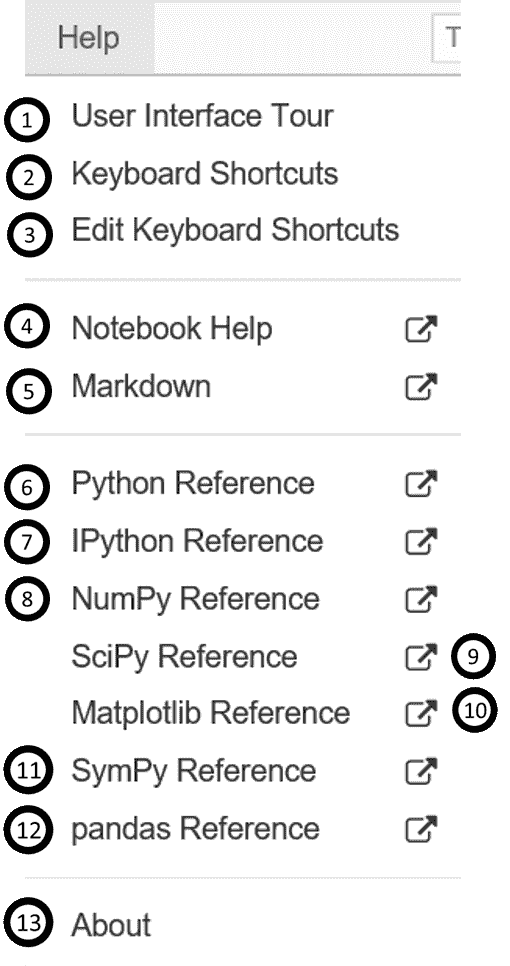

# 朱庇特笔记本备忘单:朱庇特笔记本初学者指南

> 原文：<https://www.edureka.co/blog/cheatsheets/jupyter-notebook-cheat-sheet>

Jupyter 笔记本是一种强大的方式来编写和迭代你的 [**Python**](https://www.edureka.co/blog/learn-python-for-data-science/) 代码用于 [**数据分析**](https://www.edureka.co/blog/python-pandas-tutorial/) 。Jupyter Notebook 基于 IPython 构建，内核运行计算并与 Jupyter Notebook 前端接口通信。这个 Jupyter 笔记本备忘单将帮助你找到著名的笔记本应用程序，这是 Jupyter 项目的子项目。

## Jupyter 笔记本备忘单

Jupyter Notebook 是一个开源的网络应用程序，允许你创建和分享包含实时代码、公式、可视化和叙述性文本的文档。它用于数据清洗和转换、数值模拟、统计建模、数据可视化、 **[机器学习](https://www.edureka.co/blog/what-is-machine-learning/)** 等等。

这个 Jupyter 笔记本备忘单是 Jupyter 笔记本中使用的工具栏和键盘快捷键的指南。

## 保存/加载笔记本

让我们从 Jupyter 笔记本 的保存或加载开始

1.  创建新笔记本
2.  打开现有笔记本
3.  制作当前笔记本的副本
4.  保存当前笔记本
5.  重命名当前笔记本
6.  保存当前笔记本并记录检查点
7.  将笔记本恢复到之前的检查点
8.  打印笔记本的预览
9.  下载笔记本 as-
    *   IPython 笔记本
    *   Python
    *   HTML
    *   降价
    *   PDF
10.  关闭笔记本&停止运行脚本

## 快捷键

以下是运行 Python 内核的 Jupyter 笔记本最常用的键盘快捷键。这个列表经常变化。查看帮助- >笔记本中的快捷键，了解最新的快捷键。

| 命令 | 描述 |
| 输入 | 进入编辑模式 |
| 命令+a；command+c；命令+ v | 全选；复制；粘贴 |
| 命令+z；命令+ y | 取消；准备好了吗 |
| 命令+ s | 保存和检查点 |
| Command+b；命令+ a | 在下面插入单元格；在上方插入单元格 |
| Shift + Enter | 运行单元格，选择下面的 |
| Shift + m | 合并单元格 |
| Command+】；命令+ [ | 缩进；dedent |
| Ctrl + Enter | 运行单元 |
| 选项+回车 | 运行单元格，在下方插入单元格 |
| 逃跑 | 进入命令模式 |
| 转义+ d + d | 删除选中的单元格 |
| 转义+ y | 将单元格改为代码 |
| 转义+ m | 将单元格改为降价 |
| 转义+ r | 将单元格改为原始 |
| 转义+ 1 | 将单元格改为标题 1 |
| 转义+ n | 将单元格改为标题 n |
| 转义+ b | 在下方创建单元格 |
| 转义+ a | 在上方插入单元格 |

## 编辑单元格

1.  将选中的单元格剪切到剪贴板
2.  将剪贴板中的单元格复制到当前位置
3.  将剪贴板中的单元格粘贴到当前单元格上方
4.  将剪贴板中的单元格粘贴到当前单元格下方
5.  将剪贴板中的单元格粘贴到当前单元格的顶部
6.  删除单元格
7.  恢复“删除单元格”调用
8.  从当前位置分割一个单元格
9.  将当前单元格与上面的单元格合并
10.  将当前单元格与下一个单元格合并
11.  上移当前单元格
12.  向下移动当前单元格

13。调整当前笔记本的元数据

14。在选定的单元格中查找和替换

15。移除电池附件

16。复制当前单元格的附件

17。粘贴当前单元格的附件

18。在选定的单元格中插入图像

## 查看单元格

1.  切换 Jupyter 标志和文件名的显示
2.  切换工具栏显示
3.  切换单元格中的行号
4.  切换单元格动作图标的显示:
    *   无
    *   编辑元数据
    *   原始单元格格式
    *   幻灯片放映
    *   附件
    *   标签

## 插入单元格

## 执行单元格

1.  在当前单元格上方添加新单元格
2.  在当前单元格下方添加新单元格

1.  运行选定的单元格
2.  关闭当前单元格，并在下方创建一个新单元格
3.  运行当前单元格，并在上方创建一个新单元格
4.  运行所有细胞
5.  运行当前单元格上方的所有单元格
6.  运行当前单元格下的所有单元格
7.  改变当前单元格的单元格类型
8.  切换、切换滚动和清除当前输出
9.  切换、切换滚动和清除所有输出

## 魔法命令

下面是 jupyter 笔记本中一些常用的魔法命令。

| 声明 | 解释 | 例子 |
| %魔法 | 全面列举并解释魔法功能 | %魔法 |
| %自动功能 | 激活时，允许您调用不带“%”的魔法函数 | %自动功能 |
| 【t0 %】quick ref .【快速参考资料】T1 | 启动 IPython 快速参考 | 【t0 %】quick ref .【快速参考资料】T1 |
| %时间 | 倍单语句 | In[561]:% time method =[a for a In data if b . starts with(' http ')] |
| 【t0 %】【pastebin】t1 | 从 当前会话中粘贴 bin 行。 | 【t0 %】【pastebin 的 3 个 18-20 ~1/1-5 个百分点】 |
| %调试 | 进入交互式调试器 | %调试 |
| %hist | 打印命令输入 并输出历史 | %hist |
| %pdb | 出现异常后自动进入 python 调试器 | %pdb |
| % c 粘贴 | 打开手动粘贴 Python 代码执行的特殊提示 | % c 粘贴 |
| %复位 | 删除当前名称空间中定义的所有变量和 名称 | %复位 |
| %运行 | 运行一个 python 脚本 在一个笔记本里面 | %运行 script.py |
| %谁，%谁 _ls，%谁是 | 显示交互命名空间中定义的变量，用 改变详细程度 | %谁，%谁 _ls，%谁是 |
| %xdel | 删除 本地命名空间中的一个变量。清除对那个变量的任何引用 | %xdel 变量 |

## 使用不同的编程语言

内核提供计算和与前端接口的通信，如笔记本电脑。安装 Jupyter Notebook 会自动安装 IPython 内核。

1.  中断内核
2.  重启内核
3.  中断内核&清除所有输出
4.  重启内核&运行所有细胞
5.  连接回远程笔记本电脑
6.  重启内核&运行所有细胞
7.  运行其他已安装的内核

## 小工具

1.  用互动小工具保存笔记本
2.  用互动小工具清除笔记本
3.  下载所有正在使用的 widget 模型的序列化状态
4.  嵌入当前小工具

## 帮助

1.  浏览用户界面教程
2.  内置键盘快捷键列表
3.  编辑内置键盘快捷键
4.  笔记本帮助主题
5.  笔记本中可用的降价描述
6.  Python 帮助主题
7.  IPython 帮助主题
8.  NumPy 帮助主题
9.  SciPy 帮助主题
10.  Matplotlib 帮助主题
11.  SymPy 帮助主题
12.  熊猫帮助话题
13.  关于 Jupyter 笔记本

**[为 Python 下载 Jupyter 笔记本备忘单](/blog/wp-content/uploads/2018/10/Jupyter_Notebook_CheatSheet_Edureka.pdf)**

就这样，我们结束了 **Jupyter 笔记本小抄**。要获得更深入的知识，请查看我们的交互式在线实时教育培训 [***Python 数据科学认证培训***](https://www.edureka.co/python) 在这里，我们将为您提供全天候支持，在您的整个学习期间为您提供指导。Edureka 的 Python 课程帮助您获得定量分析、数据挖掘和数据呈现方面的专业知识，通过将您的职业生涯转变为数据科学家角色来超越数字。您将使用 Pandas、Numpy、Matplotlib、Scikit 等库，并掌握 Python 机器学习算法等概念，如回归、聚类、决策树、随机森林、朴素贝叶斯、Q 学习和时间序列。