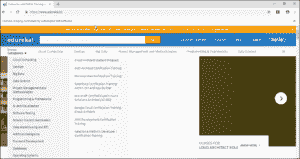
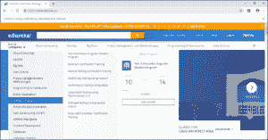
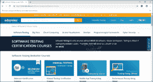
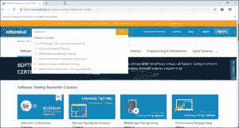
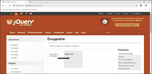
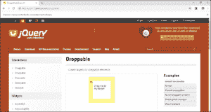

# 如何在 Selenium WebDriver 中处理 Actions 类？

> 原文：<https://www.edureka.co/blog/keyboard-mouse-events-actions-class>

在使用 [*Selenium*](https://www.edureka.co/selenium-certification-training) 测试应用程序时，动作起着至关重要的作用。为了在 web 应用程序上执行任何操作，比如访问下拉框、双击、右键单击等等，actions 类是必不可少的。基于这一点，我写了这篇关于如何在 Selenium 中处理 Actions 类的文章，以帮助您理解动作是如何工作的。

我将按以下顺序讨论这个话题:

*   什么是 Actions 类？
*   [动作类](#Different_methods_under_Action_%20class)下的不同方法
*   [如何处理 Selenium 中的 Actions 类](#How_to_handle_actions_class_in_Selenium)
*   [演示](#Demo)

那么，我们开始吧。

## 什么是 Actions 类？

Actions 类是处理各种类型的键盘和鼠标事件的内置功能。在*[Selenium web driver](https://www.edureka.co/blog/selenium-webdriver-architecture/)*中，使用高级用户交互 API 来处理这些事件，包括拖放或在控制键的帮助下单击多个元素等操作。它主要由执行各种操作时需要的*动作*组成。


这个*动作类*是面向用户的 API，用于模拟复杂的动作事件。您可以直接使用该类，而不使用输入设备，即键盘和鼠标。

```

Actions action = new Actions(driver);
action.moveToElement(element).click().perform();

```

我将使用 ***perform()*** 来执行动作。

使用这个动作 API， *[WebDriver 可以轻松处理键盘交互。](https://www.edureka.co/blog/selenium-tutorial)* 为了使用鼠标动作，我将使用 web 元素的当前位置，然后执行某种操作。

现在，让我们了解一下这个类下用于执行某些操作的不同方法。

## **不同方法下的动作类**

基本上有两种方法帮助处理中的动作，即:

*   键盘接口
*   鼠标界面

让我们详细了解一下。

**键盘接口**

*   **sendKeys(keysToSend):** 向元素发送一系列击键。
*   **keyDown(theKey)** :发送一个按键而不释放。随后的动作可以假定它是按下的。

例如:钥匙。ALT 键。SHIFT 或 Keys。控制)；

*   **keyUp(按键)**:执行按键释放。

**鼠标界面**

*   **click()** :点击元素。
*   **doubleClick ()** :双击元素。
*   **contextClick()** :在元素上执行上下文单击(右键单击)。
*   **clickAndHold()** :在当前鼠标位置点击，不释放。
*   **dragAndDrop(source，target)** :在源位置点击，在释放鼠标之前移动到目标元素的位置。源(要抓取的元素，目标–要释放的元素)。
*   **dragAndDropBy(source，xOffset，yOffset)** :在源位置执行点击并保持，移动给定的偏移值，然后释放鼠标。(X 偏移–水平移动，Y 偏移–垂直移动)。
*   **【moveByOffset(x 轴偏移量，y 轴偏移量)**:将鼠标从当前位置(或 0，0)移动给定的偏移量。x 偏移–设置水平偏移(负值–向左移动鼠标)，y 偏移–设置垂直偏移(负值–向上移动鼠标)。
*   **moveToElement(toElement)** :将鼠标移动到元素的中心。
*   **release()** :在当前鼠标位置释放鼠标左键。

一旦您对 Actions 类下的不同方法有了正确的认识，就很容易实现相同的用例。

## **如何处理 Selenium 中的 actions 类**

要在 Selenium 中处理这些操作类，必须遵循正确的格式。

*   创建一个 Actions 类的对象''
*   使用 [*WebDriver*](https://www.edureka.co/blog/selenium-webdriver-tutorial) 聚焦元素:action.moveToElement(element)。构建()。执行()；
*   建立()。perform()用于编译和执行 actions 类。
*   使用 actions 类下的不同方法来执行各种操作，如 click()、拖放等。

现在让我们考虑做一个演示来理解 Actions 类是如何工作的。

## **演示**

我将在两个网站上表演，分别是 edureka.co 的[](https://www.edureka.co/)和 jqueryui.com 的 [*。*](http://jqueryui.com/)

*   将 [*Java*](https://www.edureka.co/blog/java-tutorial/) 库下载到您的系统中。
*   当你想使用 Selenium 时，首先要做的是确保你知道如何将 安装到你的系统中。
*   要使用的 IDE。我更喜欢在 Eclipse IDE 上工作，因为它对用户友好，并且易于执行 Java 项目。
*   选择您选择的 [*浏览器驱动*](https://www.edureka.co/blog/selenium-chromedriver-and-geckodriver/) 。
*   获取您想要测试的网页的 URL。
*   执行相应的动作，如点击按钮，鼠标移动，按键等。

请参考此代码，了解在测试应用程序时操作是如何有帮助的。

```

package seleniumdemo;

import java.util.concurrent.TimeUnit;
import org.openqa.selenium.By;
import org.openqa.selenium.Keys;
import org.openqa.selenium.WebDriver;
import org.openqa.selenium.WebElement;
import org.openqa.selenium.chrome.ChromeDriver;
import org.openqa.selenium.interactions.Action;
import org.openqa.selenium.interactions.Actions;

public class Selenium {

public static void main(String[] args) throws InterruptedException {
System.setProperty("webdriver.chrome.driver", "C:UsersVaishnaviDesktopchromedriver_win32 (2)chromedriver.exe");
WebDriver driver = new ChromeDriver();
driver.get("http://www.edureka.co/");
driver.manage().window().maximize();
driver.manage().timeouts().implicitlyWait(10, TimeUnit.SECONDS);
Thread.sleep(3000);
Actions builder = new Actions(driver);
builder.moveToElement(driver.findElement(By.id("header_topcat"))).build().perform();
Thread.sleep(3000);
WebElement link = driver.findElement(By.cssSelector("#software-testing-certification-courses"));
builder.moveToElement(link).build().perform();
Thread.sleep(2000);
driver.findElement(By.xpath("//ul[@class='dropdown-menu']//li//a[text()='Software Testing']")).click();
Thread.sleep(4000);
WebElement act = driver.findElement(By.id("search-inp"));
builder.moveToElement(act).build().perform();
Thread.sleep(3000);
WebElement search = driver.findElement(By.xpath("//span[@class='typeahead__button']"));
builder.moveToElement(search).build().perform();
Thread.sleep(3000);
Action seriesOfActions;
seriesOfActions = builder
.sendKeys(act, "Selenium")
.keyDown(search, Keys.SHIFT)
.keyUp(search, Keys.SHIFT)
.build();
seriesOfActions.perform();
Thread.sleep(3000);
driver.quit();
}

}

```

上述代码的输出如下所示:



搜索下拉菜单并单击它，然后在下拉菜单上执行操作。



点击“**软件测试”**并导航至该页面。



执行键盘功能，如 KeyUp、KeyDown 和 sendKeys()。



为了执行拖放，我考虑了这个专门处理拖放的网站，[](http://jqueryui.com/draggable/)。

```

package seleniumdemo;

import org.openqa.selenium.By;
import org.openqa.selenium.WebDriver;
import org.openqa.selenium.WebElement;
import org.openqa.selenium.chrome.ChromeDriver;
import org.openqa.selenium.interactions.Actions;

public class demo {

public static void main(String[] args) throws InterruptedException {
System.setProperty("webdriver.chrome.driver", "C:UsersVaishnaviDesktopchromedriver_win32 (2)chromedriver.exe");
WebDriver driver = new ChromeDriver();
driver.get("http://jqueryui.com/droppable/");
driver.manage().window().maximize();
driver.switchTo().frame(0);
WebElement SourceElement= driver.findElement(By.id("draggable"));
WebElement TargetElement= driver.findElement(By.id("droppable"));
Actions action = new Actions(driver);
Thread.sleep(3000);
action.dragAndDrop(SourceElement, TargetElement).build().perform();
//action.clickAndHold(SourceElement).moveToElement(TargetElement).release().build().perform();
Thread.sleep(3000);
driver.quit();

}

}

```

上述代码的输出如下所示:



将相应的元素拖放到目标位置。

**

至此，我们结束了这个“Selenium 中的动作类”博客。我希望你们喜欢这篇文章，并且理解 Selenium 中这些动作类下的动作和不同的方法。现在您已经了解了如何在 Selenium 中执行操作，请查看 Edureka 提供的 **[Selenium 认证课程](https://www.edureka.co/selenium-certification-training)** ，edu reka 是一家值得信赖的在线学习公司，拥有遍布全球的 650，000 多名满意的学习者。本课程旨在向您介绍完整的 Selenium 特性及其在软件测试中的重要性。

有问题要问我们吗？请在“Selenium 中的 Actions 类”的评论部分提到它，我们将会回复您。