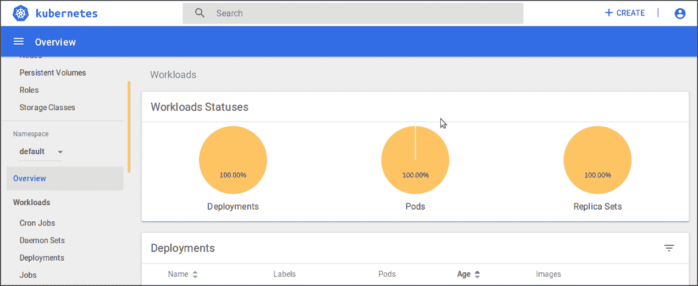
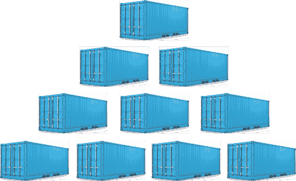
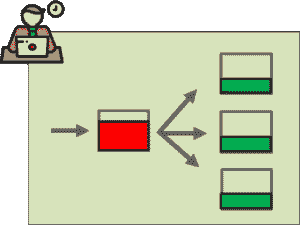

# Kubernetes vs Docker:比较两个容器编排巨头！

> 原文:# t0]https://www . edureka . co/blog/kuberates-vs-docker/

**Kubernetes** 和 **Docker Swarm** 是当今领先的容器编排工具。因此，在您的产品中使用它们之前，您应该知道它们到底是什么以及它们是如何工作的。要理解这一点，请阅读这篇博客，它讨论了 Kubernetes 与 Docker Swarm 之间的性能和可用性对峙。

我不会在这篇博客中谈论这两个工具的基础知识。先阅读基础知识，然后浏览我以前的博客。要阅读 Docker 是什么，点击[这里](https://www.edureka.co/blog/docker-tutorial)。要阅读什么是 Kubernetes，点击[这里](https://www.edureka.co/blog/what-is-kubernetes-container-orchestration)。

下表简要总结了 Kubernetes 与 Docker Swarm 之间的差异。详细的解释将在博客的后面提供。

你可能也有兴趣阅读[这篇报道](https://www.edureka.co/skill-report)，它讲述了 2018 年需要掌握的顶级技能。

| **特色** |  | **码头工人群** |
| 安装&集群配置 | 安装复杂；但是一旦设置好，集群就非常强大 | 安装非常简单；但是集群不是很强 |
| 桂 | GUI 是 Kubernetes 仪表板 | 没有图形用户界面 |
| 扩展性 | 高度可扩展&快速扩展 | 高度可扩展&的扩展速度比 Kubernetes 快 5 倍 |
| 自动缩放 | Kubernetes 可以进行自动缩放 | Docker Swarm 无法进行自动缩放 |
| 负载均衡 | 不同箱中不同集装箱之间的负载平衡流量需要人工干预 | Docker Swarm 对集群中容器之间的流量进行自动负载平衡 |
| 滚动更新&回滚 | 可以部署滚动更新&可以自动回滚 | 可以部署滚动更新，但不能自动回滚 |
| 数据卷 | 只能与同一 Pod 中的其他容器共享存储容量 | 可以与任何其他容器共享存储卷 |
| 记录&监控 | 内置测井工具&监测 | 应使用 ELK 等第三方工具进行测井&监控 |

## **Kubernetes vs Docker Swarm**

我还想提醒你，人们把 Docker Swarm 误解为 Docker。 **Docker** 只是一个集装化平台。 **Docker Swarm** 是一个容器编排平台，同 **Kubernetes** 。因此，在同一组参数上比较两者是唯一正确的。我将比较的参数是:

*   [安装&集群配置](#InstallKubernetesCluster)
*   [桂](#KubernetesDashboard)
*   [扩展性](#ContainerScalability)
*   [自动缩放](#AutoScaling)
*   负载均衡
*   [滚动更新&回滚](#RollingUpdatestRollbacks)
*   [数据卷](#DataVolumes)
*   [记录&监控](#LoggingMonitoring)

### **安装&集群配置**

用 **Docker Swarm** 建立集群，弹指一挥间就能搞定。只需要执行两个命令。一个在经理端，另一个在工人端。从字面上看，这就是全部。之后，您可以立即开始部署。

然而，有了 **Kubernetes** ，设置就没有 Swarm 那么容易了。您需要运行命令来启动集群，然后定义您的环境，然后定义 Pod 网络(供容器交互)，然后启动仪表板，最后集群将被托管。

### **【GUI】**

GUI 基本上是一个仪表板，可以用来毫不费力地控制您的集群。没有 CLI 命令麻烦，没有技术工作，简单的英语，即使是非技术背景的专业人员也可以应付。你可以在***localhost:8001***用 **Kubernetes 仪表盘**得到这一切。

然而，**码头工人群**回复说，“*对不起，我们现在没有这样的设施*”。是的，没有仪表板！这是令人不安的。但是，嘿，权威人士会为它辩护说，如果你正在处理容器，那么你的技术足够处理没有 GUI。而且，这也是部分正确的。

### **扩展性**

任何公司最终都需要增加集装箱的数量。那里没有例外。而且，在这里，库伯内特和**蜂群**都站稳了脚跟。双方都不赢。Kubernetes 在保持集群强度方面稍好，而 Swarm 在扩展方面稍快(比 K8s 快 5 倍)。

我对这一点的看法是，集群的力量比什么都重要。在 Prod 中，我宁愿确保更高的稳定性，而不是灵活性。于是， Kubernetes 是我的赢家。

### **自动缩放**

明显的赢家是**库伯内特斯**。这是因为，K8s 足够智能，可以分析您的服务器负载，并根据需要进行伸缩。不需要人工干预。这是一个很大的帮助，因为著名的“交通大灾难”完全可以避免。

但是 T2 并不是这里自信的防守者。当流量涌入时，它崩溃了，没有可用的帮助。而手动干预是唯一的出路(不支持自动缩放)。

### **负载均衡**

** Kubernetes** 在这里挨打。有时，您需要手动配置负载平衡设置。多个容器作为一个容器。并且每个服务可以被定义为一组 pod。现在的挑战是让这些豆荚互相交谈，因为它们应该很容易被发现。因为服务用于发现，而不是它们的 IP 地址，因此存在挑战。

使用 **Swarm** 进行负载均衡很简单，因为 Swarm 会自动进行负载均衡。没有 pod 的概念，因此所有容器都使用网络 IP 地址相互发现，只要节点连接到集群，这就会自动发生。

### **滚动更新&回滚**

**库伯内特斯**再次在这里获胜。事实上，K8s 和 Swarm 集群都支持容器“滚动更新”的概念。k8s 对 pod 整体执行滚动更新，而 Swarm 直接对容器执行。滚动更新是逐步将更新部署到所有容器中的现有应用程序的过程。

但是**蜂群**被击败，因为它不会自动回滚。每当部署更新时出现问题，K8s 和 Swarm 都提供了一个回滚到之前稳定部署的选项。但是，只有 Kubernetes 在出现故障的情况下会自动回滚。集群的主服务器密切监视更新和部署。

### **数据卷**

**Kubernetes** 允许我们在同一个 Pod 内的多个容器之间共享存储容量。然而， **Docker Swarm** 允许我们与任何其他容器共享存储容量。但 K8s 的优势在于，存储可以很容易地安装在本地存储上，或者安装在公共云上，如 AWS、GCP，甚至是共享网络上，如 NFS。

### **记录&监控**

**Kubernetes** 提供内置的日志和监控工具。日志记录有助于在出现故障时快速分析日志并了解问题所在。监控有助于主节点持续了解节点的健康状态以及它们所封装的服务。Kubernetes 进行内置日志记录和监控。然而，有了 **Swarm** ，我们可以使用像 ELK 这样的第三方工具。

因此，在选择 Kubernetes 还是 Docker Swarm 之前，这些是你必须记住的相关参数。听下面的视频会帮助你更好地理解其中的区别。

## **Kubernetes vs Docker Swarm |集装箱编排战| Kubernetes 培训**

[//www.youtube.com/embed/FmrAGliHvzQ?rel=0&showinfo=0](//www.youtube.com/embed/FmrAGliHvzQ?rel=0&showinfo=0)

如果你有兴趣了解更多关于 Kubernetes 的知识，那么你可以看看 Edureka 的 [Kubernetes 培训](https://www.edureka.co/kubernetes-certification)。如果你在 Kubernetes 和 Docker Swarm 之间有偏好，那么我们很想听听你的意见。你可以在下面的评论区表达。