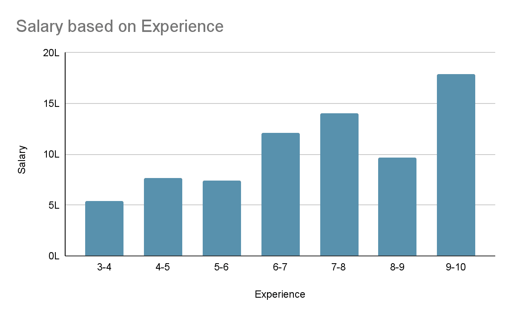
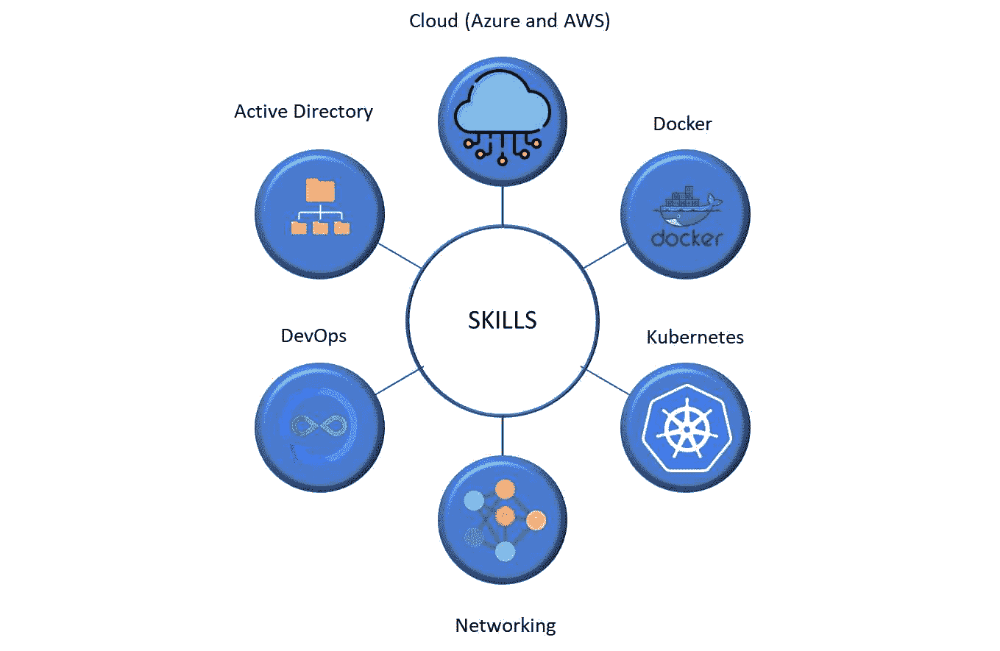
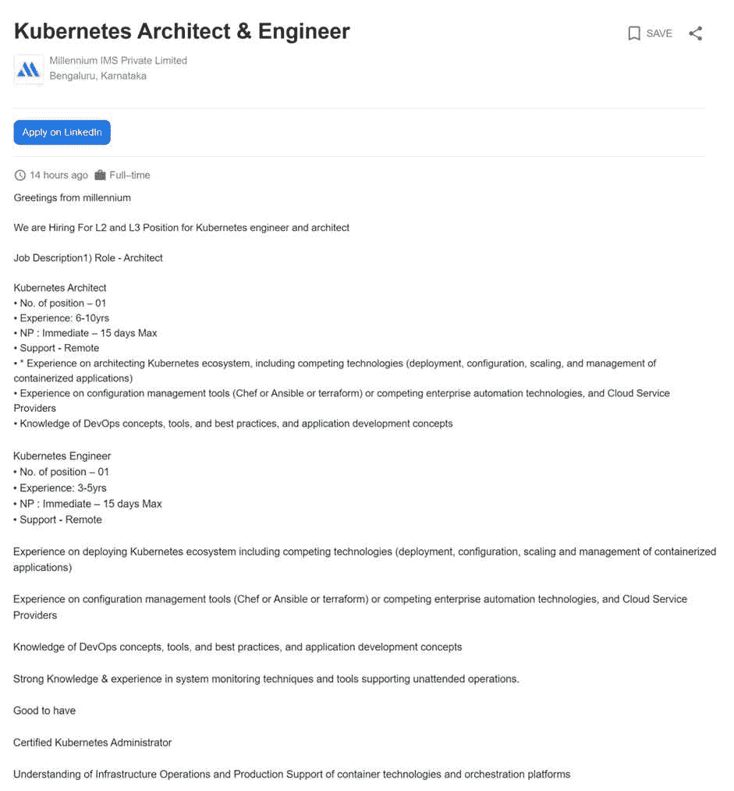
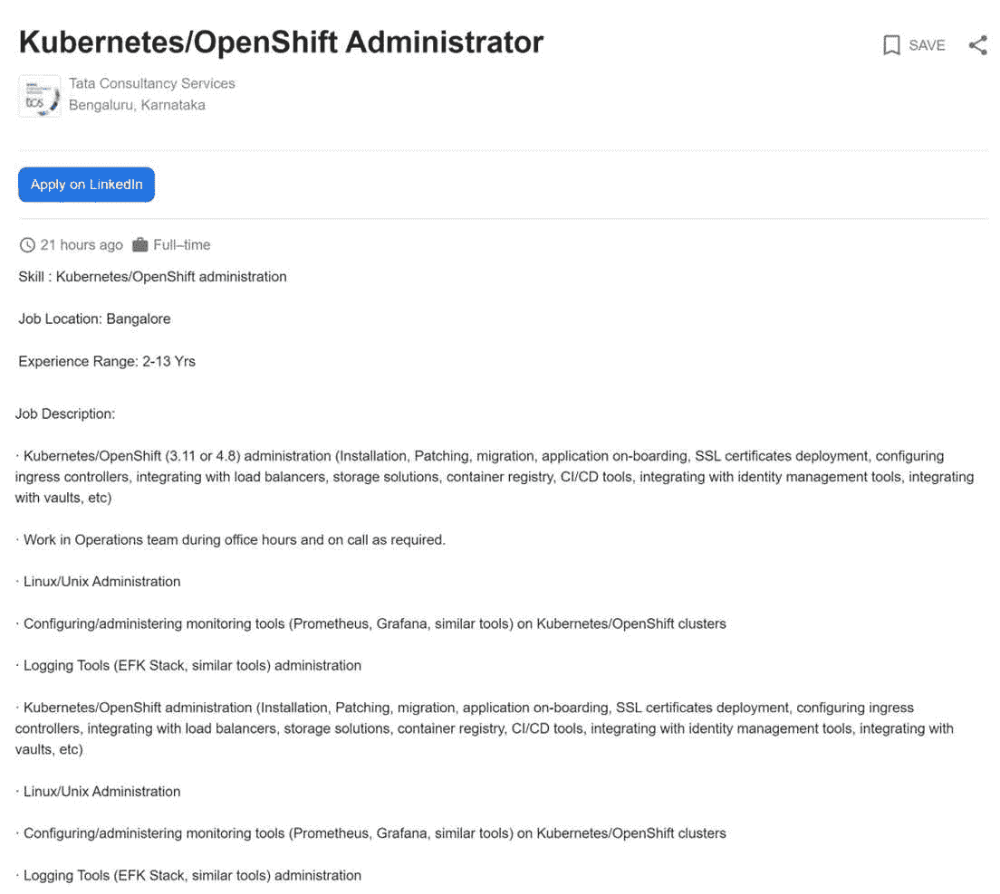
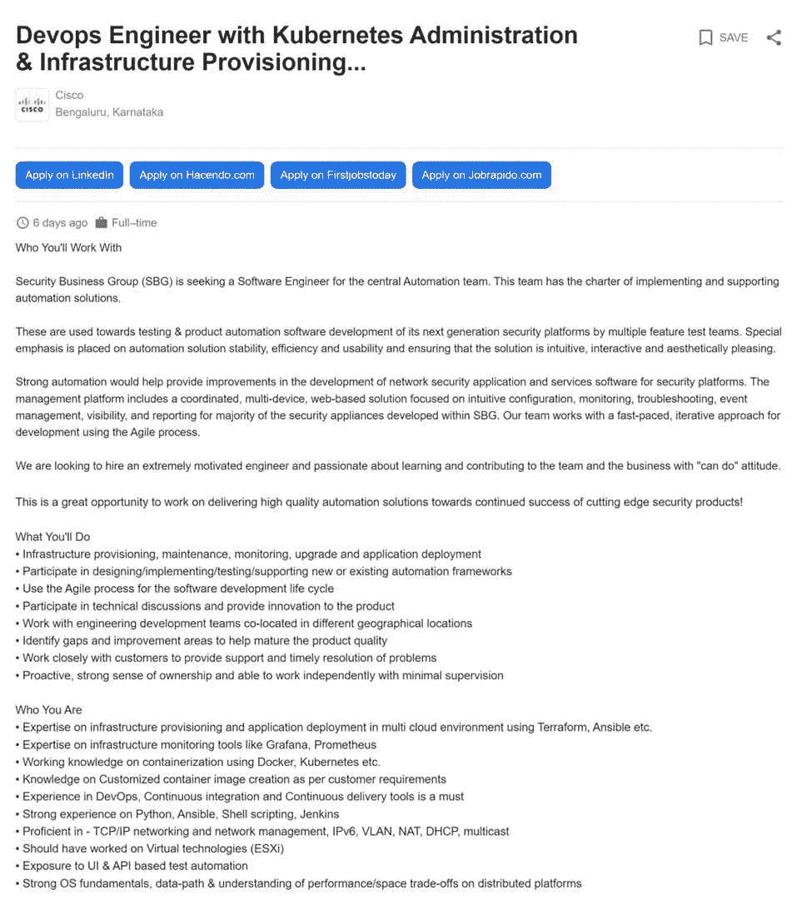
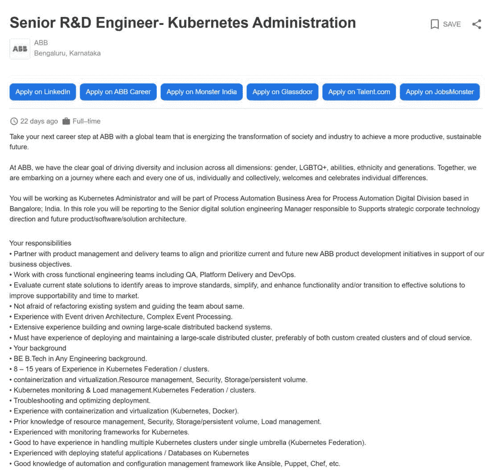
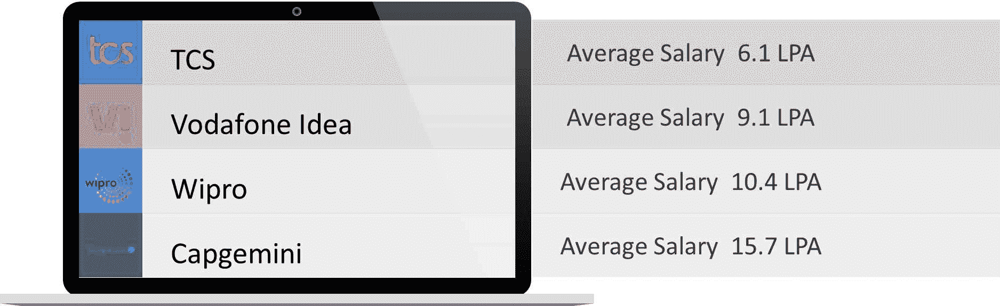
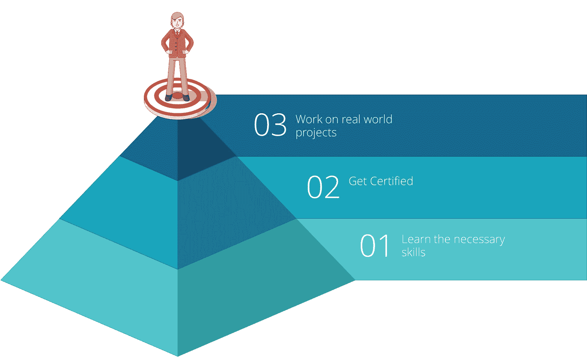

# Kubernetes 印度管理员工资[2023 年更新]

> 原文：<https://www.edureka.co/blog/kubernetes-administrator-salary-in-india/>

***Kubernetes 管理员*** 的工作近年来需求越来越大，薪酬也飙升至新高。在印度，一名 Kubernetes 管理员的平均收入为 9.6 LPA。工资范围根据技能水平和经验而增加。Kubernetes 管理员的工资从 4 LPA 到 24 LPA 不等，经验越丰富，工资会高得多。因此，对于这个博客，让我们从讨论和理解 Kubernetes 管理员的角色开始，我们将讨论以下主题:

*   [**Kubernetes 印度管理员工资**](#India)
*   [**Kubernetes 管理员的顶级技能**](#Skills)
*   [**Kubernetes 管理员岗位说明书**](#Job)
*   [**【Kubernetes 管理员岗位角色和工资**](#Roles)
*   [**公司招聘 Kubernetes 管理员**](#Hiring)
*   [**成为 Kubernetes 管理员的途径**](#Path)

## **Kubernetes 印度管理员工资**

Kubernetes 的管理员角色吸引了很多人的兴趣，主要是因为它提供的薪水。正因为如此，它促使许多人选择了这条职业道路。根据 Glassdoor 的数据，Kubernetes 管理员的全国平均工资为 10.13 LPA，6 LPA 处于低端，高端，一个人每年可以赚到 16 LPA。

 根据经验水平的不同，一个最少 3 到 4 年经验的 Kubernetes 管理员最多可以打 5.4 LPA。一个有 4-7 年经验的中级 Kubernetes 管理员每年可以赚 121 万卢比。拥有 7 年以上经验的高级 Kubernetes 管理员每年最多可以赚 179 万卢比。这些数字显示了市场对这份工作的需求以及这份工作的光明前景。

【Kubernetes 管理员的顶级技能

基于 Kubernetes 的职业需要精通一些工具，这些工具大多与云相关。您必须熟悉 UNIX 和 Windows 环境。您还应该了解如何操作 Jenkins、AWS、Kubernetes 和 Linux 管理。让我们看看成为一名优秀的 Kubernetes 管理员所需的基本技能。

**活动目录:** 活动目录是一组将唯一用户与网络资源连接起来的服务和数据库。你应该对此有丰富的经验和理解，因为它在处理 Azure Active Directory 和 LDAP 时起着重要的作用。由于 Kubernetes 与 Azure 的集成遵循一组非常具体的步骤，所以很好地理解 Active Directory 是有好处的。

DevOps: DevOps 本质上整合了软件开发人员和 IT 团队之间的流程。它是一套旨在提供更好的工作流程的实践、工具和理念。在云环境中，Kubernetes 扮演着重要的角色。然而，Kubernetes 管理员也有可能知道 DevOps 的某些方面，并在需要时实现它们。有一个经过认证的 Kubernetes 管理员认证也是很好的，可以增加你获得第一次面试的机会。

网络:Windows 和 Linux 的网络知识是 Kubernetes 管理员工作中不可或缺的一部分。除此之外，您还应该了解如何在 Kubernetes 集群上配置和管理监控工具，比如 Prometheus 或 Grafana。对于 Kubernetes 管理员来说，了解基础设施的供应、维护、监控和升级也很有帮助。对于这个职位，你还需要精通 TCP/IP 网络和网络管理。

**Kubernetes:** 管理 Kubernetes 集群是 Kubernetes 管理员角色的核心职责。您应该熟悉 Kubernetes 监控和负载管理。有在一个保护伞下处理多个 Kubernetes 集群和部署有状态应用程序的经验是很好的。

Docker: Docker 是 Kubernetes 管理员的重要工具，主要用于容器化和虚拟化。在某些方面，DevOps 中使用的工具也是 Kubernetes 管理中使用的工具。因此，了解自动化和配置管理框架(如 Ansible、Puppet 和 Chef)是很好的。

**云(Azure 和 AWS) :** 大多数使用 Kubernetes 运行的东西都是在云基础设施上运行的。大多数公司要么在 AWS 上运行，要么在微软 Azure 云上运行。因此，最好有使用这些云提供商的故障排除和部署经验。还需要在构建和维护大规模分布式集群方面拥有丰富的经验，包括定制集群和云服务。

**Kubernetes 管理员职位描述**

大多数知名公司都在寻找在类似领域拥有丰富经验的 Kubernetes 管理人员。让我们看看 Kubernetes 管理员的一些工作描述，这些描述是基于我们上面讨论过的资格或技能。

**Kubernetes 建筑师&工程师-千禧 IMS**

**Kubernetes/OpenShift 管理员-TCS**

【Kubernetes 管理部门的开发工程师&基础设施供应-思科

****

**高级 R & D 工程师-库本内斯行政官-ABB** 

## **Kubernetes 管理员的工作职责和工资**

根据 LinkedIn 的数据，美国大约有 73，000 多个 Kubernetes 管理员职位空缺。然而，在印度，这个数字大约是 15，000+与 Kubernetes 管理相关的工作。

我们将继续下去，看看招聘人员中最受欢迎的 Kubernetes 管理员职位简介。

| **工作角色** | **所需技能** | **工资** |
| 系统管理员 | 活动目录、系统管理、故障排除 | ₹ 4.0 LPA |
| Oracle 数据库管理员 | 数据库管理、性能调优、Oracle DBA、Unix、监控 | ₹ 6.0 LPA |
| 高级系统管理员 | VMware，故障排除，DNS，活动目录，系统管理 | ₹ 7.0 LPA |
| Linux 系统管理员 | Linux 系统管理，DNS，Redhat Linux，Apache | ₹ 7.0 LPA |
| 网络管理员 | 网络管理、防火墙、网络、交换、广域网、局域网、路由 | ₹ 4.5 LPA |
| 高级管理员 | 管理、Windows、故障排除、网络、虚拟化、监控、Unix、Perl | ₹ 8.2 LPA |
| Windows 系统管理员 | Windows 系统管理、活动目录、DNS、VMware、DHCP、Windows 服务器 | ₹ 4.1 LPA |

## **雇佣 Kubernetes 管理员的公司**

除了 Kubernetes 管理员职位所需的技能之外，我们还看了上面提到的薪水和工作角色。现在，让我们看看一些顶级公司，以及他们为 Kubernetes 管理员的角色支付了多少钱。

## **成为 Kubernetes 管理员的途径**

通过了解基础知识，你可以尝试成为一名 Kubernetes 管理员。一旦你理解了它们，你就可以开始在一些实时项目中实现这些基本原理。让我们看看如何开始成为 Kubernetes 管理员的旅程。

1.  **学习必要的技能**

开始任何旅程都需要基础知识。所以，深入了解，打好基础。发展你的技能，学以致用。记笔记，最重要的是，熟悉云计算环境。此外，作为 Kubernetes 管理员意味着你也知道其他工具，比如 Docker 和 Jenkins。理想情况下，你应该擅长掌握 Azure 和 AWS 基础设施。了解更多信息，做一些基本的项目来帮助你开始。

2.  **获得认证**

如果你能获得认证，这将有助于向招聘人员展示你对 Kubernetes 有所了解。这有助于展示你理解 Kubernetes 以及如何管理环境的基本能力。这也将使你能够展示你的能力与 Kubernetes 管理。您还可以获得行业级认证，以展示您在了解如何管理 Kubernetes 方面的专业知识。这对于 DevOps 也是有用的，人们也可以将 Kubernetes 管理的知识用于 DevOps。

3.  **参与现实生活中的项目**

理解概念是一回事，实现它们是完全不同的。所以，你做现实生活中的项目是有意义的。它们不仅能帮助你，还能帮助你理解现实世界中的事情是如何运作的，以及小部分如何连接在一起形成一个大项目。对于 Kubernetes 的管理，您可以从创建 Kubernetes 集群开始，并开始使用 Jenkins 来自动化部署。你也可以把这些项目加入你的作品集，向潜在雇主展示你的作品。

**结论**

成为 ***Kubernetes 管理员*** 的途径不仅在薪水方面有吸引力，它还为你在 it 行业打开了新的大门。 ***云基础设施*** 正在不断扩展，这为 it 内部的各个领域带来了新的工作机会。虽然 Kubernetes 政府只是其中的一小部分，但很明显，Kubernetes 将继续存在。作为 Kubernetes 管理员，候选人将体验不断变化和扩展的云网络及其管理。为了帮助你在 Kubernetes 变得更好，Edureka 提供了一个认证的 Kubernetes 管理计划。在这里，您将通过实际操作演示，了解并学习如何设置自己的 Kubernetes 集群、配置 pods 之间的网络以及防止未经授权的访问。如果你想详细了解 Kubernetes，那么我建议你看这个 YouTube :

## **【立方教程| edureka】**

[https://www.youtube.com/embed/0j-iIW3_sbg](https://www.youtube.com/embed/0j-iIW3_sbg)

*我希望这篇关于 **Kubernetes 印度管理员薪水的博客对你有用。**本博客中讨论的主题基于行业专家的知识和事实。如果您对 Kubernetes 的管理感兴趣，请访问我们的 Edureka 网站并报名参加* **[*Kubernetes 认证培训课程。*](https://www.edureka.co/kubernetes-certification)** *本 Kubernetes 课程帮助你在第一次尝试参加 Kubernetes 认证管理员(CKA)考试时过关。该交互式 CKA 认证旨在帮助您了解如何设置自己的 Kubernetes 集群、配置 pods 之间的网络以及防止未经授权的访问。这个在线 Kubernetes 培训是实时的，由讲师指导，通过实际操作演示帮助您掌握 Kubernetes 的关键概念，从而帮助您成为拥有* *Edureka 的 Kubernetes 认证专家。*