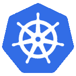
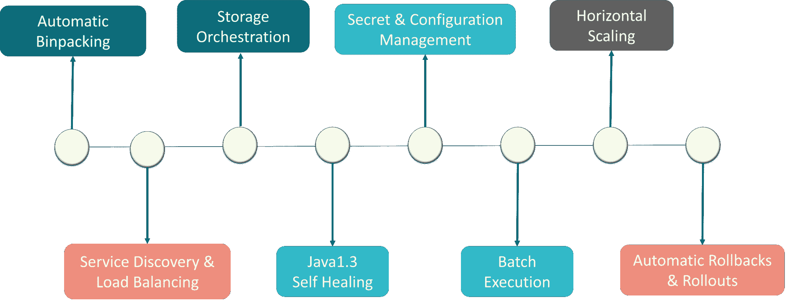
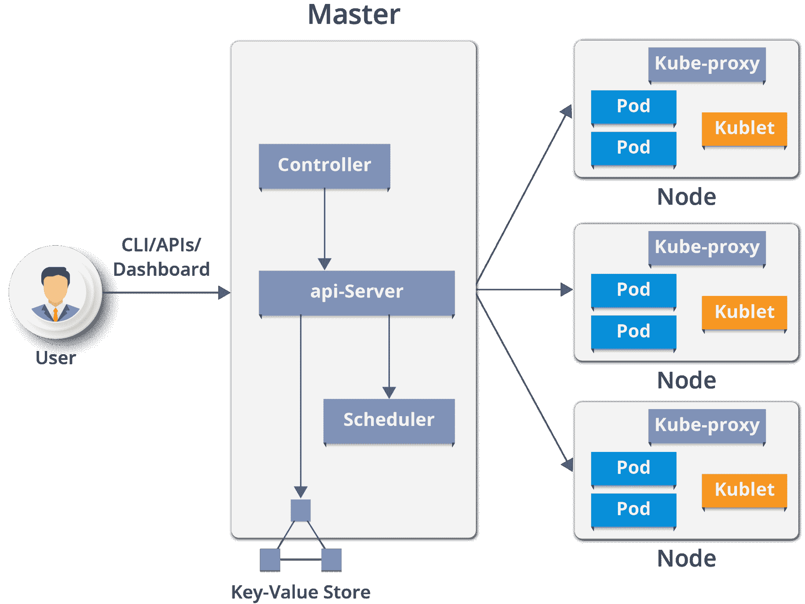
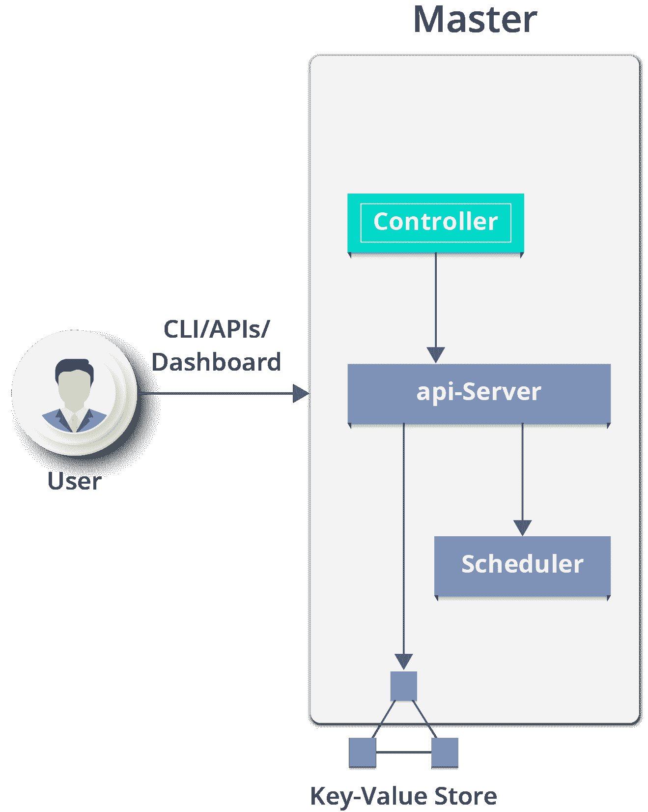
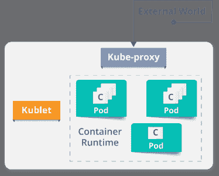
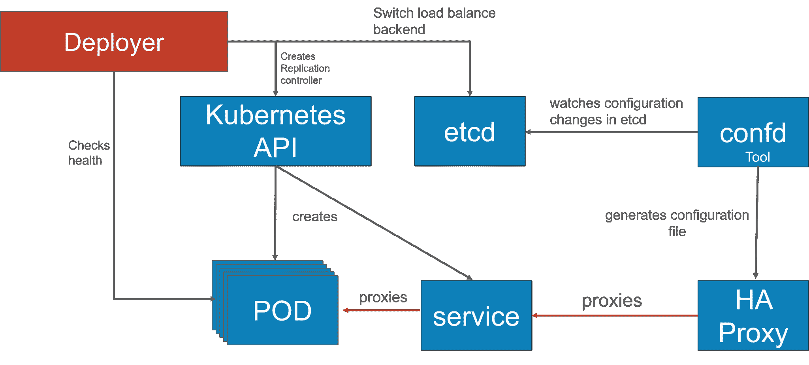

# 了解库伯内特建筑

> 原文：<https://www.edureka.co/blog/kubernetes-architecture/>

容器已经成为开发应用程序的决定性方式，因为它们提供了包含运行应用程序所需的一切的包。在这个博客中，我们将讨论 Kubernetes 的架构和 Kubernetes 的移动部分，以及哪些是关键元素，它们在 Kubernetes 架构中的角色和职责是什么。更多详情，请参考 Edureka 的 [Kubernetes 认证](https://www.edureka.co/kubernetes-certification)。

## **概述**

Kubernetes 是一个开源的容器管理工具，它可以自动进行容器部署、容器伸缩&和容器负载平衡。

*   写在 Golang 上的 ，它有一个巨大的社区，因为它最初是由 Google &开发的，后来捐赠给了**【CNCF】**
*   可以将“n”个容器组合成一个逻辑单元，用于管理&部署它们

如果你喜欢 Kubernetes 建筑的视频讲解，你可以浏览下面的视频。

## **【立方建筑| edureka】**

[//www.youtube.com/embed/qTYfDVvTGmk?rel=0&showinfo=0](//www.youtube.com/embed/qTYfDVvTGmk?rel=0&showinfo=0)

本视频将向您介绍流行的 DevOps 工具——Kubernetes，并深入探讨 Kubernetes 的架构及其工作原理。

## 想探索更多关于 Kubernetes [<button>探索现在</button>](https://www.edureka.co)

## **库伯内特**的特点

关于详细的解释，请看这个[博客](https://www.edureka.co/blog/what-is-kubernetes-container-orchestration)。

##  **【立方结构/立方结构组成部分】**

 Kubernetes 架构有以下主要组成:

*   主节点
*   工作/从节点
*   分布式键值存储。)

## **主节点**

它是所有管理任务的入口点，负责管理 Kubernetes 集群。集群中可以有多个主节点来检查容错能力。多个主节点将系统置于高可用性模式，其中一个将成为我们执行所有任务的主节点。【T2

为了管理集群状态，它使用 **etcd** ，其中所有主节点都连接到它。

让我们讨论一下主节点的组成部分。 如图所示，它由 4 个部分组成:

**API 服务器:**

*   通过主节点内的 API 服务器执行所有管理任务。
*   在这个 REST 中，命令被发送到验证和处理请求的 API 服务器。
*   在请求之后，集群的结果状态被存储在分布式键值存储中。

**调度:**

*   调度器将任务调度给从节点。它存储每个从节点的资源使用信息。
*   它以 pod 和服务的形式安排工作。
*   在调度任务之前，调度器还要考虑服务需求的质量、数据局部性、亲和性、反亲和性等。

**控制器管理器:**

*   又称**控制器**。
*   它是一个守护进程，管理 Kubernetes 集群，该集群管理不同的非终止控制循环。
*   它还执行生命周期功能，例如名称空间创建和生命周期、事件垃圾收集、终止 pod 垃圾收集、级联删除垃圾收集、节点垃圾收集等。
*   基本上，控制器通过 API 服务器观察它管理的对象的期望状态和它们的当前状态。如果它管理的对象的当前状态不符合期望状态，则控制回路采取校正步骤以确保当前状态与期望状态相同。

**什么是 ETCD？**

*   etcd 是一个分布式键值存储，用于存储集群状态。
*   它可以是 Kubernetes 主机的一部分，也可以在外部配置。
*   etcd 是用 Go 编程语言编写的。在 Kubernetes 中，除了存储集群状态(基于 **Raft 共识算法**)之外，它 还用于存储配置细节，如子网、配置图、机密等。
*   raft 是一种共识算法，旨在替代 Paxos。一致性问题涉及多个服务器对值达成一致；这是复制状态机环境中出现的一个常见问题。Raft 定义了三种不同的角色(领导者、追随者和候选人),并通过选出的领导者达成共识

现在你已经了解了主节点的功能。让我们看看什么是 Worker/Minions 节点及其组件。

## **职工节点(原喽啰** **)**

它是一个物理服务器，也可以说是一个虚拟机，它使用由主节点控制的 pod(**一个 pod 调度单元**)来运行应用程序。在物理服务器(工作节点/从属节点)上，对 pod 进行调度。为了从外部世界访问 应用程序，我们连接到节点。

我们来看看以下是哪些组件:

**容器运行时:**

*   为了运行和管理容器的生命周期，我们需要在 worker 节点上有一个**容器运行时**。
*   有时候，Docker 是也称为容器运行时，但准确的说，Docker 是一个使用**容器**作为容器运行时的平台。

*   它是一个代理，与主节点通信，在节点或工作节点上执行。它通过 API 服务器获取 Pod 规范，并执行与 Pod 相关联的容器，并且确保那些 Pod 中描述的容器正在运行并且是健康的。

**Kube-proxy:**

*   Kube-proxy 在每个节点上运行，以处理单个主机子网，并确保服务可供外部方使用。
*   它充当单个工作节点上服务的网络代理和负载平衡器，并管理 TCP 和 UDP 数据包的网络路由。
*   它是运行在每个工作节点上的网络代理，并监听 API 服务器的每个服务端点创建/删除。
*   对于每个服务端点，kube-proxy 设置路由，这样它就可以到达它。

### **吊舱**

pod 是一个或多个逻辑组合在一起的容器。pod 在节点上运行。pod 作为一个逻辑单元一起运行。所以它们有相同的共享内容。它们共享相同的 IP 地址，但可以通过本地主机和共享存储访问其他 pod。pod 不需要全部运行在同一台机器上，因为容器可以跨越多台机器。一个节点可以运行多个单元。

## **用例:Luminis Technologies 如何在生产中使用 Kubernetes**

**问题:** Luminis，一家软件技术公司使用 AWS 部署他们的应用程序。为了部署应用程序，需要定制脚本和工具来实现自动化，这对于运营团队以外的团队来说并不容易。他们的小团队没有资源来学习关于脚本和工具的所有细节。

**主要问题:**有 n 个 o 个**部署单元**这在开发和运营团队之间造成了隔阂。

**解:**

**他们是如何在库伯内部署的:**

他们用一种[蓝绿调配](https://martinfowler.com/bliki/BlueGreenDeployment.html)机制来 降低处理多个并发版本的复杂度。(因为总是只有一个版本的应用程序在后台运行)

在这种情况下，他们的团队通过开源 Apache 许可下的 实现创建了一个名为“ **Deployer** ”的组件，作为 Amdatu umbrella 项目的一部分。 这种机制在重新配置负载均衡器之前对 pod 执行健康检查，因为它们希望部署的每个组件都提供健康检查。

**他们是如何实现部署自动化的？**

随着**部署者**就位，他们能够参与构建管道的部署。  在成功构建之后，他们的构建服务器将新的 Docker 映像推送到 Docker Hub 上的注册表中。然后构建服务器调用**部署器**自动将新版本部署到测试环境中。通过在生产环境中触发**部署器**，相同的映像被提升到生产环境中。

 #### 订阅我们的 youtube 频道以获取新的更新..！