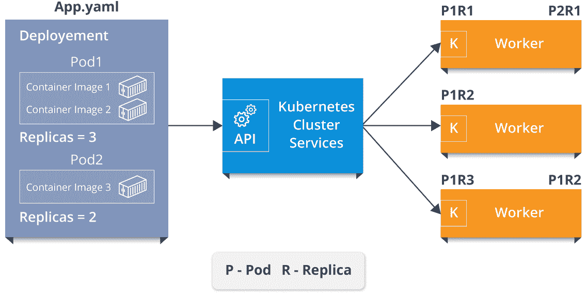

# Kubernetes 网络——Kubernetes 网络概念的综合指南

> 原文：<https://www.edureka.co/blog/kubernetes-networking/>

在之前关于[什么是 Kubernetes](https://www.edureka.co/blog/what-is-kubernetes-container-orchestration) 的博客中，你一定对 Kubernetes 有所了解。在这个关于 Kubernetes 网络的博客中，我将主要关注 Kubernetes 中涉及的网络概念。

在这个关于 Kubernetes 网络的博客中，你将了解以下主题:

*   [什么是 Kubernetes？](#What%20is%20Kubernetes?)
*   [在 Kubernetes](#Kubernetes%20Networking) 联网
*   [财富向导用例](#Company%20Use-Case)
*   [动手](#Hands-On)

## **什么是 Kubernetes？**

您可以将 Kubernetes 定义为一个开源的容器编排工具，它为自动化容器化应用程序的部署提供了一个可移植的平台。

现在，任何与 Kubernetes 合作的人都必须对 Kubernetes 集群有一个清晰的了解，因为这将有助于你理解 Kubernetes 网络。

### 库伯星团

Kubernetes 平台提供了所需的状态管理，这使得集群服务能够运行，并在基础设施中进行联邦配置。我举个例子解释一下。

考虑一个 YAML 文件，该文件包含需要提供给集群服务的所有配置信息。因此，这个文件被提供给集群服务的 API，然后由集群服务来决定如何在环境中调度 pods。因此，假设 pod 1 有两个包含三个副本的容器映像，pod 2 有一个包含两个副本的容器映像，将由群集服务将这些 pod-副本对分配给工作线程。

参考上图。现在，如您所见，集群服务为第一个工作线程分配了两个 pod 副本对，为第二个工作线程分配了一个 pod 副本对，为第三个工作线程分配了两个 pod 副本对。现在，Kubelet 进程负责将集群服务与工作人员进行通信。

因此，集群服务的整个设置和工作人员本身组成了这个 **Kubernetes 集群**！！

你认为这些单独分配的吊舱是如何相互通信的？

答案在于 Kubernetes 网络！

#### 订阅我们的 youtube 频道获取新的更新..！