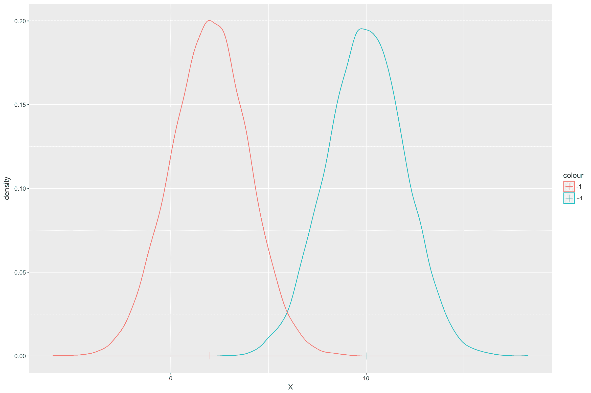
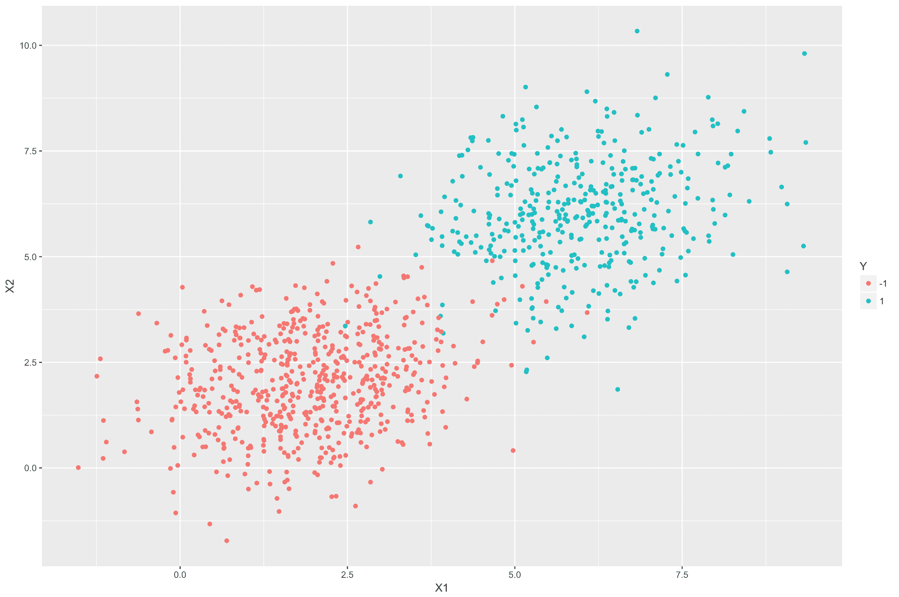
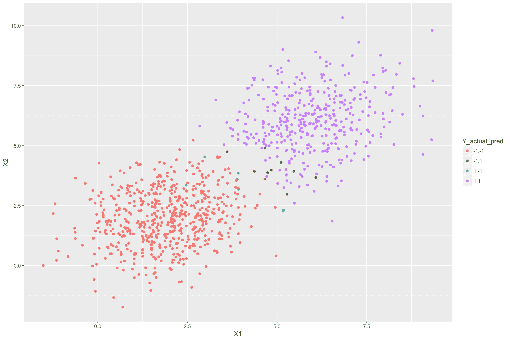

# 如何在 R 中实现线性判别分析？

> 原文：<https://www.edureka.co/blog/linear-discriminant-analysis/>

线性判别分析是一种非常流行的机器学习技术，用于解决分类问题。在本文中，我们将试图理解这种技术背后的直觉和数学。还提供了在 [R](https://www.edureka.co/blog/r-tutorial/) 中实现 LDA 的例子。

*   [线性判别分析假设](#LinearDiscriminantAnalysisAssumption)
*   [直觉](#Intuitions)
*   [LDA 的数学描述](#MathematicalDescriptionofLDA)
*   [学习模型参数](#LearningtheModelParameters)
*   [R 中的例子](#ExampleinR)

那么让我们开始吧

## **线性判别分析假设**

线性判别分析基于以下假设:

*   因变量 *Y* 是离散的。在本文中，我们将假设因变量是二进制的，并采用类值 *{+1，-1}* 。样本属于类别 *+1* 的概率，即*P(Y =+1)= P*。因此，一个样本属于类别 *-1* 的概率为*1-p*。

*   自变量 *X* 来自高斯分布。高斯分布的均值取决于类别标签 *Y* 。即如果*y**I**=+1*，那么*x**I*就是*𝜇**+1方差*【𝜎】**2*对于两个类来说是相同的。数学上来说，*x |(y =+1)~n(𝜇**+1**，**2**)**x |(y =-1)**

有了这些信息，就有可能为自变量和因变量构建一个联合分布*【X，Y】*。因此，LDA 属于 **生成式分类器模型** 的一类。一个密切相关的生成分类器是二次判别分析(QDA)。它基于 LDA 所有相同的假设，除了类方差不同。

让我们继续用线性判别分析文章看看

## **直觉**

考虑类条件高斯分布为 *X* 给定类。下图显示了分布的密度函数。在这个图中，如果*Y =+1*，那么 *X* 的均值就是 10，如果*Y =-1*，那么均值就是 2。两种情况下的方差都是 2。



现在假设给我们一个新值 *X* 。姑且称之为*x**I*。任务是为这个*x**I*确定最可能的类标签，即*y**I*。为简单起见，假设样本属于类别 *+1* 的概率与属于类别 *-1* 的概率相同，即*p = 0.5*

直观地说，如果说*x**I*𝜇*+1*比*𝜇**-1*更接近，那么更有可能的是再正式一点，*y**I**=+1*if:

*| x**I**–𝜇**+1**|<| x**I**–𝜇**-1**|*

用标准差归一化两边:

*| x**I**–𝜇**+1**|/𝜎<| x**I**–𝜇**-1**|/𝜎*

两边开方:

*(x**I**——𝜇**+1**)**2**/𝜎**2**<(x【t35)*

x*【I】*【2】** <*【I】*

*2x**I**(𝜇**-1**–𝜇**+1**)/𝜎**2**–(𝜇* 2*/𝜎**2**)<0*

*-2x**I**(𝜇**-1**–𝜇**+1**)/𝜎**2**+(𝜇【t35) 2**/𝜎**2**)>0*

上述表达式的形式为*bx**I**+c>0*其中*b =-2(𝜇**-1**–𝜇**+1* */𝜎**2**+1**2**/𝜎**2*

显而易见，方程的形式是 **线性** ，因此得名线性判别分析。

让我们继续用线性判别分析文章看看，

## **LDA 的数学描述**

LDA 表达式的数学推导基于类似于 [贝叶斯规则](https://en.wikipedia.org/wiki/Bayes%27_theorem) 和 **贝叶斯最优分类器** 的概念。鼓励感兴趣的读者阅读更多关于这些概念的内容。一种推导表达式的方法可以在这里找到[](https://web.stanford.edu/class/stats202/content/lec9.pdf)。

我们将直接为我们的具体情况提供表达式，其中*【Y】**{+1，-1}* 。我们还将把上一节展示的直觉扩展到 *X* 可以多维的一般情况。假设有 *k* 个自变量。在这种情况下，类意味着*𝜇**-1*和*𝜇**+1*将是维度为*k * 1*和方差-协方差矩阵 *的向量*

分类器函数给定为

*Y = h(X)= sign(b**T*X+c)

其中，

*b =-2𝜮**-1**(𝜇**-1**–𝜇**+1**)*

*c =𝜇**-1**t**𝜮**-1**-1**–𝜇**-1*

sign 函数返回 *+1* 如果表达式*b**T**x+c>0*，否则返回 *-1* 。 *c* 中的自然对数项用于调整两个类的类概率不必相等的事实，即 *p* 可以是(0，1)之间的任何值，而不仅仅是 0.5。

## **学习模型参数**

给定一个带有 *N* 数据点*(x**1**，y**1**)，(x*2*，y y**n*)*，我们需要估算 *p，𝜇**-1**，𝜇* *+1 称为 [最大似然估计](https://en.wikipedia.org/wiki/Maximum_likelihood_estimation) 的统计估计技术用于估计这些参数。上述参数的表达式如下所示。**

*+1**=(1/n**+1**)**【𝚺*I:yi =+1**x**I*

*-1**=(1/n**-1**)**【𝚺*I:yi =-1**x**I*

*p = N**+1**/N*

*𝜮=(1/n)**𝚺I*= 1:n**(x**I**–𝜇**I**)(x*

其中*N**+1**=样本数其中 y**I**=+1**N**-1**=样本数其中*

有了上面的表达式，LDA 模型就完成了。可以使用上述表达式来估计模型参数，并在分类器函数中使用它们来获得自变量 *X* 的任何新输入值的类别标签。

让我们继续用线性判别分析文章看看

## **R 中的例子**

下面的代码生成一个虚拟数据集，包含两个自变量 *X1* 和 *X2* 和一个因变量 *Y* 。对于 *X1* 和 *X2* ，我们将用均值*𝜇**-1**=(2)*和 *𝜇 从两个多元高斯分布中生成样本 40%的样本属于 *+1* ，60%属于 *-1* ，因此*p = 0.4*。*

```
library(ggplot2)
library(MASS)
library(mvtnorm)
#Variance Covariance matrix for random bivariate gaussian sample
var_covar = matrix(data = c(1.5, 0.3, 0.3, 1.5), nrow=2)
#Random bivariate gaussian samples for class +1
Xplus1 <- rmvnorm(400, mean = c(6, 6), sigma = var_covar)
# Random bivariate gaussian samples for class -1
Xminus1 <- rmvnorm(600, mean = c(2, 2), sigma = var_covar)
#Samples for the dependent variable
Y_samples <- c(rep(1, 400), rep(-1, 600))
#Combining the independent and dependent variables into a dataframe
dataset <- as.data.frame(cbind(rbind(Xplus1, Xminus1), Y_samples))
colnames(dataset) <- c("X1", "X2", "Y")
dataset$Y <- as.character(dataset$Y)
#Plot the above samples and color by class labels
ggplot(data = dataset)+
geom_point(aes(X1, X2, color = Y))

```

上图中，蓝色圆点代表 *  +1  * 类样本，红色圆点代表 *  -1  * 类样本。样本之间有一些重叠，即不能用一条简单的线将类别完全分开。换句话说，它们不是完全线性分离的。

我们现在将使用上述数据训练一个 LDA 模型。

```
#Train the LDA model using the above dataset
lda_model <- lda(Y ~ X1 + X2, data = dataset)
#Print the LDA model
lda_model

```

**输出:**

组的先验概率:

-1 1

0.6 0.4

分组表示:

X1 X2

-1 1.928108 2.010226

1 5.961004 6.015438

线性判别式的系数:

LD1

X1 0.5646116

X2 0.5004175

可以看出，模型学习的类均值对于类 *-1* 和类*+1*(5.961004，6.015438)。这些平均值非常接近我们用来生成这些随机样本的类别平均值。组 *+1* 的先验概率是参数 *p* 的估计。 *b* 向量是线性判别系数。

我们现在将使用上述模型来预测相同数据的类别标签。

```
#Predicting the class for each sample in the above dataset using the LDA model
y_pred <- predict(lda_model, newdata = dataset)$class
#Adding the predictions as another column in the dataframe
dataset$Y_lda_prediction <- as.character(y_pred)
#Plot the above samples and color by actual and predicted class labels
dataset$Y_actual_pred <- paste(dataset$Y, dataset$Y_lda_prediction, sep=",")
ggplot(data = dataset)+
geom_point(aes(X1, X2, color = Y_actual_pred))</p>

```

上图中，紫色样本来自 LDA 模型正确分类的 *  +1  * 类。类似地，红色样本来自被正确分类的类别 *  -1  * 。蓝色的是来自 *  +1  * 类，但被错误归类为 *  -1  * 。绿色的是来自 *  -1  * 类，被误归类为 *  +1  * 。发生错误分类是因为这些样本比它们的实际类别均值更接近另一个类别均值(中心)。

*这就把我们带到了本文的结尾，看看 Edureka 的 [**R 培训**](https://www.edureka.co/r-for-analytics/)* *吧，edu reka 是一家值得信赖的在线学习公司，拥有遍布全球的 25 万多名满意的学习者。Edureka 的数据分析与 R 培训将帮助您获得 R 编程、数据操作、探索性数据分析、数据可视化、数据挖掘、回归、情感分析方面的专业知识，并使用 R Studio 进行零售、社交媒体方面的真实案例研究。*

*有问题吗？请在这篇文章的评论部分提到它，我们会尽快回复你。*