# 机器学习如何实现线性回归？

> 原文：<https://www.edureka.co/blog/linear-regression-for-machine-learning/>

[监督学习](https://www.edureka.co/blog/supervised-learning/)的重点围绕输入和输出变量，使用算法预测结果。如果出现新的输入变量。机器学习中的线性回归算法是一种监督学习技术，用于逼近映射函数以获得最佳预测。在本文中，我们将了解机器学习的线性回归。但是如果你想超越这个博客，你可以访问[机器学习 Python 课程](https://www.edureka.co/machine-learning-certification-training)！

本博客讨论了以下主题。

*   [什么是回归？](#regression)
*   [回归类型](#types)
*   [什么是线性回归？](#linear)
*   [线性回归术语](#terms)
*   [线性回归的优缺点](#advantages)
*   [线性回归用例](#usecases)
*   [用例——线性回归实现](#example)

## **什么是回归？**

回归的主要目标是构建一个有效的模型，从一组属性变量中预测相关属性。回归问题是当输出变量是实数或连续值时，如工资、体重、面积等。

我们也可以将回归定义为一种统计方法，用于住房、投资等领域。它用于预测一个因变量和一堆自变量之间的关系。让我们看看各种类型的回归技术。

## ****

## **回归类型**

以下是回归的类型。

1.  **简单线性回归**
2.  **多项式回归**
3.  **支持向量回归**
4.  **决策树回归**
5.  **随机森林回归**

### **简单线性回归**

最有趣和最常见的回归技术之一是简单线性回归。在这里，我们根据自变量预测因变量的结果，变量之间的关系是线性的。因此，线性回归这个词。

### **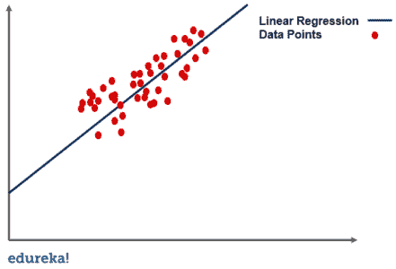**

### **多项式回归**

在这种回归技术中，我们将原始特征转换成给定次数的多项式特征，然后对其执行回归。

### **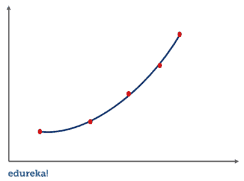**

### **支持向量回归**

对于[支持向量机](https://www.edureka.co/blog/support-vector-machine-in-python/)回归或 SVR，我们识别具有最大边缘的超平面，使得最大数量的数据点在这些边缘内。它非常类似于支持向量机分类算法。

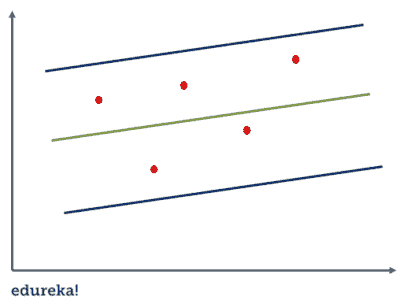

### **决策树回归**

一棵[决策树](https://www.edureka.co/blog/decision-tree-algorithm/)可以用于回归和[分类](https://www.edureka.co/blog/classification-in-machine-learning/)。在回归的情况下，我们使用 ID3 算法(迭代二分法 3)通过减少标准偏差来识别分裂节点。

### **随机森林回归**

在随机森林回归中，我们集成了几个决策树回归的预测。现在我们知道了不同类型的回归，让我们来详细看看简单的线性回归。

**了解我们在顶级城市的机器学习认证培训课程**

| 印度 | 美国 | 其他国家 |
| [班加罗尔的机器学习课程](https://www.edureka.co/masters-program/machine-learning-engineer-training-bangalore) | [达拉斯的机器学习培训](https://www.edureka.co/masters-program/machine-learning-engineer-training-dallas) | [多伦多的机器学习培训](https://www.edureka.co/machine-learning-certification-training-toronto) |
| [海德拉巴的机器学习课程](https://www.edureka.co/masters-program/machine-learning-engineer-training-hyderabad) | [华盛顿的机器学习培训](https://www.edureka.co/masters-program/machine-learning-engineer-training-washington) | [伦敦的机器学习培训](https://www.edureka.co/machine-learning-certification-training-london) |
| [孟买的机器学习认证](https://www.edureka.co/machine-learning-certification-training-mumbai) | [纽约的机器学习认证](https://www.edureka.co/machine-learning-certification-training-new-york-city) | [迪拜的机器学习课程](https://www.edureka.co/masters-program/machine-learning-engineer-training-dubai) |

## **什么是线性回归？**

简单线性回归是一种回归技术，其中自变量与因变量具有线性关系。图中的直线是最佳拟合线。简单线性回归的主要目标是考虑给定的数据点，并绘制最佳拟合线，以尽可能最好的方式拟合模型。


在讨论线性回归算法如何工作之前，让我们先来看看简单线性回归中的几个重要术语。

## **线性回归术语**

在学习线性回归算法之前，熟悉以下术语非常重要。

### **成本函数**

最佳拟合线可以基于下面给出的线性方程。

### **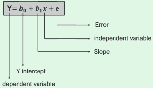**

*   要预测的因变量用 y 表示。
*   与 y 轴相交的线用截距 b <sub>0</sub> 表示。
*   b <sub>1</sub> 是直线的斜率，x 代表决定 y 的预测的自变量。
*   结果预测中的误差用 e 表示。

成本函数为 b <sub>0</sub> 和 b <sub>1</sub> 提供最佳可能值，以制作数据点的最佳拟合线。我们通过将这个问题转化为最小化问题来得到 b <sub>0</sub> 和 b <sub>1</sub> 的最佳值。在这个问题中，实际值和预测值之间的误差被最小化。

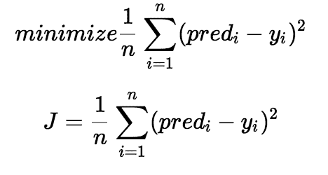

我们选择上面的函数来最小化误差。我们计算误差差的平方，并对所有数据点的误差求和，除以数据点总数。然后，产生的值提供所有数据点的平均平方误差。

它也被称为 MSE(均方误差)，我们改变 b <sub>0</sub> 和 b <sub>1</sub> 的值，使 MSE 值固定在最小值。

### **梯度下降**

理解线性回归的下一个重要术语是**梯度下降。**是一种更新 b <sub>0</sub> 和 b <sub>1</sub> 值以降低 MSE 的方法。这背后的想法是不断迭代 b <sub>0</sub> 和 b <sub>1</sub> 值，直到我们将 MSE 减小到最小。

为了更新 b <sub>0</sub> 和 b <sub>1</sub> ，我们从成本函数中提取梯度。为了找到这些梯度，我们对 b <sub>0</sub> 和 b <sub>1</sub> 取偏导数。这些偏导数是梯度，用于更新 b <sub>0</sub> 和 b <sub>1</sub> 的值。

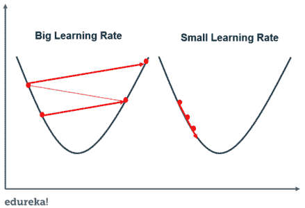 较小的学习率更接近最小值，但在较大的学习率情况下需要更多的时间。花费的时间更快，但有可能超过最小值。既然我们已经了解了线性回归中的术语，让我们来看看线性回归对于机器学习的一些优点和缺点。

通过学习[人工智能课程](https://www.edureka.co/executive-programs/machine-learning-and-ai)，将自己转变为一名高技能专业人士，并获得一份高薪工作。

## **优缺点**

| **优势** | **缺点** |
| 线性回归对于可线性分离的数据表现特别好 | 因变量和自变量之间的线性假设 |
| 更易于实施、解释和高效培训 | 它通常很容易产生噪音和过度拟合 |
| 它使用降维技术、正则化和交叉验证很好地处理了过度拟合 | 线性回归对异常值非常敏感 |
| 另一个优点是超出特定数据集的外推 | 容易出现多重共线性 |

## **线性回归用例**

*   销售预测

*   风险分析

*   房屋申请预测的价格和其他因素

*   预测股票价格、投资评估等金融应用。

线性回归背后的基本思想是找出因变量和自变量之间的关系。它用于获得最佳拟合线，以最小的误差预测结果。我们可以在简单的现实生活中使用线性回归，比如根据学习时间和其他决定性因素来预测 SAT 分数。

考虑到这一点，让我们来看一个使用案例。

## **用例——实现线性回归**

该过程按以下步骤进行:

1.  加载数据
2.  探索数据
3.  分割数据
4.  训练和分割数据
5.  生成模型
6.  评估准确性

让我们深入了解实施线性回归的每个步骤的细节。

**1。加载数据**

我们可以从 sklearn(scikit-learn)数据集模块中已经存在的基本糖尿病数据集开始，以线性回归开始我们的旅程。

```
from sklearn import datasets

disease = datasets.load_diabetes()
print(disease)

```

**输出: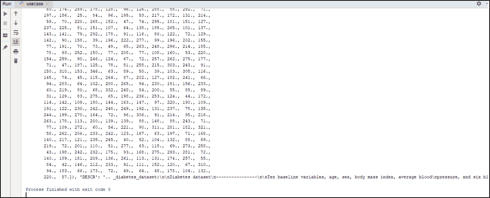**

**2。探索数据**

加载完数据后，我们可以通过使用下面的代码简单地检查标签来开始探索。

```
print(disease.keys())

```

**输出: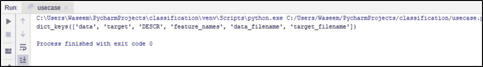**

上面的代码给出了数据集中的所有标签，之后，我们可以对数据进行切片，这样我们就可以绘制出最终的线条。我们还将使用所有的数据点，现在，我们将从数据中截取第 2 列。

```
import numpy as np

disease_X = disease.data[:, np.newaxis,2]
print(disease_X)

```

**输出: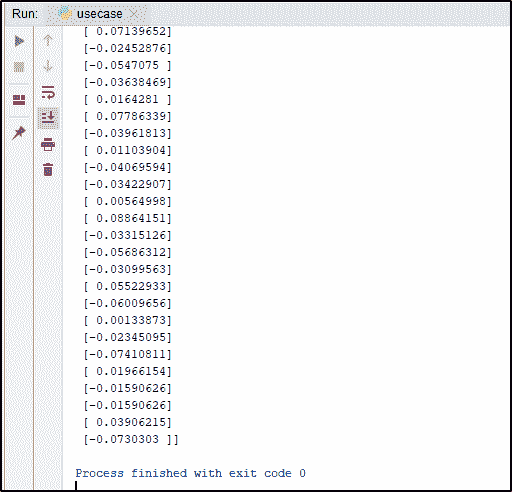**

在这一步之后，我们将把数据分成训练集和测试集。

**3。分割数据**

```
disease_X_train = disease_X[:-30]
disease_X_test = disease_X[-20:]

disease_Y_train = disease.target[:-30]
disease_Y_test = disease.target[-20:]

```

下一部分涉及到生成模型，这将包括从 sklearn 导入 linear_model。

**4。生成模型**

```
from sklearn import linear_model

reg = linear_model.LinearRegression()
reg.fit(disease_X_train,disease_Y_train)

y_predict = reg.predict(disease_X_test)

```

为了评估模型的准确性，我们将使用来自 scikit-learn 的均方误差。

**5。评估**

```
accuracy = mean_squared_error(disease_Y_test,y_predict,)

print(accuracy)

weights = reg.coef_
intercept = reg.intercept_
print(weights,intercept)

```

**输出:**

为了更清楚地了解数据点在图表上的样子，我们也来绘制图表。

```
import matplotlib.pyplot as plt

plt.scatter(disease_X_test, disease_Y_test)
plt.plot(disease_X_test,y_predict)
plt.show()

```

**输出: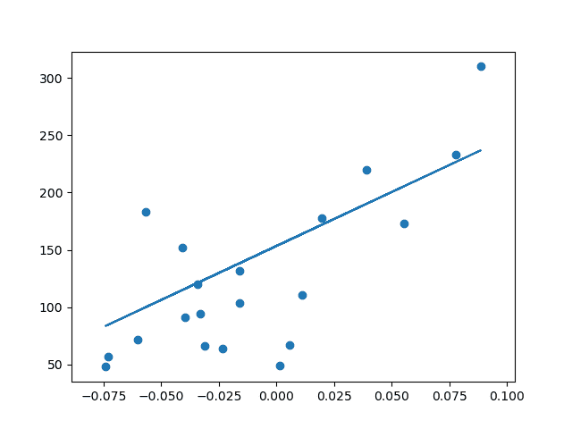**

为了在这个场景中获得更精确的模型，我们可以使用整个数据，而不仅仅是第 2 列。这将给出如下所示的精度:

```
#make a little change in the code above, and remove the plotting code to avoid errors
disease_X = disease.data

```

**输出: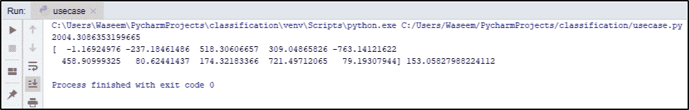**

这将我们带到了本文的结尾，我们已经了解了机器学习的线性回归。我希望你清楚本教程中与你分享的所有内容。

一旦你知道了什么是机器学习的基础知识，你是否想知道如何进步？看看 Edureka 的 [机器学习训练](https://www.edureka.co/machine-learning-certification-training) ，它将帮助你在这个令人着迷的领域走上成功的正确道路。学习机器学习的基础，机器学习的步骤和方法，包括无监督和有监督的学习，数学和启发式方面，以及创建算法的动手建模。你会为机器学习工程师的职位做好准备。

你也可以参加一个 [机器学习课程](https://www.edureka.co/masters-program/machine-learning-engineer-training) 硕士项目。该计划将为您提供关于现实世界中机器学习应用的最深入和实用的信息。此外，您将学习在机器学习领域取得成功所需的基本知识，如统计分析、Python 和数据科学。