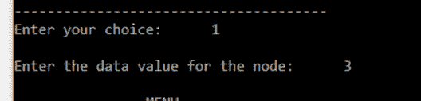
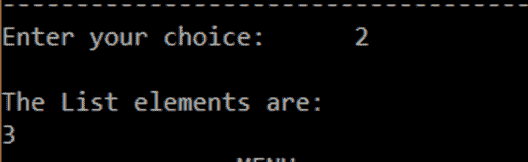
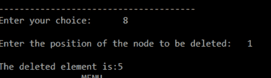
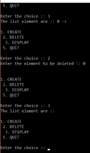

# C 中的链表:如何在 C 中实现一个链表？

> 原文：<https://www.edureka.co/blog/linked-list-in-c/>

在数组之后，第二个最流行的数据结构是链表。链表是一种线性数据结构，由一系列节点组成，其中每个节点都包含一个值和一个指向链中下一个节点的指针。在本文中，我们来看看如何用 c 实现一个链表。

## **C 中的链表是什么？**

链表是一种线性数据结构。每个链表都有两个部分，数据部分和地址部分，地址部分保存了链表中下一个元素的地址，这个元素叫做节点。

链表的大小是不固定的，可以在列表中的任意位置添加数据项。缺点是要到达一个节点，我们必须从第一个节点一直遍历到我们需要的节点。链表就像一个数组，但不像数组，它不是按顺序存储在内存中的。

最流行的链表类型有:

1.  [单链表](#SinglyLinkedList)
2.  [加倍链表](#DoublyLinkedList)

**链表示例**

格式:【数据，地址】

头- >【三千一百】->【431001】->【211002】

在该示例中，数字 43 出现在位置 1000，地址出现在前一节点中。这就是链表的表示方式。

## **基本链表函数**

c 中的链表上可以实现多个函数，下面我们试着借助一个示例程序来了解一下。 首先，我们创建一个列表，显示它，在任意位置插入，删除一个位置。下面的代码将向您展示如何对列表执行操作。

```
#include<stdlib.h>
#include <stdio.h>

void create();
void display();
void insert_begin();
void insert_end();
void insert_pos();
void delete_begin();
void delete_end();
void delete_pos();

struct node
{
        int info;
        struct node *next;
};
struct node *start=NULL;
int main()     
{
        int choice;
        while(1){

                printf("n                MENU                             n");
                printf("n 1.Create     n");
                printf("n 2.Display    n");
                printf("n 3.Insert at the beginning    n");
                printf("n 4.Insert at the end  n");
                printf("n 5.Insert at specified position       n");
                printf("n 6.Delete from beginning      n");
                printf("n 7.Delete from the end        n");
                printf("n 8.Delete from specified position     n");
                printf("n 9.Exit       n");
                printf("n--------------------------------------n");
                printf("Enter your choice:t");
                scanf("%d",&choice);
                switch(choice)
                {
                        case 1:
                                        create();
                                        break;
                        case 2:
                                        display();
                                        break;
                        case 3: 
                                        insert_begin();
                                        break;
                        case 4:
                                        insert_end();
                                        break;
                        case 5:
                                        insert_pos();
                                        break;
                        case 6:
                                        delete_begin();
                                        break;
                        case 7:
                                        delete_end();
                                        break;
                        case 8:
                                        delete_pos();
                                        break;

                        case 9:
                                        exit(0);
                                        break;

                        default:
                                        printf("n Wrong Choice:n");
                                        break;
                }
        }
        return 0;
}
void create()
{
        struct node *temp,*ptr;
        temp=(struct node *)malloc(sizeof(struct node));
        if(temp==NULL)
        {
                printf("nOut of Memory Space:n");
                exit(0);
        }
        printf("nEnter the data value for the node:t");
        scanf("%d",&temp->info);
        temp->next=NULL;
        if(start==NULL)
        {
                start=temp;
        }
        else
        {
                ptr=start;
                while(ptr->next!=NULL)
                {
                        ptr=ptr->next;
                }
                ptr->next=temp;
        }
}
void display()
{
        struct node *ptr;
        if(start==NULL)
        {
                printf("nList is empty:n");
                return;
        }
        else
        {
                ptr=start;
                printf("nThe List elements are:n");
                while(ptr!=NULL)
                {
                        printf("%dt",ptr->info );
                        ptr=ptr->next ;
                }
        }
}
void insert_begin()
{
        struct node *temp;
        temp=(struct node *)malloc(sizeof(struct node));
        if(temp==NULL)
        {
                printf("nOut of Memory Space:n");
                return;
        }
        printf("nEnter the data value for the node:t" );
        scanf("%d",&temp->info);
        temp->next =NULL;
        if(start==NULL)
        {
                start=temp;
        }
        else
        {
                temp->next=start;
                start=temp;
        }
}
void insert_end()
{
        struct node *temp,*ptr;
        temp=(struct node *)malloc(sizeof(struct node));
        if(temp==NULL)
        {
                printf("nOut of Memory Space:n");
                return;
        }
        printf("nEnter the data value for the node:t" );
        scanf("%d",&temp->info );
        temp->next =NULL;
        if(start==NULL)
        {
                start=temp;
        }
        else
        {
                ptr=start;
                while(ptr->next !=NULL)
                {
                        ptr=ptr->next ;
                }
                ptr->next =temp;
        }
}
void insert_pos()
{
        struct node *ptr,*temp;
        int i,pos;
        temp=(struct node *)malloc(sizeof(struct node));
        if(temp==NULL)
        {
                printf("nOut of Memory Space:n");
                return;
        }
        printf("nEnter the position for the new node to be inserted:t");
        scanf("%d",&pos);
        printf("nEnter the data value of the node:t");
        scanf("%d",&temp->info) ;

        temp->next=NULL;
        if(pos==0)
        {
                temp->next=start;
                start=temp;
        }
        else
        {
                for(i=0,ptr=start;i<pos-1;i++) { ptr=ptr->next;
                        if(ptr==NULL)
                        {
                                printf("nPosition not found:[Handle with care]n");
                                return;
                        }
                }
                temp->next =ptr->next ;
                ptr->next=temp;
        }
}
void delete_begin()
{
        struct node *ptr;
        if(ptr==NULL)
        {
                printf("nList is Empty:n");
                return;
        }
        else
        {
                ptr=start;
                start=start->next ;
                printf("nThe deleted element is :%dt",ptr->info);
                free(ptr);
        }
}
void delete_end()
{
        struct node *temp,*ptr;
        if(start==NULL)
        {
                printf("nList is Empty:");
                exit(0);
        }
        else if(start->next ==NULL)
        {
                ptr=start;
                start=NULL;
                printf("nThe deleted element is:%dt",ptr->info);
                free(ptr);
        }
        else
        {
                ptr=start;
                while(ptr->next!=NULL)
                {
                        temp=ptr;
                        ptr=ptr->next;
                }
                temp->next=NULL;
                printf("nThe deleted element is:%dt",ptr->info);
                free(ptr);
        }
}
void delete_pos()
{
        int i,pos;
        struct node *temp,*ptr;
        if(start==NULL)
        {
                printf("nThe List is Empty:n");
                exit(0);
        }
        else
        {
                printf("nEnter the position of the node to be deleted:t");
                scanf("%d",&pos);
                if(pos==0)
                {
                        ptr=start;
                        start=start->next ;
                        printf("nThe deleted element is:%dt",ptr->info  );
                        free(ptr);
                }
                else
                {
                        ptr=start;
                        for(i=0;i<pos;i++) { temp=ptr; ptr=ptr->next ;
                                if(ptr==NULL)
                                {
                                        printf("nPosition not Found:n");
                                        return;
                                }
                        }
                        temp->next =ptr->next ;
                        printf("nThe deleted element is:%dt",ptr->info );
                        free(ptr);
                }
        }
}

```

这段代码的第一部分是创建一个结构。创建了一个链表结构，这样它可以保存我们需要的数据和地址。这样做是为了让编译器知道节点应该是什么样子。

```
struct node
{
        int info;
        struct node *next;
}; 

```

在这个结构中，我们有一个名为 info 的数据变量来保存数据，还有一个指针变量指向地址。可以对链表进行各种操作，例如:

*   ***创造()***
*   ***显示()***
*   ***insert_begin()***
*   ***insert_end()***
*   ***]insert_pos()***
*   ***delete_begin()***
*   ***delete_end()***
*   ***delete_pos()***

这些函数由菜单驱动的主函数调用。在 main 函数中，我们根据用户想要在程序中做什么操作来接受用户的输入。该输入然后被发送到开关盒并基于用户输入。

基于所提供的输入，该函数将被调用。接下来，我们有不同的功能需要解决。让我们来看看这些函数中的每一个。

### **创建功能**

首先，有一个 create 函数来创建链表。这是创建链表的基本方法。让我们看看代码。

```
void create()
{
        struct node *temp,*ptr;

        printf("nEnter the data value for the node:t");
        scanf("%d",&temp->info);
        temp->next=NULL;
        if(start==NULL)
        {
                start=temp;
        }
        else
        {
                ptr=start;
                while(ptr->next!=NULL)
                {
                        ptr=ptr->next;
                }
                ptr->next=temp;
        }
}

```

**输出**



首先，创建两个类型为 ***node、ptr 和 temp*** 的指针。我们从用户那里获取需要添加到链表中的值，并将其存储在 temp 变量的 info 部分，然后将下一个地址部分的 temp 赋值为 null。有一个开始指针保存列表的开始。然后我们检查列表的开始。如果列表的开始为空，那么我们把 temp 赋给开始指针。否则，我们遍历到最后一个添加了数据的点。

为此，我们为 ptr 指定起始值，并遍历到***ptr->next = null***。然后我们分配***ptr->next***temp 的地址。以类似的方式，给出了在开头插入、在结尾插入和在指定位置插入的代码。

### 显示功能

这是显示函数的代码。

```
void display()
{
        struct node *ptr;
        if(start==NULL)
        {
                printf("nList is empty:n");
                return;
        }
        else
        {
                ptr=start;
                printf("nThe List elements are:n");
                while(ptr!=NULL)
                {
                        printf("%dt",ptr->info );
                        ptr=ptr->next ;
                }
        }
}

```

**输出**



在显示函数中，我们首先检查列表是否为空，如果为空则返回。在下一部分中，我们将起始值赋给 ptr。然后，我们运行一个循环，直到 ptr 为空，并打印每个节点的数据元素，直到 ptr 为空，这指定了列表的结尾。

### **删除功能**

下面是从链表中删除一个节点的代码片段。

```
void delete_pos()
{
        int i,pos;
        struct node *temp,*ptr;
        if(start==NULL)
        {
                printf("nThe List is Empty:n");
                exit(0);
        }
        else
        {
                printf("nEnter the position of the node to be deleted:t");
                scanf("%d",&pos);
                if(pos==0)
                {
                        ptr=start;
                        start=start->next ;
                        printf("nThe deleted element is:%dt",ptr->info  );
                        free(ptr);
                }
                else
                {
                        ptr=start;
                        for(i=0;i<pos;i++) { temp=ptr; ptr=ptr->next ;
                                if(ptr==NULL)
                                {
                                        printf("nPosition not Found:n");
                                        return;
                                }
                        }
                        temp->next =ptr->next ;
                        printf("nThe deleted element is:%dt",ptr->info );
                        free(ptr);
                }
        }
} 

```

**输出**



在删除过程中，它首先检查列表是否为空，如果是，则它存在。如果不为空，它会要求用户输入要删除的位置。一旦用户进入该位置，它检查它是否是第一个位置，如果是，它分配 ***ptr*** 开始并将开始指针移动到下一个位置并删除 ptr。如果*位置不为零*，那么它运行一个 for 循环，从 0 一直到用户输入的 pos，并存储在 ***pos*** 变量中。有一个 if 语句来决定输入的位置是否不存在。如果 *ptr 等于空值*，则它不存在。

我们*在 for 循环中将 ptr 赋给 temp* ，然后 ptr 继续下一部分。找到位置后。我们让 temp 变量保存下一个 的 ***ptr- >的值，从而跳过 ptr。那么 ptr 被删除。类似地，对于第一个和最后一个元素删除也可以这样做。***

## **双向链表**

它被称为双向链表，因为有两个[指针](https://www.edureka.co/blog/pointers-in-c/)，一个指向下一个节点，另一个指向前一个节点。在双向链表中执行的操作类似于单向链表。下面是基本操作的代码。

```
#include<stdio.h>
#include<stdlib.h>
struct Node;
typedef struct Node * PtrToNode;
typedef PtrToNode List;
typedef PtrToNode Position;

struct Node
{
    int e;
    Position previous;
    Position next;
};

void Insert(int x, List l, Position p)
{
    Position TmpCell;
    TmpCell = (struct Node*) malloc(sizeof(struct Node));
    if(TmpCell == NULL)
        printf("Memory out of spacen");
    else
    {
        TmpCell->e = x;
        TmpCell->previous = p;
        TmpCell->next = p->next;
        p->next = TmpCell;
    }
}

void Delete(int x, List l)
{
    Position p, p1, p2;
    p = Find(x, l);
    if(p != NULL)
    {
        p1 = p -> previous;
        p2 = p -> next;
        p1 -> next = p -> next;
        if(p2 != NULL)                  // if the node is not the last node
            p2 -> previous = p -> previous;
    }
    else
        printf("Element does not exist!!!n");
}

void Display(List l)
{
    printf("The list element are :: ");
    Position p = l->next;
    while(p != NULL)
    {
        printf("%d -> ", p->e);
        p = p->next;
    }
}

int main()
{
    int x, pos, ch, i;
    List l, l1;
    l = (struct Node *) malloc(sizeof(struct Node));
    l->previous = NULL;
    l->next = NULL;
    List p = l;
    printf("DOUBLY LINKED LIST IMPLEMENTATION OF LIST ADTnn");
    do
    {
        printf("nn1\. CREATEn 2\. DELETEn  3\. DISPLAYn 4\. QUITnnEnter the choice :: ");
        scanf("%d", &ch);
        switch(ch)
        {
        case 1:
            p = l;
            printf("Enter the element to be inserted :: ");
            scanf("%d",&x);
            printf("Enter the position of the element :: ");
            scanf("%d",&pos);
            for(i = 1; i < pos; i++) { p = p->next;
            }
            Insert(x,l,p);
            break;

        case 2:
            p = l;
            printf("Enter the element to be deleted :: ");
            scanf("%d",&x);
            Delete(x,p);
            break;

        case 3:
            Display(l);
            break;
        }
    }
    while(ch<4);
}

```

**输出  **

如你所见，操作的概念非常简单。在 C 语言程序设计中，双向链表的操作与单向链表相同。唯一的区别是有另一个地址变量，它有助于在双向链表中更好地遍历链表。

希望你已经理解了如何在 c 中对单链表和双链表进行基本操作。

如果你想学习 Java 中的链表，这里有一个[完整指南](https://www.edureka.co/blog/linked-list-in-java/)。

如果您遇到任何问题，请在“C 语言链表”的评论区提出您的所有问题，我们的团队将很乐意回答。