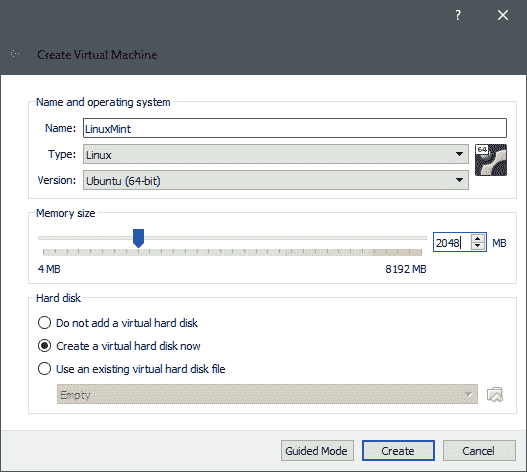
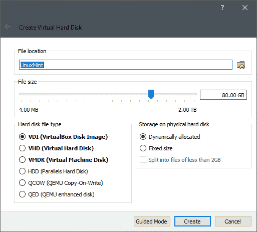
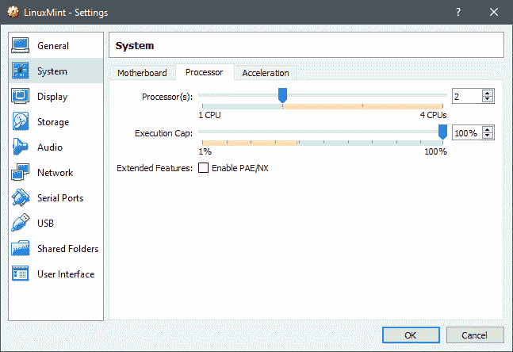
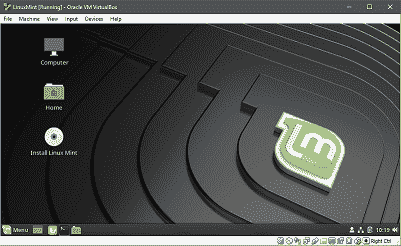
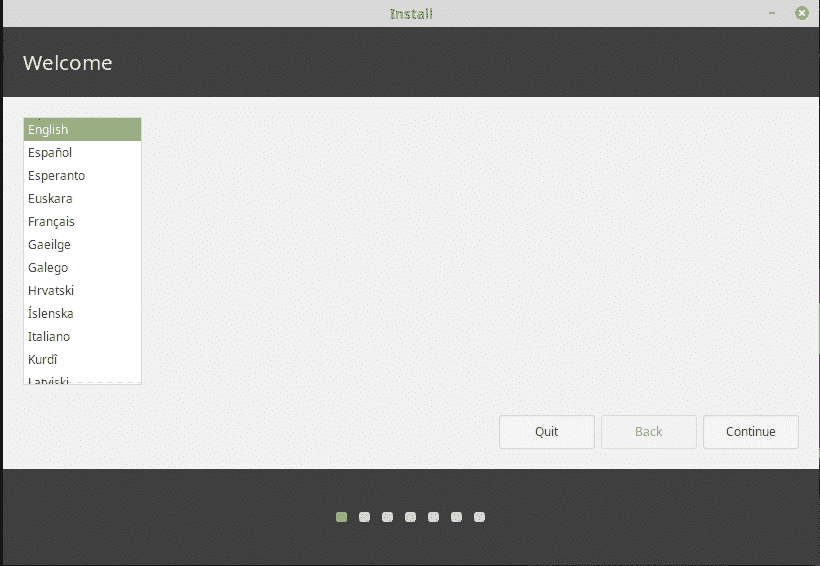
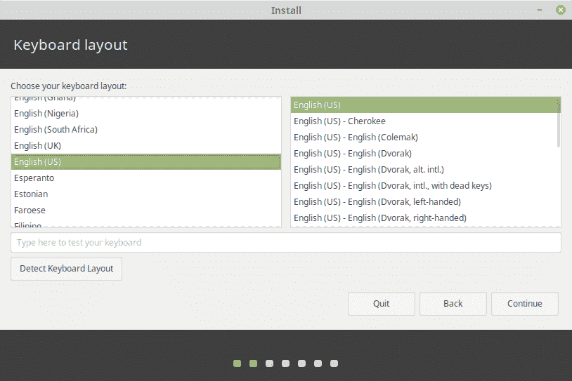
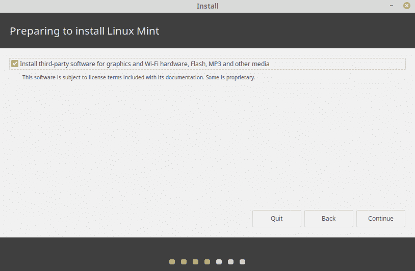
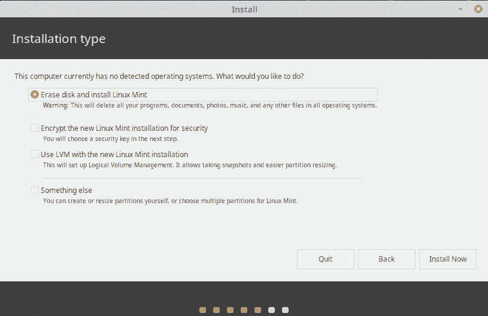
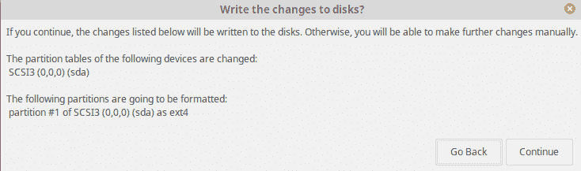

# Linux Mint 是什么，比 Ubuntu 好在哪？

> 原文：<https://www.edureka.co/blog/linux-mint/>

Linux Mint 是 Windows 或 Mac 用户在工作环境中不得不切换到 *[Linux](https://www.edureka.co/linux-admin)* 时第一个被吸引的操作系统。Linux Mint 从 2006 年开始出现，已经成长并成熟为一个非常用户友好的操作系统。所以在这篇博客中，我们将详细讨论 Linux Mint。我们将要讨论的主题如下

*   [什么是 Linux Mint？](#what)
*   [Linux Mint 的特性](#features)
*   [如何选择合适的版本？](#edition)
*   [Linux Mint 的利与弊](#pnc)
*   [Ubuntu Vs Linux Mint](#uvslm)
*   [安装 Linux Mint](#install)

让我们从第一个话题开始。

## **什么是 Linux Mint？**

Linux Mint 是一个基于 Ubuntu 的社区驱动的 Linux 发行版。它努力成为一个现代、优雅、舒适、功能强大且易于使用的操作系统。Linux Mint 是一个免费的开源操作系统，设计用于桌面计算机。它是目前数百万人使用的最流行的桌面 Linux 发行版之一。

## **Linux Mint 的特性**

*   Linux Mint 的核心区别是它的用户界面和易交互性。

*   像典型的 Linux 发行版一样，Linux Mint 包括一个集成的预安装应用程序套件，并通过其应用程序包管理器实用程序提供搜索、下载和安装附加应用程序的能力。

*   Linux Mint 的设计非常舒适和易于使用，但同时，它也是强大和可配置的。

*   一切都是为了让用户体验更好。用户反馈非常重要，它被用来持续改进 Linux Mint 的质量。

*   Linux Mint 提供长期支持(LTS)版本，通常支持 5 年。

## **如何选择合适的版本？**

Linux Mint 有 3 种不同的风格，每一种都有不同的桌面环境。

| 版本 | 描述 |
| 肉桂色 | 最现代、最创新、功能最全的台式机 |
| 交配 | 更稳定、更快速的台式机 |
| Xfce 你好 | 最轻便和最稳定的 |

*   Linux Mint 最流行的版本是 **Cinnamon** 版。Cinnamon 主要是为 Linux Mint 开发的。它是光滑的，美丽的，充满了新的功能。

*   Linux Mint 还参与了 MATE T2 的开发，这是一个经典的桌面环境，是 GNOME 2 的延续，GNOME 2 是 Linux Mint 在 2006 年到 2011 年间的默认桌面。虽然它缺少一些功能，开发速度比 Cinnamon 慢，但 MATE 运行速度更快，使用的资源更少，而且比 Cinnamon 更稳定。

*   **Xfce** 是一个轻量级的桌面环境。它不像 Cinnamon 或 MATE 那样支持很多功能，但它非常稳定，对资源的使用非常少。

如果你不确定选择哪个桌面，就从肉桂色版开始吧。当你有时间的时候，尝试所有的方法。这三个版本在 Linux Mint 社区中都有自己的受众，并且都非常受欢迎。

### **32 位还是 64 位？**

建议使用 64 位。提供 32 位 ISO 映像是为了与旧电脑兼容。32 位处理器现在非常罕见，大多数计算机能够在 64 位处理器上运行。如果你的电脑是 2007 年以后生产的，你可能有一个 64 位处理器。

如果你有一台旧电脑，并且不确定它是否能在 64 位上运行，请阅读 [X86 年表](https://en.wikipedia.org/wiki/X86#Chronology)。你可以尝试在你的电脑上启动 Linux Mint 64 位。如果不兼容，你只会得到一个错误信息。

## **Linux Mint 的利与弊**

### 让我们来看看使用 Linux Mint 的几个优点。

*   它开箱即用，提供全面的多媒体支持，非常易于使用。
*   它既免费又开源。
*   这是社区驱动的。这里鼓励用户向项目发送反馈。这样做是为了让我们可以利用他们的想法来改进 Linux Mint。
*   它基于 Debian 和 Ubuntu，提供了大约 30，000 个软件包和最好的软件管理器之一。
*   它是安全可靠的，Linux Mint 需要很少的维护(没有回归，没有防病毒，没有反间谍软件…等)，因为保守的软件更新方法，独特的更新管理器和强大的架构。

### 现在让我们讨论几个缺点。

*   没有设备管理器。

*   Mint 对新技术持保守态度。所以，如果你想跟上最新的技术或者华丽的桌面，那么你可能更适合 Fedora 这样的发行版。
*   Mint 太大了，需要一台性能合理的机器来有效运行。因此，如果你的机器特别旧，你不能升级它，那么你最好用别的东西代替。
*   虽然 Mint 基于 Ubuntu，但它在很多方面与它的兄弟不同，所以并不是 Ubuntu 的所有东西都能与 Mint 兼容。此外，Mint 的最新版本不会基于 Ubuntu 的最新版本:它总是落后一两个版本。
*   没有 PPA(个人软件包档案)-添加一个 PPA 到您的源代码，然后从 PPA 安装软件是一个伟大的方式来打破你的安装。最初，它可能不会在每个 PPA 软件中出现，但最终会出现。

## **Linux Mint vs Ubuntu**

| **功能** | **Linux 为** | **Ubuntu** |
| 用户界面 | 工作流程更快且易于使用 | 不比 Linux Mint 好 |
| 表演 | 比 Ubuntu 更快更轻 | 比 Linux Mint 慢一点 |
| 内存使用 | 较少的内存使用 | 更高的内存使用率 |
| 社区 | 较小的社区 | 更大的社区 |
| 分配 | 基于 Ubuntu | 基于 Debian |
| 桌面环境 | 肉桂、Xfce 和马黛茶 | 默认环境称为 unity |
| 预装软件 | 默认安装的重要应用程序 | Ubuntu 缺少这个预装的工具 |
| 可用性 | 推荐给初学者 | 推荐给专业人士，开发者首选。 |

## **安装 Linux Mint**

虽然有些电脑预装了 *[Linux Mint](https://www.linuxmint.com/edition.php?id=267)* ，但更有可能的是你会把它安装到已经有操作系统的机器上。有两种方法可以采用:要么在现有的操作系统上安装它，有效地删除它，要么与原来的操作系统一起安装。

还有一个双重引导的选择。通过手动启动，你在同一台计算机上安装了两个操作系统，但是你一次只能使用其中的一个。这种方法牺牲了灵活性；为了使用一个操作系统的应用程序，您需要关闭另一个操作系统。但是这里我们将集中讨论前两个选项。

### **1。直接安装**

在您的 PC 或 Mac 上直接安装 Linux Mint 的步骤如下:

*   准备一个安装程序。这通常是一个 USB 驱动器，虽然你也可以把它刻录到光盘上，如果你喜欢的话。但是要注意，现在大多数 Linux 安装程序都比 CD-ROM (700 MB)大，所以你需要一个 DVD-R/RW 或者一个合适大小的 u 盘。Linux Mint 的安装程序将近 2 GB。

*   接下来，从您刚刚创建的介质(USB 驱动器或光盘)启动。您可能需要调整与引导顺序相关的机器设置，以及 UEFI(稍后将详细介绍)。

*   最后，一旦 USB 驱动器启动，运行安装程序，你就到达一个活跃的 Mint 桌面。

### **2。使用虚拟盒子-**

Linux Mint 19 的标准推荐系统要求是:

*   2GB 内存(最低 1 GB)
*   20GB 的磁盘空间

确保你至少分配了最低限额，如果可以的话，尽量多分配一点。尤其是磁盘空间很容易分配，因为即使是 100GB 的虚拟磁盘也只占用 10GB 的物理空间，或者说只占用操作系统和虚拟机内所有数据所需的很少空间。只有当您使用磁盘的动态分配(这是默认设置)时，才会出现这种情况。

*   进入 VirtualBox 管理器窗口，点击 New，开始分配内存，并给你的虚拟机命名。这里的类型是 Linux，版本是 Ubuntu。

*   接下来要做的是创建  一个虚拟硬盘。物理硬盘上的默认文件类型和存储是可以的。分配 20 GB 以上的磁盘。

*   点击 ***创建，*** 虚拟机就创建好了。如果您愿意，您可以通过转到设置来进一步调整它(右键单击虚拟机并选择设置)。在它们的设置→系统→处理器中，如果硬件允许，您可以添加一些额外的计算核心。

*   现在启动系统，因为没有启动盘，VirtualBox 会坚持要你提供一张。在这里，我们需要使用 Linux Mint ISO 来完成这项工作，并启动 VM。

*   在 live install 介质中，我们可以看到 Install Linux Mint 实用程序，它将帮助我们执行与其同名的任务。双击并启动该实用程序。选择首选语言。

*   接下来选择键盘布局。

*   虽然不是绝对必要，尤其是在虚拟机内部，但安装第三方软件是安全的，总体而言，这将改善用户体验。

*   由于我们创建了一个新的虚拟硬盘，所以擦除磁盘并在其上安装 Linux Mint 也是安全的。如果你试图在一个物理磁盘上进行双引导，或者只是在不丢失数据的情况下改变你的 Linux 发行版，这个选项不适合你。如果您在物理磁盘上安装 Linux Mint，请备份您的数据。

*   现在点击， **立即安装，** 然后查看安装程序想要创建的分区，如果您满意，那么您可以点击继续。例如，擦除磁盘选项将最终创建这些分区。

*   安装将开始，同时，我们可以设置我们的位置和用户帐户和密码。安装可能需要一段时间，需要更新软件包和复制文件。然而，一旦我们这样做了，我们现在可以重新启动虚拟机，新安装的操作系统将迎接我们。

如果你的主要操作系统只有 Linux，那么 Linux Mint 可能是一个不错的选择。这与你对这个系统了解多少无关。

至此，我们结束了这个 Linux Mint 博客。

*有问题吗？请将它发布在 **[Edureka 社区](https://edureka.co/community)** 上，我们将会回复您。*

*如果您希望学习 Linux 管理并建立一个丰富多彩的职业生涯，那么请查看我们的 [**Linux 认证**](https://www.edureka.co/linux-admin) 培训，该培训带有讲师指导的现场培训和真实项目经验。这个培训将帮助您深入理解 Linux 管理，并帮助您掌握这个主题。*