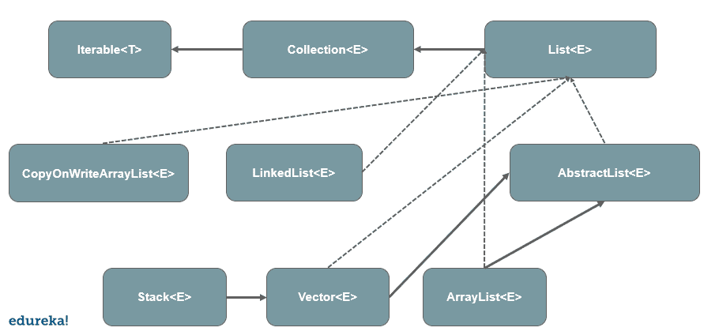

# Java 中的列表:初学者的一站式解决方案

> 原文：<https://www.edureka.co/blog/list-in-java/>

Java 编程语言优化了[数据结构](https://www.edureka.co/blog/data-structures-algorithms-in-java/)支持。随着能力的增强，能够控制数据结构以满足各种依赖性变得相当重要。Java[中的 list](https://www.edureka.co/java-j2ee-training-course)是[集合接口](https://www.edureka.co/blog/java-collections/)的一个子接口，通过位置访问、迭代等概念给出最佳解决方案。在本文中，我们将讨论 Java 中对列表接口的各种操作。以下是本博客讨论的主题:

*   [Java 中的列表界面](#list)
*   [列出接口方法和描述](#methods)
*   [Java 中对列表的操作](#operations)
    *   [位置访问](#access)
    *   [搜索](#search)
    *   [迭代](#iteration)
    *   [范围视图](#range-view)

## **Java 中的列表界面**

Java 中的 List 接口是 Java 集合接口的子接口。它是有序的，并且允许重复条目，在插入和删除时具有定位的灵活性。我们可以在索引的帮助下访问元素，这也有助于搜索操作。

列表由 [ArrayList](https://www.edureka.co/blog/java-arraylist/) 、 [LinkedList、](https://www.edureka.co/blog/linked-list-in-java/)、 [Vectors](https://www.edureka.co/blog/vector-in-java/) 和 Stack 类实现。下面是用 Java 实现 list [接口的语法。](https://www.edureka.co/blog/java-interface/)

```
public interface List<E> extends Collection<E>

```

**Java 列表类图**

## ****

列表接口扩展了集合接口，集合接口扩展了迭代器接口。抽象列表提供了列表接口的优化实现，以减少工作量。下面是我们在 Java 中使用 list 接口时可以使用的方法。

## **列出接口方法，并附有说明**

| **方法** | **描述** |
| void add(int index，E element) | 它用于在特定位置插入元素 |
| 布尔加法 | 它将元素追加到列表的末尾 |
| 布尔 addAll(int index，Collection extends E> c) | 它将指定集合中的元素追加到列表的末尾 |
| 空清除() | 从列表中移除所有元素 |
| 布尔等于(对象 o) | 它将指定的对象与列表中的元素进行比较 |
| int hashcode() | 它返回列表的散列码值 |
| E get(int index) | 它从列表的特定位置获取元素 |
| 布尔型 isEmpty() | 它检查列表是否为空 |
| int lastIndexOf(object o) | 返回指定对象的索引值 |
| Object[] toArray() | 它返回一个数组，该数组中的所有元素都以正确的顺序排列 |
| 到阵列(T[] a) | 返回一个包含列表中所有元素的数组 |
| 布尔包含(对象 o) | 如果列表中存在指定的元素，则返回 true |
| 布尔包含全部(集合> c) | 它检查列表中的多个元素 |
| int indexOf(Object o) | 返回第一次出现的元素的索引 |
| E remove(int 索引) | 移除指定位置的元素 |
| 布尔移除(对象 o) | 它移除指定元素的第一个匹配项 |
| 布尔 removeAll(集合> c) | 从列表中移除所有元素 |
| void replaceAll(一元运算符运算符) | 用指定值替换所有元素 |
| 作废零售(收款> c) | 保留指定位置的所有元素 |
| E 集合(int 索引，E 元素) | 替换指定位置的指定元素 |
| 无效排序(比较器 Super E> c) | 基于指定的比较器对列表进行排序 |
| 拆分器拆分器() | 在元素上创建 sppoliteator |
| List <e>subList (int fromIndex, int toIndex)</e> | 获取给定范围内的元素 |
| int size() | 返回列表中元素的数量 |

## **Java 中对列表的操作**

我们可以使用不同的方法对列表执行各种操作。这些操作包括位置访问、搜索操作、迭代等。下面是几个例子来展示在 [Java](https://www.edureka.co/blog/java-tutorial/) 中对列表的操作。

**创建列表对象**

创建列表对象类似于创建常规对象。下面是一个用 Java 制作列表[对象](https://www.edureka.co/blog/java-object/)的例子。

```
List a =  new Stack();
List b =  new Vector();
List c =  new ArrayList();
List d = new LinkedList();
//After the release of generics, we can restrict the type of the object as well.
List <object> list = new ArrayList<object>();

```

### **位置访问**

下面的例子展示了 Java 中对列表的位置访问。

```
import java.util.*;

public class Demo {
public static void main(String[] args){
List<Integer> list = new ArrayList<Integer> ();
list.add(0,1);
list.add(1,3);
list.add(2,5);
list.add(3,7);
System.out.println(list);
list.remove(3);
System.out.println(list.get(2));
list.set(3,5);
System.out.println(list);
}
}

```

### **搜索**

有了索引，搜索变得更加容易。下面的例子展示了在 Java 中搜索列表的操作。

```
import java.util.*;

public class Demo{
public static void main(String[] args){
List<String> list = new ArrayList<String>();
list.add("Edureka");
list.add("Java Programming");
list.add("J2EE");
System.out.println(indexOf("Java Programming"));
System.out.println(lastIndexOf("Edureka"));
System.out.println(indexOf("Advance Java"));
}
}

```

### **迭代**

ListIterator 用于遍历 Java 中的列表序列。它本质上是双向的。下面是 Java 中 ListIterator 的几种方法。

**ListIterator 接口**

| **方法** | **描述** |
| 空添加 | 在列表中插入元素 |
| 布尔 hasNext() | 如果正向遍历有下一个元素，则返回 true |
| e 下一个() | 返回列表中的下一个元素 |
| int nextindex() | 返回列表中的下一个索引 |
| 布尔 hasPrevious() | 如果向后遍历有下一个元素，则返回 true |
| e 上一个() | 返回列表中的前一个元素 |
| e 预览索引() | 返回列表中的上一个索引 |
| void 删除() | 它删除列表中的最后一个元素 |
| 空集 | 它用指定的值替换最后一个元素 |

**申报**

```
public interface ListIterator<E> extends Iterator<E>

```

**列表迭代器示例**

```
import java.util.*;
public class Demo{
public static void main(String[] args){
List<String> list = new Arraylist<String>();
list.add("Edureka");
list.add("Java");
list.add("J2EE");
list.add("Advance java");

ListIterator<String> li = list.listIterator();
System.out.println("Forward iteration");
while(li.hasNext()){
System.out.println("index=" + li.nextIndex() + "value=" + li.next());
}
System.out.println("backward iteration");
while(li.hasPrevious()){
System.out.println("index= " + li.previousIndex() + "value=" +li.previous());
}
}
}

```

### **测距视野**

List 接口提供了获取部分列表的列表视图的方法。以下是显示范围视图操作的示例。

```
import java.util.*;
public class Demo{
public static void main(){
List<String> list = new ArrayList<String>();
list.add("Edureka");
list.add("Edureka Java");
list.add("Java Programming");
list.add("J2EE");
list.add("Advance Java");

List <String> list2 = new ArrayList<String> ();
list2 = list.subList(2,4);
System.out.println(list2);
}
}

```

在本文中，我们讨论了各种例子，包括 Java 中的列表接口操作。优化提高了效率，并且有了所有支持列表接口的方法，任何开发人员都可以更容易地使用列表来获得更好的结果。

Java 编程语言已经成为当今最有前途的语言之一，随着需求的增长，它迎合了 it 行业的大量就业机会。要掌握所有的技能，报名参加 edureka 的 [Java 认证项目](https://www.edureka.co/java-j2ee-training-course)，开始你的职业生涯。

有问题要问我们吗？请在这篇关于“Java 中的列表”的文章的评论中提到这一点，我们会尽快回复您。