# 使用 JMeter 的负载测试:如何在 CMD 中测量性能

> 原文：<https://www.edureka.co/blog/load-testing-using-jmeter/>

确保交付高质量的软件产品是很重要的。因此，参与[测试](https://www.edureka.co/blog/what-is-software-testing/)产品的工程师采用了各种测试方法。它需要确保应用程序运行没有任何故障。这篇关于“使用 JMeter 进行**负载测试”的文章将提供关于负载[测试工具](https://www.edureka.co/blog/software-testing-tools/)的深入知识，用于按以下顺序分析和测量性能:**

*   什么是负载测试？
*   [用于负载测试的工具](#loadtestingtools)
*   [什么是 JMeter？](#jmeter)
*   [Jmeter 的优势](#jmeteradvantages)
*   [JMeter 的元素](#jmeterelements)
*   [使用 JMeter(非 GUI 模式)进行负载测试](#loadtestusingjmeter)
*   [仪表板上的报告生成](#dashboard)

## **什么是负载测试？**

负载测试是一种性能测试，用于确定系统在真实条件下的性能。它检查系统在正常和高负载期间的行为，并确定系统、软件或计算设备是否能够在终端用户的高需求下处理高负载。


负载测试用于识别以下内容:

*   应用程序的最大运行能力
*   确定当前的基础架构是否足以运行应用程序
*   应用程序相对于峰值用户负载的可持续性
*   应用程序可以支持的并发用户数量，以及允许更多用户访问它的可伸缩性。

## **用于负载测试的工具**

性能测试在实时中是非常重要的，尤其是从客户满意度的角度来看。有几个可用的性能测试工具，例如:

*   阿帕奇 JMeter
*   负载运行器
*   WebLOAD
*   装载机队
*   LoadView
*   新负载

Apache JMeter 是最受欢迎的测试工具之一。让我们继续我们的“使用 JMeter 进行负载测试”文章，看看 JMeter 的所有优点。

## **什么是米？**

Apache JMeter 是一个测试工具，用于分析和测量不同软件服务和产品的性能。这是一个纯 Java 开源软件，用于测试 Web 应用程序或 FTP 应用程序。


它用于执行 web 应用程序的性能测试、负载测试和功能测试。JMeter 还可以通过为 web 服务器创建大量虚拟并发用户来模拟服务器上的重负载。

## **JMeter 的优点**

Apache JMeter 开源软件通过简化测试过程填补了一大空白。JMeter 的一些优势包括:

****

**开源**–JMeter 是一款开源软件。这意味着它可以免费下载。它也是一个 100%纯 Java 应用程序。开发人员可以使用它的源代码，可以根据他们的要求修改和定制它。

****

**用户友好的**–JMeter 有一个全面的 GUI，帮助创建测试计划和配置元素。添加元素也很容易。你只需要右击树形场景，然后添加你需要做的事情。

****

**支持**——基本上是为性能测试而设计的，但也通过创建测试计划来支持其他非功能性测试，如压力测试、分布式测试、Web 服务测试等。

****

**综合文档**——这是最需要强调的一点。由于其强大的文档，用户可以对每一个步骤有一个清晰的想法，从零开始，包括测试设置的安装和配置，并生成最终报告。

****

**记录**–JMeter 允许用户使用记录设备记录 HTTP/HTTPS 以创建测试计划。我们使用代理服务器，允许 JMeter 在您使用普通浏览器浏览 web 应用程序时观察和记录您的操作。

****

**报告**–JMeter 支持仪表板报告生成。通过 JMeter 生成大量的报告，帮助用户理解性能测试的执行结果。

您可以参考 [JMeter 教程](https://www.edureka.co/blog/jmeter-tutorial/)来了解测试工具安装过程中涉及的步骤，并查看执行任何测试时使用的不同元素。

## **JMeter 的元素**

JMeter 的不同组件被称为元素。每个元素都有特定的用途。一些主要因素是:

*   **线程组**–线程组是线程的集合。每个线程代表一个使用被测应用程序的用户。它模拟一个真实的用户对服务器的请求。线程组的控件还允许您设置每个组的线程数量。
*   采样器–JMeter 支持测试 HTTP、FTP、JDBC 和更多协议。线程组模拟用户对服务器的请求。采样器帮助线程组知道它需要发出哪种类型的请求。
*   **监听器**–监听器显示测试执行的结果。它们可以以不同的格式显示结果，如树、表、图或日志文件。
*   **配置**–配置元素用于设置缺省值和变量，供采样器以后使用。

现在上面所有的元素都已经在 [JMeter 教程](https://www.edureka.co/blog/jmeter-tutorial/)中详细解释过了。在这个使用 JMeter 的负载测试中，在非 GUI 模式下执行测试需要另一个新元素。

### **断言**

JMeter 中的断言用于验证发送给服务器的请求的响应。断言是一个在运行时用请求的实际结果验证预期结果的过程。如果你需要在一个特定的采样器上应用断言，那么就把它作为这个采样器的子元素添加进去。

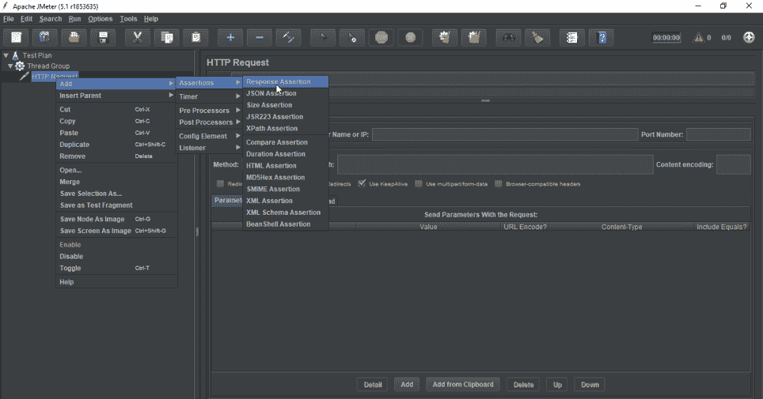

如果你需要在一个特定的采样器上应用断言，那么就把它作为这个采样器的子元素添加进去。您可以通过将“断言监听器”添加到线程组来查看断言结果。

*   **响应断言**–响应断言可用于添加模式字符串，并与服务器响应的一个或多个值进行比较。例如，当您向 URL:【https://www.google.com】T2 发送请求并获得服务器响应时，您可以使用响应断言来验证这一点。

## **【负载测试使用 JMeter(非 GUI 模式)**

在了解在非 GUI 模式下执行测试的步骤之前，让我们看看为什么我们更喜欢非 GUI 模式:

*   GUI 消耗更多的资源或内存
*   对于重负载测试，不推荐使用 GUI
*   命令行可以与其他系统集成

现在让我们看看使用 JMeter 和**命令提示符**进行负载测试的步骤。

*   **步骤 1**–首先您必须在 JMeter 的用户界面中创建一个测试计划。

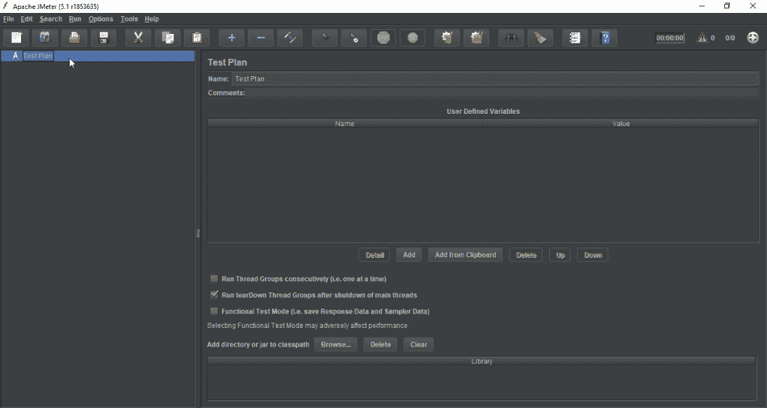

*   **步骤 2**–下一步是添加线程组，并指定线程或用户的数量以及循环计数。

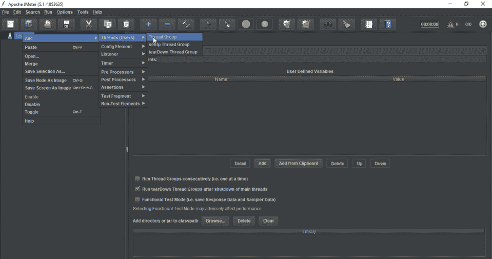

*   **步骤 3**–一旦创建了线程组，下一步就是添加 HTTP 请求并指定服务器名称和路径。现在将您的测试计划保存在任何文件夹中。


在命令提示符下运行测试计划的命令如下:

```
jmeter -n -t Userssundush_nDownloadspache-jmeter-5.1inLoadTestedureka.jmx -l Userssundush_nDownloadspache-jmeter-5.1inLoadTestloadtest.csv
```

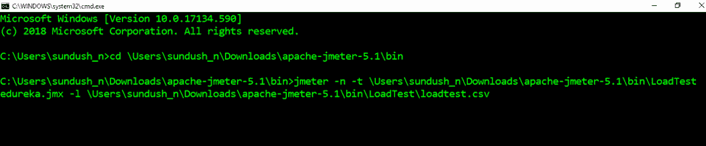

在哪里，

**-n**->-**-t**->jmeter 测试脚本的位置 **-l** - >结果文件的位置

*   现在，一旦您从命令提示符运行了测试，它就会将结果存储在 **loadtest.csv** 文件中。

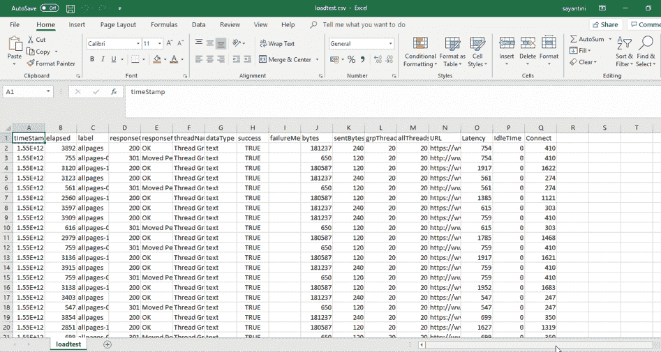

这些是通过命令提示符执行测试所涉及的**步骤**。现在让我们继续我们的“使用 JMeter 进行负载测试”文章，看看如何在 dashboard 上生成报告。

## **仪表板上的报表生成**

JMeter 支持仪表板报告生成，以从测试计划中获得图表和统计数据。仪表板生成器是 JMeter 的模块化扩展。它的默认行为是从 CSV 文件中读取和处理样本，以生成包含图形视图的 HTML 文件。它可以在负载测试结束时或根据需要生成报告。

在仪表板上生成报告的**命令**是:

```
jmeter -n -t Userssundush_nDownloadspache-jmeter-5.1inLoadTest edureka.jmx -l Userssundush_nDownloadspache-jmeter-5.1inLoadTestloadtest.csv -e -o Userssundush_nDownloadspache-jmeter-5.1inLoadTestHTMLreport
```

在哪里，

**-e** - >生成 HTML 报表-**-o**->输出文件夹的位置

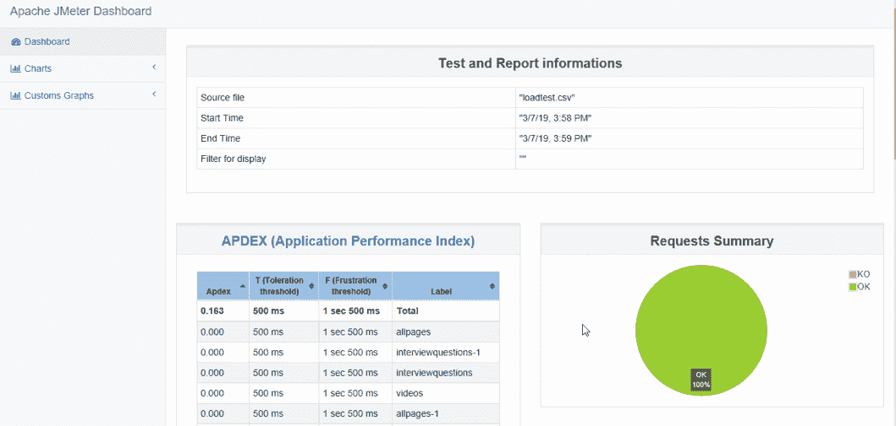

该报告提供了以下**指标**:

*   **APDEX** (应用程序性能指数)表根据可容忍和可满足阈值的可配置值计算每个事务:

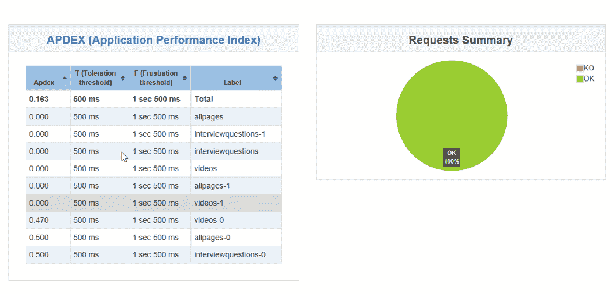

*   一个**统计表**在一个表格中提供每个交易的所有指标的摘要，包括 3 个可配置的百分点:

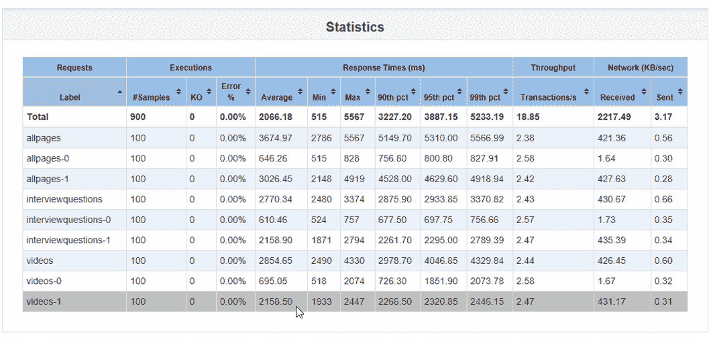

*   **一段时间内的响应时间**，包括交易控制器样本结果:

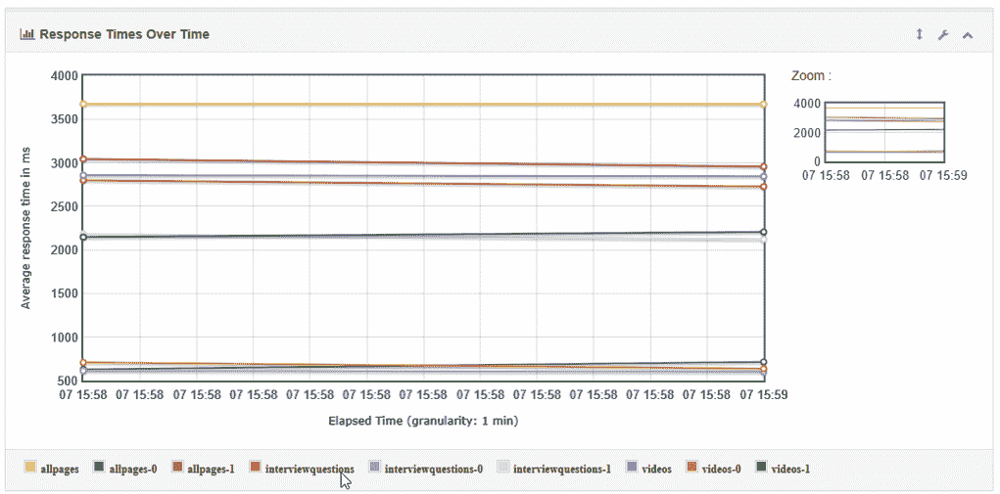

*   **响应时间一段时间内的百分比**，仅包括成功响应:

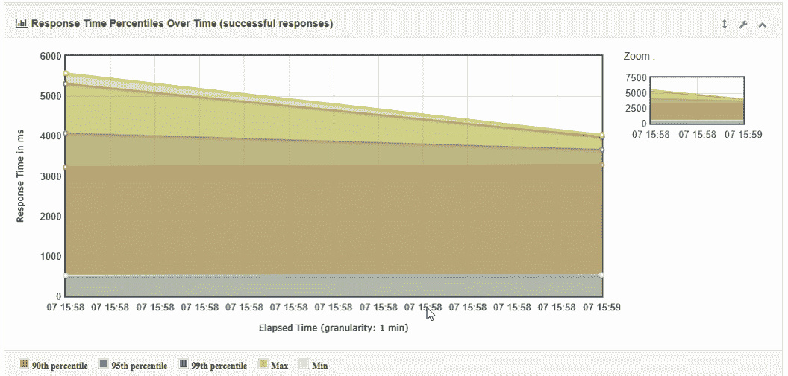

*   **一段时间内的活动线程数**:

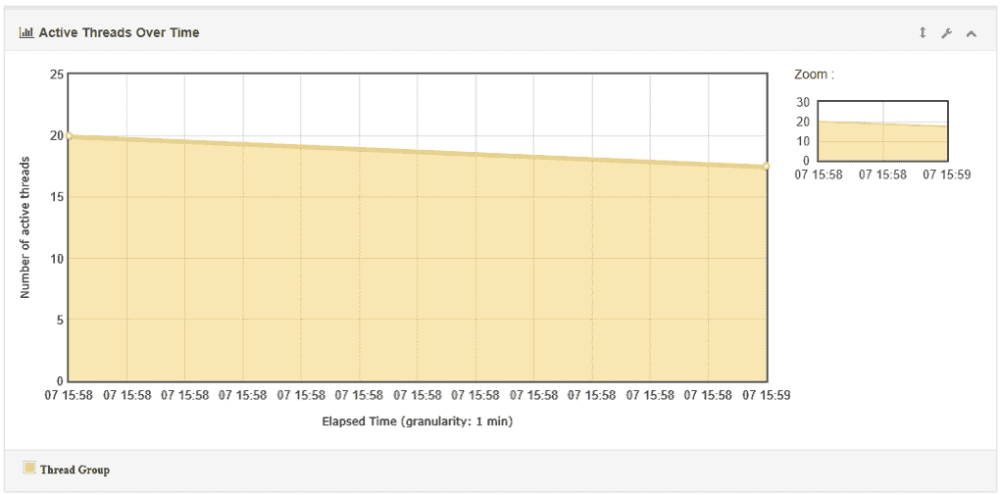

*   **一段时间内的延迟**:

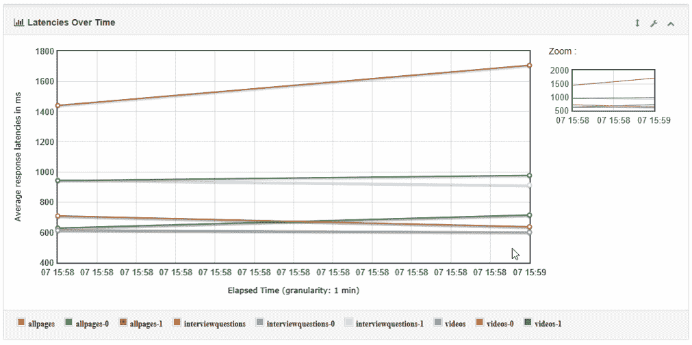

*   **响应时间百分比**，包括交易控制器样本结果 **:**

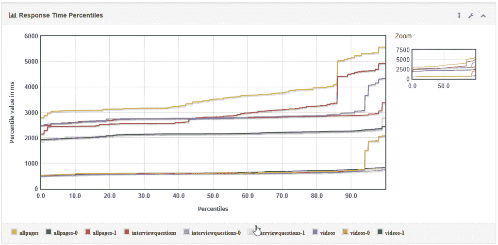

*   **响应时间概述**，不包括交易控制器样本结果:

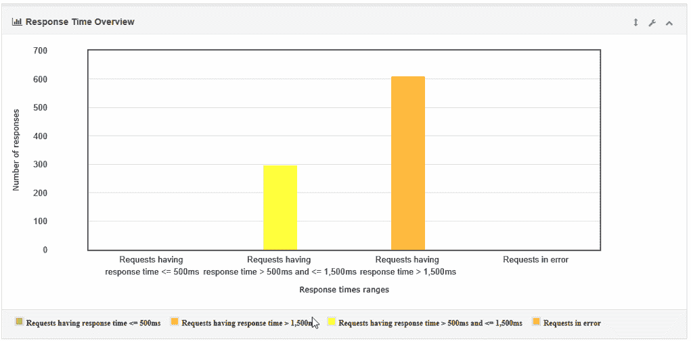

*   **时间 vs 线程**:

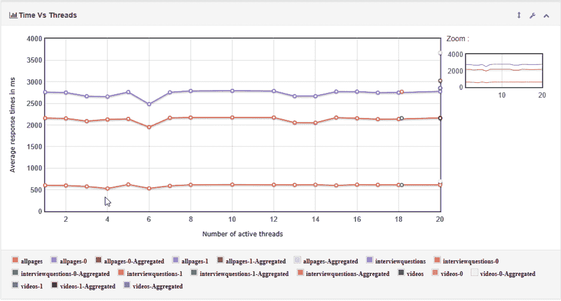

*   **响应时间分布**:

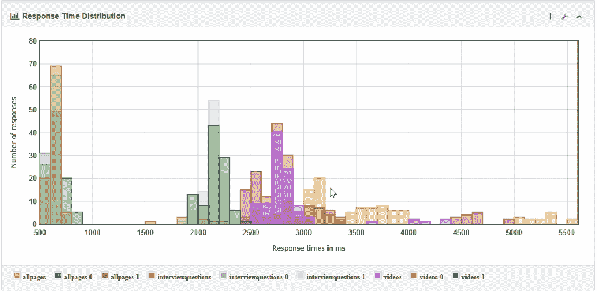

这里有一个关于使用 JMeter 进行**负载测试的视频，它将为您提供如何使用命令提示符执行测试并在 dashboard 上生成报告的逐步指导！**

## **使用 JMeter | Edureka 进行负载测试**


[//www.youtube.com/embed/tTgyrSWlj5s?rel=0&showinfo=0](//www.youtube.com/embed/tTgyrSWlj5s?rel=0&showinfo=0)

这个关于使用 JMeter 进行负载测试的视频将为您提供关于负载测试工具以及它如何在非 GUI 模式下执行的深入知识。

*至此，我们结束了这篇使用 JMeter 进行负载测试的文章。我希望你们喜欢这篇文章，并且理解如何在非 GUI 模式下执行测试并在仪表板上生成报告。*

*现在您已经了解了 JMeter 的工作原理，请查看由 Edureka 提供的 [**性能测试课程**](https://www.edureka.co/jmeter-training-performance-testing) ，这是一家值得信赖的在线学习公司，拥有遍布全球的 250，000 多名满意的学习者。本课程让您深入了解工作负载期间的软件行为。在本课程中，您将学习如何检查软件的响应时间和延迟，以及测试软件包是否能够高效扩展。本课程将帮助您检查强度并分析应用在不同负载类型下的整体性能。有问题要问我们吗？请在“使用 JMeter 进行负载测试”的评论部分提到它，我们会回复您。*