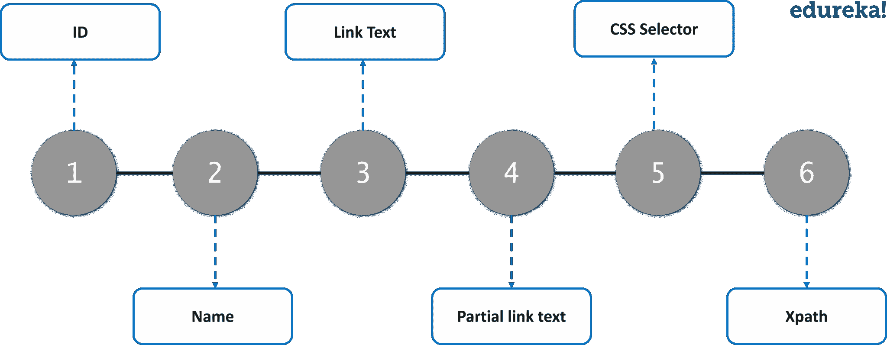
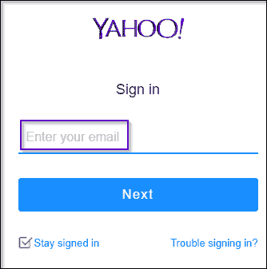
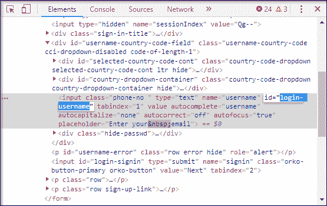
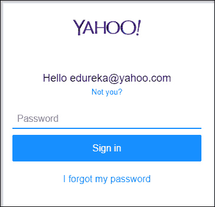
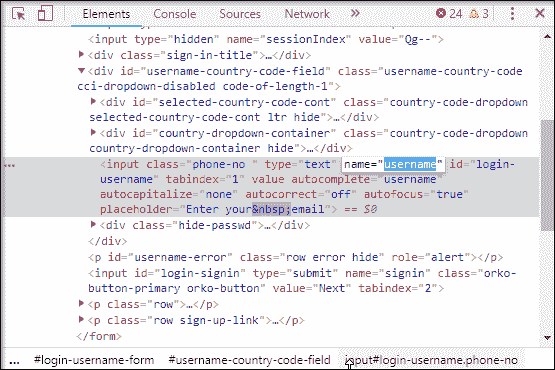
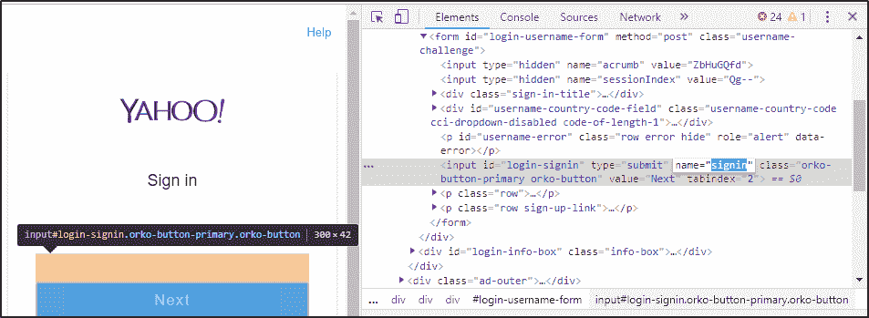
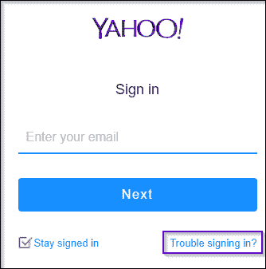
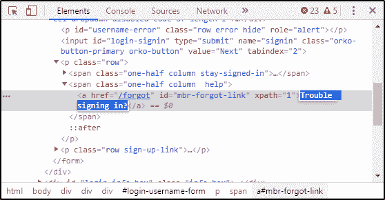
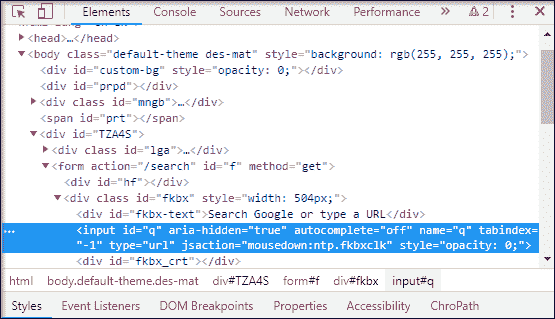
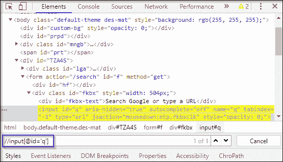

# Selenium 中的定位器——如何在网页上定位元素？

> 原文：<https://www.edureka.co/blog/locators-in-selenium/>

如果你想学习在网页上定位元素的最简单方法，你可以查看 [Selenium 认证](https://www.edureka.co/selenium-certification-training)。定位元素的确是一场噩梦，因为在网页中找到 web 元素并使之自动化是一件非常复杂的事情。为了简化这个任务，我们在 [Selenium](https://www.edureka.co/blog/selenium-tutorial) 中使用了定位器。在本文中，我将简要介绍不同类型的定位器以及相关示例。

*   [硒里的定位器是什么？](#WhatislocatorsinSelenium?)
*   [定位器的类型](#Typesoflocators)
    *   [Id 定位器](#Idlocator)
    *   [名称定位器](#Namelocator)
    *   [链接文本&部分链接文本](#LinkText&PartialLinkText)
    *   [CSS 选择器](#CSSSelector)
    *   [XPath](#XPath)
*   [硒定位器的最佳实践](#BestpracticesforSeleniumLocators)

如果你想通过  认证硒专家掌握硒的概念，你可以看看下面的视频，视频中这些主题涵盖了更广泛的范围。

## **Selenium web driver 中的定位器| Selenium Training | edu reka**


[https://www.youtube.com/embed/jK_4nnEJVHQ?rel=0&controls=0&showinfo=0](https://www.youtube.com/embed/jK_4nnEJVHQ?rel=0&controls=0&showinfo=0)*This Edureka video on Locators in Selenium talks about different types of selenium locators and steps involved to locate a web element using locators along with examples.*

## **硒里的定位器是什么？**

定位符被定义为在网页内唯一标识网络元素的地址。这个命令告诉 [Selenium](https://www.edureka.co/blog/what-is-selenium/) IDE 它需要操作哪些 GUI 元素，比如文本框、按钮、复选框等等。找到正确的 GUI 元素是创建自动化脚本的先决条件，但是准确识别 GUI 元素比听起来要困难得多。有时，您甚至可能最终使用不正确的 GUI 元素或者根本没有元素！因此，使用正确的定位器确保 es 测试更快、更可靠或者在发布时维护更少。

如果你足够幸运地使用了唯一的 id 和类，那么你通常都准备好了。但有时选择正确的定位器会成为一场噩梦，因为在网页中查找 web 元素非常复杂。

理解了这一点，让我们更深入地了解 Selenium 中的各种类型的定位器。

## **硒中定位器的种类**

有各种各样的 web 元素，如文本框、id、单选按钮等。它需要一种有效和准确的方法来识别这些元素。因此，您可以断言，随着 locator 有效性的增加，自动化脚本的稳定性也会增加。或者，您可以查看 Edureka 的[自动化课程](https://www.edureka.co/masters-program/automation-testing-engineer-training)并获得认证！

 为了准确无误地识别 web 元素，selenium 使用了不同类型的定位器。它们如下:

*   Id 定位器
*   名称定位器
*   链接文本和部分链接文本
*   CSS 选择器
*   XPath

### **Id 定位器**

识别 web 元素最流行的方法是使用 Id。Id 被认为是最安全和最快的定位器选项，即使有多种选择，也应该始终是首选。例如，员工编号或帐户将是唯一的。

现在，让我们借助一个例子来理解 ID 定位器的工作原理。我将启动谷歌浏览器，导航到 yahoo.com 的。在这里，我将尝试使用 **ID 定位器**来定位*电子邮件文本框*。



检查上面的 web 元素，您可以看到它有一个输入标签和属性，如 class 和 id。现在，我将使用 Id 定位器的值，即**登录用户名**来定位电子邮件文本框。



让我们看看如何自动化文本框，并使用 Id locator 向其发送值。

```
package Edureka;
import java.util.concurrent.TimeUnit;
import org.openqa.selenium.By;
import org.openqa.selenium.chrome.ChromeDriver;
public class Locators {
public static void main(String[] args) {
System.setProperty("webdriver.chrome.driver", "C:Selenium-java-edurekachromedriver_win32chromedriver.exe");
WebDriver driver = new ChromeDriver();
driver.manage().window().maximize();
driver.manage().deleteAllCookies();
driver.manage().timeouts().pageLoadTimeout(40, TimeUnit.SECONDS);
driver.manage().timeouts().implicitlyWait(30, TimeUnit.SECONDS);
driver.get("https://login.yahoo.com/");
driver.findElement(By.id("login-username")).sendKeys("edureka@yahoo.com"); //id locator for text box
WebElement searchIcon = driver.findElement(By.id("login-signin"));//id locator for next button
searchIcon.click();
}

```

当你运行上面的 [Java](https://www.edureka.co/blog/java-tutorial/) 程序， ***chrome 驱动*** 会启动谷歌 chrome，重定向到雅虎邮箱，输入邮箱地址，导航到下一页。您可以参考下图查看输出:



我希望这能让你清楚地了解 Selenium 中的 Id locator 是如何工作的。现在让我们进一步了解如何使用名称定位器。

### **名称定位器**

这也是定位具有 name 属性的元素的有效方法。使用这种策略，将返回具有 name 属性值的第一个元素。如果没有元素具有匹配的 name 属性，那么将引发一个 **NoSuchElementException** 。

现在，让我们借助一个例子来看看名称定位器的工作原理。在下图中，你可以看到，名称定位器拥有一个名为用户名的值。这里的区别是你应该使用一个名字而不是 id。



让我们来看看下面的代码来自动化文本框。

```
driver.get("https://login.yahoo.com/");
driver.findElement(By.name("username")).sendKeys("edureka@yahoo.com"); //name locator for text box
WebElement searchIcon = driver.findElement(By.name("signin"));//name locator for next button
searchIcon.click();

```

In the above code, I have given the value of name locator for the *next* button as **signin,** because when you inspect on that button, you can see in the below figure its value is **signin**.



当您运行上面的 [Java](https://www.edureka.co/blog/java-tutorial/) 代码时，您的输出将与 Id locator 相同。现在，让我们了解另一个定位器，即链接文本。

### **linkText**

您可以使用 *linkText* 来识别网页上的超链接。可以借助*锚标签* ( < a >)来确定。为了在网页上创建超链接，您可以使用后跟链接文本的锚标记。

现在，让我们借助一个例子来看看 linkText 定位器的工作原理。假设您想查找'*登录时遇到的问题？*链接如下图所示。你会怎么做？

让我带你经历这些步骤。



关于检查"*登录有问题吗？"*–你可以注意到它以一个锚标记开始。但是，这个锚标记没有任何名称和 Id 属性。在这种情况下，您可以使用 **linkText** 定位器。



正如你在上面的代码片段中看到的，它有一个名为*“登录有问题吗？”*。我将利用该文本并使用一个 linkText 定位器来编写我的代码，如下所示。

```
driver.get("https://login.yahoo.com/");
driver.findElement(By.linkText("Trouble Signing in?")).click();//linkText locator for links

```

On executing the above code, you will be redirected to* “Trouble Signing In?”* page as shown below.


在某些情况下，您可能需要通过 *linkText* 元素中的部分文本来查找链接。在这种情况下，您可以使用*部分链接文本*来定位元素。我们举同样的例子，试着定位一下。我会选择*“麻烦签到？”*链接。现在，我不再粘贴全文，而是将它作为*问题*给出。所以我会像这样修改我的代码

```
driver.get("https://login.yahoo.com/");
driver.findElement(By.partiallinkText("Trouble")).click();//partiallinkText locator for links

```

现在，当您运行上述代码时，它将被重定向到“*登录困难？”*页面，但不同的是，你使用部分值来定位链接。我希望这能让您清楚地了解 selenium 中的 linkText 和 partialLinkText 定位器是如何工作的。现在让我们进一步了解 selenium 中最简单的定位器之一。

### **CSS 选择器**

CSS 主要用于为网页提供样式规则，您可以使用它来识别网页中的一个或多个元素。CSS 选择器始终是在页面中定位复杂元素的最佳方式。

让我们以 y *ahoo 登录页面*为例，使用 CSS 选择器。我将检查电子邮件文本框元素。CSS 选择器总是以 **#** 开始，并且在输入 *Id* 属性的值作为*登录用户名*时，该元素被高亮显示。这意味着它能够使用 CSS 选择器定位元素。现在，让我们复制这个值并使用 eclipse 中的 CSS 选择器来理解它的工作原理。所以，我的代码是这样的-

```
driver.findElement(By.cssSelector("#login-username")).sendKeys("edureka@yahoo.com");
driver.findElement(By.cssSelector("#login-signin")).click();

```

当你运行上面这段代码时，你将被重定向到*雅虎登录页面*，并要求你输入密码。事情就是这样的。现在让我们深入本文的最后一个定位器，理解 XPath。

### **XPath**

XPath 是一种查询 XML 文档的语言。 [XPath](https://www.edureka.co/blog/xpath-in-selenium/) 是定位硒元素的重要策略。它还包含一个路径表达式和一些条件。在这里，您可以轻松地编写 XPath 脚本/查询来定位网页中的任何元素。

现在，让我们借助一个例子来理解这一点。我将启动谷歌浏览器，导航到 google.com 的。在这里，我将尝试使用 XPath 定位搜索框。在检查 web 元素时，您可以看到它有一个输入标记和属性，如 class 和 id。接下来，我将利用标记名和这些属性来构造 XPath，XPath 反过来将定位搜索栏。



你只需要点击元素标签，按 Ctrl + F，就可以在 Chrome 的开发者工具里打开一个搜索框。在这里，你可以写 XPath，字符串选择器，它给出基于那个标准的搜索。

在上图中，你可以看到它有一个输入标签。现在，我将从//输入开始。这里//input 暗示了一个标签名。我将利用 *name* 属性，并将单引号中的‘q’作为它的值传递。这将给出下面的 XPath 表达式:

```
//input[@name=’q’]

```



在上图中，您可以看到，在编写 XPath 时，它突出显示了元素，这意味着这个特定的元素是使用 XPath 定位的。

现在，您可以在 Eclipse 中使用下面的代码通过 XPath 定位特定的元素。

```
driver.get("https://www.google.com/");
driver.findElement(By.xpath("//input[@id='q']")).sendKeys("Selenium"); //xpath for search box
WebElement searchIcon = driver.findElement(By.xpath("//input[@id='Google Search']"));//xpath for search button

```

On writing this code, it will give you an automated search of Selenium. Basically, this is how you can use XPath.So, this was all about different types of Locators in Selenium. Now let’s move further and understand some of the best practices of using [Selenium](https://www.edureka.co/blog/10-reasons-to-learn-selenium/) Locators.

## **硒定位器最佳实践**

理解 Selenium 中定位器的概念是一回事，但知道如何使用它们完全是另一回事。能够构建健壮的定位器始于理解什么是健壮的定位器。下面列出了在 selenium 中使用定位器时必须遵守的三个标准:

*   **Selenium 中的健壮定位器尽可能简单小巧:**定位器包含的元素越多，由于页面结构的变化，它出错的几率就越高。
*   **Selenium locators 在你改变了 UI 元素的属性之后仍然工作:**依赖于频繁改变的属性，比如  修饰符类(menu _ _ item–red)从来都不是一个好的做法。
*   **本质上健壮的 Selenium 定位器在您更改目标元素周围的 UI 元素后仍然工作:** 每当您使用非唯一属性时，定位器都有可能会中断，因为有人添加了上面具有相同属性的元素。

**了解我们在顶级城市的硒测试课程**

| 印度 | 美国 | 其他国家 |
| [印度硒培训](https://www.edureka.co/selenium-certification-training-india) | [芝加哥硒培训](https://www.edureka.co/selenium-certification-training-chicago) | [硒认证英国](https://www.edureka.co/selenium-certification-training-uk) |
| [加尔各答的硒培训](https://www.edureka.co/selenium-certification-training-kolkata) | [纽约硒培训](https://www.edureka.co/selenium-certification-training-new-york-city) | [新加坡硒培训](https://www.edureka.co/selenium-certification-training-singapore) |
| [浦那硒课程](https://www.edureka.co/selenium-certification-training-pune) | [美国硒培训](https://www.edureka.co/selenium-certification-training-us) | [硒训练悉尼](https://www.edureka.co/selenium-certification-training-australia) |

这个 把我们带到了这篇关于硒定位器文章的结尾。希望对你有帮助，让你的知识增值。

如果您希望学习 Selenium 并在测试领域建立职业生涯，请查看我们的交互式在线 Selenium 课程，该课程提供 24*7 支持，在整个学习期间为您提供指导。

*有问题吗？请在 Selenium 文章中的 Locators 的评论部分提到它，我们会回复您。*