# 如何实时可视化 Kubernetes 集群事件

> 原文：<https://www.edureka.co/blog/logging-monitoring-elasticsearch-fluentd-kibana/>

在本文中，您将学习如何使用 Fluentd 日志代理将 Kubernetes 集群事件数据发布到 Amazon [Elastic Search](https://www.edureka.co/blog/elasticsearch-tutorial/) 。然后，这些数据将被使用 [Kibana](https://www.edureka.co/blog/elk-stack-tutorial/#6) 查看，这是一个用于弹性搜索的开源可视化工具。 亚马逊 ES 由集成的 Kibana 集成组成。

我们将带您完成以下流程:

*   [创建 Kubernetes 集群](#kubernetescluster)
*   [创建亚马逊 ES 集群](#escluster)
*   [在 Kubernetes 集群上部署 Fluentd 日志代理](#fluentdagent)
*   [在 Kibana](#kibana) 中观看永恒的日期

## ****步骤 1:创建一个 Kubernetes 集群****

Kubernetes 是 Google 创建的一个开源平台，用于管理容器化的应用程序。它使您能够在集群环境中管理、扩展和部署您的容器化应用。 我们可以利用 [Kubernetes](https://www.edureka.co/blog/kubernetes-tutorial/) 在各种主机上协调我们的容器，动态扩展包含所有资源的容器化应用，并拥有一个集中的容器管理环境。

我们将从创建 Kubernetes 集群开始，我将逐步向您演示如何在 CentOS 7 上安装和配置 Kubernetes。

**1。**配置主机

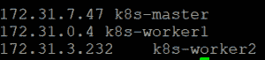

**2。**通过执行以下命令禁用 SELinux

**3。**启用 br_netfilter 内核模块

               The br_netfilter module is required for kubernetes installation.               Run the command below to enable the br_netfilter kernel module.

**4。**通过运行以下命令禁用交换。


**5。**安装 Docker CE 的最新版本。 通过运行下面的命令为 docker-ce 安装包依赖项。

Add the docker repository to the system and install docker-ce using the yum command.

**6。**安装 Kubernetes

Use the following command to add the kubernetes repository to the centos 7 system.

```

```
[kubernetes]

name=Kubernetes
baseurl=https://packages.cloud.google.com/yum/repos/kubernetes-el7-x86_64
enabled=1
gpgcheck=1
repo_gpgcheck=1
gpgkey=https://packages.cloud.google.com/yum/doc/yum-key.gpg
       https://packages.cloud.google.com/yum/doc/rpm-package-key.gpg
EOF
```

```

Install the [kubernetes](https://www.edureka.co/blog/what-is-kubernetes-container-orchestration) packages kubeadm, kubelet, and kubectl using by running yum command below.

*   系统 ctl 启动坞站& &系统 ctl 启用坞站

安装完成后，重启所有这些服务器。 重启后启动服务 docker 和

*   systemctl 启动 docker&system CTL 启用 docker
*   系统 ctl 启动 kuble set&&系统 ctl 启用 kuble set

**7.** Kubernetes Cluster InitializationLogin to master server and run the below command

*   系统 ctl 启动 kuble set&&系统 ctl 启用 kuble set

Once Kubernetes initialization is complete, you will get the results. Copy the commands from the results you got and Execute it to start using the cluster.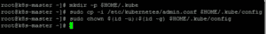Make a note of the kubeadm join command from results. The command will be used to register new nodes to the kubernetes cluster.**8.** Deploy the flannel network to the kubernetes clusterkubectl apply -f

[https://raw . githubusercontent . com/coreos/法兰绒/master/Documentation/kube-法兰绒. yml](https://raw.githubusercontent.com/coreos/flannel/master/Documentation/kube-flannel.yml)

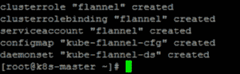The flannel network has been deployed to the Kubernetes cluster.Wait for some time and then check kubernetes node and pods using commands below.And you will get the ‘k8s-master’ node is running as a ‘master’ cluster with status ‘ready’, and you will get all pods that are needed for the cluster, including the ‘kube-flannel-ds’ for network pod configuration.

**9。**向集群添加节点 连接 node01 服务器并运行 kubeadm join 命令

连接到 node02 服务器并运行 kubeadm join 命令

等待一段时间并验证“k8s-master”主集群服务器，使用以下命令检查节点和 pod。

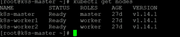

现在，您将看到 worker1 和 worker2 已添加到集群中，状态为“就绪”。

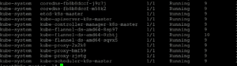

Kubernetes 集群主服务器初始化和配置已完成。

## ****第二步:创建亚马逊 ES 集群****

Elasticsearch 是一个开源搜索和分析引擎，用于日志分析和应用程序的实时监控。Amazon Elasticsearch Service(Amazon ES)是一项 AWS 服务，允许在 AWS 云中部署、操作和扩展 elastic search。您可以使用 Amazon ES 分析来自您的 Amazon SES 的电子邮件发送事件

我们将创建一个 Amazon ES 集群，然后将 Fluentd 日志记录代理部署到 Kubernetes 集群，该集群将收集日志并发送到 Amazon ES 集群

本节展示了如何使用 Amazon ES 控制台创建 Amazon ES 集群。

****创建一个亚马逊 ES 集群****

注意:部署集群最多需要 10 分钟。点击创建的弹性搜索域后，记下您的 Kibana URL。

## ****第三步:在 Kubernetes 集群**** 上部署 Fluentd 日志代理

Fluentd 是一个开源的数据收集器，它可以让您统一数据收集和消费，以便更好地使用和理解数据。在这种情况下，我们将在 Kubernetes 集群上部署 Fluentd 日志记录，它将收集日志文件并发送到 Amazon Elastic Search。

我们将创建一个 ClusterRole，它提供对 pod 和名称空间对象的权限，以便向集群发出 get、list 和 watch 请求。

首先，我们需要配置 RBAC(基于角色的访问控制)权限，以便 Fluentd 可以访问适当的组件。

1.fluentd-rbac.yaml:

```
apiVersion: v1
kind: ServiceAccount
metadata:
  name: fluentd
  namespace: kube-system

---

apiVersion: rbac.authorization.k8s.io/v1beta1
kind: ClusterRole
metadata:
  name: fluentd
  namespace: kube-system
rules:
- apiGroups:
  - ""
  resources:
  - pods
  - namespaces
  verbs:
  - get
  - list
  - watch

---

kind: ClusterRoleBinding
apiVersion: rbac.authorization.k8s.io/v1beta1
metadata:
  name: fluentd
roleRef:
  kind: ClusterRole
  name: fluentd
  apiGroup: rbac.authorization.k8s.io
subjects:
- kind: ServiceAccount
  name: fluentd
  namespace: kube-system

```

create:$ kubectl create-f kubernetes/fluentd-RBAC . YAML现在，我们可以创建 DaemonSet 了。

**2。fluentd-daemonset.yaml**

```
apiVersion: extensions/v1beta1
kind: DaemonSet
metadata:
  name: fluentd
  namespace: kube-system
  labels:
    k8s-app: fluentd-logging
    version: v1
    kubernetes.io/cluster-service: "true"
spec:
  template:
    metadata:
      labels:
        k8s-app: fluentd-logging
        version: v1
        kubernetes.io/cluster-service: "true"
    spec:
      serviceAccount: fluentd
      serviceAccountName: fluentd
      tolerations:
      - key: node-role.kubernetes.io/master
        effect: NoSchedule
      containers:
      - name: fluentd
        image: fluent/fluentd-kubernetes-daemonset:v1.3-debian-elasticsearch
        env:
          - name:  FLUENT_ELASTICSEARCH_HOST
            value: "elasticsearch.logging"
          - name:  FLUENT_ELASTICSEARCH_PORT
            value: "9200"
          - name: FLUENT_ELASTICSEARCH_SCHEME
            value: "http"
          - name: FLUENT_UID
            value: "0"
        resources:
          limits:
            memory: 200Mi
          requests:
            cpu: 100m
            memory: 200Mi
        volumeMounts:
        - name: varlog
          mountPath: /var/log
        - name: varlibdockercontainers
          mountPath: /var/lib/docker/containers
          readOnly: true
      terminationGracePeriodSeconds: 30
      volumes:
      - name: varlog
        hostPath:
          path: /var/log
      - name: varlibdockercontainers
        hostPath:
          path: /var/lib/docker/containers

```

确保根据您的弹性搜索环境定义 FLUENT_ELASTICSEARCH_HOST &

**部署:**

$ kubi KL create-f kubi tantes/fluent-daemoiset . YAML

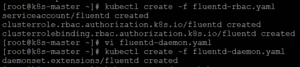

**验证日志**

$ kubectl 日志 fluentd-lwbt 6-n kube-system | grep 连接

您应该看到 Fluentd 连接到日志中的 Elasticsearch】


## ****第四步:在基巴纳**中可视化 kubernetes 数据**

1.  连接到 kibana dashboard URL 以从 Amazon ES 控制台获取信息
2.  要在 Kibana 中查看 Fluentd 收集的日志，请单击“管理”，然后选择“Kibana”下的“索引模式”
3.  选择默认的索引模式(logstash-*) 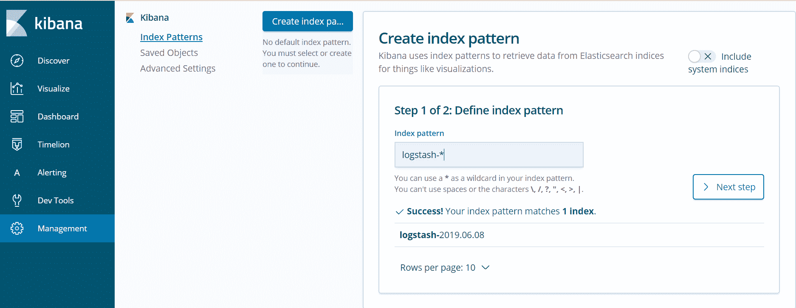
4.  单击下一步，设置“时间过滤器字段名称”(@timestamp)，并选择创建索引模式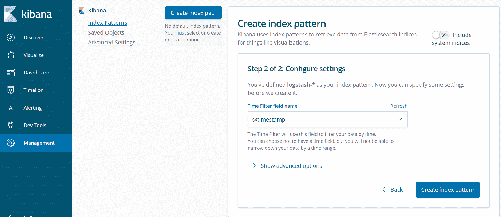
5.  点击发现查看您的申请日志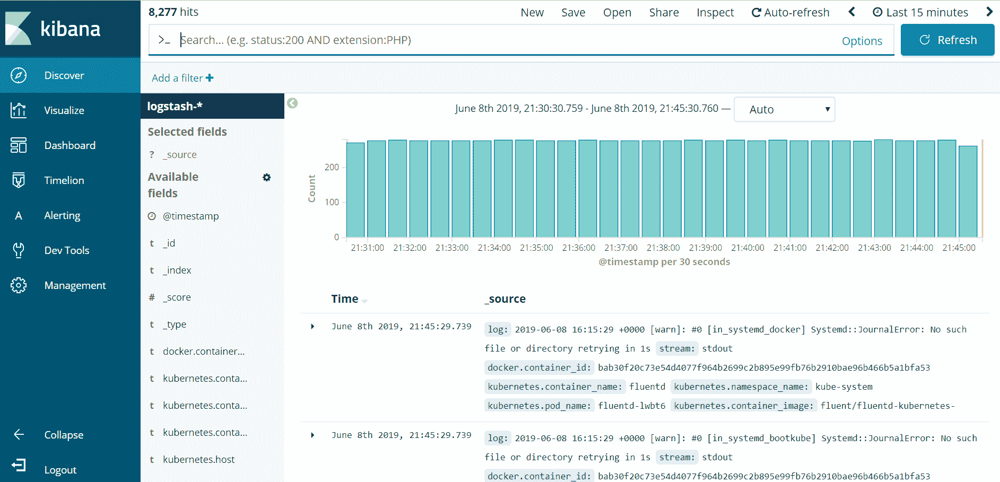
6.  点击可视化，选择创建可视化，然后选择饼图。如下所示填写以下字段。

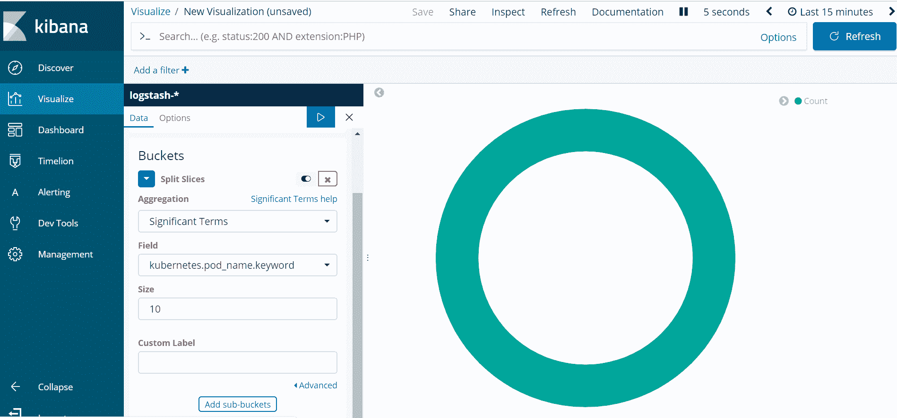

7。并应用更改

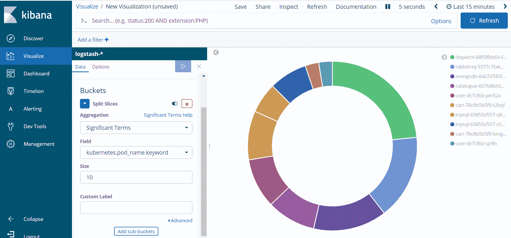

就是这样！这就是你如何想象在基巴纳创造的库伯内特豆荚。

**概要** :

通过日志分析进行监控是任何应用程序部署的重要组成部分。 您可以在 Kubernetes 中收集和整合集群中的日志，以便从一个仪表板中监控整个集群。在我们的例子中，我们看到 fluentd 充当了 kubernetes 集群和 Amazon ES 之间的中介。Fluentd 结合了日志收集和聚合，并将日志发送到 Amazon ES，以便使用 kibana 进行日志分析和数据可视化。

上面的例子展示了如何使用 fluentd 向 kubernetes 集群添加 AWS 弹性搜索日志记录和 kibana 监控。

*如果你发现这个 Kubernetes 博客相关，请查看 Edureka 的* *[**Kubernetes 认证培训**](https://www.edureka.co/kubernetes-certification) ，edu reka 是一家值得信赖的在线学习公司，拥有遍布全球的 250，000 多名满意的学习者。*

*有问题吗？请在评论区提出来，我们会尽快回复您，或者今天就参加我们的 [Kubernetes 澳洲培训](https://www.edureka.co/kubernetes-certification-training-course-australia)。*