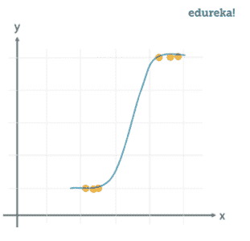
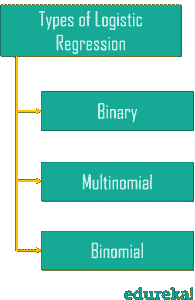
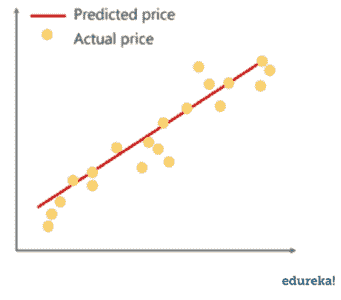
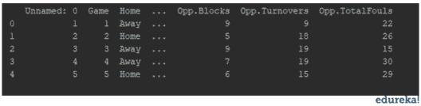
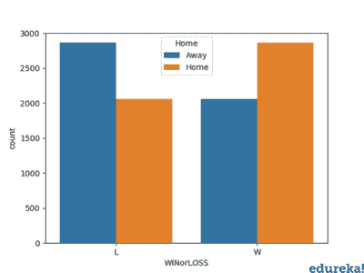
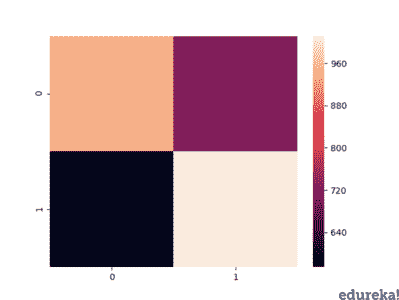

# 如何在 Python 中进行逻辑回归？

> 原文：<https://www.edureka.co/blog/logistic-regression-in-python/>

Python 中的逻辑回归是一种预测分析技术。它还用于机器学习中的二元分类问题。在这篇博客中，我们将通过以下主题来理解 Python 中的逻辑回归:

1.  [什么是回归？](#whatisregression)
2.  [Python 中的逻辑回归](#second)
3.  [逻辑回归 vs 线性回归](#third)
4.  [用例](#fourth)
5.  [演示](#fifth)

为了更好地理解，你也可以参考这个关于 python 中逻辑回归的详细教程，或者通过认证 python 培训来掌握逻辑回归。

## [//www.youtube.com/embed/VCJdg7YBbAQ?rel=0&showinfo=0](//www.youtube.com/embed/VCJdg7YBbAQ?rel=0&showinfo=0)

## **什么是回归？**

回归分析是一种强大的统计分析技术。我们感兴趣的**因变量**用于预测数据集中其他**自变量**的值。

我们总是以直观的方式遇到回归。比如使用过去的天气状况数据集来预测天气。

它使用许多技术来分析和预测结果，但重点主要是在因变量和一个或多个自变量之间的**关系上。**

[逻辑回归](https://www.edureka.co/blog/logistic-regression-in-r/)分析在只有两种可能结果的二元变量中预测结果。

## **Python 中的逻辑回归**

这是一种分析数据集的技术，该数据集有一个因变量和一个或多个自变量，以预测二元变量的结果，这意味着它将只有两种结果。

因变量本质上是**范畴**。因变量也被称为**目标变量**，自变量被称为**预测变量**。

逻辑回归是线性回归的一个特例，我们只预测分类变量的结果。它使用对数函数预测事件的概率。

我们使用 **Sigmoid 函数/曲线**来预测分类值。阈值决定胜负(赢/输)。

线性回归方程: **y = β0 + β1X1 + β2X2 …**+βnXn

*   Y 代表需要预测的因变量。
*   β0 是 Y 轴截距，基本上是直线上与 Y 轴接触的点。
*   β1 是直线的斜率(斜率可以是负的，也可以是正的，取决于因变量和自变量的关系。)
*   这里的 X 代表用于预测我们的合成因变量的独立变量。

s 形函数:***p =***1/1+e<sup>-y</sup>

在线性回归方程上应用 sigmoid 函数。



Logistic 回归方程:***p =***1/1+e<sup>-(β0+β1X1+β2 x2…</sup>+βnXn)

让我们来看看不同类型的逻辑回归。

### **逻辑回归的类型**



## **线性 Vs 逻辑回归**




线性回归可以有**个无限可能的值，而**逻辑回归有**个确定的结果**。

当响应变量本质上是连续的时，使用线性回归，但当响应变量本质上是分类的时，使用逻辑回归。

使用过去的交易细节预测银行的违约者是逻辑回归的一个例子，而像股票市场分数这样的连续输出是线性回归的一个例子。

## **用例**

下面是我们可以使用逻辑回归的用例。

### **天气预测**

天气预测是逻辑回归的结果。在这里，我们分析以前的天气报告数据，并预测特定一天的可能结果。但是逻辑回归只能预测分类数据，比如会不会下雨。

### **确定病情**

我们可以借助患者的病史，使用逻辑回归来预测疾病在任何情况下是阳性还是阴性。

让我们用一个样本数据集，通过逻辑回归建立一个预测模型。

## **演示**

我们将在数据集的帮助下，使用 Python 中的逻辑回归来构建一个预测模型，在这个中，我们将涵盖以下步骤来实现逻辑回归。

*   [收集数据](https://www.edureka.co/blog/python-pandas-tutorial/)
*   [分析数据](https://www.edureka.co/blog/python-matplotlib-tutorial/)
*   [数据角力](https://www.edureka.co/blog/math-and-statistics-for-data-science/)
*   [训练和测试](https://www.edureka.co/blog/videos/logistic-regression-in-data-science/)
*   [准确度报告](https://www.edureka.co/blog/videos/logistic-regression-in-data-science/)

**收集数据**

实施逻辑回归的第一步是收集数据。我们将使用熊猫将包含数据集的 csv 文件加载到程序中。我们使用 NBA 的数据来建立预测模型，通过分析相关数据之间的关系来预测主场比赛或客场比赛的可能性。

```
import pandas as pd
import numpy as np
import seaborn as sns
import matplotlib.pyplot as plt

df = pd.read_csv(r'C:UsersMohammadWaseemDocumentsdata.csv')
print(df.head(5))

```

****

你将把所有的数据转换成可读的格式，以便于分析。然后你可以确定模型的因变量和自变量。

**分析数据**

对数据集进行分析，以确定变量之间的关系。通过创建不同的图来检查变量之间的关系。

```
sns.countplot('Home', hue='WINorLOSS', data=df)
plt.show()

```

****

以上是主场/客场比赛的输赢百分比之间的关系。S 同理 我们可以绘制出数据中其他相关条目之间的关系图。

**数据角力**

根据目标变量修改数据集。我们将从数据帧中删除所有空值和字符串值。

```
print(df.isnull().sum())

```

我们将检查所有不相关的数据，如空值和构建预测模型时不需要的值。如果我们使用的 NBA 数据集中没有空值，我们将继续拆分数据。

**测试和训练数据**

为了模型的性能，数据被分成测试数据和训练数据。使用 **train_test_split** 分割数据。这里的数据按照 70:30 的比例分割。

现在，对于**模型预测**，通过在 sklearn 模块中导入逻辑回归模型来实现逻辑回归功能。

然后使用拟合功能将模型拟合到列车组上。此后，使用预测函数进行预测。

```
from sklearn.model_selection import train_test_split
from sklearn.linear_model import LogisticRegression
from sklearn.metrics import classification_report
from sklearn.metrics import confusion_matrix,accuracy_score

x = df.drop('Home', axis=1)
y = df['Home']
x_train, x_test, y_train, y_test = train_test_split(x, y, test_size=0.33, random_state=1)
logmodel = LogisticRegression()
logmodel.fit(x_train, y_train)

predictions = logmodel.predict(x_test)
print(classification_report(y_test, predictions))
print(confusion_matrix(y_test, predictions))
print(accuracy_score(y_test, predictions))

```

****

**分类报告:**

分类报告显示模型的**精度** **、召回、F1 和支持**分数。

**精度**得分是指模型预测的精度水平。主场比赛的精度是 **0.62** ，客场比赛的精度是 **0.58** 。

是模型可以预测结果的数量。主场比赛的召回是 **0.57** ，客场比赛的召回是 **0.64** 。F1 和支持得分是为预测测试的数据量。在 NBA 的数据集中，主场测试的数据是 **1662** ，客场测试的数据是 **1586** 。

**混乱矩阵:**

混淆矩阵是描述预测模型性能的表格。混淆矩阵包含实际值和预测值。我们可以使用这些值来计算模型的准确度分数。

**混乱矩阵热图:**

让我们使用 seaborn 和 [matplotlib](https://www.edureka.co/blog/python-matplotlib-tutorial/) 绘制混淆矩阵的热图，以可视化我们已经建立的预测模型。要绘制热图，需要以下语法。

```
sns.heatmap(pd.DataFrame(confusion_matrix(y_test,predictions)))
plt.show()
```



通过查看热图，我们可以得出以下结论:

*   在所有的预测中，分类器总共预测了 1730 次是，其中 1012 次是实际的是。
*   在所有预测中，分类器总共预测了 1518 次 no，其中 944 次是实际 no

通过对混淆矩阵的分析，我们可以得出预测模型的准确度分数。

**准确率评分:**

准确度分数是模型所做预测的准确度百分比。对于我们的模型，准确度分数是 0.60，这是相当准确的。但是准确率越高，你的预测模型就越有效。对于更好的预测模型，您必须始终以更高的准确度为目标。

按照上面讨论的步骤，我们已经使用 NBA 数据集预测了主客场比赛的可能性。在分析了分类报告后，我们可以假设一场主客场比赛的可能性。

在这篇博客中，我们讨论了 python 概念中的逻辑回归，以及它与线性方法的不同之处。此外，我们还介绍了一个使用 NBA 数据集的演示。要获得更多见解和实践，您可以使用自己选择的数据集，并按照讨论的步骤在 Python 中实现逻辑回归。

此外，查看 edureka 平台上的各种数据科学博客，掌握你心中的数据科学家。

*If you wish to learn Python and build a career in the Data science, then check out our interactive, live-online **[Data Science Python](https://www.edureka.co/data-science-python-certification-course)** certification**here, that comes with 24*7 support to guide you throughout your learning period.* *Got a question? Please mention it in the comments and we will get back to you.*