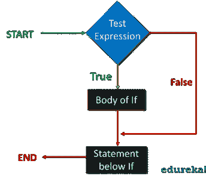
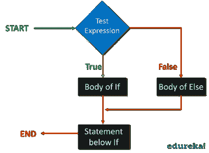
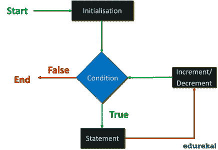
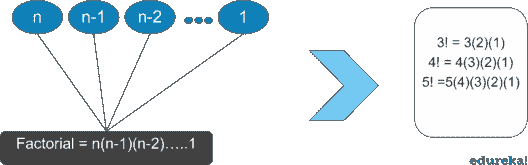
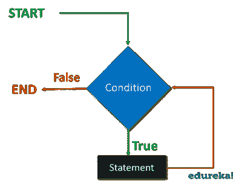
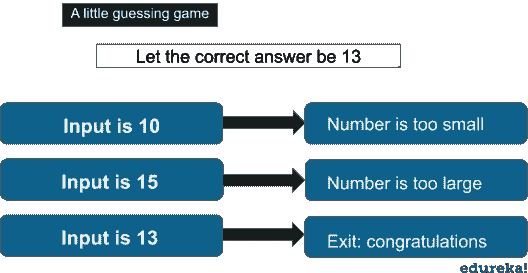
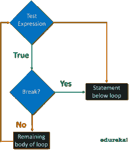
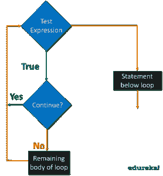

# Python 中的循环:为什么要使用循环？

> 原文：<https://www.edureka.co/blog/loops-in-python/>

对于任何程序员来说，处理冗余代码和重复命令都是一场噩梦。 **[Python](https://www.edureka.co/data-science-python-certification-course)** 利用循环、控制和条件语句来克服这个障碍。本文将帮助您理解 python 中的循环以及围绕循环的所有术语。

1.  [Python 中有哪些循环？](#WhatareLoopsinPython?)
2.  [回路和**而**回路的**是什么？**](#Whatisforloopandwhileloop?)
3.  [循环控制语句](#Loopcontrolstatements)

如果你想通过**[认证的 Python 专家](https://www.edureka.co/python)** 掌握 Python 中循环的概念，你可以看看下面的视频，这些主题在更广泛的规范中有所涉及

## Python 循环教程| Python For Loop | While Loop Python | Python 培训| Edureka


[//www.youtube.com/embed/zFvoXxeoosI?rel=0&showinfo=0](//www.youtube.com/embed/zFvoXxeoosI?rel=0&showinfo=0)

这个 edu reka“Python 循环”教程将帮助你理解 Python 中使用的不同类型的循环。您将学习如何实际实现 python 中的所有循环。

## **Python 中的循环是什么？******

**[中的循环 Python](https://www.edureka.co/blog/python-101-hello-world-program/)** 允许我们多次执行一组语句。让我们举一个例子来理解为什么在 python 中使用循环。

假设，你是一名软件开发人员，你需要为办公室的所有员工提供一个软件模块。因此，您必须分别打印每个员工的工资单明细。打印所有员工的详细信息将是一项令人厌烦的任务，相反，您可以使用逻辑来计算详细信息，并继续迭代相同的逻辑语句。这将节省您的时间，并使您的代码高效。

下图是一个循环的流程图:


执行开始并检查条件是真还是假。条件可以是我们想在程序中测试的任何逻辑。如果为真，它将执行循环体，如果为假，它将退出循环。

### **条件语句**

**[Python 中的条件语句](https://www.edureka.co/blog/python-functions)** 从数学上支持通常的逻辑条件。

例如:

*   等于:a == b
*   不等于:a！= b
*   小于:a < b
*   小于或等于:a < = b
*   大于:a > b
*   大于等于:a > = b

这些语句有几种用法，最常见的是在 **if** 语句中。

如果语句让我们理解**的概念。**

### **【if】语句**

一个 **if** 语句是使用' **if'** 关键字编写的，语法是关键字' if '后跟条件。

下面是 **if** 语句的流程图:



如您所见，执行遇到了 **if** 条件，并相应地采取行动。如果为真，它执行主体，如果为假，它退出 **if** 语句。

```
a = 10
b = 20
if a < b :
print(" b is greater")

```

上面的代码片段说明了在 **if** 语句中如何使用条件的基本示例。

当到达 ***if 语句*** 时，检查 b 的值是否大于。如果 b 大于，则打印“ ***b 大于*** ”。现在如果条件为假， 退出 ***if 语句*** 并执行下一条语句。为了打印下一条语句，我们可以为我们希望执行的替代结果添加一个关键字' **else** '。为了更好地理解，我们转到 **else** 语句。

### **【else】语句**

**else**关键字捕捉前面条件没有捕捉到的任何内容。 当 **if** 语句的条件为假时，执行将移至 else 语句。

下面我们来看看 **else** 语句的流程图:



如你所见，当 **if** 语句为假时，执行转移到 **else 的主体。**让我们用一个例子来理解这一点。

```
a = 10
b = 20
if a < b :
print(" b is greater")
else:
print(" a is greater")

```

第一个条件不成立，所以我们将转到下一个语句，即 **else** 语句，并打印“ **b 大于**”。

万一我们有更多的条件要测试，我们也可以使用 **elif** 语句。

### **【elif】语句**

**elif** 语句通俗地说就是“改试试这个条件”。其余的条件可以通过使用 **elif** 关键字来使用。

让我们看看下面的代码:

```
a = 10
b = 20
if a < b :
print(" b is greater")
elif a == b :
print(" a is equal to b ")
else:
print(" a is greater")

```

"当【T2 if 语句不为真时，执行将移至 **elif** 语句并检查其是否为真。并且最终 **else** 语句 if 和 **elif** 为假。

既然一个！= b，“b 更大”将打印在这里。

注意: *python 依靠缩进，其他编程语言使用花括号进行循环。*

## **什么是‘for’循环和‘while’循环**

****

循环的**用于执行语句，对序列中的每个项目执行一次。序列可以是一个列表、一个字典、一个集合或一个字符串。**

for 循环的**有两部分，指定迭代语句的块和每次迭代执行一次的主体。**

与 **while** 循环不同，我们已经指定了迭代必须执行的次数。 **for** 循环语法采用三个字段，一个布尔条件，计数变量的初始值和计数变量的增量。

看例子可以更好地理解这一点:

```
days = ["sun" , "mon" , "tue" , "wed", "thu", "fri", "sat"]
for x in days:
print(x)

```

在这里，我们遍历了列表。 我们可以使用 range()函数迭代指定次数的代码。

### **测距功能**

Range 函数需要一个特定的数字序列。它从 0 开始，然后值递增 1，直到达到指定的数字。

例如:

```
for x in range(3)
print(x)

```

它将从 0-2 打印，**输出**将看起来像

```
0 
1
2
```

注:*【3】范围不是指 0-3 之间的值，而是指 0-2 之间的值。*

下面是另一个使用条件语句的例子:



```
num = int(input("number"))

factorial = 1
if num < 0 :
print(" invalid input")
elif num == 0:
print(" factorial is 1")
else:
for i in range( 1 , num+1):
factorial = factorial * i
print(factorial)

```

### **【while】循环**

只要**条件为真**,**‘while’**循环就执行这组语句。

它由条件块和语句集的主体组成，它将继续执行语句，直到条件变为假。不能保证看到循环将保持迭代多长时间。

下面是 while 循环的流程图:T2



为了理解这一点，让我们看看下面的例子。

举例:

```
i = 1
while i < 6 :
     print(i)
     i += 1

```

**输出**:打印 1 2 3 4 5

执行将继续，直到 **i** 的值达到 6。

while 循环要求相关变量准备好，这里我们需要一个索引变量，可以是任何值。

让我们考虑另一个例子:



```
num = int(input("enter number"))
while num > 0:
    if num < 13:
        print("the number is too large")
        break
    elif num < 13:
        print("number too small")
        break
    elif num == 13:
        print("exit: congratulations")
        break

```

注意:*记得迭代 I 否则循环会永远继续下去。如果这里没有控制语句，循环将永远继续下去。请尝试删除 break 语句，然后再次运行。*

在某些情况下，我们可能需要控制执行流程以支持一些条件，所以让我们来理解 Python 中的循环控制语句。

## **循环控制语句**

为了控制循环的流程或根据一些特定的条件改变执行，我们使用下面讨论的循环控制语句。 控制语句用于根据条件改变执行。

在 Python 中，我们有三个控制语句:

### **破**

**Break** 语句用于终止包含它的循环的执行。一旦循环遇到 break 语句，循环就终止，执行转移到循环后面的下一条语句。



正如你看到的，当 **break** 返回 true 时，执行移动到循环下面的语句。

让我们用一个例子来更好地理解这一点:

```
for val in "string" :
    if val == "i":
       break
       print(val)
    print("the end")

```

**输出** :

```
s
t
r
The end
```

在这里，只要在字符串中遇到字符串“I ”,执行就会停止。然后执行会跳到下一条语句。

### **继续**

**继续**语句用于跳过当前迭代循环中的剩余代码。I t 不像 **break** 语句那样终止循环，而是继续剩余的迭代。



当遇到 continue 时，它仅跳过该迭代的剩余循环。

例如:

```
for val in "string" :
    if val == "i":
       continue
       print(val)
   print("the end")

```

```
Output: 
s
t
r
n
g
the end

```

它将跳过输出中的字符串“I ”,其余的迭代仍将执行。字符串中除“I”以外的所有字母都将被打印。

### **过关**

**传递**语句是一个空操作。这基本上意味着该语句在语法上是必需的，但是您不希望执行任何命令或代码。

看看下面的代码:

```
for val in "please":
if val == "a":
   pass
   print("pass block")
   print(val)

```

**输出:**

```
p 
l
e
pass block
a
s
e
```

执行不会受到影响，一旦遇到“a”字符串，它将打印**通过**程序块。并且执行将从“a”开始并执行剩余的迭代。

### **‘while’循环使用 Break 语句**

让我们通过下面的例子来理解如何使用 **while** 循环和 **break** 语句:

```
i = 1
while i < 6 : 
     print(i)
     if i == 3 :
        break
        i += 1

```

**输出**:打印 1 2

当迭代到 3 时，执行将被终止，下一条语句将被执行。

### **使用继续语句**

让我们以 **while** 循环中的 continue 语句为例:

```
i = 1 
while i < 6: 
   print(i)
   if i == 3 :
      continue
      i += 1

```

输出:1 2 4 5

这里的执行将被跳过，其余的迭代将被执行。

## **嵌套循环**

Python 允许我们在一个循环中使用另一个循环，下面是几个例子

### **嵌套循环**

在另一个 **for** 循环中使用 **for** 循环的示例:

```
for i in range(1 , 6):
  for j in range(i):
     print( i , end="")
   print()

```

**输出:**

```
1
2 2
3 3 3
4 4 4 4

```

### **嵌套‘while’循环**

下面是使用嵌套的 **while** 循环的基本语法:

```
while expression:
while expression:
statement(s)
statement(s)

```

示例:

一个显示嵌套的 **while** 和 **for** 循环的例子:

```
travelling = input("yes or no")
while travelling == "yes" :
      num = int(input("number of people"))
 for num in range( 1 , num+1):
     name = input("name")
     age = input("age")
     gender = input("gender")
     print(name)
     print(age)
     print(gender)
travelling = input("oops missed someone")

```

在这个程序中，我们使用了一个 **while** 循环，并且在 **while** 循环的主体内部，我们为循环加入了一个**。**

这篇博客中讨论的概念将帮助你理解 Python 中的循环。当你想掌握 Python 时，这将非常方便，并帮助你提高代码效率。Python 是一种广泛使用的高级语言。

既然你已经经历了 python 中的循环和它们的 [**应用**](https://www.edureka.co/blog/ethical-hacking-using-python/) ，你可能想看看 **[Python 训练](https://www.edureka.co/data-science-python-certification-course)**by[**edu reka**](https://edureka.co)。

*有任何疑问吗？不要忘记在评论中提到他们，我们会给你回复。*