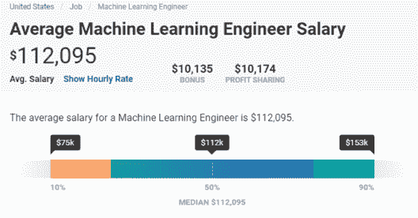

# 机器学习职业和未来范围

> 原文：<https://www.edureka.co/blog/machine-learning-career/>

从事 **[机器学习](https://www.edureka.co/masters-program/machine-learning-engineer-training)** 的职业是否有利可图？如果这个问题在你的脑海中，那么重新考虑一下，因为 [普华永道报告](https://www.pwc.com/us/en/services/consulting/library/artificial-intelligence-predictions-2019.html) 称，31%的高管担心无法满足未来 5 年对人工智能技能的需求。在这篇文章中，我将提出这个话题“机器学习的职业生涯和未来范围”

本文将讨论以下几点:

*   [事实和数字](#facts)
*   [成为机器学习专家的必备技能](#EssentialSkillSettoBecomeaMachineLearningExpert)
*   [机器学习工作简介](#jobs)
*   [机器学习岗位工资](#MachineLearningJobsSalary)
*   [机器学习未来范围](#MachineLearningFutureScope)

## **机器学习职业和未来范围**

## **事实和数字**

此外，忽略所有这些人工智能/人工智能将稳定且不可避免地接管大部分劳动力并将带来大规模失业的喧嚣，来自世界领先的研究和咨询公司*的报告*描绘了人工智能预计将在 2020 年之前为近 230 万个工作岗位铺平道路。

人工智能专业人员，尤其是机器学习领域的专业人员，需求非常高，因为几乎每个初创公司(基于软件)，以及大型企业，都希望雇用拥有 [机器学习](https://www.youtube.com/watch?v=YcUPVziBsMA) 知识的人。

作为主流商业的有效武器，机器学习在这十年里已经走过了漫长的道路。但幸运的是，它仍远未达到可能的顶点，我们也可以期待它在不久的将来取得彻底的进展。因此，如果你是一名人工智能野心家，希望在该行业找到一份工作，这是提高人工智能的一个重要方面——机器学习——的最佳时机。

通过 [人工智能课程](https://www.edureka.co/executive-programs/machine-learning-and-ai) 将自己转变为高技能专业人士，并获得高薪工作。

## **成为机器学习专家的必备技能**

你可能听说过一些围绕机器学习技能的迷思“我数学不好，所以不能成为机器学习专业人士”“只有硬核程序员才能做机器学习的编程，而不是新手”“成为机器学习专家需要书呆子的头脑”等等。

### ****

嗯，所有这些都是**真正的[神话](https://www.edureka.co/blog/data-scientists-myths)** 因为，通过适当的奉献，任何人都可以获得机器学习技能。通过有效的努力和奉献，你不仅会成为一名机器学习工程师，还会在乌托邦世界的创造中发挥重要作用。

所以，让我们了解一下在机器学习领域建立职业生涯的必备技能。

### 程序设计语言

虽然没有专门用于机器学习的编程语言，但在比较每种能够进行机器学习的编程语言的特点时，Python 看起来更胜一筹。

加载和处理数据、可视化数据、将输入转换成数字矩阵甚至评估，是机器学习专家每天都会做的一些基本任务。难怪 Python 能够为我们做所有这些繁重的工作。而且 Python 对机器学习库也有巨大的支持。

这就是为什么，如果你想成为一名机器学习专家，Python 编程语言的知识肯定会改变游戏规则。

### **数学技能**

机器学习是一个广阔的领域，建立在一些复杂的数学成分上，如微积分、线性代数、统计学、概率和最优化。这就是原因，为了加快机器学习的学习曲线，你必须具备这些复杂数学技能的基础知识。

### ****

### **机器学习算法**

如果一个人想从事机器学习领域的职业，他/她应该非常熟悉机器学习算法的标准实现。这些算法可以通过库/包/API 广泛获得，是机器学习最重要的组成部分之一。

### **数据结构**

在成为机器学习工程师的旅程中，你必须掌握的另一项技能是“数据结构”。机器学习专家，在其整个职业生涯中，应该致力于解决现实世界的问题，这就是为什么他们应该对数据结构概念(堆栈、队列、树、图、big-O 符号、搜索、排序等)有深入的了解。).

### **系统分析与设计**

机器学习工程师的典型输出是什么？当然，说到底，一个机器学习工程师的交付品就是一个软件。这就是原因，对软件工程概念和系统设计的深入了解对于机器学习中有前途的职业生涯是必不可少的。

## **机器学习工作简介**

一旦你获得了正确的机器学习技能，你应该开始寻找什么样的工作档案？让我们仔细看看一些最受欢迎的机器学习工作角色。

### **机器学习工程师**

机器学习领域最受欢迎的工作之一是机器学习工程师。机器学习工程师负责设计和实现机器学习算法，以帮助从海量数据中解读有意义的模式。

### **数据科学家**

数据科学家的主要角色是通过使用机器学习和预测分析来收集、分析和解释大量非结构化数据，以获得洞察力并帮助设计未来策略。如果有人在机器学习、大数据技术和分析工具方面有很好的实践经验，那么被聘用为数据科学家的机会就会增加。

### **数据分析师**

数据分析师通过首先获取关于特定主题的信息，然后解释和分析这些信息，最后在综合报告中呈现他们的发现，从而为他们的组织提供价值。他们利用自己的技能和工具来提供竞争分析和识别趋势。数据分析师在微积分、经济学、统计学、机器学习和编程方面有很强的背景。

### **数据架构师**

作为当今最受欢迎的机器学习专业人士之一，数据架构师负责组织的大数据生态系统。他们通过使用机器学习算法来开发、构建、测试和维护高度可扩展的数据管理系统。在收集数据并进行批处理后，他们通过 API 将数据发送给数据科学家进行分析。

## **机器学习岗位工资**

几乎所有的决策都在转向人工智能，无论是初创企业还是大型科技巨头，都在向热门的机器学习职位提供丰厚的薪酬，如 ML 工程师、数据科学家等。

就数据科学家职位的薪酬而言，在所有经验水平和技能组合中，在印度，拥有机器学习技能的数据科学家的工资中位数约为 9 lacs，而在美国约为 92，000 美元。

下图来自 Payscale.com，描述了这一点:

另一方面，如果我们谈论机器学习工程师的工作角色，在印度，所有经验水平和技能组合的机器学习工程师的中位数工资约为 7 lacs，而在美国约为 **$1，12000。**

 下面来自 Payscale.com 的图表正描绘了这一点:

## **机器学习未来范围**

机器学习的未来看起来很有希望，因为机器学习工程师的熟练人才库尚不足以满足对训练有素的专业人员日益增长的需求。领先的在线就业门户网站“Indeed”的一份报告称，自 2018 年初以来，雇主对人工智能和人工智能技能的需求一直是此类熟练专业人员供应量的两倍。

此外，MarketsandMarkets 的研究显示，到 2022 年，机器学习市场规模将增长到 88.1 亿美元。

所以，正如你所看到的，这个领域有很多机会，这是提升机器学习技能的好时机。通过获得认证和从事现实生活中的顶点项目来准备自己，以利用机器学习职业机会。

现在，我们就此结束这篇机器学习生涯和未来范围的文章。希望这篇文章是有见地的！

*Edureka 有一个专门策划的* [*机器学习工程师硕士项目*](https://www.edureka.co/masters-program/machine-learning-engineer-training) *，它将使你精通监督学习、非监督学习和自然语言处理等技术。它包括人工智能&机器学习方面的最新进展和技术方法的培训，如深度学习、图形模型和强化学习。*

有问题要问我们吗？请在“机器学习职业和未来范围”文章的评论部分提到它，我们将会给您回复。