# 2023 年你必须准备的顶级机器学习面试问题

> 原文：<https://www.edureka.co/blog/interview-questions/machine-learning-interview-questions/>

自从[人工智能](https://www.edureka.co/blog/what-is-artificial-intelligence)、[机器学习](https://www.edureka.co/blog/what-is-machine-learning/)和[深度学习](https://www.edureka.co/blog/what-is-deep-learning)问世以来，世界已经发生了变化，并将在未来几年继续如此。在这篇***2023 年*** 博客的机器学习面试问题中，我收集了面试官最常问的问题。这些问题是向[机器学习 Python 认证](https://www.edureka.co/machine-learning-certification-training)培训专家咨询后收集的。

如果你最近参加过任何机器学习面试，请将这些面试问题贴在评论区，我们会尽快回答。如果你有任何问题，你也可以在下面发表评论，这些问题可能会在你的机器学习面试中遇到。

您可以浏览机器学习面试问题和答案的录音，其中我们的讲师已经用示例详细解释了这些主题，这将有助于您更好地理解这个概念。

## **机器学习面试问答|机器学习面试准备| Edureka**


[https://www.youtube.com/embed/t6gOpFLt-Ks?rel=0&showinfo=0](https://www.youtube.com/embed/t6gOpFLt-Ks?rel=0&showinfo=0)*This Edureka video on Machine Learning Interview Questions and Answers will help you to prepare yourself for Data Science / Machine Learning interviews.*

在这个关于机器学习面试问题的博客中，我将讨论在你的面试中被问到的最常见的机器学习相关问题。所以，为了让你更好的理解，我把这个博客分成了以下三个部分:

1.  [机器学习核心面试问题](#Machine%20Learning%20Core%20Interview%20Questions)
2.  [机器学习使用 Python 面试问题](#Machine%20Learning%20using%20Python%20Interview%20Question)
3.  [基于机器学习场景的面试问题](#Machine%20Learning%20Scenario%20based%20Interview%20Question)

## **机器学习核心面试问题**

## **Q1。机器学习有哪些不同的类型？**

|  | 监督学习 | 无监督学习 | 强化学习 |
| 定义 | 机器通过使用标签数据进行学习 | 机器在没有任何指导的情况下根据标记的数据进行训练 | 代理通过产生动作和发现错误或奖励来与其环境交互 |
| 问题的类型 | 回归或分类 | 关联或分类 | 基于奖励 |
| 数据类型 | 标记数据 | 未标记的数据 | 没有预定义的数据 |
| 培养 | 外部监督 | 没有监督 | 没有监督 |
| 方法 | 将标记的输入映射到已知的输出 | 理解模式并发现输出 | 跟踪试错法 |
| 流行算法 | 线性回归、逻辑回归、SVM、KNN 等 | k 均值、C 均值等 | Q-Learning、SARSA 等 |

*机器学习的类型——机器学习面试问题——爱德华卡*

机器有三种学习方式:

1.  监督学习
2.  无监督学习
3.  强化学习

**监督学习:**

*Supervised learning is a method in which the machine learns using labeled data. *

***   这就像在老师的指导下学习*   训练数据集就像是用来训练机器的老师*   当给定新数据时，模型在开始做出决策之前，在预定义的数据集上进行训练**

****无监督学习:****

***Unsupervised learning is a method in which the machine is trained on unlabelled data or without any guidance***

*****   这就像没有老师的学习。*   模型通过观察学习，并在数据中发现结构。*   模型被给定一个数据集，并通过创建聚类来自动在该数据集中查找模式和关系。****

******强化学习:******

*****Reinforcement learning involves an agent that interacts with its environment by producing actions & discovers errors or rewards.*****

*******   这就像被困在一个孤岛上，你必须探索周围的环境，学会如何独立生活和适应生活条件。*   模型通过试凑法学习*   它学习的基础是对它所做的每一个动作的奖励或惩罚******

### ********Q2。你会如何向一个上学的孩子解释机器学习？********

*******   假设你的朋友邀请你参加他的聚会，在那里你遇到了完全陌生的人。既然你对他们毫无概念，你就会在心理上根据性别、年龄组、穿着打扮等对他们进行分类。*   在这种情况下，陌生人代表未标记的数据，对未标记的数据点进行分类的过程只是无监督的学习。*   由于你没有使用任何关于人的先验知识，并在移动中对他们进行分类，这就变成了一个无监督的学习问题。******

### ********Q3。深度学习和机器学习有什么不同？********

| **深度学习** | **机器学习** |
| 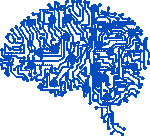 *深度学习是机器学习的一种形式，受人脑结构的启发，在特征检测方面特别有效。* | 机器学习就是解析数据、从数据中学习、然后应用所学知识做出明智决策的算法。 |

*******深度学习 vs 机器学习——机器学习面试问题——爱德华卡*******

### ********Q4。**解释分类和回归******

******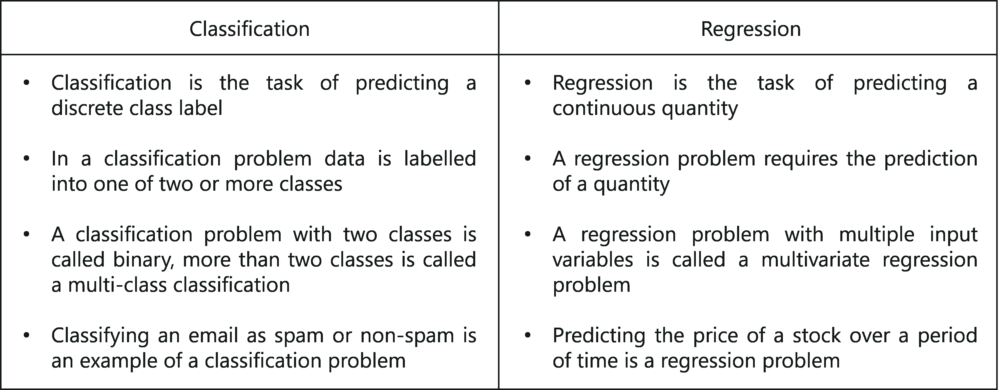******

*******分类 vs 回归——机器学习面试问题——爱德华卡*******

### ********Q5。你所理解的选择偏差是什么？********

*******   这是一种统计误差，它会导致实验中取样部分的偏差。*   该误差导致一个采样组比实验中包括的其他组更经常被选择。*   如果没有识别出选择偏差，选择偏差可能会产生不准确的结论。******

### ********Q6。你所理解的精确和回忆是什么？********

******让我用一个类比来解释一下:******

*******   想象一下，你的女朋友在过去的 10 年里每年都给你一个生日惊喜。有一天，你的女朋友问你:“亲爱的，你还记得我给你的所有生日惊喜吗？”*   为了和你的女朋友保持良好的关系，你需要回忆起所有的 10 件事情。所以，**回忆**就是你能正确回忆的事件数占事件总数的比例。*   如果你能正确回忆起所有 10 件事，那么你的回忆率是 1.0 (100%)，如果你能正确回忆起 7 件事，你的回忆率是 0.7 (70%)******

******然而，你可能在一些答案中是错误的。******

*******   例如，假设你猜了 15 次，其中 10 次是正确的，5 次是错误的。这意味着你可以回忆起所有的事件，但不是那么精确*   因此，**精度**是您可以正确回忆的事件数量与您可以回忆的事件总数(正确回忆和错误回忆的混合)的比率。*   从上面的例子中(10 个真实事件，15 个答案:10 个正确，5 个错误)，您得到了 100%的召回率，但是您的准确率只有 66.67% (10 / 15)******

### ********Q7。用一个简单的例子解释假阴性，假阳性，真阴性，真阳性。********

******让我们考虑一个火灾紧急情况的场景:******

*******   **真阳性:**如果发生火灾时警报响起。 *火是阳性的，系统做出的预测是真实的。**   **误报:**如果报警持续，而没有火灾。 *系统预测火灾为阳性这是一个错误的预测，因此预测是假的。**   **假阴性:**如果报警器不响但发生了火灾。 *系统预测火灾为阴性，因为有火所以是假的。**   **真否定:**如果报警器不响，说明没有发生火灾。 *火是阴性的，这个预言是真的。*******

### ********Q8。什么是混淆矩阵？********

******混淆矩阵或误差矩阵是用于总结分类算法性能的表格。******

******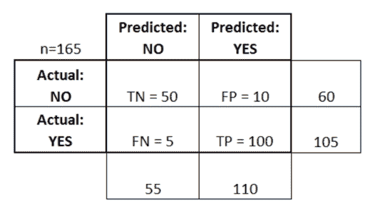******

*******混淆矩阵——机器学习面试问题——爱德华卡*******

******考虑上表，其中:******

*******   TN =真阴性*   TP =真阳性*   FN =假阴性*   FP =假阳性******

### ********Q9。归纳学习和演绎学习有什么区别？********

*******   *归纳学习是利用观察得出结论的过程**   *演绎学习是利用结论形成观察的过程*******

******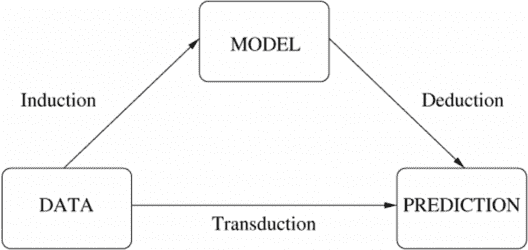******

*******归纳 vs 演绎学习——机器学习面试问题——爱德华卡*******

### ********Q10。KNN 和 K-均值聚类有什么不同？********

******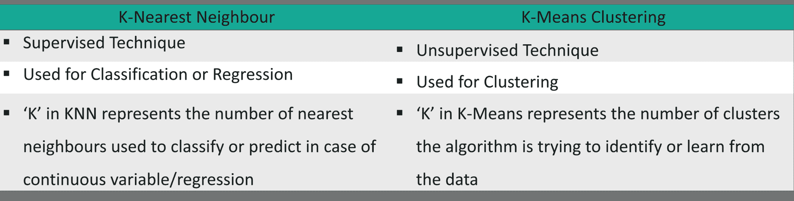******

*******K-means vs KNN——机器学习面试问题——edu reka*******

### ********Q11。什么是 ROC 曲线，它代表什么？********

*******受试者操作特征曲线(或 ROC 曲线)是诊断测试评估的基本工具，是诊断测试不同可能截止点的真阳性率(灵敏度)与假阳性率(特异性)的关系图。*******

******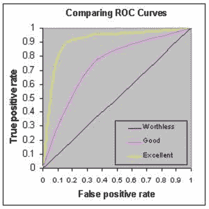******

*******ROC——机器学习面试问题——edu reka*******

*******   它显示了敏感性和特异性之间的权衡(任何敏感性的增加都会伴随着特异性的降低)。*   曲线越靠近 ROC 空间的左侧边界和顶部边界，测试就越准确。*   曲线越接近 ROC 空间的 45 度对角线，测试越不准确。*   分界点处切线的斜率给出了该测试值的似然比(LR)。*   曲线下的面积是测试准确度的量度。******

### ********Q12。一型和二型错误有什么区别？********

******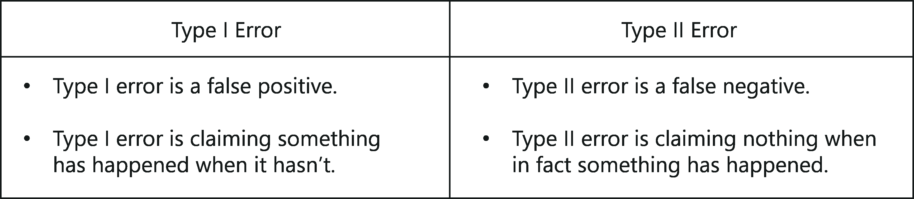******

*******1 型 vs 型错误——机器学习面试问题——爱德华卡*******

********Q13。假阳性太多好还是假阴性太多好？解释一下。********

************

*******漏报 vs 误报——机器学习面试问题——爱德华卡*******

******这取决于问题以及我们试图解决问题的领域。如果你在医学测试领域使用机器学习，那么假阴性是非常危险的，因为当一个人实际上不舒服时，报告不会显示任何健康问题。同样，如果在垃圾邮件检测中使用机器学习，那么误报是非常危险的，因为算法可能会将重要的电子邮件归类为垃圾邮件。******

### ********Q14。模型精度和模型性能哪个对你更重要？********

******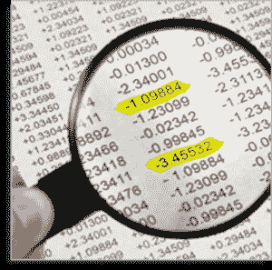******

*******模型精度 vs 性能——机器学习面试问题——爱德华卡*******

******好吧，你必须知道模型精度只是模型性能的一个子集。模型的准确性和模型的性能成正比，因此模型的性能越好，预测就越准确。******

### ********Q15。决策树中基尼杂质和熵的区别是什么？********

*******   基尼系数和熵是用来决定如何分割决策树的指标。*   基尼系数是一个随机样本被正确分类的概率，如果你根据分支中的分布随机选择一个标签。*   熵是计算信息缺失的一种度量。你通过分裂来计算信息增益(熵的差异)。这种方法有助于减少输出标签的不确定性。******

### ********Q16。熵和信息增益的区别是什么？********

*******   熵是你的数据有多乱的一个指标。越接近叶节点，它越小。*   信息增益基于在属性上分割数据集后熵的减少。当你越接近叶节点，它就越大。******

### ********Q17。什么是过度拟合？你如何确保你没有过度适应一个模型？********

*******当模型研究训练数据的程度对模型在新数据上的性能产生负面影响时，就会发生过拟合。*******

******这意味着训练数据中的扰动被模型记录和学习为概念。但这里的问题是，这些概念不适用于测试数据，并对模型分类新数据的能力产生负面影响，因此降低了测试数据的准确性。******

******避免过度拟合的三种主要方法:******

*******   收集更多的数据，以便模型可以用不同的样本进行训练。*   使用集合方法，如随机森林。它基于 bagging 的思想，bagging 用于通过组合数据集的不同样本上的多个决策树的结果来减少预测中的变化。*   选择正确的算法。******

### ********Q18。解释机器学习中的集成学习技术。********

### ********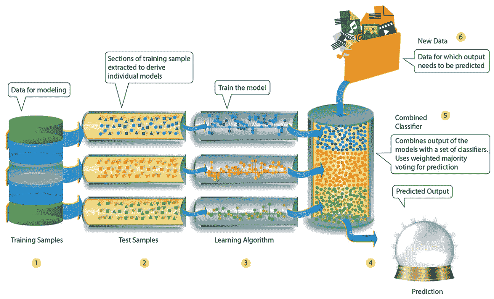********

*******集成学习——机器学习面试问题——爱德华卡*******

******集成学习是一种用于创建多个机器学习模型的技术，然后将这些模型组合起来以产生更准确的结果。通过使用整个训练数据集来构建通用机器学习模型。然而，在集成学习中，训练数据集被分成多个子集，其中每个子集用于建立单独的模型。在模型被训练之后，它们被组合以预测结果，从而减少输出中的方差。******

### ********Q19。机器学习中的 bagging 和 boosting 是什么？********

************

*******装袋&助推——机器学习面试问题——爱德华卡*******

### ********Q20。你如何筛选异常值，如果发现异常值，你应该怎么做？********

******以下方法可用于筛选异常值:******

*******   **箱线图:**箱线图代表数据的分布及其可变性。箱形图包含上四分位数和下四分位数，因此箱形图基本上跨越了四分位数之间的范围(IQR)。使用箱线图的主要原因之一是为了检测数据中的异常值。由于箱形图跨越了 IQR，因此它会检测位于此范围之外的数据点。这些数据点只不过是离群值。*   **概率和统计模型:**正态分布和指数分布等统计模型可用于检测数据点分布的任何变化。如果在分布范围之外发现任何数据点，则将其呈现为异常值。*   **线性模型:**可以训练诸如逻辑回归的线性模型来标记异常值。以这种方式，模型挑选出它看到的下一个异常值。*   **基于邻近度的模型:**这种模型的一个例子是 K-means 聚类模型，其中，数据点基于诸如相似性或距离之类的特征形成多个或“K”个聚类。因为相似的数据点形成聚类，所以异常值也形成它们自己的聚类。这样，基于邻近性的模型可以很容易地帮助检测异常值。******

******你如何处理这些异常值？******

*******   如果你的数据集是巨大而丰富的，那么你可以冒险丢弃离群值。*   但是，如果您的数据集很小，那么您可以通过设置一个百分比阈值来限制离群值。例如，高于第 95 百分位的数据点可用于限制异常值。*   最后，基于数据探索阶段，您可以缩小一些规则的范围，并根据这些业务规则估算异常值。******

### ********Q21。什么是共线性和多重共线性？********

*******   当多重回归中的两个预测变量(例如，x1 和 x2)具有某种相关性时，会出现共线性。*   当两个以上的预测变量(如 x1、x2 和 x3)相互关联时，会出现多重共线性。******

### ********Q22。你所理解的特征向量和特征值是什么？********

*******   **特征向量:** *特征向量是那些即使对其进行线性变换，其方向也保持不变的向量。**   **特征值:** *特征值是用于特征向量变换的标量。*******

******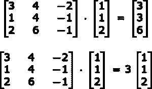******

*******特征值&特征向量——机器学习面试问题——爱德华卡*******

******在上面的例子中，3 是特征值，乘法问题中的原向量是特征向量。******

******方阵 A 的特征向量是非零向量 x，因此对于某个数λ，我们有以下等式:******

*********Ax = λx，*********

******其中λ是特征值，因此，在我们的例子中，λ = 3，X = [1 1 2]******

### ********Q23。什么是 A/B 测试？********

*******   A/B 是带有两个变量 A 和 B 的随机实验的统计假设检验。它用于比较使用不同预测变量的两个模型，以检查哪个变量最适合给定的数据样本。*   考虑这样一个场景，您已经创建了两个模型(使用不同的预测变量)，可用于为电子商务平台推荐产品。*   A/B 测试可用于比较这两种模式，以检查哪种模式最适合向客户推荐产品。******

******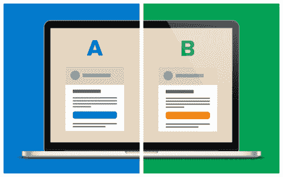******

*******A/B 测试——机器学习面试问题——爱德华卡*******

### ********Q24。什么是整群抽样？********

*******   这是一个在特定人群中随机选择具有相似特征的完整群体的过程。*   聚类样本是一种概率样本，其中每个采样单元是元素的集合或聚类。*   例如，如果您对一组公司中的经理总数进行聚类，在这种情况下，经理(示例)将表示元素，公司将表示聚类。******

### ********Q25。** **运行二叉分类树算法相当容易。但是您知道树是如何决定在根节点及其后续子节点上拆分哪个变量的吗？********

*******   诸如基尼指数和熵之类的度量可以用来决定哪个变量最适合于在根节点分裂决策树。*   我们可以计算基尼系数如下:计算子节点的基尼系数，使用公式-成功和失败概率的平方和(p^2+q^2).*   使用分裂每个节点的加权基尼系数来计算分裂的基尼系数*   熵是数据中杂质或随机性的量度，(对于二进制类):******

******这里 p 和 q 分别是该节点成功和失败的概率。******

*******   当一个节点是同构的时，熵为零；当两个类都以 50%–50%的比例出现在一个节点中时，熵最大。综上所述，熵必须尽可能低，才能决定一个变量是否适合作为根节点。******

*******要了解更多关于人工智能和机器学习的知识，那就去读人工智能教程吧。此外，报名参加 NIT Warangal 的 PGP [AI 和 ML 课程](https://www.edureka.co/executive-programs/machine-learning-and-ai)以达到精通。*******

********了解我们在顶级城市的机器学习认证培训课程********

| 印度 | 美国 | 其他国家 |
| [班加罗尔的机器学习课程](https://www.edureka.co/masters-program/machine-learning-engineer-training-bangalore) | [达拉斯的机器学习培训](https://www.edureka.co/masters-program/machine-learning-engineer-training-dallas) | [多伦多的机器学习培训](https://www.edureka.co/machine-learning-certification-training-toronto) |
| [海德拉巴的机器学习课程](https://www.edureka.co/masters-program/machine-learning-engineer-training-hyderabad) | [华盛顿的机器学习培训](https://www.edureka.co/masters-program/machine-learning-engineer-training-washington) | [伦敦的机器学习培训](https://www.edureka.co/machine-learning-certification-training-london) |
| [孟买的机器学习认证](https://www.edureka.co/machine-learning-certification-training-mumbai) | [纽约的机器学习认证](https://www.edureka.co/machine-learning-certification-training-new-york-city) | [迪拜的机器学习课程](https://www.edureka.co/masters-program/machine-learning-engineer-training-dubai) |

## ********机器学习用 Python 提问********

******这组机器学习面试问题处理的是 Python 相关的机器学习问题。******

### ********Q1。列举几个 Python 中用于数据分析和科学计算的库。********

******以下是主要用于数据分析的 Python 库列表:******

*******   NumPy*   我的天啊*   熊猫*   SciKit*   Matplotlib*   希伯恩*   散景******

### ********Q2。用 Python 语言绘图你更喜欢哪个库:Seaborn 还是 Matplotlib 还是 Bokeh？********

******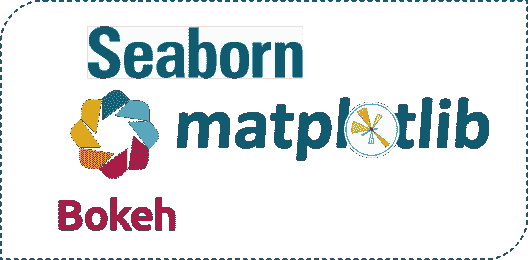******

*******Python 库——机器学习面试问题——爱德华卡*******

******这取决于你想要实现的视觉化。每个库都有特定的用途:******

*******   **Matplotlib:** 用于基本绘图，如条形图、饼图、折线图、散点图等*   **Seaborn:** 构建在 Matplotlib 和 Pandas 之上，以简化数据绘制。它用于统计可视化，如创建热图或显示数据分布*   **散景:**用于交互式可视化。如果您的数据过于复杂，并且您没有在数据中找到任何“信息”，那么可以使用散景创建交互式可视化效果，让您的观众自己探索数据******

### ********Q3。NumPy 和 SciPy 是什么关系？********

*******   NumPy 是 SciPy 的一部分。*   NumPy 定义了数组以及一些基本的数字函数，如索引、排序、整形等。*   SciPy 使用 NumPy 的功能实现计算，如数值积分、优化和机器学习。******

### ********Q4。Pandas 系列和 Python 中单列 DataFrame 的主要区别是什么？********

******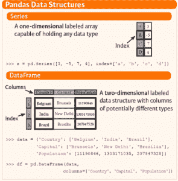******

*******熊猫系列 vs data frame——机器学习面试问题——爱德华卡*******

### ********Q5。在 Python 中，如何处理数据集中变量的重复值？********

******考虑以下 Python 代码:******

```
 ******bill_data=pd.read_csv("datasetsTelecom Data AnalysisBill.csv")
bill_data.shape
#Identify duplicates records in the data
Dupes = bill_data.duplicated()
sum(dupes)
#Removing Duplicates
bill_data_uniq = bill_data.drop_duplicates()****** 
```

### ********Q6。编写一个基本的机器学习程序来检查模型的准确性，通过使用任何分类器导入任何数据集？********

```
******#importing dataset
import sklearn
from sklearn import datasets
iris = datasets.load_iris()
X = iris.data
Y = iris.target

#splitting the dataset
from sklearn.cross_validation import train_test_split
X_train, Y_train, X_test, Y_test = train_test_split(X,Y, test_size = 0.5)

#Selecting Classifier
my_classifier = tree.DecisionTreeClassifier()
My_classifier.fit(X_train, Y_train)
predictions = my_classifier(X_test)
#check accuracy
From sklear.metrics import accuracy_score
print accuracy_score(y_test, predictions)****** 
```

## ********机器学习场景基础题********

******这组机器学习面试问题处理基于场景的机器学习问题。******

### ********Q1。给你一个数据集，其中包含的变量有超过 30%的缺失值？假设，50 个变量中，有 8 个变量的缺失值高于 30%。你将如何处理他们？********

*******   为丢失的值分配一个独特的类别，谁知道丢失的值可能会揭示一些趋势。*   我们可以公然移除它们。*   或者，我们可以明智地用目标变量检查它们的分布，如果发现任何模式，我们将保留那些丢失的值，并在删除其他值的同时给它们分配一个新的类别。******

### ********Q2。编写一个 SQL 查询，使用您朋友喜欢的页面进行推荐。假设您有两个表:一个包含用户及其朋友的两列表，一个包含用户及其喜欢的页面的两列表。它不应该推荐你已经喜欢的页面。********

```
 ******SELECT f.user_id, l.page_id
FROM friend f JOIN like l
ON f.friend_id = l.user_id
WHERE l.page_id NOT IN (SELECT page_id FROM like
WHERE user_id = f.user_id)****** 
```

### ********Q3。有一个游戏，要求你掷出两个公平的六面骰子。如果骰子上的数值之和等于 7，那么您将赢得 21 美元。但是，每次掷出两个骰子，你都必须支付 5 美元。你玩这个游戏吗？以及后续:如果他玩 6 次这个游戏赚钱的概率是多少？********

*******   第一个条件是，如果两个骰子的值之和等于 7，那么您将赢得 21 美元。但是对于所有其他情况，你必须支付 5 美元。*   首先，我们来计算一下可能的案例数量。由于我们有两个 6 面骰子，因此案例总数= 6 * 6 = 36。*   在 36 个案例中，我们必须计算出产生和为 7 的案例数(这样两个骰子的值之和就等于 7)*   产生和为 7 的可能组合是，(1，6)，(2，5)，(3，4)，(4，3)，(5，2)和(6，1)。所有这 6 种组合产生的和为 7。*   这意味着在 36 个机会中，只有 6 个会产生 7 的和。取比值，我们得到: *6/36 = 1/6**   因此，这表明我们有机会在 6 场比赛中赢得 21 美元。*   因此，回答这个问题，如果一个人玩 6 次，他将赢得一场 21 美元的游戏，而对于其他 5 场游戏，他将不得不支付每场 5 美元，这是所有 5 场游戏的 25 美元。因此，他将面临损失，因为他赢得了 21 美元，但最终支付了 25 美元。******

### ********Q4。我们有两个在新闻提要中投放广告的选项:****1–每 25 个故事中，有一个会成为广告****2–每个故事有 4%的机会成为广告********

### ********对于每个选项，100 个新闻故事中显示的广告的预期数量是多少？** **如果我们选择选项 2，用户在 100 个故事中只看到一个广告的可能性有多大？完全没有广告呢？********

*******   选项 1 的 100 个新故事中显示的广告的预期数量等于 4 (100/25 = 4)。*   类似地，对于选项 2，在 100 个新故事中显示的广告的预期数量也等于 4 (4/100 = 1/25，这表明每 25 个故事中有一个是广告，因此在 100 个新故事中将有 4 个广告)*   因此，对于每个选项，在 100 个新故事中显示的广告总数是 4。*   问题的第二部分可以用二项分布来解决。二项式分布有三个参数:
    *   成功和失败的概率，在我们的例子中是 4%。
    *   案例总数，在我们的案例中是 100。
    *   结果的概率，即在 100 个故事中，用户只看到一个广告的概率*   p(单个广告)= (0.96)^99*(0.04)^1******

*******(注:这里 0.96 表示 100 个故事里看不到广告的几率，99 表示只看到 1 个广告的可能性，0.04 是 100 个故事里看到一次广告的概率)*******

*******   总共有 100 个广告位置。因此，100 * p(单个广告)= 7.03%******

### ********Q5。您如何预测下个月谁会续订？你需要什么数据来解决这个问题？你会做什么分析？你会建立预测模型吗？如果有，是哪些算法？********

*******   让我们假设我们正在尝试预测网飞订阅的续订率。因此，我们的问题陈述是预测哪些用户将续订下个月的订阅计划。*   接下来，我们必须了解解决这个问题所需的数据。在这种情况下，我们需要检查每个家庭的频道活动小时数、家庭中成年人的数量、孩子的数量、哪个频道的流媒体播放量最大、每个频道花费的时间、收视率与上月相比有多大变化等。需要这样的数据来预测一个人是否会在下个月继续订阅。*   收集这些数据后，找到模式和相关性是很重要的。例如，我们知道如果一个家庭有孩子，那么他们更有可能订阅。同样，通过研究前一个月的观看率，你可以预测一个人是否仍然对订阅感兴趣。必须研究这种趋势。*   下一步是分析。对于这种问题陈述，您必须使用分类算法将客户分为两类:
    *   下个月可能订阅的顾客
    *   下个月不太可能订阅的客户*   你会建立预测模型吗？是的，为了实现这一点，你必须建立一个预测模型，将客户分为两类，如上所述。*   选择哪些算法？可以选择 Logistic 回归、随机森林、支持向量机等分类算法。*   一旦选择了正确的算法，就必须执行模型评估来计算算法的效率。其次是部署。******

### ********Q6。如何将昵称(皮特、安迪、尼克、罗伯等)映射到真实姓名？********

*******   这个问题可以用 n 种方法解决。让我们假设给你一个包含 1000 条 twitter 交互的数据集。你将通过仔细分析推文中使用的词语来研究两个人之间的关系。*   这种问题陈述可以通过使用自然语言处理技术实现文本挖掘来解决，其中句子中的每个单词被分解，并且找到各个单词之间的相互关系。*   NLP 被积极用于理解客户反馈，在 Twitter 和脸书上进行情感分析。因此，解决这个问题的方法之一是通过文本挖掘和自然语言处理技术。******

### ********Q7。一个罐子有 1000 个硬币，其中 999 个是公平的，1 个是双头的。随机选一枚硬币，掷 10 次。假设你看到 10 个正面，那么下一次掷硬币也是正面的概率是多少？********

*******   有两种选择硬币的方法。一个是选一枚公平的硬币，另一个是选有两个头的。*   *选择公平币的概率= 999/1000 = 0.999* *选择不公平币的概率= 1/1000 = 0.001**   连续选择 10 个头像=选择公平硬币*获得 10 个头像+选择不公平硬币*   *p(a)= 0.999 *(1/2)^10 = 0.999 *(1/1024)= 0.000976**p(b)= 0.001 * 1 = 0.001**p(a/a+b)= 0.000976/(0.000976+0.001)= 0.4939**p(b/a**   *选择另一个人头的概率= P(A/A+B)* 0.5+P(B/A+B)* 1 = 0.4939 * 0.5+0.5061 = 0.7531*******

### ********Q8。假设给你一个数据集，它的缺失值分布在距离中位数 1 个标准差的范围内。有多大比例的数据不会受到影响，为什么？********

******由于数据分布在中位数上，我们假设它是正态分布。众所周知，在正态分布中，大约 68%的数据位于均值(或众数、中位数)的 1 倍标准差内，这使得大约 32%的数据不受影响。因此，大约 32%的数据不会受到缺失值的影响。******

### ********Q9。给你一个癌症检测数据集。让我们假设当你建立一个分类模型时，你达到了 96%的准确率。为什么不应该对自己的模特表现感到高兴？你能做些什么呢？********

******您可以执行以下操作:******

*******   添加更多数据*   处理缺失的异常值*   特征工程*   特征选择*   多种算法*   算法调整*   集成方法*   交叉验证******

### ********Q10。您正在处理时间序列数据集。你的经理要求你建立一个高精度的模型。您从决策树算法开始，因为您知道它对所有类型的数据都相当有效。后来你尝试了一个时间序列回归模型，得到了比决策树模型更高的准确率。这可能发生吗？为什么？********

*******   时间序列数据是基于线性的，而决策树算法被认为是检测非线性相互作用的最佳方法*   决策树无法提供可靠的预测。为什么？
    *   原因是它不能像回归模型那样很好地映射线性关系。
    *   我们还知道，只有当数据集满足其线性假设时，线性回归模型才能提供稳健的预测。******

### ********Q11。假设你发现你的模型有低偏差和高方差的问题。你认为哪种算法可以解决这种情况，为什么？********

*******类型 1:如何应对高方差？*******

*******   当模型的预测值接近实际值时，偏差较低。*   在这种情况下，我们可以使用 bagging 算法(例如:[随机森林](https://www.edureka.co/blog/random-forest-classifier/))来解决高方差问题。*   Bagging 算法通过重复随机采样将数据集划分为子集。*   一旦被划分，这些样本可以被用于使用单一学习算法来生成一组模型。随后，使用投票(分类)或平均(回归)来组合模型预测。******

*******类型二:如何应对高方差？*******

*******   通过使用正则化技术降低模型复杂度，其中较高的模型系数受到惩罚。*   您还可以使用可变重要性图表中的前 n 个功能。有可能由于数据集中的所有变量，算法在寻找有意义的信号时面临困难。******

### ********Q12。给你一个数据集。数据集包含许多变量，其中一些变量是高度相关的，您对此有所了解。您的经理要求您运行 PCA。你会先移除相关变量吗？为什么？********

******很可能，你会忍不住说不，但那是不正确的。 丢弃相关变量将对 PCA 产生实质性影响，因为在相关变量存在的情况下，由特定成分解释的方差变得膨胀。******

### ********Q13。你被要求建立一个多元回归模型，但是你的 R 模型并没有你想要的那么好。为了改进，您删除了截距项，现在您的模型 R 从 0.3 变为 0.8。可能吗？怎么会？********

******是的，这是可能的。******

*******   截距项是指没有任何独立变量的模型预测，或者换句话说，均值预测 R = 1–∑(Y–Y)/∑(Y–Y mean)其中 Y 是预测值。*   在截距项存在的情况下，R 值将根据均值模型评估您的模型。*   在没有截距项(Ymean)的情况下，模型不能做出这样的评估，*   分母较大时，∑(Y–Y)/∑(Y)等式的值变得比实际值小，从而导致 R 值较高。******

### ********Q14。你被要求用 10000 棵树建立一个随机的森林模型。在其训练过程中，你得到的训练误差为 0.00。但是，在测试中，验证误差是 34.23。这是怎么回事？你还没有把你的模型训练的很完美吗？********

*******   模型过度拟合了数据。*   训练误差为 0.00 意味着分类器在一定程度上模仿了训练数据模式。*   但是，当这个分类器在看不见的样本上运行时，它无法找到这些模式，并返回更多错误的预测。*   在随机森林中，这通常发生在我们使用了过多的树的时候。因此，为了避免这种情况，我们应该使用交叉验证来调整树的数量。******

********Q15。买了这个的人也买了……'亚马逊上看到的推荐是基于哪个算法？********

******像亚马逊这样的电子商务网站利用机器学习向客户推荐产品。这种推荐的基本思想来源于协同过滤。协同过滤是比较具有相似购物行为的用户，以便向具有相似购物行为的新用户推荐产品的过程。******

******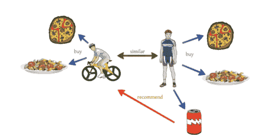******

*******协同过滤——机器学习面试问题——爱德华卡*******

******为了更好地理解这一点，我们来看一个例子。假设用户 A 是一名运动爱好者，他买了披萨、意大利面和一杯可乐。几周后，另一个骑自行车的用户 B 买了披萨和意大利面。他没有购买可乐，但亚马逊向用户 B 推荐了一瓶可乐，因为他的购物行为和生活方式与用户 a 非常相似。这就是协同过滤的工作方式。******

******所以这些是机器学习面试中最常被问到的问题。然而，如果你想复习更多的知识，你可以浏览这些博客:******

*******   [初学者机器学习教程](https://www.edureka.co/blog/machine-learning-tutorial/)*   [机器学习的十大应用:机器学习在日常生活中的应用](https://www.edureka.co/blog/machine-learning-applications/)*   [机器学习算法](https://www.edureka.co/blog/machine-learning-algorithms/)******

*******到此，我们的博客就告一段落了。希望这些机器学习面试问题能帮助你在机器学习面试中获得 ace。或者，也可以用 Python 认证的[机器学习获得专家指导！](https://www.edureka.co/machine-learning-certification-training)*******

******学习机器学习的基础知识，包括无监督和有监督学习的机器学习步骤和方法，数学和启发式方面，以及创建算法的动手建模。你会为机器学习工程师的职位做好准备。[机器学习课程](https://www.edureka.co/masters-program/machine-learning-engineer-training) Masters 计划将为您提供关于机器学习在现实世界中的应用的最深入和实用的信息。此外，您将学习在机器学习领域取得成功所需的基本知识，如统计分析、Python 和数据科学。******

*******此外，如果你想成为一名成功的深度学习工程师，你可以使用 Edureka 的 Tensoflow 参加[深度学习课程](https://www.edureka.co/ai-deep-learning-with-tensorflow)培训。*******