# R 语言中的机器学习，适合初学者，有例子

> 原文：<https://www.edureka.co/blog/machine-learning-with-r/>

## **机器学习用 R**

机器学习就是现在和未来！从网飞的推荐引擎到谷歌的自动驾驶汽车，都是机器学习。这篇关于 R 机器学习的博客帮助你理解不同机器学习算法遵循的机器学习核心概念，以及用 R 实现那些机器学习算法

这个关于“R 机器学习”的博客由以下几个部分组成:

*   [理解机器学习](#understand)
*   [机器学习算法的类型](#type)
*   [用 R 实现机器学习算法](#algo)

## **机器学习用 R | edu reka**

## **理解机器学习**

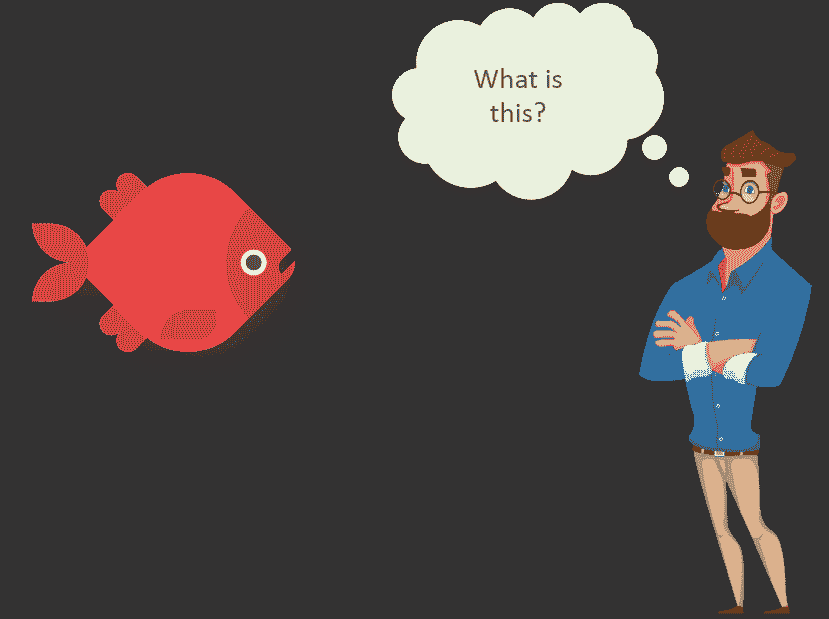

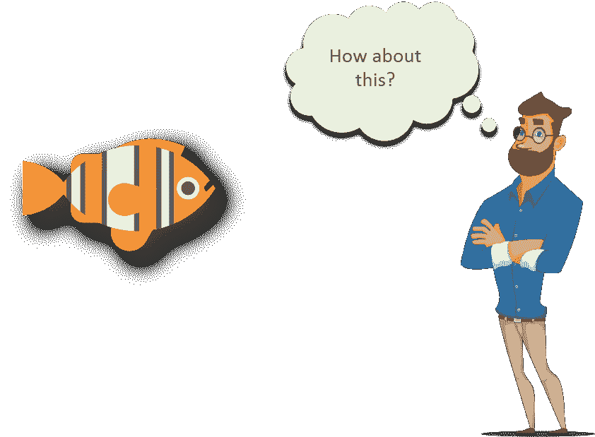


**你怎么知道那些都是鱼？**

当你还是个孩子的时候，你可能会看到一张鱼的照片，你的幼儿园老师或父母会告诉你这是一条鱼，它有一些与它相关的特征，比如它有鳍、鳃、一双眼睛、一条尾巴等等。现在，每当你的大脑遇到具有这些特征的图像，它会自动将其注册为一条鱼，因为你的大脑*已经*知道它是一条鱼。

这就是我们大脑的工作方式，但是机器呢？如果把同样的图像输入机器，机器将如何识别它是一条鱼？

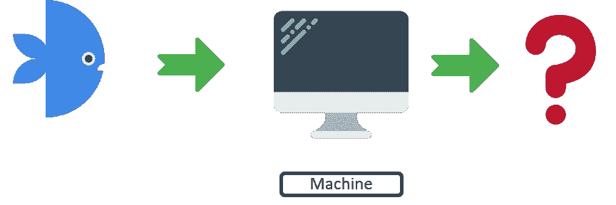

这就是 M *机器学习*的用武之地。我们将继续向带有“鱼”标签的计算机输入鱼的图像，直到*机器学习到与*鱼相关的所有特征。

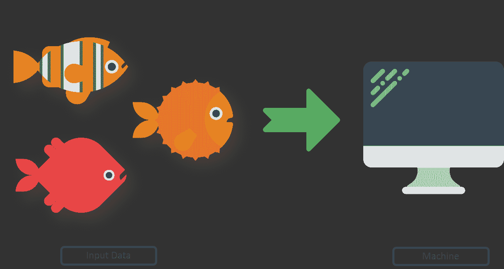

一旦机器学习了与鱼相关的所有特征，我们将向它输入新数据，以确定它学习了多少。

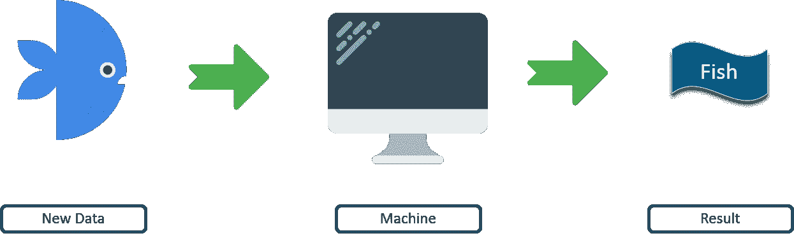

换句话说，*原始数据/训练数据*被给予机器，以便它*学习*与*训练数据相关的所有特征。* 一旦学习完成，就会给出*新数据/测试数据*来确定机器学习的程度。

让我们在 R 博客的机器学习中前进，并了解机器学习的类型。

## **机器学习的类型**

*   ### **Supervised learning:**

监督学习算法从一个已知的数据集(训练数据)中学习，该数据集有标签进行预测。


回归和分类是监督学习的一些例子。

#### **#分类:**


对于这个例子，如果第一个观察结果被赋予标签“男人”,那么它被正确地分类，但是如果它被赋予标签“女人”,则分类是错误的。类似地，对于第二个观察，如果给定的标签是“女人”，它被正确地分类，否则分类是错误的。

#### **#回归:**

回归是一种监督学习算法，有助于确定一个变量如何影响另一个变量。

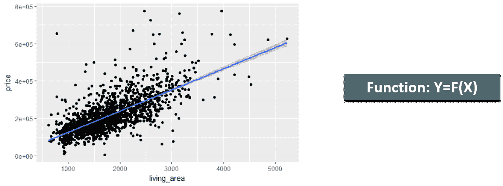

在这里，“居住面积”是自变量，“价格”是因变量，即我们确定“价格”如何随“居住面积”而变化。

*   ### **Unsupervised learning:**

无监督学习算法从没有标签的数据中进行推断。

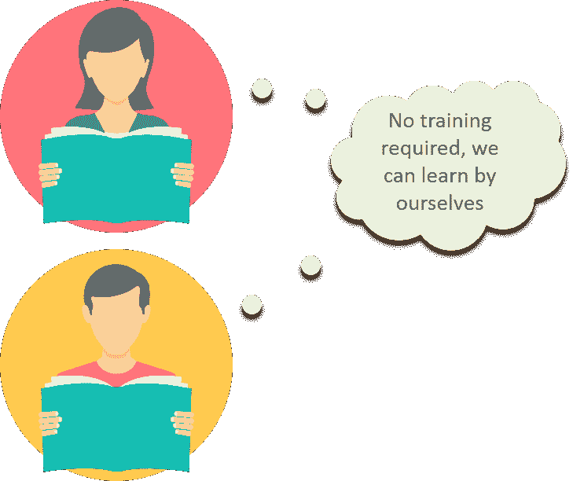

*聚类*就是无监督学习的一个例子。“K-均值”、“分层”、“模糊 C-均值”是聚类算法的一些例子。

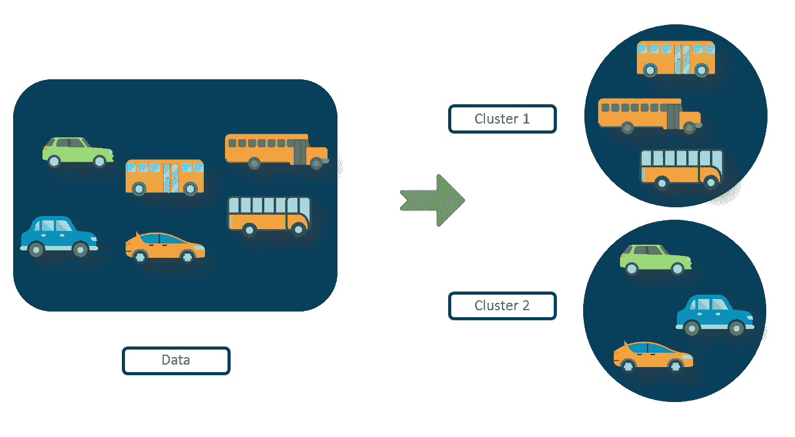

在这个例子中，观察值集合被分成两个集群。聚类是基于观察值之间的相似性来完成的。存在高的组内相似性和低的组间相似性，即，在所有公共汽车之间存在非常高的相似性，但是在公共汽车和汽车之间存在低的相似性。

*   ### **Intensive learning:**

强化学习是一种机器学习算法，其中*环境*中的*机器/代理*学习理想行为，以最大化其性能。代理人需要简单的奖励反馈来学习它的行为，这被称为*强化信号*。

## ****

以*吃豆人*为例。只要吃豆人继续吃食物，它就能获得积分，但当它撞上怪物时，它就失去了生命。因此，吃豆人知道它需要吃更多的食物，并避免怪物，以提高其性能。

如果你想深入学习人工智能和机器学习，来我们这里报名参加 Edureka 的这个研究生文凭 [AI 和 ML 课程](https://www.edureka.co/executive-programs/machine-learning-and-ai)。

## **用 R 实现机器学习:**

### **线性回归:**

我们将使用钻石数据集实现线性回归算法:

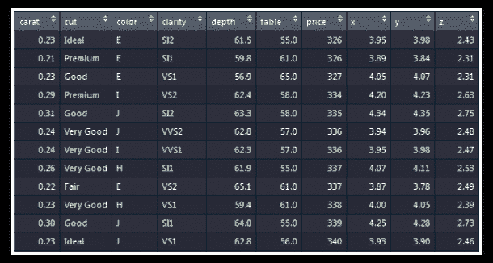

数据集描述:

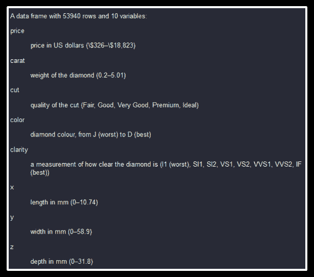

在对数据建立任何模型之前，我们应该将数据分成“训练”和“测试”组。该模型将在“训练”装置上建立，其准确性将在“测试”装置上检查。

我们需要加载“caTools”包，将数据拆分成两组。

```
`library(caTools)`
```

“caTools”包提供了一个函数“sample.split()”，帮助拆分数据。

```
sample.split(diamonds$price,SplitRatio = 0.65)->split_index
```

价格列中 65%的观察值被指定为“真”标签，其余 35%被指定为“假”标签。

```
subset(diamonds,split_index==T)->train
subset(diamonds,split_index==F)->test
```

所有具有“真”标签的观察值已被存储在“*列车”对象*中，而那些具有“假”标签的观察值已被分配给“测试”集合。

现在，拆分已经完成，我们有了“训练”和“测试”集，是时候在训练集上构建线性回归模型了。

我们将使用“lm()”函数对“train”数据建立线性回归模型。我们根据数据集的所有其他变量来确定钻石的*价格*。构建的模型存储在对象“mod _ regressive”中。

```
`lm(price~.,data = train)->mod_regress`
```

现在，我们已经建立了模型，我们需要对“测试”集进行预测。“predict()”函数用于获得预测值。它需要两个参数:T2 制造的模型 T3 和 T4 测试集。预测结果存储在“result _ regressive”对象中。

```
`predict(mod_regress,test)->result_regress`
```

让我们使用“cbind()”函数将“测试”数据集的实际价格值和预测值绑定到一个数据集。新的数据帧存储在 的“最终数据”中

```
`cbind(Actual=test$price,Predicted=result_regress)->Final_Data` 
```

```
`as.data.frame(Final_Data)->Final_Data`
```

由实际值和预测值组成的“最终数据”一览:

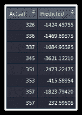

让我们通过从实际值中减去预测值来找出误差，并将这个误差作为新的一列添加到“Final_Data”中:

```
`(Final_Data$Actual- Final_Data$Predicted)->error`
```

```
cbind(Final_Data,error)->Final_Data
```

“最终数据”一瞥，其中也包含预测误差:

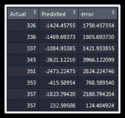

现在，我们继续计算“*均方根误差”*，它给出了所有预测的总误差

```
`rmse1<-sqrt(mean(Final_Data$error^2))` 
```

```
rmse1
```

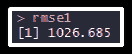

继续，让我们建立另一个模型，这样我们可以比较这两个模型的准确性，并确定哪个更好。

我们将在“train”集合上建立一个新的线性回归模型，但这一次，我们将从独立变量中删除“x”和“y”列，即钻石的“价格”由除“x”和“y”之外的所有列决定。

建立的模型存储在“mod _ regressive 2”中:

```
`lm(price~.-y-z,data = train)->mod_regress2`
```

预测结果存储在【结果 _ 回归 2】

```
`predict(mod_regress2,test)->result_regress2`
```

实际值和预测值合并存储在“最终数据 2”中:

```
`cbind(Actual=test$price,Predicted=result_regress2)->Final_Data2` 
```

```
as.data.frame(Final_Data2)->Final_Data2
```

让我们也把预测中的误差加到“Final _ data 2”

```
`(Final_Data2$Actual- Final_Data2$Predicted)->error2`
```

```
cbind(Final_Data2,error2)->Final_Data2
```

【Final _ data 2】一览:


求均方根误差得到总误差:

```
`rmse2<-sqrt(mean(Final_Data2$error^2))`
```

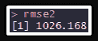

我们看到“rmse2”略微小于“rmse1”，因此第二个模型略微好于第一个模型。

### **分类:**

我们将使用“car_purchase”数据集来实现*递归分区*，这是一种分类算法。

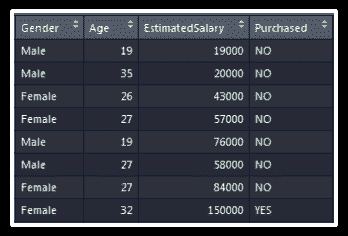

让我们使用“caTools”包中的“sample.split()”函数将数据分成“训练”和“测试”组。

```
`library(caTools)`
```

“已购买”栏中 65%的观察值将被分配“真”标签，其余的将被分配“假”标签。

```
`sample.split(car_purchase$Purchased,SplitRatio = 0.65)->split_values`
```

所有具有“真”标签的观察值将被存储到“训练”数据中，而那些具有“假”标签的观察值将被分配到“测试”数据中。

```
`subset(car_purchase,split_values==T)->train_data`
```

```
subset(car_purchase,split_values==F)->test_data
```

构建递归分割算法的时间:

我们将从加载‘rpart’包开始:

```
`library(rpart)`
```

“已购买”列将是因变量，所有其他列是自变量，即我们将确定此人是否购买了所有其他列的汽车。模型建立在“train_data”上，结果存储在“mod1”中。

```
`rpart(Purchased~.,data = train_data)->mod1`
```

我们来绘制结果:

```
`plot(mod1,margin = 0.1)` `text(mod1,pretty = T,cex=0.8)`
```

**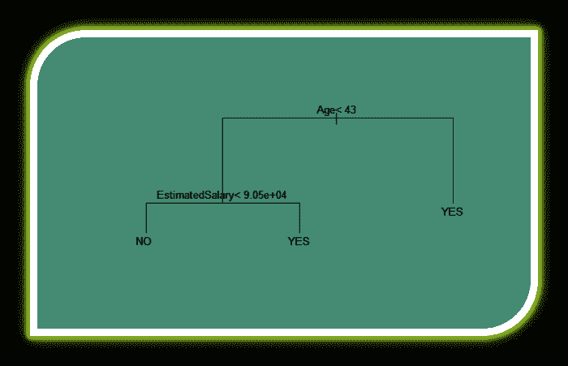**

现在，我们继续在“test_data”上预测结果。我们将构建的 rpart 模型“mod1”作为第一个参数，测试集“test_data”作为第二个参数，预测类型作为第三个参数的“class”。结果存储在“result1”对象中。

```
`predict(mod1,test_data,type = "class")->result1`
```

让我们使用 caret 包中的“confusionMatrix()”函数来评估模型的准确性。

```
library(caret) confusionMatrix(table(test_data$Purchased,result1))
```

**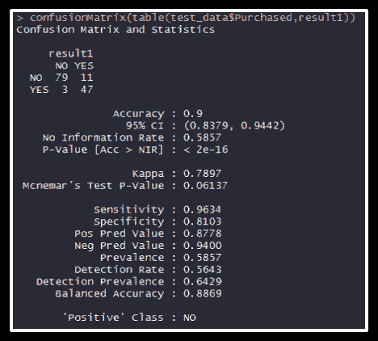**

混淆矩阵告诉我们，在这个人没有购买汽车的 90 次观察中，79 次观察被正确地分类为“否”，11 次被错误地分类为“是”。类似地，在这个人实际购买汽车的 50 次观察中，47 次被正确地分类为“是”，3 次被错误地分类为“否”。

我们可以用正确预测除以总预测即(79+47)/(79+47+11+3)来求出模型的精度。

### **K-均值聚类:**

我们将使用“iris”数据集实现 k-means 聚类:

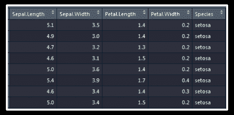

让我们删除“物种”列，创建一个新的数据集，该数据集仅包含“虹膜”数据集的前四列。

```
`iris[1:4]->iris_k`
```

让我们假设集群的数量为 3。“Kmeans()”函数接受输入数据和数据将被聚类的聚类数。语法是:kmeans( data，k)其中 k 是聚类中心的数量。

```
`kmeans(iris_k,3)->k1`
```

分析聚类:

```
str(k1)
```

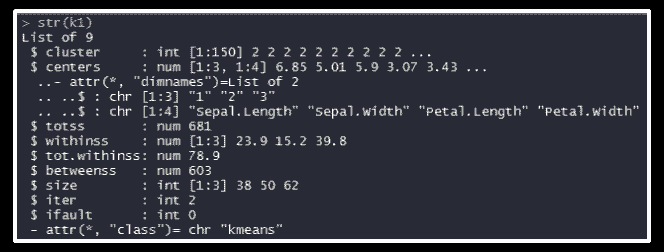

str()函数给出了 kmeans 的结构，其中包括各种参数，如 withinss、betweenss 等，分析这些参数可以了解 kmeans 的性能。

betweenss:平方和之间，即簇内相似度

内:平方和内，即簇间相似度

总相似度:所有类的所有相似度之和，即总的类内相似度

一个好的聚类将具有较低的“tot.withinss”值和较高的“betweenss”值，这取决于最初选择的聚类数“k”。

成为机器学习专家的时机已经成熟，你可以利用新的机会。这就给我们带来了这篇《 ***机器学习与 R*** 》博客的结尾。我希望这个博客是有益的。

*Edureka 有专门策划的 **[数据科学课程](https://www.edureka.co/data-science)** ，帮助你获得机器学习算法方面的专业知识，如 K-Means 聚类、决策树、随机森林、朴素贝叶斯。您将学习统计学、时间序列、文本挖掘的概念，以及深度学习的介绍。本课程的新批次即将开始！！*