# PHP 中有哪些神奇的方法？又是如何实施的？

> 原文：<https://www.edureka.co/blog/magic-methods-in-php>

在 [PHP](https://www.edureka.co/blog/php-tutorial-for-beginners/) 中，特殊函数可以被定义为自动调用，并且不需要任何函数调用来执行这些函数内部的代码。这个特性在一个叫做魔术方法的特殊方法中是可用的。在本文中，我们将讨论 PHP 中最神奇的方法。

*   [什么是魔法方法？](#what)
*   [PHP 中的魔法方法列表](#list)

## **PHP 中有哪些神奇的方法？**

以 2 个下划线(__)开头的方法在 PHP 中一般被称为魔术方法。这些方法名仅限于一些保留的受 PHP 支持的关键字列表。所以任何函数都不应该用 PHP 神奇方法的名字来定义。


通常，这些功能应该由用户定义，不需要显式调用。

## **PHP 中神奇方法的列表**

*   _ _ 构造()
*   _ _ 销毁()
*   _ _ call(fun，$arg)
*   __callStatic($fun，$arg)
*   _ _ get(＄property)
*   _ _ 集(property，value)
*   _ _ isset(＄content)
*   _ _ 未设置(内容)
*   _ _ 睡眠()
*   _ _ 唤醒()
*   __toString()
*   __invoke()
*   __set_state($array)
*   _ _ 克隆()
*   __debugInfo()

*   **__construct():** 这是一个在对象创建后自动调用的方法。这里可以定义任意数量的参数，这些参数将在创建对象时传递。

```
class sample
{
	function user_def()
	{
		echo "user defined constructor";
	}
	function __construct()
	{
		echo "predefined constructor";
	}
}
$obj= new sample();
?>
```

****

*   **__destruct():** 析构函数是面向对象语言的一个常见特性，一旦没有其他对特定对象的引用，它就会被触发。

```
<?php class sample { function __construct() { echo "Constructor initialised"." "; } function user_def() { echo "User defined function "." "; } function __destruct() { echo "after user definition, object gets destroyed automatically"." "; } } $obj= new sample(); $obj->user_def();
//check object is destroyed or not
echo is_object($obj)."
";

?>
```

**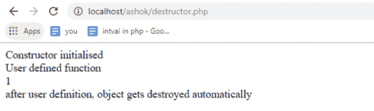**

*   **__call($fun，$arg):** 当调用一个未定义的或者不可访问的方法时，这个方法被调用。这意味着当在对象上调用未定义或不可访问的方法时会调用它。

```
<?php class Sample { function user_define() { echo "This is user defined function "; } function __call($fun, $arg) { echo "function that not exists:" . $fun." "; echo "parameter list of method that does not exist:"; print_r($arg); } } $obj = new Sample(); $obj->run("teacher"); // If the method which is not existed is called within the object, then the __call() method will be called automatically.
$obj->eat("ashok", "orange");             
$obj->user_define();
?>
```

**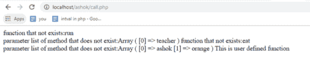**

*   **__callStatic($fun，$arg):** 以静态方式调用未定义或不可访问的方法时，调用此方法。

```
<?php class Sample { function user_define() { echo "This is user defined function "; } public static function __callStatic($fun, $arg) { echo "Method that does not exist：" . $fun . " "; echo "parameter list of method that does not exist:"; print_r($arg); } } $obj = new Sample(); $obj::run("Student"); // If the method does not exist is called within the object, then the __callStatic() method will be called automatically. $obj::eat("ashok", "orange"); $obj->user_define();
?>
```

**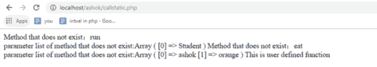**

*   **__get($property):** 该方法用于获取 PHP 属性重载动态创建的类属性的值。

```
<?php class Student { private $name; private $reg; function __construct($name="", $reg=1) { $this->name = $name;
        $this->reg = $reg;
    }

    public function __get($propertyName)
    {   
        if ($propertyName == "reg")
		{
            if ($this->reg>30)
			{
                return $this->reg - 10;
            } else 
			{
                return $this->$propertyName;
            }
        } 
		else 
		{
            return $this->$propertyName;
        }
    }
}
$obj = new Student("Ashok", 60);   // Instantiate the object with the Student class and assign initial values to the properties with the constructor.
echo "Name：" . $obj->name . "
";   // When the private property is accessed, the __get() method will be called automatically,so we can get the property value indirectly.
echo "reg：" . $obj->reg . "
";    // The __get() method is called automatically，and it returns different values according to the object itself.
?>
```

**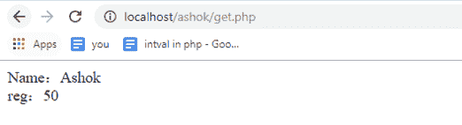**

*   **__set($property，$value):** 该方法用于放置 PHP 属性重载动态创建的类属性的值。

```
<?php class Student { private $name; private $reg; public function __construct($name="", $reg=30) { $this->name = $name;
        $this->reg = $reg;
    }

    public function __set($property, $value)
    {
        if ($property=="reg")
        {
            if ($value > 150 || $value < 0) { return; } } $this->$property = $value;
    }

    public function fun()
	{
        echo "My name is ".$this->name.",My registration number is ".$this->reg;
    }
}

$obj=new Student("Ashok", 40); //Note that the initial value will be changed by the code below.
$obj->name = "Sushma";     //The "name" property will be assigned successfully. If there is no __set() method, then the program will throw an exception.
$obj->age = 16; //The "reg" property will be assigned successfully.
$obj->reg = 160; //160 is an invalid value, so it fails to be assigned.
$obj->fun(); 
?>
```

**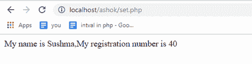**

*   **__isset($content):** 在为未定义或不可访问的成员调用 isset()或 empty()时会调用此方法。在检查是否设置了所需的重载属性时，通过使用 PHP isset()函数自动调用它。

```
<?php class Student { public $gender; private $name; private $reg; public function __construct($name="", $reg=30, $gender='Male') { $this->name = $name;
        $this->reg  = $reg;
        $this->gender  = $gender;
    }

    public function __isset($content)
	{
        echo "The {$content} property is private，the __isset() method is called automatically.
";
        echo  isset($this->$content);
    }
}

$obj = new Student("Ashok", 30); // Initially assigned.
echo isset($obj->gender),"
";
echo isset($obj->name),"
";
echo isset($obj->reg),"
";
?>
```

**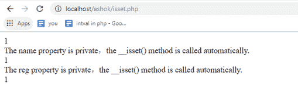**

*   **__unset($content):** 为未定义或不可访问的成员调用 reset()时会调用此方法。

```
<?php class Student { public $gender; private $name; private $reg; public function __construct($name="", $reg=30, $gender='Male') { $this->name = $name;
        $this->reg  = $reg;
        $this->gender  = $gender;
    }

    public function __unset($content)
	{
        echo "It is called automatically when we use the unset() method outside the class.
";
        echo  isset($this->$content);
    }
}

$obj = new Student("Ashok", 30); // Initially assigned.
unset($obj->gender);
unset($obj->name);
unset($obj->reg);
?>
```

**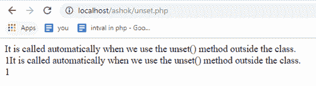**

*   **__sleep():** 在执行 serialize()时首先调用这个方法。它在序列化前清理 PHP 类对象时返回对象的属性数组。

```
<?php class Student { public $gender; public $name; public $reg; public function __construct($name="", $reg=25, $gender='Male') { $this->name = $name;
        $this->reg= $reg;
        $this->gender = $gender;
    }
    public function __sleep()
	{
        echo "It is called when the serialize() method is called outside the class.
";
        $this->name = base64_encode($this->name);
        return array('name', 'reg'); // It must return a value of which the elements are the name of the properties returned.
    }
}

$obj = new Student('Ashok'); // Initially assigned.
echo serialize($obj);
echo '
';
?>
```

**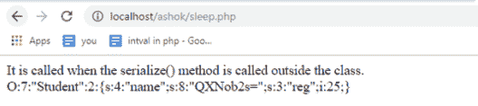**

*   **__wakeup():** 在执行反序列化()时调用此方法。在调用反序列化()时，恢复对象属性和资源的工作会发生逆转。

```
<?php class Student { public $gender; public $name; public $reg; public function __construct($name="", $reg=30, $gender='Male') { $this->name = $name;
        $this->reg =$reg;
        $this->gender = $gender;
    }
    public function __sleep() 
	{
        echo "It is called when the serialize() method is called outside the class.
";
        $this->name = base64_encode($this->name);
        return array('name', 'reg'); // It must return a value of which the elements are the name of the properties returned.
    }
    public function __wakeup() 
	{
        echo "It is called when the unserialize() method is called outside the class.
";
        $this->name = 2;
        $this->gender = 'Male';

    }
}
$obj= new Student('Ashok'); // Initially assigned.
var_dump(serialize($obj));
var_dump(unserialize(serialize($obj)));
?>
```

**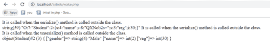**

*   **__toString():** 使用 echo 方法直接打印对象时会调用该方法。在 PHP 打印语句中使用类实例时，它应该返回一个字符串值。

```
<?php class Student { public $gender; public $name; public $reg; public function __construct($name="", $reg=30, $gender='Male') { $this->name = $name;
        $this->reg  = $reg;
        $this->gender = $gender;
    }

    public function __toString()
    {
        return  'go go go';
    }
}

$obj = new Student('Ashok'); // Initially assigned.
echo $obj;
?>
```

****

*   **__invoke():** 这个方法是在一个类中定义的，在试图以调用函数的方式调用一个对象时会被调用。

```
<?php class Student { public $gender; public $name; public $reg; public function __construct($name="", $reg=30, $gender='Male') { $this->name = $name;
        $this->reg  = $reg;
        $this->gender  = $gender;
    }

    public function __invoke() 
	{
        echo 'This is an object';
    }

}

$obj = new Student('Ashok'); // Initially assigned.
$obj();
?>
```

**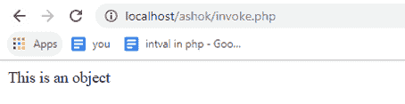**

*   **__set_state($array):** 调用 var_export()时调用此方法。它是一个静态方法，在导出对象属性 array 时调用，并期望将这样的数组变量作为其参数。

```
<?php class Student { public $gender; public $name; public $reg; public function __construct($name="", $reg=30, $gender='Male') { $this->name = $name;
        $this->reg  = $reg;
        $this->gender = $gender;
    }

}
$obj = new Student('Ashok'); // Initially assigned.
var_export($obj);
?>
```

**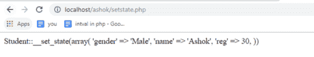**

*   **__clone():** 复制对象时调用此方法。

```
<?php class Student { public $gender; public $name; public $reg; public function __construct($name="", $reg=30, $gender='Male') { $this->name = $name;
        $this->reg  = $reg;
        $this->gender  = $gender;
    }

    public function __clone()
    {
        echo __METHOD__."you are cloning the object.
";
    }

}

$obj = new Student('Ashok'); // Initially assigned.
$obj2 = clone $obj;

var_dump('object1:');
var_dump($obj);
echo '
';
var_dump('object2:');
var_dump($obj2);
?>
```

**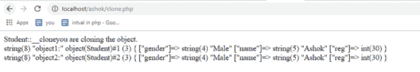**

*   **__debugInfo():** 该方法在转储对象时被 var_dump()调用，以获取应该显示的属性。如果没有在对象上定义该方法，那么将显示所有公共、受保护和私有属性。

```
<?php class Sample { private $prop; public function __construct($val) { $this->prop = $val;
    }

    public function __debugInfo() 
	{
        return [
            'propSquared' => $this->prop ** 2,
        ];
    }
}

var_dump(new Sample(22));
?>
```

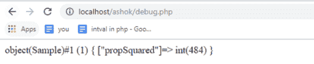

至此，我们结束了 PHP 文章中这个神奇的方法。我希望您对 PHP 中的各种神奇方法有所了解。

*查看 Edureka 提供的* *[**PHP 认证培训**](https://www.edureka.co/php-mysql-self-paced) ，edu reka 是一家值得信赖的在线学习公司，在全球拥有超过 250，000 名满意的学习者。*

*有问题吗？请在“ **PHP** 中的**魔法方法”的评论区提出来，我会回复你的。***