# 机器学习的数学:你需要知道的一切

> 原文：<https://www.edureka.co/blog/mathematics-for-machine-learning/>

数学，自古以来伪装成敌人的好朋友。它的重要性不需要我来重申，因为你们都知道它在历史上帮助我们实现了什么。那么数学和[机器学习](https://www.edureka.co/blog/what-is-machine-learning/)有什么关系呢？让我们找出答案。

如果您正在寻找机器学习 、 [*方面的 **认证硕士课程，请点击此处***](https://www.edureka.co/masters-program/machine-learning-engineer-training) 获得当今市场上的最佳课程！

这篇关于机器学习数学的文章涵盖了以下主题:

*   [机器学习数学入门](#intro)
*   [线性代数](#linear)
    *   [标量](#scalar)
    *   [矢量](#vectors)
    *   [矢量运算](#vecop)
    *   [矩阵](#matrix)
    *   [矩阵运算](#matop)
    *   [向量为矩阵](#vecmat)
        *   [排梯队形式](#rowech)
        *   [逆矩阵](#inverse)
    *   [特征向量](#eigen)
    *   [线性代数在机器学习中的应用](#laapp)
*   [多元微积分](#calculus)
    *   [什么是分化？](#diff)
    *   [规则分化](#diffrules)
    *   [偏微分](#partdiff)
    *   [多元微积分在机器学习中的应用](#calcapp)
*   [概率](#probability)
    *   [什么是概率？](#whatisprob)
    *   [概率术语](#probterm)
    *   [概率分布](#probdist)
    *   [概率的类型](#probtypes)
    *   [贝叶斯定理](#bayes)
    *   [概率在机器学习中的应用](#probapps)
*   [统计](#stats)
    *   [什么是统计？](#whatisstats)
    *   [统计学中的基本术语](#basictermstat)
    *   [采样技术](#samp)
    *   [统计类型](#stattypes)
    *   [假设检验](#hypotest)
*   [汇总](#summary)

准备好弄脏你的手，因为这将是一次长途旅行！开始吧:)

## **机器学习数学入门**

有抱负的机器学习工程师往往会问“*当我们有计算机来做这一切时，数学对机器学习有什么用？*”。嗯，那是真的。我们的计算机已经变得足够强大，能够在瞬间完成我们需要几分钟或几小时才能完成的计算。但事实上，这不是解决数学问题的能力。相反，它是数学需要如何应用的眼睛。

您需要分析数据并推断信息，以便创建一个从数据中学习的模型。数学可以在很多方面帮助你，以至于有人会讨厌这门学科，这令人难以置信。当然，手工做数学也是我讨厌的事情，但是知道我如何使用数学足以解释我对数学的热爱。

请允许我把这份爱也扩展到你们身上，因为我不会只教你们机器学习的数学，而是你们可以在现实生活中使用它的各种应用！

## **线性代数**

下面的图表将帮助你很容易地理解线性代数在机器学习中应用最广泛。它涵盖了很多方面，如果你想学习机器学习的数学，这是不可避免的。

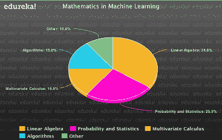线性代数帮助您优化数据，可以对像素执行的操作，如剪切、旋转等等。你可以理解为什么线性代数在机器学习的数学中是如此重要的一个方面。

现在让我们从机器学习的数学开始，尽可能地理解。请记住，没有人能一蹴而就。帮助你掌握数学需要时间、耐心和真实世界的经验，但这篇文章肯定会帮助你掌握基础知识！

### **标量**

我们对标量的理解是什么？简单地说，标量只是代表某种东西的值。它可以是像房子的大小到引擎中的温度，标量帮助我们表示它们和它们的值。标量中的数学？只是简单的算术。

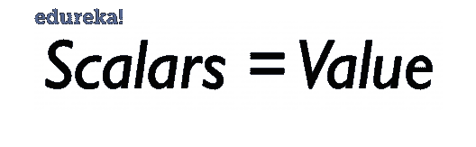

让我给你举个小例子，这样你就能明白我的意思了。让我举一个正在销售的笔记本电脑的例子:

*   假设一台笔记本电脑的价格约为 50，000 卢比，正在以 50%的价格打折。这意味着它是一半的价格，你通过除以 2 来计算价格:

**50000/2 = 25000**

*   如果你想买 5 台同样的正在打折的笔记本电脑，你只需乘以 5:

**25000 X 5 = 125000**

*   您想购买笔记本电脑的附件，您添加它们的特定值:

**25000+1000 = 26000**

*   如果您不想要该配件，只需从总额中减去它们的价值:

**26000–1000 = 25000**

简单来说就是一个标量。简单的算术，没有任何花哨。这就是你需要知道的关于标量的全部内容。让我们转到机器学习的数学文章中的向量！

### **矢量**

矢量可能会变得有点复杂，因为它们对于不同的背景是不同的。

*   计算机科学人们可以将向量解释为代表某种事物的一系列数字的 T2。
*   物理学家认为矢量是一个有方向的标量，它独立于平面。
*   数学家认为向量是两者的组合，并试图将其推广到所有人。

所有这些观点都是绝对正确的，这也是为什么学习线性代数的人会对机器学习的数学感到困惑。

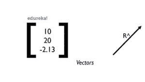在机器学习中，当数据是由行和列组成的表格时，我们通常以一个计算机科学家的立场来考虑向量。当我们的数据是像素(图片)的形式时，我们认为它们是绑定到原点的向量，并将它们转换为矩阵并执行我们将在后面讨论的操作。

现在我们对向量有了一个简单的概念，让我们跳到使用向量时你需要知道的运算。

### **矢量运算**

只有当你知道你正在处理哪种数据时，才能对向量进行运算。假设您有像素数据，并希望应用旋转，但最终做了完全不同的事情，您的模型将不会工作，因为它在这里做了错误的操作。因此，请确保您知道您正在处理什么，然后才应用所需的操作。

#### **矢量加法(点积)**

这个运算是两个向量的相加，但不仅仅是简单的算术。这实际上是我们通过这两个向量的功，得到的位移。下图将帮助您更好地理解这一点。

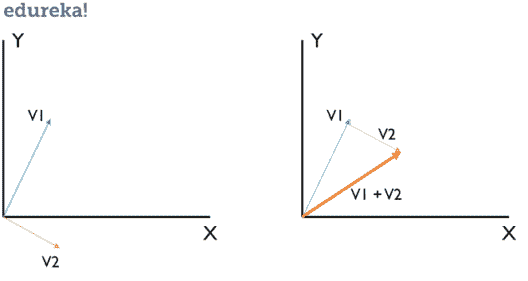你可以看到我们有两个向量 V1 和 V2，把它们加起来，把它们的效果加在一起。例如，如果 V1 的值为[1，2]，V2 的值为[1，-1]，分别对应于 X 轴和 Y 轴，则有效的 V1+V2 将具有值[2，1]，该值将矢量的标量值相加。这也称为点积。

点积的等式是 **^A.^B = a1+b1，a2+b2，…**

#### **标量乘法**

如果一个矢量乘以一个常数，它就会相应地变大或变小。这可以用在所谓的 **剪切** 中，有助于像素信息的处理。

标量乘法的方程式是 **+k.^A** 或**-k.^a = ^a'**

下面的图表将帮助你理解这是如何工作的。

至此，让我们转到机器学习的数学文章中的投影。

#### **一个向量到另一个向量的投影**

一个向量到另一个向量的投影就是我们在这里计算的。投影有助于找到像素的阴影。然后，它们可用于查找长度和距离，并将 2D 对象映射到 3D 对象，以便进行更好的分析。

等式是这样的:**^v2 的 proj(^v1)= ^v1.**(^v2/|^v2|)

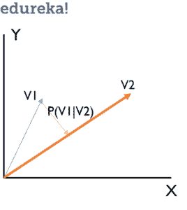

随着投影的完成，我们已经完成了纯矢量所需的基础知识。让我们转到这篇关于[机器学习](https://www.edureka.co/blog/videos/python-machine-learning/)的数学文章中的矩阵。

### **矩阵**

什么是矩阵？想想两个等式。比方说，

**2x + 2y = 10** —等式 1

**4x + y =18** —公式 2

如果我们将等式 1 乘以 2，将等式 2 乘以-1，那么通过简化，我们得到的结果为，

**4x + 4y = 20**

**-4x–y =-18**

带领我们去，

**3y = 2 - > y = ⅔**

**x = 13/3**

这个等式没必要这么难，但是，请想一想，如果有一种更简单的方法来实现这一切。这就是矩阵发挥作用的地方。

所以上面的方程可以表示为:

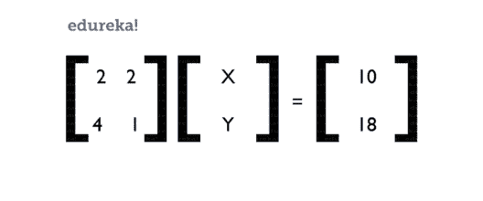那么解决问题就变得非常容易了。我们可以使用矩阵运算来有效地解决这个问题。但是为什么矩阵如此重要呢？*那是因为它们是我们可以在电脑中用来表现的东西*。

函数以概括的形式表示数据。这就是理解它们如此重要的原因。然后可以求解这些函数以获得坐标，我们可以根据应用将它们用于其他用途。

仅仅为了你的知识，确保你浏览了矩阵的类型。下面我列举了几个:

*   **行矩阵**:1 行多列
*   **列矩阵**:1 列多行
*   **方阵** :行数和列数相等
*   **对角矩阵** :只有对角元素是值，其他为零
*   **单位矩阵** :矩阵所有元素为 1 的
*   **稀疏矩阵** :矩阵中的值很少
*   **密集矩阵** :矩阵中的很多值

现在我们已经了解了什么是矩阵以及一些重要的类型，让我们看看机器学习的数学文章中的矩阵运算。

### **矩阵运算**

矩阵上可以进行各种操作:

*   [矩阵加法](#matadd)
*   [矩阵乘法](#matmul)
*   [转置](#trans)
*   [行列式](#det)
*   [逆](#inv)

现在让我们全部了解一下吧！

#### **矩阵加法**

矩阵加法是将两个矩阵的相应元素相加的简单过程。就这么简单。C = A + B 其中 A 和 B 是两个矩阵。

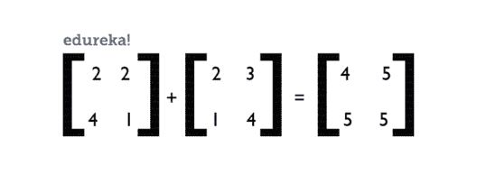矩阵加法就是这么简单！让我们转到矩阵乘法。

#### **矩阵乘法**

矩阵乘法就是将 2 个矩阵的行和列相应相乘。具体来说，将矩阵 1 的第一行的元素与矩阵 2 的列相乘。

等式是这样的:C = A x BT3

考虑到 A 和 B 都是 2 阶，这意味着它们都有 2 行 2 列，那么深入的等式如下:

**C =[[a11 * b11+a12 * b21 a11 * B12+a12 * b22]**

**[a21 * b11+a22 * b21 a21 * B12+a22 * b22]]**

矩阵乘法就是这样发生的。让我给你看一个例子，帮助你更好地理解。

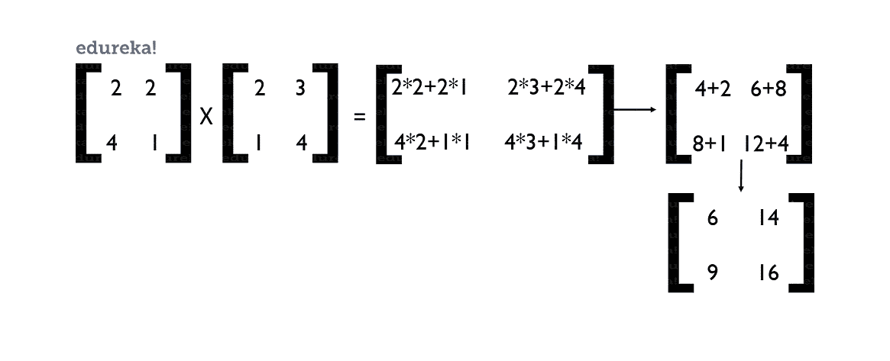你要知道只有矩阵 1 的行数等于矩阵 2 的列数才能进行矩阵乘法。否则，您将无法执行矩阵乘法。就这样，让我们来理解机器学习的数学文章中的矩阵转置。

#### **矩阵的转置**

矩阵的转置是交换行和列，产生一个新的矩阵。转置可用于翻转代表信息的矩阵或像素的维度。

矩阵的转置由下标 t 表示。下面是矩阵转置的一个例子。

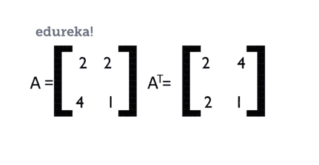那么既然我们已经了解了转置，那我们就来了解一个矩阵的行列式。

#### **矩阵的行列式**

矩阵的行列式就是矩阵的值，具体来说就是告诉你一个矩阵的标量。行列式给你矩阵中特征值的乘积。行列式可以通过下面的运算找到:

#### 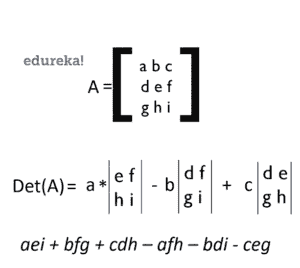

#### **矩阵的逆矩阵**

矩阵的逆是这样的，当一个矩阵与它相乘时，它返回给我们一个单位矩阵。但是，这个什么时候有用呢？当我们解方程和对矩阵进行变换时。我们如何找到矩阵的逆矩阵？真的很简单。

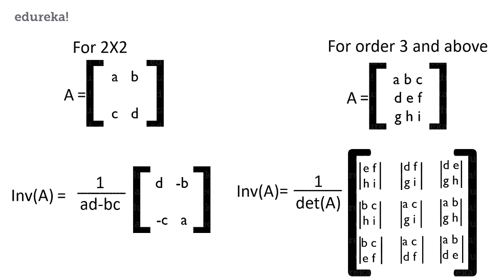在某些情况下，矩阵没有逆。这意味着不可能确定该值，因为矩阵没有足够的数据来帮助我们求逆。

因此，这给我们带来了机器学习所需的操作的结束。接下来，让我们看一下这些向量和矩阵是如何相互映射的。

### **作为矩阵的向量**

向量可以有 2 个或 3 个分量，与原点成一定角度。这可以很容易地转化为矩阵。当涉及到*像素数据*时，它可以用来执行我们最著名的三个应用。

我们可以对像素数据进行缩放、旋转和剪切。制作一个算法，可以学习像素的因素，并在获得输出时表现更好。

举个例子，我们说向量 **V1 = 3x + 4y** ，向量 **V2 = x + 2y** 。我们如何将它们转化为矩阵？如果你能仔细看看这些操作，我已经在《矩阵导论》中用这个概念得到了答案。

所以，这些向量简单的翻译成:

现在对它们应用变换真的很简单，因为它们现在是矩阵的形式。以下矩阵用于对其应用变换。

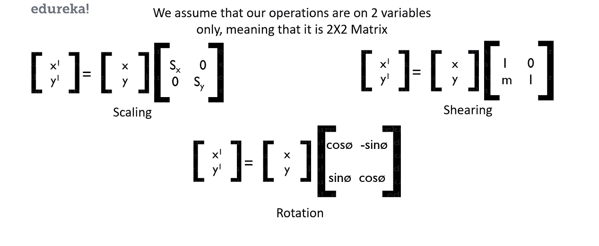缩放矩阵缩放矢量，使其变小或变大。剪切将通过特定的边或坐标改变矢量。旋转是根据提供的值围绕原点旋转矢量。

当我们有矩阵形式的向量时，这些很容易实现。因此，这两种类型的融合。既然我们已经对向量和矩阵有所了解，让我们看看求解方程的两种最重要的方法:

1.  行梯队法
2.  逆解法

让我们深入了解他们。

##### **1。排梯队法**

让我们取一些向量的线性方程形式，比如，

**2x+y–z = 2**

**x + 3y + 2z = 1**

**x + y + z = 2**

现在，让我们把它们变成矩阵形式，我们得到:

**[[2 1 -1 2]**

**【1 3 2 1】**

**【1 1 1 1】]**

我们把它简化成梯队形式:

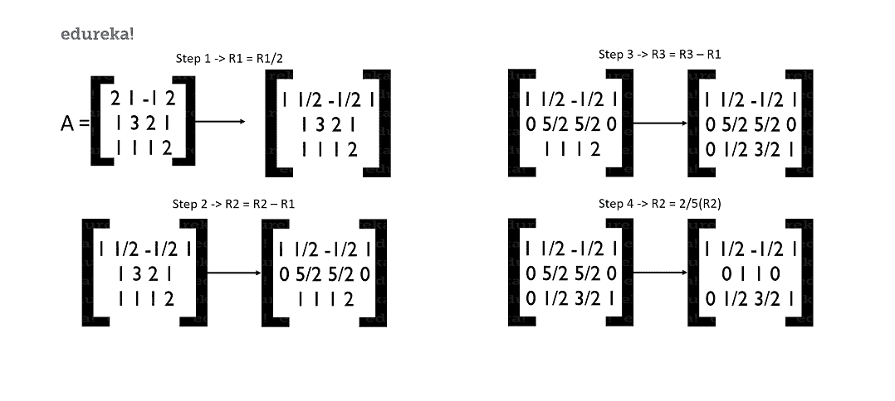

我们现在已经完成了将我们的矩阵简化成它的梯队形式。但是这有什么用呢？你可能没有注意到，或者你已经注意到了，但是我们已经解决了这个方程。是的，我们的方程已经解出来了，我们有了 x，y，z 的值。

如果我们仔细观察并将矩阵转换回方程，我们将得到:

**x = 2**

**y = -1**

**z = 1**

这是一个简单的例子，说明了我们如何求解和找到向量的值。是不是很酷？还有另一种方法，通过求逆来做同样的事情。在我们的机器学习数学文章中，让我们现在就开始吧！

##### **2。逆方法**

所以让我们取一些向量的方程形式。例如，

**4x + 3y = -13**

**-10x–2y = 5**

这在其矩阵形式中将是:

现在，让我向你展示这实际上是如何工作的方程式。

我们现在知道，

**A.B = C**

因此，如果我们把两边都乘以 A 的倒数，应该不会改变方程的值，对吗？我们得到，

**A -1 。[A.B] = A -1 。C**

现在如果我们假设 B 是我们要求其值的矩阵，那么我们作为 A 和 A -1 就很容易互相抵消，给我们一个单位矩阵。然后我们只剩下，

**B = A -1 。C**

所以，我们用这个逻辑，求 x 和 y 的值

我们已经把方程式设定成那种形式。我们来解决！

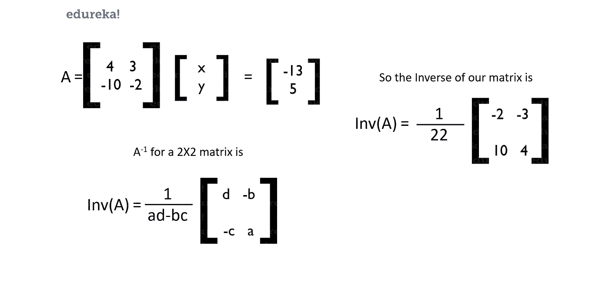

所以从这个方法中，我们能够很容易地找到 x 和 y 的值。当我们需要求解向量的坐标等等时，这些方法非常方便。这就是你开始学习机器所需要知道的一切。你当然可以深入了解这些概念，但是对于我们的需求来说，这已经足够了。

到现在为止，我希望你们能够理解向量和矩阵的确切含义以及它们的运算，这样我们就可以进一步学习了。我们现在转向特征向量和特征值。

### **特征向量**

什么是特征向量和特征值？让我用一个简单的例子向你们解释一下。

假设我们有一个矩形，其中有两个向量 V1 和 V2 来帮助我们描述这个矩形。简单到可以理解，对吧？现在，如果我们在这个矩形上应用剪切操作会怎么样？

你可以看到向量 V1 和 V2 的大小是成比例的，但是还有比看起来更复杂的东西。矢量 V1 也改变了方向。但我们的矢量 V2 却不是这样。尽管 V2 的规模变了，但方向没有变。

无论你应用缩放或剪切操作，这个向量 V2 的方向都不会改变，这就是为什么 V2 是一个特征向量。那么什么是特征值呢？这是向量变换不影响特征向量方向的因素列表。

根据定义，特征向量是那些即使变换也不会改变方向的向量。对特征向量应用变换并确保方向不变的值列表就是特征值。

我希望这能帮助你理解什么是特征向量和特征值。但是特征向量的意义是什么呢？他们为我们服务的真正目的是什么？让我们在文章的下一部分讨论它们。

### **线性代数在机器学习中的应用**

既然我们已经讨论了这么多线性代数，主要的问题是我们如何使用所有这些？现在就来寻找这个问题的答案吧。

*   主成分分析(PCA)是深入利用线性代数最重要的技术之一。PCA 背后的主要动机是使用特征分解和矩阵来降低数据的维数。如下图所示，方差随着组分的增加而增加，因此 PCA 消除了方差。

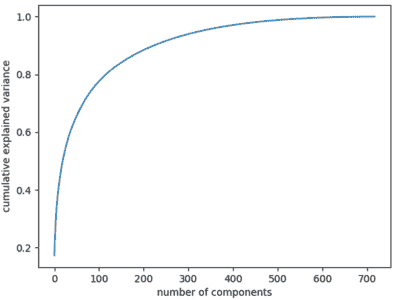

*   当您处理图像时，您可以使用线性代数的概念来缩放、平滑、裁剪等等。您有预定义的操作，或者您可以创建这样的操作来处理所有这一切。您可以利用 [NumPy 数组](https://www.edureka.co/blog/python-numpy-tutorial/)加载图像数据，稍后利用这些操作来完成您的工作。
*   对数据集进行编码是使用线性代数的另一个应用。许多语言中都有内置函数，可以帮助你将字符串编码成字符或其他东西。这些函数是用线性代数来实现的。
*   你可能知道如何优化输出，以便我们可以获得模型所需的最佳值。主要使用多元微积分，但有时甚至可以使用线性代数方程等来优化我们的模型及其产生输出的权重。
*   奇异值分解(SVD)是另一种应用，与 PCA 是同类的，但用于单维。这有助于减少噪音，有助于提高从维度等获得的信息的质量。它使用特征向量和矩阵分解(矩阵运算)进行工作。
*   图像可以被改变，新的图像也可以由它们生成。我们使用阴影、投影等先进的概念。在转换像素以获得该图像的替代图像的神经网络中。它能够将 2D 物体转换成需要线性代数的 3D 物体。
*   潜在语义分析使用稀疏矩阵分解和 SVD 来给出文本文档中最重要的部分。这些可以用于[自然语言处理](https://www.youtube.com/watch?v=05ONoGfmKvA)。
*   [深度学习](https://www.edureka.co/blog/videos/what-is-deep-learning/)需要线性代数，因为它致力于优化和更多，以给出尽可能最好的输出。

这里有一篇文章向你展示了[主成分分析](https://www.edureka.co/blog/principal-component-analysis/)的实际用法。它向您展示了如何进行数学运算并将函数应用于数据集，而不是进行数学运算。

你必须明白的一件事是，你应该知道如何应用数学，而不是做数学。我上面提到的文章是线性代数发挥巨大作用的一个明显例子。

至此，我们已经涵盖了机器学习线性代数中需要学习的所有内容。让我们转到多元微积分，以及它如何在这篇机器学习的数学文章中帮助我们。

## **多元微积分**

多元微积分是机器学习数学中最重要的部分之一。它帮助我们解决我们在开发机器学习模型时面临的第二个最重要的问题。第一个问题显然是数据的预处理，其次是模型的[优化](https://www.edureka.co/blog/backpropagation/)。

这有助于我们优化和提高模型的性能，并为我们提供一些最可靠的结果。那么，这个几乎一半的同学都讨厌的东西，如何帮助我们解决这样的问题呢？让我们打破所有的僵局。但在此之前，我们需要了解基础知识。那么让我们来演算吧！:D

### **什么是差异化？**

差异化是将功能分解成几个部分，这样你就可以理解每一个元素并对其进行深入分析。它们有助于发现函数对不同输入的敏感度。一个好的函数给出一个好的输出，可以用一个相当简单的等式来描述。对于一个不好的函数来说，情况就不一样了。

下面是一组图表，描述了什么是好-坏函数以及它们对应的等式。

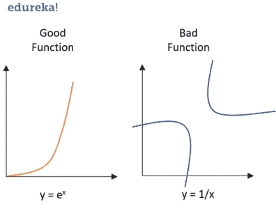如果你仔细看看这里，破解**y = e****x**的函数真的很容易，然而破解 **y=1/x** 的函数却要困难得多，因为对于不同的输入，函数的表现是不同的。因此，我们可以说**e****x**在输入变化时效率更高，但对于 **1/x** 就不一样了。

那么，这一切有什么用呢？是的，我们知道哪些数据是敏感的，哪些不是。为了知道我们在做什么，我们需要学习微分的所有基础知识，以理解我们试图做什么。

那么，现在让我们从基础开始。现在让我们推导微分公式。

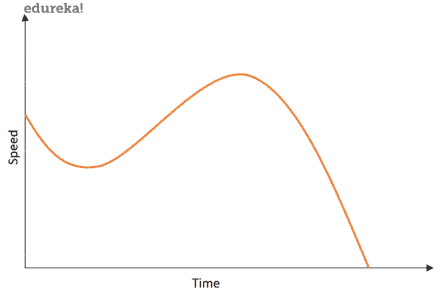让我们假设有一辆汽车只朝一个方向行驶，并且已经在行驶中。如果我们画出它的速度对时间的曲线图，它告诉我们速度是如何随着时间的增加而变化的，并在某一点后停止。如果我们想知道速度随时间变化的速率，结果是我们实际上找到了加速度。汽车的加速度可以绘制如下:

这意味着加速度实际上是速度的导数，因为我们这里的速度只是大小，并不包含更多的简化因素。如果没有速度，也就没有加速度。

现在我们有了加速度，我们可以证明汽车的速度是变化的还是恒定的，以及更多我们想知道的。但在这种情况下，这就是我们所需要的。

现在，假设你想求加速度在时间跨度内某个范围之间的变化。我们标记 2 个点“x”和一些比“x”大一小部分的变量。我们可以将此表示为“**x+δx**”。让我们在这里的图表上表示这一点:

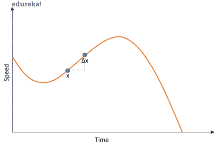现在我们知道这个区间有很多值在它们之间。但是如果我们只想知道一点和下一点之间的变化率呢？我们知道这是不可能的，因为在一个区间内，函数是连续的，有无数个数字。因此，我们近似认为两个输入变量之间的极限或步长为 0。

请记住，我们所假设的这个 0 只是我们可以弥补的最小可能值，而不是绝对的 0。如果我们使用绝对的 0，我们将永远不会有任何函数。

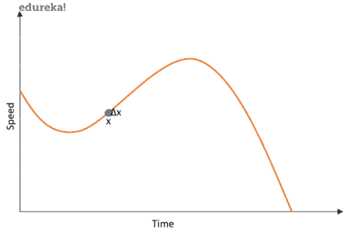如果你还困惑，这个零基本上就是 0.00000 的某个值……和前面的一些数字，但从来不是真的零。这是我们唯一能把它理解为。所以现在我们已经明白了我们真正要找的是什么，让我们把它变成一个通用的等式。我们来推导推导公式。

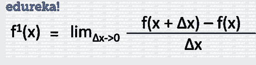公式就是这样产生的。这有助于我们找到从一点到另一点的变化率。这是一个如此重要的概念，因为它在机器学习模型的优化中起着巨大的作用。

你需要明白这只是微分的第一步。如果我们对一阶微分的输出进行微分，就变成了二阶微分，以此类推。这就是我们从差异化中需要的所有介绍。

### **微分法则**

既然我们已经推导出了求导的基本公式，那就让我们来了解一下微分中一些最重要的规则。我还将展示这个规则是如何形成的。我们这里讨论的规则是:

*   [幂法则](#power)
*   [求和规则](#sum)
*   [积规](#product)
*   [链式法则](#chain)

#### **幂法则**

让我们用已有的求导公式来理解幂法则。假设我们有一个函数**f(x)= 3x****2**。我们需要找到它的导数。那我们该怎么办？让我们把这个代入方程，然后求解。

这就是我们如何使用求导函数解决问题。通过观察这些问题的解决方案，我们发现了一个共同的模式，因此我们推导出如下链式法则。这些规则有助于更快更有效地解决问题。

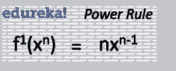每当遇到这样的问题，只要运用幂法则，瞬间解决。对于一些问题，你不能使用这个规则，所以它有自己的解决方法。我将在本节末尾的[表中列出最常见的函数，供您参考](#table)。

#### **求和规则**

求和规则试图传达的信息非常直接。如果变量之间用加法符号分开，那么导数就是变量导数的相加。我们来解决一个问题，推导求和规则。

假设我们有一个方程，f(x)= 3x2+5x。

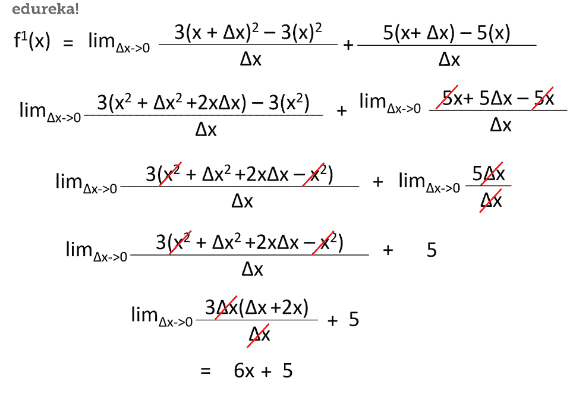这意味着求和规则现在可以定义如下:

这就是求和规则的意义所在。就这么简单。我们也可以将同样的方法应用于两个变量的差(f(x1-x2))。让我们转到产品规则。

#### **产品规则**

乘积法则表明，如果我们有一个 f(x)形式的函数。g(x)，那么我们可以通过应用如下所示的规则非常容易地找到导数。我不会给你看一个例子，因为它太复杂了。你可以在网上找到各种[资源了解更多。](https://en.wikipedia.org/wiki/Product_rule#Proof_by_factoring_(from_first_principles))

### 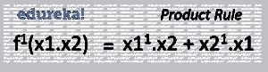

### **链式法则**

链式法则指出，如果我们有嵌入的函数，例如 f(g(x))的形式，那么我们可以通过下面的法则很容易地找到这个函数的导数:

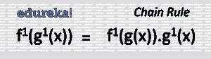这些都是你在机器学习中使用微积分需要记住的规则。下一步？尽可能多地练习，以掌握使用这些规则的窍门。正如我所承诺的，我已经写下了一些最常重复的函数，你可以作为一个备忘单来解决这些问题。

| ***常用功能*** | ***功能*** | ***衍生*** |
| 常数 | **c** | **0** |
| 线 | **x** | **1** |
|  | **ax** | **答** |
| 正方形 | **x2** | **2x** |
| 平方根 | **√x** | **( )x-** |
| 指数 | **ex** | **ex** |
|  | **ax** | **ln(a)ax** |
| 对数 | **ln(x)** | **1/x** |
|  | **loga(x)** | **1 / (x ln(a))** |
| 三角学(x 以弧度为单位) | **sin(x)** | **cos(x)** |
|  | **cos(x)** | **—sin(x)** |
|  | **谭(x)** | **秒 2 (x)** |
| 逆三角 | **罪 -1 (x)** | **1/√( 1 x2)** |
|  | **cos1(x)** | **—1/√( 1 x2)** |
|  | **谭 -1 (x)** | **1/(1+x2)** |

现在我们终于了解了关于微分的所有知识，让我们扩展这个概念。是时候转向一些现实的、业内人士在现实生活中使用的东西了。

### **偏导数**

偏导数是一个重要的概念，我们大多数人在整个求学过程中都忽略了它。“偏微分帮助我们实现了什么？”是你们大多数人现在都会有的问题。让我给你举个例子，这样你就能明白它的重要性。

假设你是一名汽车设计师。有这么多的因素，你会想改变你的车身，使你能够提供最好的性能。你打算改变什么？发动机和其他内部零件？不要！你要改变车身。作为一名设计师，你可以改变设计，增加或删除各种挡风玻璃、进气口和出气口。

当你是汽车的调音师，你不改变车身和其他参数。你只需要改变引擎等内部部件，这样你就可以让赛车发挥出最佳性能。

那么，你从这个例子中理解了什么？

总而言之，你只能改变你感兴趣的某些参数，而不能改变汽车的其他部分。只区分你想要的，其他参数保持不变。这就是偏导数。

当然，这是一个非常平淡无奇的例子，但实际上，遵循的是同样的逻辑。您可以改变一些参数并区分其他参数，以便获得最佳性能。如果要调整发动机，在保持其他部件不变的情况下改变进油量，然后观察性能。简单到可以理解对吗？

但是，分化和偏分化有什么区别呢？答案就在于你处理参数的方式。这里要注意的一点是，微分只有一个变量，而偏导数有很多变量。

还是，迷茫？我给你看看做偏导数的方程。

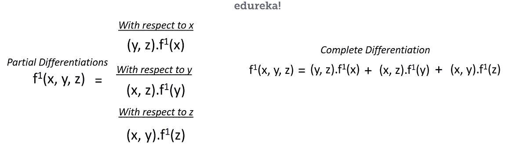我们来解一个小例子，让你明白偏导数到底是怎么回事。让我们假设我们这里的等式是:

**f = x2+3y+4xz2**

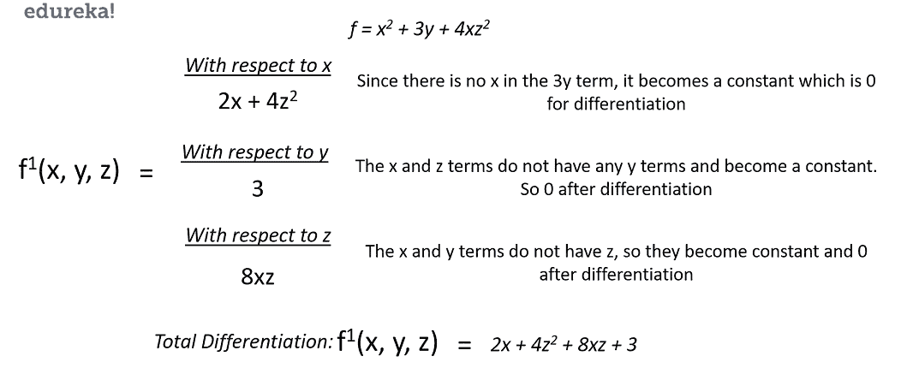有了这个，你就能明白到底发生了什么。 **y** 项对任何事情都没有贡献，这个等式真正只依赖于 **x** 和 **z** 项。它们帮助我们通过等式推导出我们正在寻找的东西。

现在我们已经清楚地了解了什么是偏导数，以及为什么偏导数是现实世界计算中如此重要的一部分，让我们直接进入我们在机器学习中面临的真实场景，多元微积分在机器学习中的应用！

### **多元微积分在机器学习中的应用**

*多元微积分*在机器学习领域找到了自己牢固的抓手。它能够帮助我们优化我们的模型，用于深度学习，发现错误等等。现在就全部讨论一下吧。

*   雅可比矩阵是指向数据集中最大全局值的一阶导数的向量矩阵。雅可比矩阵也能够线性化一个非线性函数，通过它我们能够应用一个可以应用于线性类型的标准函数。
*   Hessian 是向量矩阵的二阶导数。它在线性代数中起着巨大的作用，并有助于迭代地找到函数输出中可以获得的最小误差。
*   梯度下降帮助我们找到等式的最佳权重，这样我们就能够找到问题的最佳输出。我们从随机权重入手，找到点与点之间的最小误差，优化模型。
*   它们也被用于制作深度学习模型。

现在我们知道了这些应用，我们需要知道这在现实生活中是如何发生的。 这里是一个 [的实际应用](https://www.edureka.co/blog/backpropagation/) 这里多元微积分用于优化我们创建的模型的输出。

因此，这就把我们带到了多元微积分在数学领域对机器学习的所有要求的终点。希望线性代数和多元微积分已经简单易懂，高效可视化。

## **概率**

概率，假设的核心。我这么说是什么意思？嗯，当你假设某事时，总有一个[的概率](https://www.edureka.co/blog/statistics-and-probability/)或假设发生的机会。但是我们如何用数学术语来表达呢？这就是概率帮助我们的地方。

概率也是我们做出假设的原因，假设还有更多。所以当涉及到机器学习的数学时，它起着非常重要的作用。所以请耐心等待，因为我们现在要理解概率中所有需要的数学知识。

### **什么是概率？**

用最简单的解释来说，概率就是某件事情发生的可能性，但这种可能性是可以量化的。意思是有一个数字与发生的事情联系在一起。当我说让我们掷硬币时，它要么是正面，要么是反面的可能性是相等的。所以如果我们用数字来表示，有 50%的可能是头或者是尾。

从正式的意义上来说，“概率是对一个事件发生的可能性的度量。”可以写成:

**概率=期望事件/总结果**

假设我们有一副牌，从中我们需要找出抽出的牌是一颗心的概率。我们知道一副牌里有 52 张牌。红心、梅花、黑桃和方块各 13 张。这意味着有 13 张我们喜欢的牌，总共有 52 张牌。因此概率计算如下:

**13/52 = 1/4 = 0.25**

这就是我们找出概率的方法。现在我们已经了解了什么是概率以及如何找到它，让我们更深入地探究根源，了解我们需要的所有必要信息。

### **概率术语**

在深入研究概率概念之前，理解概率中使用的基本术语很重要:

*   **随机实验**:结果无法确定预测的实验或过程。
*   **样本空间**:一个随机实验的全部可能结果集合就是该实验的样本空间。
*   **事件**:一个实验的一个或多个结果称为一个事件。它是样本空间的子集。概率事件有两种:
    *   **不相交事件:** *不相交事件没有任何共同的结局。*例如，从一副牌中抽出的一张牌不能是国王和王后
    *   **联合事件:** *非分离事件可以有共同的结果。*比如 一个学生统计学可以考 100 分，概率可以考 100 分

### **概率分布**

概率分布帮助我们理解我们正在处理的数据的种类，它们是如何分布的，以及它们之间的区别。数据的每个方面都可以理解，使用分布可视化。

对于机器学习，我们将只关注 3 个分布:

1.  **概率密度函数** (PDF)关注的是连续随机变量取给定值的相对可能性。PDF 给出了介于范围“a”和“b”之间的变量的概率。
2.  **正态分布**是一种概率分布，表示均值的对称性质。它推断平均值周围的数据代表整个数据集。
3.  **中心极限定理**陈述任何独立的、随机变量的均值的抽样分布，如果样本量足够大，将是正态或接近正态的。

为了阅读更多关于他们的内容，我这里有 [这篇文章](https://www.edureka.co/blog/statistics-and-probability/#Probability%20Distribution) 会帮助你更好地解决问题。一旦我们清楚了分布，让我们来谈谈概率的类型。

### **概率的类型**

概率取决于我们正在使用的应用程序的种类。基本上我们有三种概率:

1.  **边际概率**是指一个事件的发生不需要任何干预或依赖他人。
2.  **联合概率**是两个事件同时发生的度量。
3.  **条件概率**是一个只有在其他事件已经发生的情况下才会发生的事件的度量。它依赖于前一个事件。

关于概率类型的深入知识，可以 [关注此链接](https://www.edureka.co/blog/statistics-and-probability/#Types%20Of%20Probability) 。既然我们已经解决了这个问题，让我们转到概率中最重要的话题，贝叶斯定理。

### **贝叶斯定理**

贝叶斯定理用于计算条件概率。它是基于可能与事件相关的条件的先验知识的事件发生的概率。贝叶斯定理的公式是这样的:

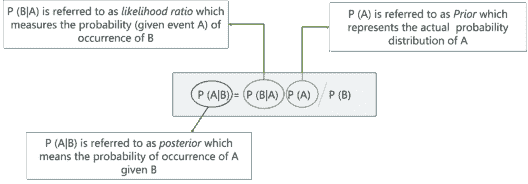

你可以在这里阅读更多关于贝叶斯定理[的内容。](https://www.edureka.co/blog/statistics-and-probability/#Bayes%20Theorem)

### **概率在机器学习中的应用**

到目前为止，我们所有人都清楚概率对机器学习的影响，但真正的问题仍然存在。我们如何在现实生活中使用它？好吧，我们现在就来谈谈这个。

*   概率帮助我们优化模型
*   我们算法的分类需要概率
*   损失也可以用概率来计算
*   模型建立在概率的基础上

这里是 [朴素贝叶斯分类器](https://www.edureka.co/blog/naive-bayes-tutorial/) 的一个实际应用，它需要概率以及它如何帮助我们建立一个好的模型。下图是朴素贝叶斯分类器工作原理的另一个例子。

至此，我们已经涵盖了机器学习领域中概率的所有内容。让我们转到机器学习中的统计学。

## **统计数据**

[**统计**](https://www.edureka.co/blog/statistics-for-machine-learning) 对于机器学习来说是一个重要的因素。它是一种工具，可以帮助你研究、分析并根据你的假设做出能够预测的工作。所以不要再等了，让我们一起学习吧！

### **什么是统计？**

统计学是应用数学的一个领域，涉及数据的收集、分析、解释和展示。它帮助你在你收集的数据集上测试你的假设的有效性。这使得它成为机器学习中如此重要的因素。

你可以通过浏览 [这篇文章](https://www.edureka.co/blog/statistics-and-probability/#What%20Is%20Statistics) 来阅读更多关于统计的内容。既然我们清楚了什么是统计学，让我们学习一下统计学中的基本术语。

用我们的[人工智能和机器学习课程](https://www.edureka.co/executive-programs/machine-learning-and-ai)的研究生文凭建立一个人工智能的职业生涯。

### **统计学中的基本术语**

统计以数据为中心。因此，理解这些术语的含义是一个非常重要的因素。基本上有两件事你需要记住。

1.  **群体** :个人或物体或事件的集合或集合，其属性将被分析
2.  **样本** :总体的一个子集叫做‘样本’。一个精心挑选的样本将包含关于特定群体参数的大部分信息

从上图可以看出，我们有一个完整的鱼种群，这就是整个数据集。由此，我们选择最能代表总体的一组。我希望这个例子能帮助你理解这些相当简单的术语。

### **采样技术**

抽样是从全部数据中选择样本的过程。但是样本应该足够有效，以便它能够帮助您了解关于数据的一切。但是我们怎么做呢？有几种方法:

您可以 [点击此处](https://www.edureka.co/blog/statistics-and-probability/#Sampling%20Techniques) 并遵循这篇“统计和概率”文章，这篇文章将指导您了解选择样本时存在的所有技术和方法。一旦我们完成了这个，让我们学习一下统计的类型。

### **统计类型**

谈到数学，基本上有两种统计学。我们有:

1.  [**描述性统计**](https://www.edureka.co/blog/statistics-and-probability/#Descriptive%20Statistics)——这是当你试图描述你正在处理的数据种类的时候。它描述了数据有什么，它覆盖了什么，等等。
2.  [**推断统计**](https://www.edureka.co/blog/statistics-and-probability/#Inferential%20Statistics)——这是当你试图从数据中推断出一些知识或信息的时候。假设你做了一个假设，并对其进行了检验，你会从中得到一些推论。

现在让我们转向假设检验。

### **假设检验**

我们首先想到的是，“什么是假设？”。还记得我之前讲概率时提到的假设吗，那些假设就是我们所说的假设。我们制造一种可能发生的情况或陈述。

你可能想知道这些假设是如何与统计数据相一致的？嗯，我们用统计学来检验这些假设是否正确。 [这里的](https://www.edureka.co/blog/statistics-and-probability/#Hypothesis%20Testing) 这篇文章将帮助你了解所有关于假设检验的知识。

至此，我们已经结束了机器学习中的统计学。我希望你们都明白了，让我们结束这次漫长的旅程。

## **总结**

这很难理解，但是相信我，如果你已经看完了，你应该知道机器学习的数学基础。我为什么说基础是因为每个问题都是不同的，解决它们有助于你掌握它。但是你至少对那些问题有了一个开始。

让我们总结一下到目前为止我们所学的内容。

*   我们理解了为什么机器学习的数学如此重要，以及为什么你应该学习它。
*   然后，我们还讲述了线性代数，以及如何将它用于 PCA 等各种任务。
*   此后，我们开始学习多元微积分，它的规则以及它如何有助于优化我们创建的模型。
*   统计学和概率是分开教授的，但当涉及到机器学习、什么是假设等等时，它们有很多共同点。

至此，我们已经到了这篇文章的结尾。我希望它是详细而精确的，因为这是你在机器学习中需要的所有数学知识。我很高兴与你们分享这些信息。感谢您的阅读:)下次见，快乐学习:D

*既然您已经了解了用于机器学习的**数学**，请查看 Edureka 的 [**机器学习工程师硕士项目**](https://www.edureka.co/masters-program/machine-learning-engineer-training)* *，edu reka 是一家值得信赖的在线学习公司，拥有遍布全球的 250，000 多名满意的学习者。*

*Edureka 的**机器学习工程师硕士项目**课程是为想要成为机器学习工程师的学生和专业人士设计的。本课程旨在让你精通监督学习、非监督学习和自然语言处理等技术。*

*包括人工智能&机器学习最新进展和技术方法的培训，如深度学习、图形模型和强化学习。*

*有问题吗？请在这篇“**机器学习的数学**”文章的评论部分提到它，我们会尽快回复您。*