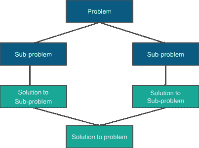
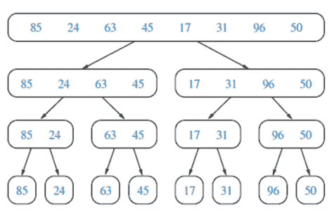
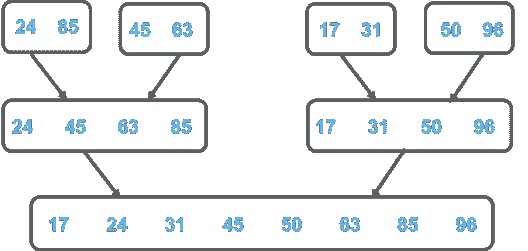

# 如何在 C 中实现归并排序？

> 原文：<https://www.edureka.co/blog/merge-sort-in-c/>

合并[排序](https://www.edureka.co/blog/sort-function-in-cpp/)是划分&征服算法的最好例子之一。这篇文章将帮助你深入理解 C 语言中的归并排序。本文将涉及以下几点:

*   [合并排序算法](#MergeSortAlgorithm)
*   [例子](#Example)
*   [合并 C 语言中的排序函数](#MergeSortFunctioninC)
*   [C 语言中的合并功能](#MergeFunctioninC)
*   [合并排序 C 程序](#MergeSortCProgram)
*   [合并 C 语言中的排序函数](#MergeSortFunctioninC)
*   [函数打印数组](#FunctionstoPrintElementsofArray)的元素
*   [主要方法](#MainMethod)

所以让我们开始吧

在我们讨论合并排序算法之前，让我们先了解分治技术。在分而治之算法设计范式中，我们递归地将问题分成子问题，然后求解子问题，最后将解组合起来得到最终结果。在将问题划分为子问题时，需要记住的一点是，子问题的结构不应与原始问题一样发生变化。除法&征服算法有 3 步: 1 .划分:将问题分解成子问题 2。征服:递归解决子问题 3。合并:合并解决方案以获得最终结果



在合并排序中，我们递归地将数组分成两半，直到每个子数组都包含一个元素，然后我们合并子数组，使其成为一个排序后的数组。merge()函数将两个排序后的子数组合并成一个，其中它假设 array[l..n]和 arr[n+1..r]已排序。

合并排序是一种高效且最快的排序算法，其时间复杂度如下:

最坏情况时间复杂度:O(n*log n) 最好情况时间复杂度:O(n*log n) 平均时间复杂度:O(n*log n)

继续这篇关于 C 语言中合并排序的文章

## **合并排序算法**

MergeSort(arr[]，l，r)，其中 l 是第一个元素的索引& r 是最后一个元素的索引。如果 r > l 1。找到数组的中间索引将其分成两半: m = (l+r)/2 2。前半段调用 merge sort:merge sort(array，l，m) 3 .后半段调用 merge sort:merge sort(array，m+1，r) 4。递归地，以排序的方式合并两半，这样只剩下一个排序后的数组: merge(array，l，m，r)

继续这篇文章

**举例:**

1.递归地划分未排序的数组，直到每个子数组中剩下 1 个元素。



2.递归地，合并子数组以产生排序的子数组，直到所有子数组合并并且只剩下一个数组。



要使用归并排序对数组进行排序，下面是过程我们取两个变量 p & r，其中 p 存储起始索引&存储数组的最后一个索引接下来，我们找到数组的中间，将其分成两半。公式 yo 这样做是(p+r)/2 并将中间元素标记为 m。下一步是从中间元素将给定的数组分解成两个子数组，即从索引 p 到 m & m+1 到 r。我们继续分解子数组，直到达到每个子数组包含 1 个元素的级别。接下来我们按照排序的顺序递归合并子数组，这样我们最终得到一个排序的数组。

继续这篇关于 C 语言中合并排序的文章

## **合并 C 语言中的排序函数**

```
void mergeSort(int arr[], int l, int r)
{
if (l < r)
{
// Finding mid element
int m = l+(r-l)/2;
// Recursively sorting both the halves
mergeSort(arr, l, m);
mergeSort(arr, m+1, r);

// Merge the array
merge(arr, l, m, r);
}
}

```

继续这篇文章

## **C 语言中的合并功能**

```
void merge(int arr[], int l, int m, int r)
{
int i, j, k;
int n1 = m - l + 1;
int n2 = r - m;
// Create temp arrays
int L[n1], R[n2];
// Copy data to temp array
for (i = 0; i < n1; i++)
L[i] = arr[l + i];
for (j = 0; j < n2; j++)
R[j] = arr[m + 1+ j];
// Merge the temp arrays
i = 0;
j = 0;
k = l;
while (i < n1 && j < n2)
{
if (L[i] <= R[j])
{
arr[k] = L[i];
i++;
}
else
{
arr[k] = R[j];
j++;
}
k++;
}
// Copy the remaining elements of L[]
while (i < n1)
{
arr[k] = L[i];
i++;
k++;
}
// Copy the remaining elements of R[]
while (j < n2)
{
arr[k] = R[j];
j++;
k++;
}
}

```

继续这篇关于 C 语言中合并排序的文章

## **合并排序 C 程序**

```
#include<stdlib.h>
#include<stdio.h>
// Merge Function
void merge(int arr[], int l, int m, int r)
{
int i, j, k;
int n1 = m - l + 1;
int n2 = r - m;
int L[n1], R[n2];
for (i = 0; i < n1; i++)
L[i] = arr[l + i];
for (j = 0; j < n2; j++)
R[j] = arr[m + 1+ j];
i = 0;
j = 0;
k = l;
while (i < n1 && j < n2)
{
if (L[i] <= R[j])
{
arr[k] = L[i];
i++;
}
else
{
arr[k] = R[j];
j++;
}
k++;
}
while (i < n1)
{
arr[k] = L[i];
i++;
k++;
}
while (j < n2)
{
arr[k] = R[j];
j++;
k++;
}
}

```

继续这篇文章

### **//合并 C 中的排序函数**

```
void mergeSort(int arr[], int l, int r)
{
if (l < r)
{
int m = l+(r-l)/2;
mergeSort(arr, l, m);
mergeSort(arr, m+1, r);
merge(arr, l, m, r);
}
}

```

继续这篇关于 C 语言中合并排序的文章

### **//函数打印数组**的元素

```
void printArray(int A[], int size)
{
int i;
for (i=0; i < size; i++)
printf("%d ", A[i]);
printf("n");
}

```

继续这篇关于 C 语言中合并排序的文章

### **//主方法**

```
int main()
{
int arr[] = {85, 24, 63, 45, 17, 31, 96, 50};
int arr_size = sizeof(arr)/sizeof(arr[0]);
printf("Given array is n");
printArray(arr, arr_size);
mergeSort(arr, 0, arr_size - 1);
printf("nSorted array is n");
printArray(arr, arr_size);
return 0;
}

```

**输出:**


现在，在执行了上面的 C 程序之后，你应该已经理解了合并排序是如何工作的&如何在 C 中实现它。我希望这篇博客能给你提供信息并增加价值。

至此，我们结束了这篇关于“C 语言中的合并排序”的博客。我希望你发现这是有益的，请继续关注更多类似主题的教程。

您也可以查看我们的培训计划 t o 深入了解 jQuery 及其各种应用程序，您可以 [**在此**](https://www.edureka.co/masters-program/full-stack-developer-training) 报名参加实时在线培训，享受全天候支持和终身访问。 用不同的字符串和修改实现上面的代码。现在，我们已经很好地理解了与指针相关的所有关键概念。

有问题要问我们吗？在这个博客的评论部分提到他们，我们会回复你。