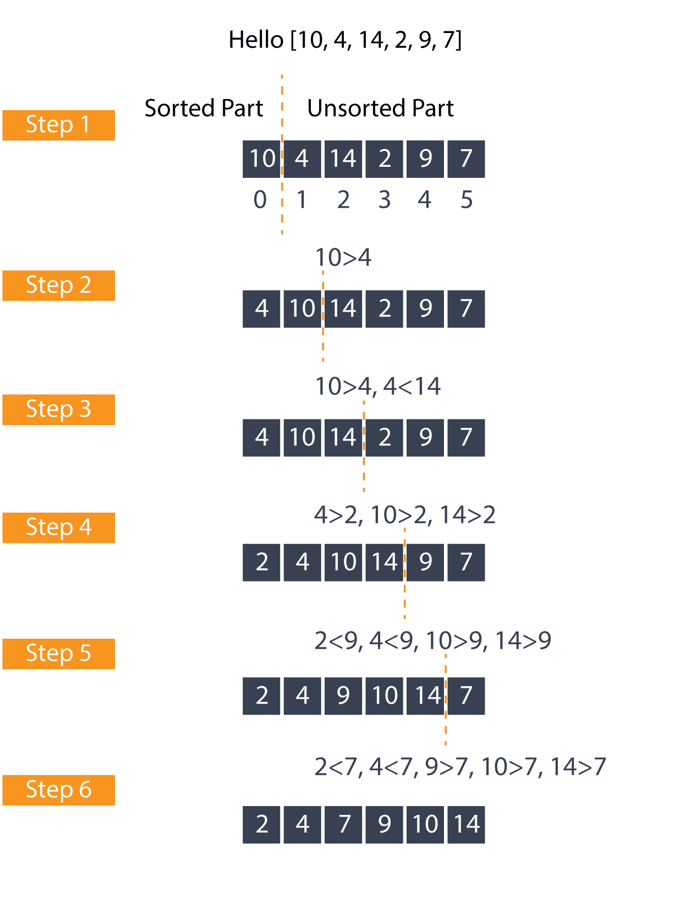
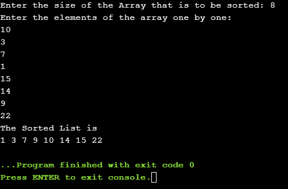

# 如何用 C++实现归并排序并举例说明

> 原文：<https://www.edureka.co/blog/merge-sort-in-cpp>

什么是合并排序？合并排序是一种基于比较的排序算法，属于分治类别。合并排序是用来根据分治策略对一个数组进行排序的，这将在本文中与其他概念一起简要介绍，比如它的算法和一个例子。我们还将看看 C++中合并排序的时间复杂度

本文将涉及以下几点:

*   [分治算法](#DivideandConquerAlgorithm)
*   [通过示例了解合并排序算法](#UnderstandingtheMergesortAlgorithmwithanexample)
*   [合并排序的伪代码](#PseudocodeforMergeSort)
*   [用 C++编写合并排序程序](#PrograminC++forMergeSort)
*   [合并排序的时间复杂度](#ThetimecomplexityforMergeSort)

继续这篇关于 C++中合并排序的文章

## **分治算法**

如果你已经熟悉 quicksort 的工作原理，你可能知道分而治之的策略。分而治之包括三个主要步骤。为了理解这些步骤，让我们考虑一个数组 Hello[ ]，它的起始索引为“a ”,结束索引为“n ”,因此我们可以用下面的方式编写数组 Hello[a…..n ]

分而治之的首要步骤是把给定的问题分成子问题或子部分。这里的关键是子问题应该与原始问题相似，并且规模更小。在我们的例子中，我们将把数组分成两半。m] [m+1…..n] m 位于 a 和 n 指数的中间

征服——一旦我们把问题分成子问题。我们递归地解决这些子问题。

组合——在这一步，我们以适当的方式组合我们子问题的所有解。换句话说，我们将两个不同的排序数组组合成一个排序数组。这就是我们排序后的数组。

继续这篇关于 C++中合并排序的文章

## **通过示例了解合并排序算法**

此时，我们知道合并排序将使用什么方法。所以，让我们来考虑一个例子，从 Hello[ ] unsorted 到一个排序的数组，经历每一步。举例——你好[10，3，7，1，15，14，9，22]



在上图中，我们考虑了一个未排序的数组，并使用合并排序来获得一个已排序的数组。现在，让我们看看每一步，理解整个算法

1.首先，我们考虑一个数组 Hello[10，3，7，1，15，14，9，22]在这个数组中总共有 8 个元素

2.正如我们前面看到的，合并排序使用分而治之的方法对元素进行排序。我们找到了位于数组中间的 m，并从中分割数组，其中 m =(a–n)/2 ' a '是数组最左边元素的索引，n 是数组最右边元素的索引。

3.在第一次划分之后，我们有两个部分，每个部分由 4 个元素组成。我们来看前半段[10，3，7，1]。

4.我们把[10，3，7，1]分成两部分[10，3]和[7，1]。之后，我们将它们进一步分为[10]、[3]、[7]、[1]。因为我们不能计算 m，所以不可能进一步划分。包含单个元素的列表总是被认为是已排序的。

5.合并是如何发生的？让我们找出答案。首先[10]和[3]按照升序进行比较和合并[3，10],与我们得到[1，7]的方式相同

6.之后，我们比较[3，10]和[1，7]。一旦进行了比较，我们将它们按升序合并，得到[1，3，7，10]。

7.[15，14，9，2]也以类似的方式进行分割和组合，形成[9，14，15，22]。

8.在最后一步中，我们比较并组合[15，14，9，2] [9，14，15，22]以给出我们的排序数组，即[1，3，7，9，10，14，15，22]。

继续这篇关于 C++中合并排序的文章

## **合并排序的伪代码**

```
Begin
   if left < right then
      m := left + (right - left) /2
      mergeSort(array, left, m)
      mergeSort (array, m+1, right)
      merge(array, left, right)
End
```

函数 mergeSort()递归地调用自己来分割数组，直到它变成一个元素，函数 merge()用于合并排序后的数组。

继续这篇关于 C++中合并排序的文章

## **c++中的归并排序程序**

```
#include<stdlib.h> 
#include<stdio.h> 
#include<iostream>

using namespace std;

void merge(int a[], int Firstindex, int m, int Lastindex); //merges the sub-arrays which are created while division

void mergeSort(int a[], int Firstindex, int Lastindex) 
{ 
    if (Firstindex < Lastindex) 
    { 

        int m = Firstindex + (Lastindex - Firstindex)/2; 

        mergeSort(a, Firstindex, m); 
        mergeSort(a, m+1, Lastindex); 

        merge(a, Firstindex, m, Lastindex); 
    } 
}   

void merge(int a[], int Firstindex, int m, int Lastindex) 
{ 
    int x; 
    int y;
    int z;
    int sub1 = m - Firstindex + 1; 
    int sub2 =  Lastindex - m; 

    int First[sub1];  //temp array

    int Second[sub2]; 

    for (x = 0; x < sub1; x++) // copying data to temp arrays
        First[x] = a[Firstindex + x]; 
    for (y = 0; y < sub2; y++) 
        Second[y] = a[m + 1+ y]; 

    x = 0; 
    y = 0; 
    z = Firstindex; 
    while (x < sub1 && y < sub2) 
    { 
        if (First[x] <= Second[y]) 
        { 
            a[z] = First[x]; 
            x++; 
        } 
        else
        { 
            a[z] = Second[y]; 
            y++; 
        } 
        z++; 
    } 
    while (x < sub1) 
    { 
        a[z] = First[x]; 
        x++; 
        z++; 
    } 
    while (y < sub2) 
    { 
        a[z] = Second[y]; 
        y++; 
        z++; 
    } 
} 
int main() 
{ 
    int size;
    cout<<"Enter the size of the Array that is to be sorted: "; cin>>size;
    int Hello[size],i;
    cout<<"Enter the elements of the array one by one:n";
    for(i=0; i<size; i++) cin>>Hello[i];
    mergeSort(Hello, 0, size - 1);
    cout<<"The Sorted List isn";
    for(i=0; i<size; i++)
    {
        cout<<Hello[i]<<" ";
    }
    return 0;
}
```

**输出-**



继续这篇关于 C++中合并排序的文章

## **时间复杂度**

当我们谈论算法时，时间复杂性是一个需要考虑的重要方面。与其他排序算法相比，合并排序被认为具有很大的时间复杂度。

最坏情况运行时间- O(n log n) 最好情况运行时间- O(n log n) 平均运行时间- O(n log n)

至此，我们结束了 C++文章中的合并排序。如果你想了解更多，请查看由 Edureka(一家值得信赖的在线学习公司)提供的  [Java 培训](https://www.edureka.co/java-j2ee-soa-training)。Edureka 的 Java J2EE 和 SOA 培训和认证课程旨在培训您掌握核心和高级 Java 概念以及各种 Java 框架，如 Hibernate & Spring。

有问题要问我们吗？请在这个博客的评论部分提到它，我们会尽快回复你。