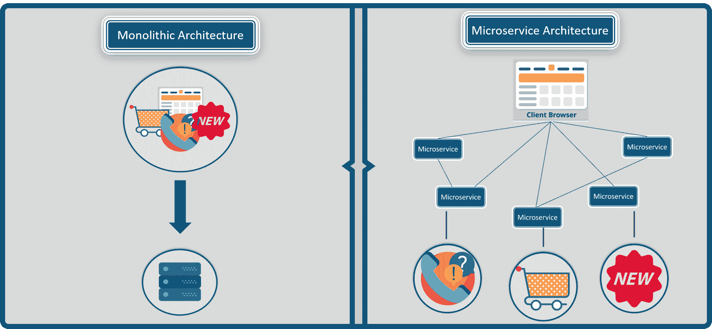
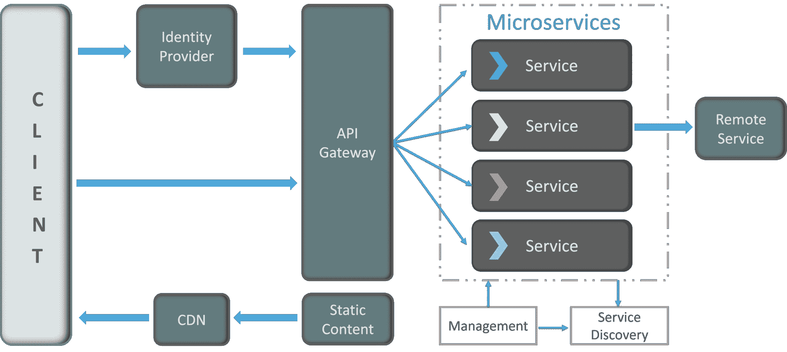
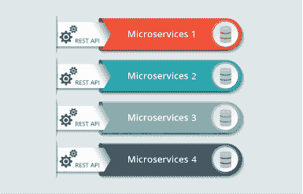

# 微服务架构–学习、构建和部署微服务

> 原文：<https://www.edureka.co/blog/microservice-architecture/>

## 微服务架构:

*从我[之前的博客](https://www.edureka.co/blog/what-is-microservices/)来看，你一定对微服务架构有了基本的了解。但是，成为一名拥有 **[微服务认证专业知识的专业人士](https://www.edureka.co/microservices-architecture-training)** 需要的不仅仅是基础知识。* *在这篇博客中，你将深入了解架构概念，并通过一个超级案例研究来实现它们。*

**在这个博客中，你将了解到以下内容:**

*   微服务架构的定义
*   微服务架构的关键概念
*   微服务架构的利弊
*   优步——案例研究

可以参考 [*什么是微服务*](https://www.edureka.co/blog/what-is-microservices/) ，了解微服务的基本面和好处。

只有我给你微服务的定义才会公平。

## **微服务定义**

因此，微服务(也称为微服务架构)没有合适的定义，但你可以说它是一个框架，由执行不同操作的小型、可单独部署的服务组成。

微服务专注于单个业务领域，可以作为完全独立的可部署服务来实现，并在不同的技术堆栈上实现。

**图 1:** 单片和微服务架构的区别——微服务架构

参考上图，了解整体架构和微服务架构的区别。 为了更好的理解两者架构的区别，可以参考我之前的博客 **[什么是微服务](https://www.edureka.co/blog/what-is-microservices/)**

为了让你更好的理解，我来告诉你一些微服务架构的关键概念。

## **微服务架构关键概念**

在开始使用微服务构建自己的应用之前，你需要清楚应用的范围和功能。

以下是讨论微服务时应遵循的一些准则。

**设计微服务时的指导方针**

*   作为一名开发人员，当你决定开发一个应用程序时，要将领域分开，并明确功能。
*   你设计的每个微服务应该只专注于应用程序的一个服务。
*   确保你已经以这样一种方式设计了应用程序，即每个服务都是可单独部署的。
*   确保微服务之间的通信是通过无状态服务器完成的。
*   每个服务都可以进一步重构为更小的服务，拥有自己的微服务。

现在，您已经通读了设计微服务的基本指南，让我们来了解微服务的架构。

## **微服务架构是如何工作的？**

一个典型的微服务架构(MSA)应该由以下组件组成:

1.  客户端
2.  身份提供者
3.  API 网关
4.  消息格式
5.  数据库
6.  静态内容
7.  管理
8.  服务发现

参考下图。

**图 2:** 微服务架构——微服务架构

我知道这个架构看起来有点复杂，但是让我为你简化一下。

**1。客户**

该架构从不同类型的客户端开始，来自不同的设备，尝试执行各种管理功能，如搜索、构建、配置等。

**2。身份提供者**

来自客户端的这些请求随后被传递给身份提供者，身份提供者对客户端的请求进行身份验证，并将请求传递给 API 网关。然后，请求通过定义良好的 API 网关传递给内部服务。

**3。API 网关**

由于客户端不直接调用服务，API Gateway 充当了客户端将请求转发到适当微服务的入口点。

**使用 API 网关的优势包括:**

*   所有的服务都可以在客户不知情的情况下更新。
*   服务也可以使用对网络不友好的消息协议。
*   API 网关可以执行交叉功能，如提供安全性、负载平衡等。

接收到客户端的请求后，内部架构由微服务组成，微服务通过消息相互通信来处理客户端的请求。

**4。消息格式**

他们通过两种类型的消息进行交流:

*   **同步消息:**在客户端等待服务响应的情况下，微服务通常倾向于使用 **REST(表述性状态转移)**，因为它依赖于无状态的客户端-服务器和 **HTTP 协议**。使用该协议是因为它是一个分布式环境，每个功能都用资源来表示，以执行操作
*   **异步消息:**在客户端不等待服务响应的情况下，微服务通常倾向于使用 **AMQP、STOMP、MQTT** 等协议。在这种类型的通信中使用这些协议，因为消息的性质是被定义的，并且这些消息在实现之间必须是可互操作的。

你可能想到的下一个问题是，使用微服务的应用程序如何处理它们的数据？

**5。数据处理**

每个微服务都拥有一个私有数据库来捕获它们的数据并实现各自的业务功能。此外，微服务的数据库仅通过其服务 API 进行更新。参考下图:

**图 3:** 微服务处理数据的表示——微服务架构

由微服务提供的服务被带到任何支持不同技术栈的进程间通信的远程服务中。

**6。** 静态内容

在微服务内部进行通信后，它们将静态内容部署到基于云的存储服务，该存储服务可以通过**内容交付网络(CDNs)** 将它们直接交付给客户端。

除了上述组件，还有一些其他组件出现在典型的微服务架构中:

**7。管理**

该组件负责平衡节点上的服务并识别故障。

**8。服务发现**

充当微服务的向导，以找到它们之间的通信路由，因为它维护节点所在的服务列表。

#### 订阅我们的 youtube 频道以获取新的更新..！