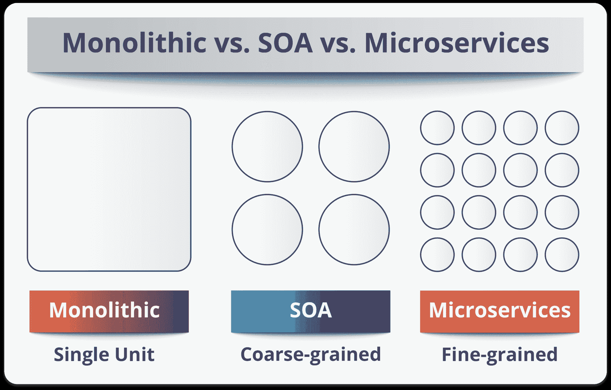
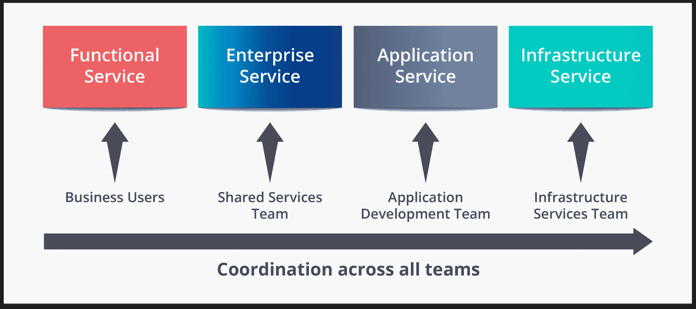
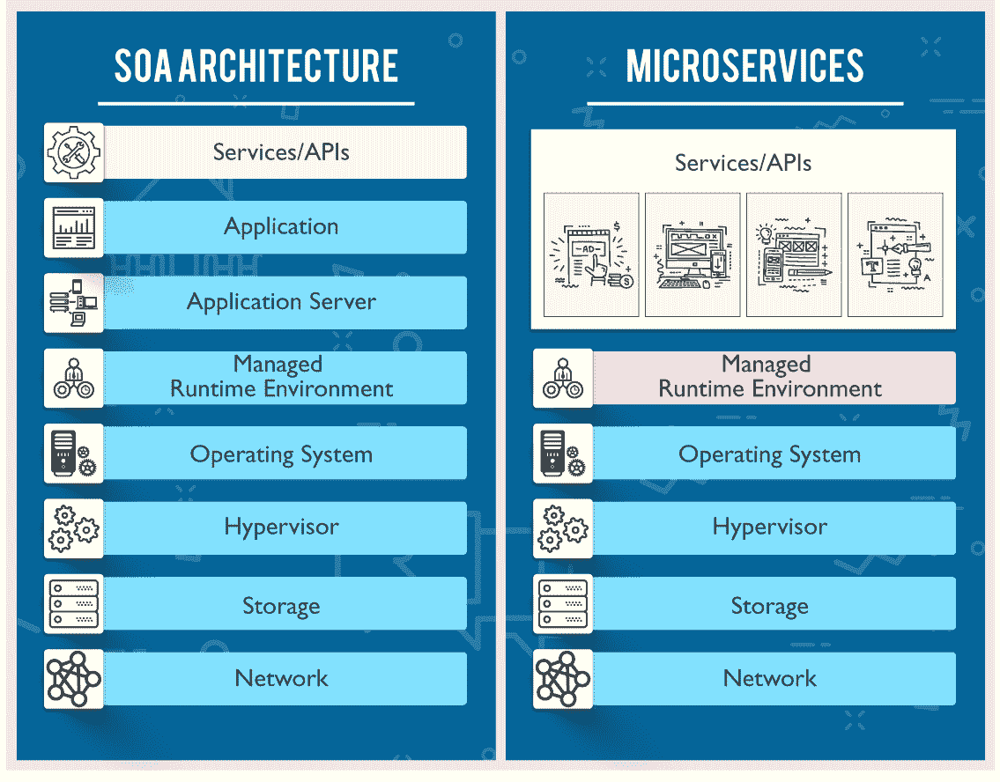

# 微服务与 SOA:有什么不同

> 原文：<https://www.edureka.co/blog/microservices-vs-soa/>

在上一篇关于 [**什么是微服务**](https://www.edureka.co/blog/what-is-microservices/) 的博客中，您已经了解到具有分布式架构的 SOA 和微服务比单一架构具有显著的优势。在这篇博客中，我将向你解释基于分层的架构，并告诉你 微服务与 SOA 架构的区别是什么？了解它们的区别，将为 ***[微服务认证培训](https://www.edureka.co/microservices-architecture-training)*** 所需的基础打好基础。

因此，在我们深入探讨微服务与 SOA 之间的区别之前，让我告诉你整体架构、SOA 和微服务之间的基本区别。

通俗地说， **Monolithic** 类似于一个大容器，其中一个应用程序的所有软件组件被组装在一起并紧密打包。

面向服务的架构本质上是服务的集合。这些服务相互通信。通信可以包括简单的数据传递，也可以包括两个或多个协调某些活动的服务。需要一些将服务相互连接的方法。

**微服务**，又名 ***[微服务架构](https://www.edureka.co/blog/microservice-architecture/)*** ，是一种架构风格，将应用程序构建为小型自治服务的集合，围绕**业务领域建模。**

你也可以观看下面的视频，我们的微服务架构专家解释了微服务架构和 SOA 之间的区别。

## **微服务 vs SOA |爱德华卡**

[//www.youtube.com/embed/EpyPFnjue38?rel=0&showinfo=0](//www.youtube.com/embed/EpyPFnjue38?rel=0&showinfo=0) This video will help you understand the differences between their architectures and other major features.

现在，让我们看看微服务与 SOA 之间的主要区别:

## **微服务 vs SOA**

当比较微服务和 SOA 时，它们都依赖服务作为主要组件，但是它们在服务特征方面有很大的不同。

## **面向服务的架构**

定义了 4 种基本服务类型，如下图:

## 

**商业服务:**

*   它们是定义核心业务运营的粗粒度服务。
*   通过 XML、业务流程执行语言(BPEL)等表示。

**企业服务:**

*   实现业务服务定义的功能。
*   他们主要依靠应用服务和基础设施服务来满足业务需求。

**应用服务**

*   局限于特定应用环境的细粒度服务。
*   专用用户界面可以直接调用服务。

*   实现认证、审计、安全、日志等非功能性任务。
*   可以从应用服务或企业服务中调用它们。

**微服务**服务分类有限。它们由两种服务类型组成，如下所示。

## 

**功能服务:**

*   它们支持特定的业务操作。
*   对服务的访问是在外部完成的，这些服务不与其他服务共享。
*   与 SOA 一样，基础设施服务实现审计、安全和日志记录等任务。
*   在此，服务不向外界公开。

## **SOA 与 MSA 的主要区别**

| **SOA** | MSA |
| --- | --- |
| 遵循“**尽可能多的共享**”架构方法 | 遵循“**尽可能少的共享**”架构方法 |
| 重要性在于**业务功能**重用 | 重要性在于概念上的**有界语境** |
| 他们有**共同**治理**和**标准**** | 他们专注于**人** **协作**和其他选项的自由 |
| 使用**企业服务总线**进行通信 | 简单消息系统 |
| 它们支持**多种消息协议** | 他们使用轻量级协议，如 **HTTP/REST** 等。 |
| **多线程**处理 I/O 的开销更大 | **单线程**通常使用事件循环特性进行非锁定 I/O 处理 |
| 最大化应用服务的可重用性 | 重点关注**脱钩** |
| **传统关系数据库**更常用 | **现代**关系数据库**** 更常用 |
| 系统性的改变需要修改整体结构 | 一个系统性的变化是创建一个新的服务 |
| 开发运维/持续交付正在变得流行，但还不是主流 | 强烈关注开发运营/持续交付 |

## 微服务与 SOA 的主要区别详见:

*   **服务粒度** : S 微服务架构中的服务组件通常是单一用途的服务，能够非常非常好地完成一件事情。使用 SOA，服务组件的规模可以从小型应用程序服务到非常大的企业服务不等。事实上，SOA 中的服务组件通常由大型产品甚至子系统来表示。
*   **组件共享** : 组件共享是 SOA 的核心原则之一。事实上，组件共享就是企业服务的全部。 SOA 增强了组件共享，而 MSA 试图通过“有界上下文”最小化共享有界上下文指的是组件及其数据作为一个单元的耦合，具有最小的依赖性。由于 SOA 依赖于多种服务来满足业务请求，因此基于 SOA 构建的系统很可能比 MSA 慢。
*   **中间件 vs API 层** : 微服务架构模式通常具有所谓的 API 层，而 SOA 具有消息中间件组件。SOA 中的消息中间件提供了许多 MSA 中没有的附加功能，包括中介和路由、消息增强、消息和协议转换。MSA 在服务和服务消费者之间有一个 API 层。
*   **远程服务** : SOA 架构依赖消息传递(AMQP，MSMQ)和 SOAP 作为主要的远程访问协议。大多数 MSA 依赖于两种协议——REST 和简单消息传递(JMS，MSMQ ), MSA 中的协议通常是同构的。
*   **异构互操作性** : SOA 通过其消息中间件组件促进多种异构协议的传播。MSA 试图通过减少集成选择的数量来简化架构模式。如果您想在异构环境中集成几个使用不同协议的系统，您需要考虑 SOA。如果您的所有服务都可以通过相同的远程访问协议公开和访问，那么 MSA 是一个更好的选择。

最后，我要说的是，判断哪种架构比其他架构好并不是那么简单。这主要取决于您构建应用程序的目的。 **SOA** 更适合需要与许多异构应用程序集成的大型复杂业务应用程序环境，即较小的应用程序不太适合 SOA，因为它们不需要消息中间件组件。**另一方面，微服务**更适合较小的、划分良好的、基于网络的系统，在这些系统中，微服务给了你作为开发人员更大的控制权。结论是，因为它们都有不同的体系结构特征，但这主要取决于您正在构建的应用程序的目的。

*如果您希望学习微服务并构建自己的应用，那么请查看我们的 **[微服务架构培训](https://www.edureka.co/microservices-architecture-training)** ，它附带有讲师指导的现场培训和真实项目体验。本培训将帮助您深入了解微服务，并帮助您掌握该主题。*

#### 订阅我们的 youtube 频道以获取新的更新..！