# Spring Boot 微服务:使用 Spring Boot 构建微服务应用

> 原文：<https://www.edureka.co/blog/microservices-with-spring-boot>

随着云计算&容器化的到来，微服务席卷全球。组织正在猎取职业有 [***微服务架构培训***](https://www.edureka.co/microservices-architecture-training) 。在之前的**博客**中，你一定已经学习了如何使用 Eclipse IDE 和 CLI 设置和运行 [Spring Boot。现在，在这篇 Spring Boot 微服务博客中，让我详细展示我们如何使用 Spring Boot 和网飞尤里卡服务器为**顶级运动品牌**创建**微服务应用**。](https://www.edureka.co/blog/spring-boot-setup-helloworld-microservices-example/)

## **为什么需要** **Spring Boot？**

Spring Boot 支持快速构建生产就绪的应用程序，并提供非功能特性:

*   易于使用容器部署的嵌入式服务器
*   它有助于监控多个组件
*   它有助于在外部配置组件

那么，让我们看看微服务架构有哪些挑战

### **挑战微服务架构**

虽然开发许多较小的微服务看起来很容易，但微服务架构存在许多固有的复杂性。让我们来看一些挑战:

*   **自动化组件**:自动化一切变得很困难，因为有许多更小的组件而不是一个整体，例如构建、部署、监控等等。
*   **可感知性**:有大量的小组件需要部署和维护，有时很难监控和识别问题。它需要对所有组件都有很强的感知能力。
*   **配置管理**:非常需要跨各种环境维护组件的配置。
*   **调试**:探测每个服务的错误变得很困难。集中式日志记录和仪表板对于简化问题调试至关重要。
*   **一致性**:你不可能有很多种工具来解决同一个问题。虽然促进创新很重要，但围绕用于实现/部署/监控微服务的语言、平台、技术和工具进行一些去中心化的治理也很重要。

**微服 Spring Boot |爱德华卡**


[https://www.youtube.com/embed/o6Rt0SMSI08?rel=0&showinfo=0](https://www.youtube.com/embed/o6Rt0SMSI08?rel=0&showinfo=0)

本视频将帮助您在 Spring Boot 的帮助下实施微服务。

## **【Spring Boot】微服务:用 Spring Boot** 打造顶级运动品牌架构

在这个 spring boot 微服务示例中，我们将创建顶级运动品牌应用，该应用将提供 3 项服务:-

1.  **尤里卡服务**–该服务将注册每个微服务，然后客户端微服务将查找尤里卡服务器，以获得相关的微服务来完成工作。这个 Eureka 服务器归网飞所有，在这里，Spring Cloud 提供了一种声明式的方法，通过 Java 注释来注册和调用服务。
2.  **物品目录服务—**该服务将生成市场上受欢迎的运动品牌列表。
3.  **边缘服务—**类似于用 Spring Boot 和 Angular 在 Bootiful 开发中创建的独立物品服务。但是，它将具有回退功能，防止客户端在服务不可用时收到 HTTP 错误

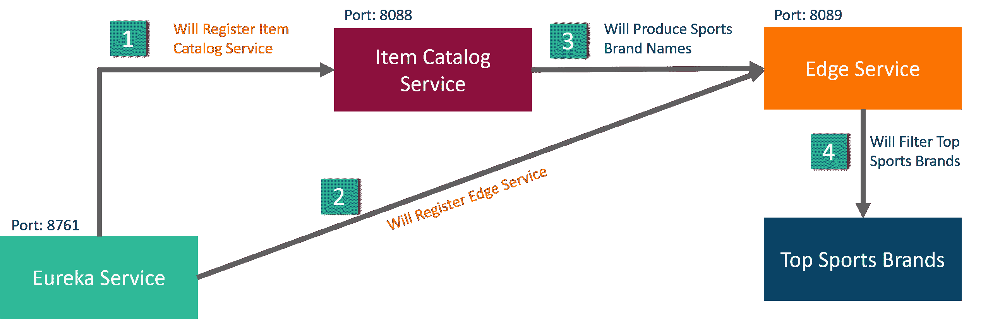

让我们看看创建这个 spring boot 微服务示例应用程序需要以下哪些工具。

### **所需工具**

*   J阿瓦 8
*   月食 IDE 氧气
*   弹簧工具

如果你在安装和运行上述工具时遇到任何困难，请参考这个**博客**。

## **Spring Boot 微服务:创建尤里卡服务**

首先，在 Eclipse IDE 中创建一个`EurekaServer` Spring Starter 项目。点击**春季开学项目**，然后点击**下一步。**

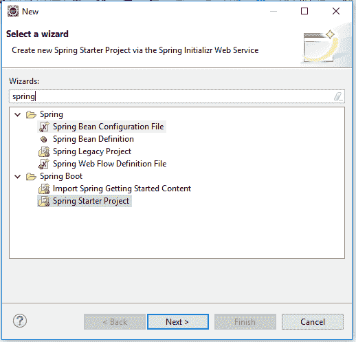

将您的 Spring Starter 项目命名为 **EurekaServer** ，其他信息将自动填入**。**

**注意:-** 确保您的互联网已连接，否则将显示错误。****

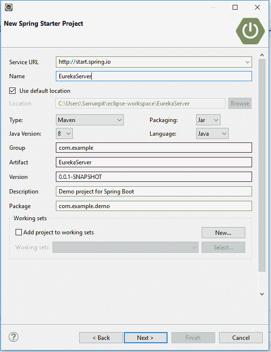

现在，选择 **`Eureka Server`** 作为依赖项，点击**完成。**

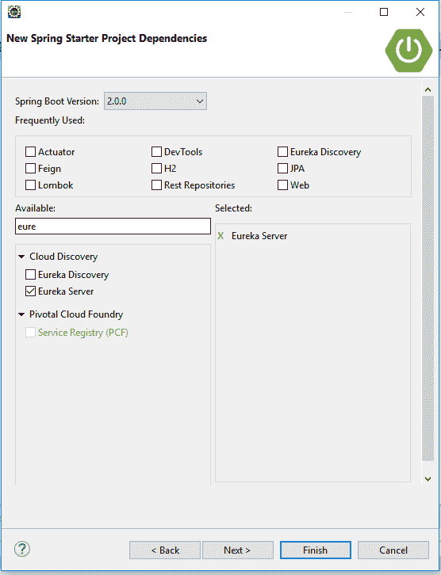

现在，修改`EurekaServer/src/main/resources/application.properties`文件，添加一个端口号，禁用注册。

`server.port=8761 eureka.client.register-with-eureka=false`

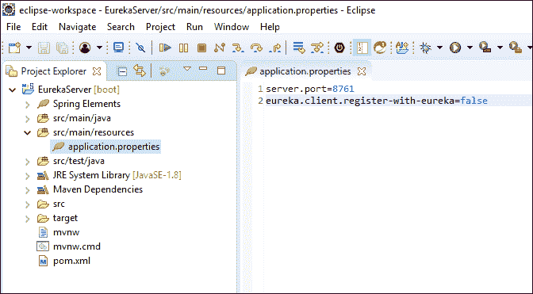 

打开`EurekaServer/src/main/java/com/example/EurekaServiceApplication.java`，在`@SpringBootApplication`上方添加`@EnableEurekaServer`。

```
`import org.springframework.cloud.netflix.eureka.server.EnableEurekaServer;

@EnableEurekaServer
@SpringBootApplication` 
```

此注释将配置一个允许其他应用程序通信的注册表。

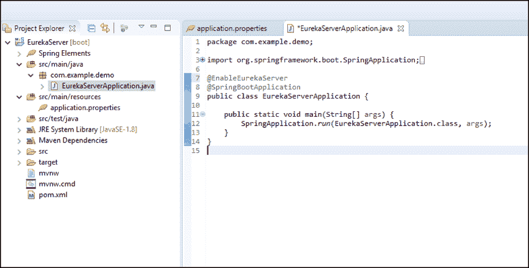 启动应用:右键点击**项目**–>**运行为**–>点击**Spring Boot App**

```
After it starts, you should be able to open http://localhost:8761 and see there are no services available.
```

现在打开`http://localhost:8761`。这里，Spring Eureka 服务器将打开，并显示没有服务将运行。 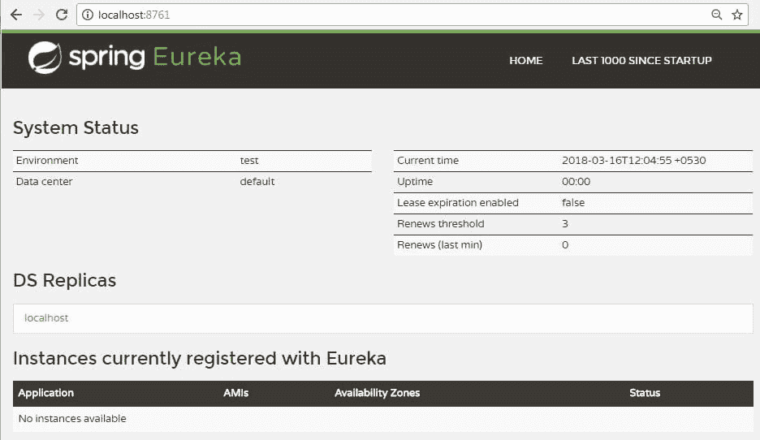

## **Spring Boot 微服务:创建物品目录服务**

再次创建新项目。使用`Item-catalog-service`作为工件名称，点击**下一个**。

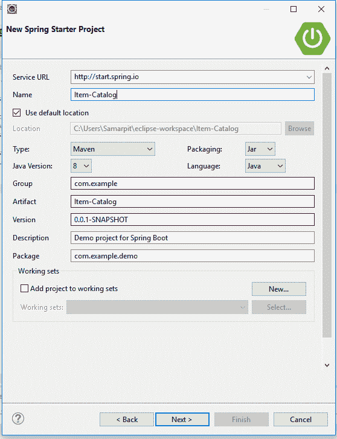

添加以下依赖关系:

*   **执行器**:帮助您监控和管理应用的特性
*   **尤里卡**发现号:进行服务注册
*   **JPA** :保存/检索数据
*   **【H2】**:内存数据库
*   **Rest** **存储库**:将 JPA 存储库公开为 Rest 端点
*   **Web** : Spring MVC 和嵌入式 Tomcat
*   **DevTools** :当文件改变时自动重新加载应用
*   **龙目岛**:减少样板代码

点击**完成。**

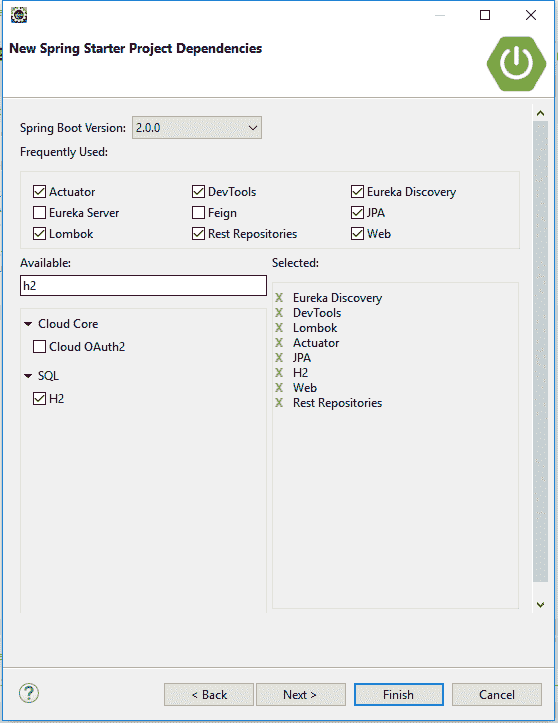

现在，创建一个 项 实体，到`ItemCatalogServiceApplication.java `。下面的代码假设您将所有的类放在同一个文件中。

```
`@Data @AllArgsConstructor
@NoArgsConstructor
@ToString
@Entity
class Item {

    public Item(String name) {
        this.name = name;
    }

    @Id
    @GeneratedValue
    private Long id;

    private String name;
}

@RepositoryRestResource
interface ItemRepository extends JpaRepository<Item, Long> {}

@Component
class ItemInitializer implements CommandLineRunner {

    private final ItemRepository ItemRepository;

    ItemInitializer(ItemRepository itemRepository) {
        this.itemRepository = itemRepository;
    }

    @Override
    public void run(String... args) throws Exception {
        Stream.of(""Lining", "PUMA", "Bad Boy", "Air Jordan", "Nike", "Adidas", "Reebok")
                .forEach(item -> itemRepository.save(new Item(item)));

        itemRepository.findAll().forEach(System.out::println);
    }
}` 
```

如果你使用的编辑器不自动导入类，这里是`ItemCatalogServiceApplication.java`顶部需要导入的列表。

```
`import lombok.AllArgsConstructor;
import lombok.Data;
import lombok.NoArgsConstructor;
import lombok.ToString;
import org.springframework.boot.CommandLineRunner;
import org.springframework.boot.SpringApplication;
import org.springframework.boot.autoconfigure.SpringBootApplication;
import org.springframework.cloud.client.discovery.EnableDiscoveryClient;
import org.springframework.data.jpa.repository.JpaRepository;
import org.springframework.data.rest.core.annotation.RepositoryRestResource;
import org.springframework.stereotype.Component;

import javax.persistence.Entity;
import javax.persistence.GeneratedValue;
import javax.persistence.Id;
import java.util.stream.Stream;` 
```

在`item-catalog-service/src/main/resources/application.properties`文件中添加一个要在 Eureka 服务中显示的应用程序名称，并将端口设置为 8088。

T2`server.port=8088`

T2`spring.application.name=item-catalog-service`

**现在，创建云属性文件**

点击**文件—>新建—>其他—>文件**，在该文件中添加以下代码并保存。

```
eureka.instance.hostname=${vcap.application.uris[0]:localhost}
eureka.instance.nonSecurePort=80
eureka.instance.metadataMap.instanceId=${vcap.application.instance_id:${spring.application.name}:${spring.application.instance_id:${server.port}}}
eureka.instance.leaseRenewalIntervalInSeconds = 5

eureka.client.region = default
eureka.client.registryFetchIntervalSeconds = 5
eureka.client.serviceUrl.defaultZone=${vcap.services.pwa-eureka-service.credentials.uri}/eureka/
```

现在，启动应用程序:

右键点击项目->**运行为**->点击**Spring Boot App**


注意:如果出现错误，请尝试此步骤:右键单击**项目**–>**运行为**–>单击“**Maven Build**”

现在打开`http://localhost:8761`。在这里，您将看到项目目录服务正在运行。

### 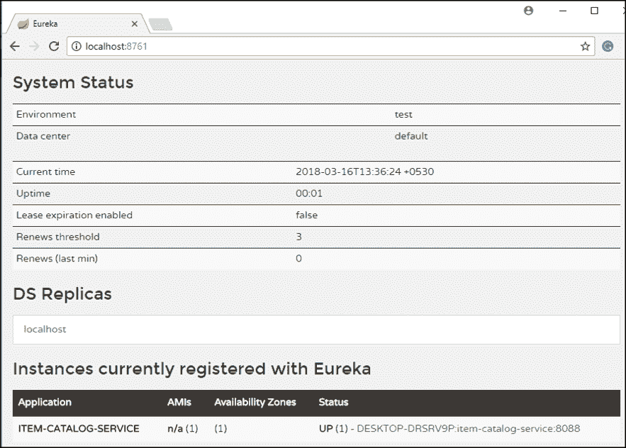

您将看到目录服务中的项目列表。

T2`Open http://localhost:8088/items`

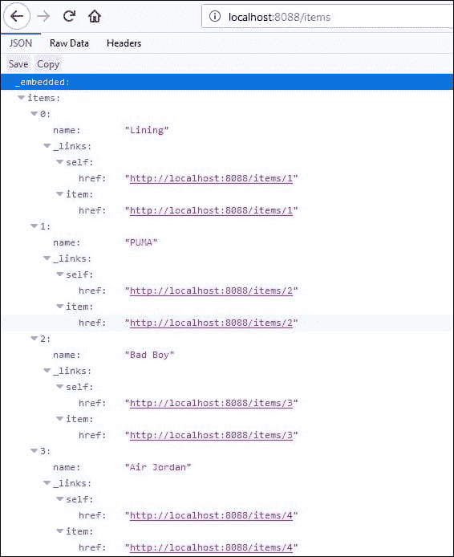

现在让我们继续前进，创建边缘服务。

**Spring Boot 微服务:打造边缘服务**

它类似于 Spring Boot 和安格尔在 **Bootiful 开发中创建的独立项目服务。但是，它将具有回退功能，防止客户端在服务不可用时收到 HTTP 错误。**

再次创建新项目。用`edge-service` 换神器名称

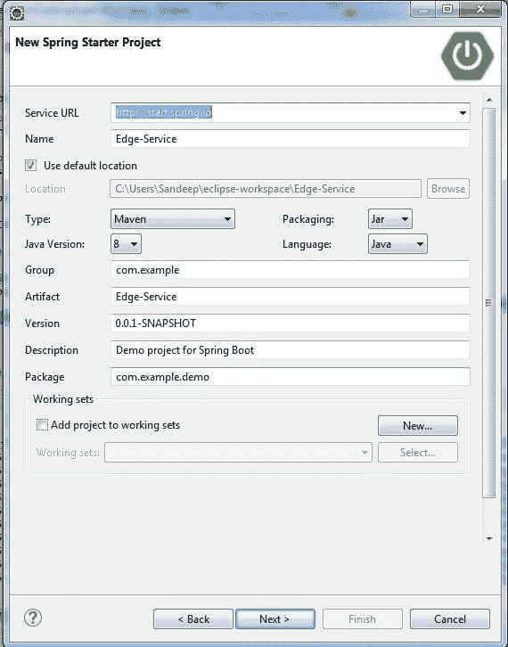

*   **尤里卡发现**:服务注册
*   **假装**:声明式 web 服务客户端
*   **Zuul** :提供智能路由
*   **Rest 存储库**:将 JPA 存储库公开为 Rest 端点
*   **Web** : Spring MVC 和嵌入式 Tomcat
*   **Hystrix** :断路器，用于停止连锁故障并使能恢复
*   **龙目岛**:减少样板代码

点击**完成。**

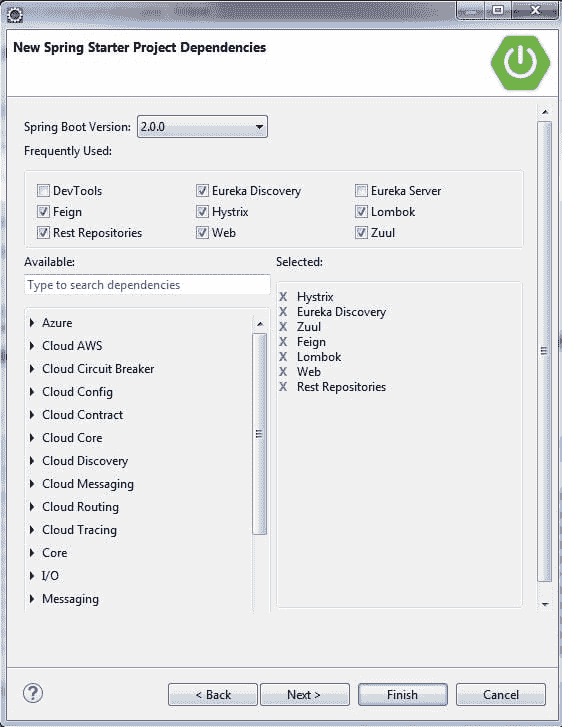

由于`item-catalog-service`在端口 8088 上运行，您需要配置这个应用程序在不同的端口上运行。修改`edge-service/src/main/resources/application.properties`将端口设置为 8089，并设置一个应用名称。

```
`server.port=8089
spring.application.name=edge-service` 
```

**现在，创建云属性文件**

点击**文件—>新建—>其他—>文件**，在该文件中添加以下代码并保存。

```
eureka.instance.hostname=${vcap.application.uris[0]:localhost}
eureka.instance.nonSecurePort=80
eureka.instance.metadataMap.instanceId=${vcap.application.instance_id:${spring.application.name}:${spring.application.instance_id:${server.port}}}
eureka.instance.leaseRenewalIntervalInSeconds = 5

eureka.client.region = default
eureka.client.registryFetchIntervalSeconds = 5
eureka.client.serviceUrl.defaultZone=${vcap.services.pwa-eureka-service.credentials.uri}/eureka/ To enable Feign, Hystrix, and registration with the Eureka server, add the appropriate annotations toEdgeServiceApplication.java:
```

```
`package com.example.edgeservice;

import com.netflix.hystrix.contrib.javanica.annotation.HystrixCommand;
import lombok.Data;
import org.springframework.boot.SpringApplication;
import org.springframework.boot.autoconfigure.SpringBootApplication;
import org.springframework.cloud.client.circuitbreaker.EnableCircuitBreaker;
import org.springframework.cloud.client.discovery.EnableDiscoveryClient;
import org.springframework.cloud.netflix.feign.EnableFeignClients;
import org.springframework.cloud.netflix.feign.FeignClient;
import org.springframework.cloud.netflix.zuul.EnableZuulProxy;
import org.springframework.hateoas.Resources;
import org.springframework.web.bind.annotation.*;

import java.util.ArrayList;
import java.util.Collection;
import java.util.stream.Collectors;

@EnableFeignClients
@EnableCircuitBreaker
@EnableDiscoveryClient
@EnableZuulProxy
@SpringBootApplication
public class EdgeServiceApplication {

    public static void main(String[] args) {
        SpringApplication.run(EdgeServiceApplication.class, args);
    }
}` 
```

在这个相同的文件中创建一个`Item` DTO(数据传输对象)。Lombok 的 [`@Data`](https://projectlombok.org/features/Data.html) 会生成一个 `toString()` 方法、getter、setters，以及适当的构造函数。

```
`@Data class Item {
    private String name;
}` 
```

创建一个`ItemClient`接口，使用 Feign 与`Item-catalog-service`通信。

```
`public class EdgeServiceApplication {

    public static void main(String[] args) {
        SpringApplication.run(EdgeServiceApplication.class, args);
    }
}

@Data
class Item {
    private String name;
}

       public String getName() {
             return name; 
}

public void setName(String name) { 
                      this.name = name;
          }
@FeignClient("item-catalog-service")
interface ItemClient {

    @GetMapping("/items")
    Resources<Item> readItems();
}` 
```

在`ItemClient`下面创建一个`RestController`，过滤掉不太热门的品牌，并显示一个`/top-brands`终点。

```
`@RestController class GoodItemApiAdapterRestController {

    private final ItemClient itemClient;

    public GoodItemApiAdapterRestController(ItemClient ItemClient) {
        this.itemClient = itemClient;
    }

    @GetMapping("/top-brands")
    public Collection<Item> goodItems() {
        return itemClient.readItems()
                .getContent()
                .stream()
                .filter(this::isGreat)
                .collect(Collectors.toList());
    }

    private boolean isGreat(Item item) {
        return !item.getName().equals("Nike") &&
                !item.getName().equals("Adidas") &&
                !item.getName().equals("Reebok");
    }
}` 
```

用 Maven 或您的 IDE 启动`edge-service`应用程序，并验证它是否成功注册到 Eureka 服务器。


现在调用 localhost:8089/top-brands，您将看到来自目录服务的顶级品牌列表。

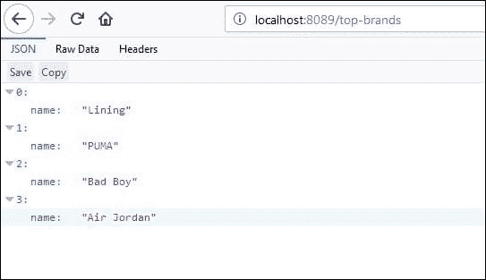

**注意:**如果你关闭`item-catalog-service`应用程序，你会得到一个 500 内部服务器错误。

```
`$ http localhost:8089/top-brands
HTTP/1.1 500
Connection: close
Content-Type: application/json;charset=UTF-8
Date: Fri, 16 Mar 2018 12:51:22 GMT
Transfer-Encoding: chunked
X-Application-Context: edge-service:8089` 
```

```
`{
    "error": "Internal Server Error",
    "exception": "feign.RetryableException",
    "message": "connect timed out executing GET http://item-catalog-service/items",
    "path": "/top-brands",
    "status": 500,
    "timestamp": 1328088897672
}` 
```

要解决这个问题，您可以使用 Hystrix 创建一个回退方法，并告诉`goodItems()`方法使用它。

```
`public Collection<Item> fallback() {
    return new ArrayList<>();
}

@HystrixCommand(fallbackMethod = "fallback")
@GetMapping("/top-brands")
public Collection<Item> goodItems() {
    return … 
}` 
```

重启`edge-service`，您应该会看到一个空列表返回。

```
`$ http localhost:8089/top-brands
HTTP/1.1 200
Content-Type: application/json;charset=UTF-8
Date: Fri, 16 Mar 2018 12:59:02 GMT
Transfer-Encoding: chunked
X-Application-Context: edge-service:8089` 
```

```
`[]` 
```

再次启动`item-catalog-service`，这个列表最终将返回顶级品牌名称的完整列表。

如果你想要这个应用程序的源代码，请在评论区留下你的评论。

#### 订阅我们的 youtube 频道以获取新的更新..！