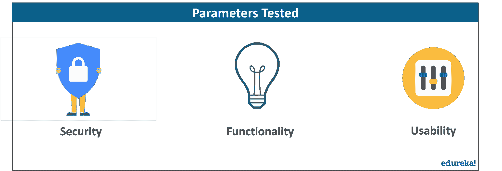
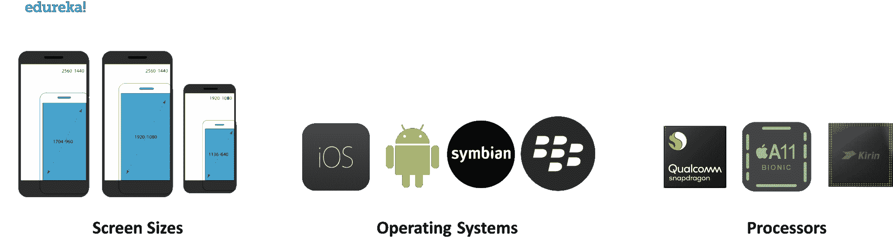

# 移动应用程序测试世界简介

> 原文：<https://www.edureka.co/blog/mobile-application-testing/>

今天，手机已经从简单的通讯设备发展成为一个基本上可以做任何事情的小工具。无论是点餐、利用出租车服务还是简单地寻找方向，都可以使用手机来完成。由于移动应用程序的奇妙世界，这才成为可能。在这篇“移动应用程序测试”文章中，我们将讨论这类应用程序的测试过程。以下是本博客中讨论的主题列表—

*   [移动应用测试简介](#introduction)
*   [为什么移动应用测试很重要？](#importance)
*   [手机 App 测试方法](#approaches)
*   [移动测试自动化的优势](#advantage)
*   [移动应用测试的关键挑战](#challenges)

## **移动应用测试简介**

移动应用程序测试是每个为手持设备开发的应用程序都必须经历的过程。显然，这是为了在应用程序发布到市场(应用程序商店/游戏商店)之前保证一定的质量水平。移动应用开发的生命周期通常比其他的要短得多，因此，他们的成功很大程度上依赖于移动应用测试。应用程序在安全性、功能性、可用性等基础上接受测试。这提高了应用程序在所有方面的总体效率，同时也提高了用户的可靠性。

好了，现在让我们花点时间来讨论一下移动应用测试的重要性。

## **为什么手机 App 测试很重要？**

一个用户一般是如何决定为了某个目的下载哪个 app 的？10 年前，这个问题可能会根据个人的选择产生许多答案。今天，它取决于两件事—

*   评级
*   评论

每天，手机用户在评分和评论的基础上安装新的应用程序，这直接关系到你的应用程序表现如何。这使得移动应用测试变得非常重要。随着大量不同操作系统、不同屏幕尺寸的移动电话的出现，处理能力测试已经发展成为软件开发过程中的一个强制性过程。新功能让用户开心，而快速的错误修复确保没有人卸载你的应用程序，这使得测试对于应用程序的生存至关重要。

既然我们已经理解了移动应用程序测试的概念及其重要性，让我们来看看不同的方法。

**移动应用测试方法**

根据移动应用的执行方式，有两种不同的测试方法，即手动测试和自动化测试。

### **手动测试**

顾名思义，手动测试是一个人工过程，主要关注用户体验。对应用程序的功能性、安全性和可用性的分析和评估是通过用户这一媒介在探索过程中完成的。这确保了您的应用程序符合用户友好的标准。这种类型的测试通常很耗时，因为缺陷往往需要时间才能被识别出来。因此，根据经验，应用程序 20%的测试应该通过 alpha 和 beta 版本的帮助手动执行，而其余的应该是自动化的。

现在，让我们继续自动化移动应用测试。

### 自动化测试

自动化测试是移动应用测试的第二种方法。在这个过程中，建立了一系列的测试用例，它们通常应该覆盖测试过程的 80%。百分比不是一个规则，而是软件行业遵循的一般准则。下面是通常通过这种特殊方法执行的测试用例的列表—

*   自动化最繁琐的手工测试用例
*   自动化可以轻松自动化的测试用例
*   最常用功能的自动化测试用例
*   自动化不可能手工执行的测试用例
*   用可预测的结果自动化测试用例

## **移动测试自动化的优势**

 [移动测试的自动化](https://www.edureka.co/blog/what-is-selenium/)已经被证明是非常有用的。下面是移动应用测试自动化带来的一系列优势—

*   提高测试效率
*   增强回归测试用例的执行
*   节省了大量时间，同时也执行了更多的测试用例
*   相同的测试脚本可以反复执行
*   测试脚本可以在多个设备上并行运行

## **移动应用测试中的关键挑战**

移动应用测试不同于传统的桌面或网络应用测试流程。这意味着它有自己的挑战。

主要挑战来自移动设备的多样性。今天，有一堆屏幕尺寸，操作系统，硬件选项，软件版本等。截至 2018 年，市场上有超过六万台 android 设备，其中一些甚至开始采用 notch 时尚，这带来了自身的挑战。让我列出移动应用测试中面临的主要问题—

*   **快速部署**——行业内的移动应用是一种对 bug 反应迅速的应用；总是想着新功能。这些部署得越快，应用保持趋势的时间就越长。
*   **多平台兼容性**——除了 Android 和 iOS，还有一堆其他操作系统在众多平台上运行。这只会增加测试某个应用程序所需的时间。
*   **连接模式**–手机有不同的连接模式，例如漫游、4g、3g、edge 等。应用程序必须在所有这些不同的模式下进行测试。
*   **端到端测试**–手机行业要求应用程序无缝集成，并且能够从后端访问数据，以便在前端产生数据，而不会出现任何问题。由于手机的多样性，这成为一项艰巨的任务。
*   **工具的可用性**——如今有许多[工具](https://www.edureka.co/blog/selenium-tutorial)可以自动化移动应用测试。为您的应用程序选择正确的方法对于成功有效地测试应用程序至关重要。

“移动应用测试”博客到此结束。这是我在移动应用程序测试系列中的第一篇博客。我将会写一些关于这个特殊主题的文章，包括一些工具和框架，尤其是 Appium。如果你有兴趣阅读其他一些关于各种趋势技术的博客，你可以看看我们的博客目录。

如果你希望学习[软件测试](https://www.edureka.co/blog/what-is-software-testing/)并建立一个丰富多彩的职业生涯，那么请查看我们的 [***Selenium 认证课程***](https://www.edureka.co/testing-with-selenium-webdriver) ，该课程带有讲师指导的现场培训和真实项目体验。该培训将帮助您深入理解软件测试和 selenium，并帮助您掌握该主题。

<article class="maincontentblog">Got a question for us? Please mention it in the comments section of “Mobile Application Testing” blog and we will get back to you as soon as possible.</article>