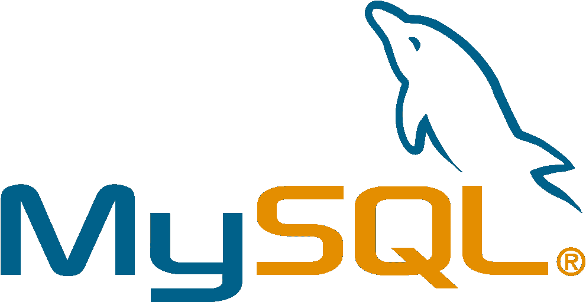
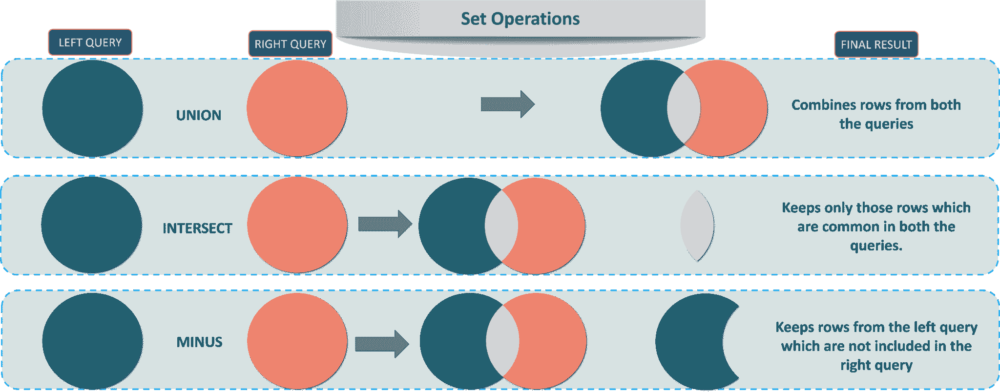

# 2023 年你必须准备的 50 个 MySQL 面试问题

> 原文：<https://www.edureka.co/blog/interview-questions/mysql-interview-questions/>

## **MySQL 面试问题:**

在每天产生 2.5 万亿字节数据的时代，数据在业务运营的[决策](https://www.edureka.co/blog/what-is-data-analytics/)中起着至关重要的作用。这使得我们在数据库中处理数据，并使我们需要使用数据库管理系统。如今市场上出现了各种各样的[数据库管理系统(DBMS)](https://www.edureka.co/blog/what-is-mysql/#Database%20Management%20System%20&%20Types%20of%20DBMS) ，关系数据库管理系统(RDBMS)是最流行的系统之一。这种类型的 DBMS 使用一种结构，允许用户识别和访问与数据库中另一段数据相关的数据*，MySQL 就是这样一种流行的 RDBMS。嗯，了解 MYSQL 为你成为数据库管理员打开了大门。我相信你已经意识到了这些事实，这让你看到了这篇 MySQL 面试问题的文章。*

在这篇关于 MySQL 面试问题的文章中，我将讨论在你的面试中被问到的与 MySQL 相关的热门问题。 这些问题都是咨询过在 这一领域拥有优秀[技能](https://www.edureka.co/mysql-dba)的人后收集的。 为了让你更好的理解，我把文章分成了以下几个部分:

1.  [MySQL DBA 面试问题](#MySQL%20DBA%20Interview%20Questions)
2.  [PHP MySQL 面试问题](#PHP%C2%A0MySQL%20Interview%20Questions)
3.  [复杂 MySQL 面试问题](#Complex%20MySQL%20Interview%20Questions)
4.  [棘手的 MySQL 面试问题](#Tricky%20MySQL%20Interview%20Questions) 

伙计们，让我们开始吧。

## **MySQL DBA 面试问题**

### **Q1。你能说出 Mysql_connect 和 Mysql_pconnect 的区别吗？**

| **Mysql_connect** | 用于打开到数据库的新连接。 |
| 您可以根据请求打开和关闭数据库连接。 |
| 每次加载页面时打开页面。 |
| **Mysql _ connect vs Mysql _ pconnect** |
| **Mysql_pconnect** | 用于打开数据库中的持久连接。 |
| 您不能关闭数据库连接。 |
| 没有必要在每次加载页面时都打开和关闭连接。 |

### **Q2。MySQL 服务器的默认端口是什么？**

MySQL 服务器的默认端口是 ***3306*** 。除此之外，TCP/IP 中 SQL Server 的另一个标准默认端口是 ***1433*** 。

### **Q3。你能说出 MySQL 中有哪些不同的集合操作吗？**

MySQL 中可用的各种 set 操作如下:

*   **UNION**–该操作返回查询选择的所有不同的行
*   **UNION ALL**–该操作返回查询选择的所有行，并且包括所有重复的行。
*   **减去**–该操作返回第一个查询选择的所有不同行，但不选择第二个查询选择的行。
*   –该操作返回两个查询选择的所有不同的行。

参考下图:

### ** Q4。你能说出 SQL SELECT 语句的顺序吗？**

SQL SELECT 语句的顺序如下:

```
SELECT, FROM, WHERE, GROUP BY, HAVING, ORDER BY.

```

### **Q5。什么是数据库白盒测试？**

数据库白盒测试处理表、数据模型、模式和参照完整性规则。它还处理触发器、具有数据库一致性的逻辑视图和 ACID 属性。

### **Q6。什么是数据库黑盒测试？**

数据库黑盒测试涉及数据映射、数据存储和检索。数据库黑盒测试用于等价划分和边界值分析等技术。

### **Q7。什么是 CTE？**

由 SQL 语句中定义的一组临时结果组成的表达式称为公用表表达式(CTE)。

### **Q8。Mysql 中有哪些不同的表？**

MySQL 中主要有五种类型的表。在所有这些数据库引擎中，MySQL 中使用的默认数据库引擎是 MyISAM。参考以下内容，了解五种类型的表格:

*   我是的
*   堆
*   合并
*   感兴趣的 DB
*   ISAM

### **Q9。什么是光标？**

游标被认为是指向一组行中的一行的指针，它只不过是一个允许遍历表中记录的控件。因此，游标用于执行遍历操作，如添加、检索和删除数据库中的记录。

### **Q10。如何测试数据库中的空值？**

空值是在特定字段中没有值的字段。因为空值不能与任何其他空值进行比较，所以不能使用比较运算符，例如=、<或< > 。要比较具有空值的字段，必须使用 IS NULL 和 IS NOT NULL 运算符。

有关 IS NULL 和 IS NOT NULL 的语法，请参考以下内容。

```
SELECT column_names FROM table_name WHERE column_name IS NULL;
SELECT column_names FROM table_name WHERE column_name IS NOT NULL;

```

### **Q11。能否详细说明一下 MySQL 中的 BLOB 和 TEXT？**

#### **斑点**

[BLOB](https://www.edureka.co/blog/mysql-data-types/#String%20Types) (二进制大对象)用于保存可变数量的数据，最多可保存 65，535 字节的数据。以下是四种类型的 BLOB。

*   TINYBLOB
*   斑点
*   中场休息
*   肺血

#### **正文**

文本用于存储字符串值，最大长度为 65，535 个字符。以下是四种类型的文本

*   TINYTEXT
*   正文
*   MEDIUMTEXT
*   长文本

### **Q12。你能告诉我如何在 SQL 中显示最高工资吗？**

要在 SQL 中显示最高工资，可以使用名为 MAX()的内置函数。

### **Q13。NVL 函数、IFNULL 函数和 ISNULL 函数之间有什么区别？**

NVL 函数、IFNULL 函数和 ISNULL 函数都用于将空值替换为另一个值。ORACLE 用户使用 NVL 函数，MySQL 用户使用 IFNULL 函数，SQL 服务器使用 ISNULL 函数

例如，假设我们有一个包含空值的列(column_3)。

因此，如果您运行下面的语句，您将得到的输出是一个空值。

```
SELECT column_1 * (column_2 + column_3) FROM Example_Table

```

现在，为了克服这一点，您可以使用上面的三个函数，如下所示:

```
SELECT column_1 * (column_2 + NVL(column_3,0)) FROM Example_Table
SELECT column_1 * (column_2 + IFNULL(column_3,0)) FROM Example_Table
SELECT column_1 * (column_2 + ISNULL(column_3,0)) FROM Example_Table

```

### **Q14。GUI 测试和数据库测试有什么区别？**

| **GUI 测试** | **数据库测试** |
| 用户界面测试也称为前端测试。 | 也称为 B 后端测试或数据测试。 |
| 处理与用户交互的项目。 | 处理对用户隐藏的项目。 |
| 测试人员不需要了解 SQL。 | 测试人员需要了解 SQL。 |
| GUI 测试关注应用程序的外观 | 数据库测试关注前端数据的完整性和后端数据的 |

### **Q15。如何在 Mysql 查询中显示表中第 n 个最高的薪水？【T2**

考虑名为“Employee”的表。

现在，为了得到第 n 个薪水，考虑下面的语句。

```
SELECT DISTINCT(salary) FROM employee ORDER BY salary DESC LIMIT n-1,1

```

因此，如果你想找出第七大工资，考虑下面的查询。

```
SELECT DISTINCT(salary) FROM employee ORDER BY salary DESC LIMIT 6,1 

```

现在，让我们进入下一组问题，即 [PHP](https://www.edureka.co/blog/php-tutorial-for-beginners/) MySQL 面试问题。

## **PHP MySQL 面试问题**

### **Q1。使用 PHP 和 MySQL 创建数据库的命令是什么？**

使用 PHP 和 MySQL 创建数据库的命令是 ***mysql_create_db(“数据库名”)。***

### **Q2。能说出 Mysql_fetch_object 和 Mysql_fetch_array 的区别吗？**

两者相似，但只有一点不同。Mysql_fetch_object 返回对象，Mysql_fetch_array 返回数组。这意味着您不能通过偏移量来访问数据，而只能通过字段名称来访问。

### **Q3:使用 PHP 可以在 MySQL 的结果集中检索数据的方式有哪些？**

使用 PHP 在 MySQL 的结果集中检索数据的不同方法如下:

*   mysql_fetch_object:这个常量获取一个结果行作为对象。
*   mysql_fetch_array:该常量以关联数组、数值数组或两者的形式获取结果行。
*   mysql_fetch_row:这个常量以枚举数组的形式给出一个结果行。
*   mysql_fetch_assoc:这个常量以关联数组的形式给出一个结果行。

### **Q4。能说一下 MySQL 的函数设置多少值可以考虑吗？**

MySQL 的 Set 函数最多可以取 64 个值，但也可以考虑 0 个值。

### **Q5。你能说出选择 Lamp(Linux、Apache、MySQL、PHP)而不是其他任何软件程序、服务器和操作系统组合的原因吗？**

选择灯组的原因很简单。Linux，Apache，MySQL，PHP 都是开源软件。Linux 操作系统的安全性比 Windows 高得多。从功能和安全性的角度来看，Apache 服务器是比其他服务器更好的服务器。MySQL 是最流行的开源数据库之一，它与 PHP 一起使用来执行各种功能。

### **Q6。你能告诉我在 PHP 中知道两个给定日期之间的天数的方法吗？**

您可以简单地声明这两个日期，然后使用 ***strtotime*** 函数将这两个日期相减，并以秒为单位找出两天之间的差异。

考虑下面的例子。

date 1 = ' 2018-09-15 '；date 2 = ' 2018-10-15 '；days =(strto time($ date 1)-strto time($ date 2))/(60 * 60 * 24)；

### **Q7。你能告诉我如何用 PHP 找到结果集中的行数吗？**

您可以使用 mysql_num_rows 函数来查找结果集中的行数。

考虑下面的例子。

```
output = mysql_query(sql, database_name);
number_of_rows = mysql_num_rows(output);
echo "The number of forws found are equal to: $number_of_rows";

```

### **Q8。MySQL 中用于加密和解密数据的函数有哪些？**

用于加密数据的函数是 ***AES_ENCRYPT()*** ，用于解密数据的函数是 ***AES_DECRYPT()*** 。

### **Q9。如果你想用 PHP 加密用户名和密码，你会怎么做？**

您可以分别使用以下函数加密用户名和密码:

```
SET USERNAME=USERNAME("Username");
SET PASSWORD=PASSWORD(”Password”);

```

### **Q10。如何提高 MySQL SELECT 查询的性能？**

**SELECT**语句用于从数据库中选择数据，返回的数据存储在结果表中，称为 **结果集** 。SELECT 语句既可以单独使用，也可以与其他语句一起使用，如 **ORDER BY** 、 **GROUP BY** 和 **HAVING** 子句。

为了提高 MySQL SELECT 查询的性能，在收集到所需数量的记录后，可以使用 LIMIT 子句限制 MySQL 在表中进一步搜索。除此之外，我们还可以使用左连接或右连接从两个或多个表中检索数据。

### **Q11。你能说出$message 和$$message 的区别吗？**

$message 和$$message 都是 PHP 变量。$message 用于存储变量数据,$$message 用于存储变量的变量。所以基本上，数据存储在$message 中，而$$message 用于存储可以动态更改的数据。

### **Q12。使用 SELECT 语句编写一个程序，While 循环。**

您可以编写一个程序从 student 表中选择学生的详细信息，并使用循环来打印学生的姓名。

```
example_query = mysql_query("SELECT * FROM 'students' WHERE  'student_id' = '1';");
while(output = mysql_fetch_array(example_query))
{
echo output['Students_Name'];
}

```

### **Q13。如何使用 PHP 备份和恢复 MySQL 数据库？**

MySQL 附带了一个实用程序 mysqldump 来提供数据库备份和恢复。可以用于备份和还原命令分别如下。

```
//To take the backup of database
mysqldump database > backup -file.sql;
//To restore the database
mysqldump database < backup -file.sql;

```

您还可以使用 phpMyAdmin 用户界面来备份数据库。如果您希望备份数据库，您只需点击 phpMyAdmin 主页上的“”链接。

### **Q14。你能说出 ereg_replace()和 eregi_replace()的区别吗？**

ereg_replace 和 ereg _ replace()是用于替换匹配字符的正则表达式。这些函数之间的唯一区别是 eregi_replace()函数在匹配字母字符时忽略大小写区别。

### **Q15。如何使用 PHP 将数据从一台服务器复制到另一台服务器？**

您可以使用以下三个选项:

**选项 1:** 你可以使用 PHP Copy 在服务器之间移动文件。请参考下面的语法:

```
/* Copy the file from source url to server */
$copy = copy( $remote_file_url, $local_file );

```

**选项 2:** 你可以使用 PHP FTP 在服务器之间移动文件。请参考下面的语法。

```
/* Download $remote_file and save to $local_file */
ftp_get($connect_it,$local_file,$remote_file,FTP_BINARY)

```

**选项三:**可以使用 PHP 中的 ZIP 和 UNZIP Files 选项。

现在，让我们进入下一组问题，也就是复杂的 MySQL 面试问题。

## **复杂** **MySQL 面试问题**

### **Q1。你能告诉我一些 SQL 优化的最佳实践吗？**

SQL 优化要遵循的最佳实践因人而异，但是下面的列表包含了建议遵循的最流行的实践。参考下文。

*   尽量避免在存储过程名称前加上前缀“sp_”。
*   建议在 INSERT 语句中使用列列表。
*   最好使用 ANSI 标准的 JOIN 子句，而不是旧式的子句。
*   使用 SELECT 语句时，避免使用*查询。
*   不要在 T-SQL 代码中使用双引号。
*   尽量避免在 ORDER BY 子句中使用列号。
*   如果您的 SQL 语句涉及多个源，请尝试使用表别名。

### **Q2。你能说出创建索引的各种方法吗？**

创建索引的各种选项如下:

*   您可以使用 T-SQL 语句创建索引。
*   您可以使用 SQL Server Management Studio。在这里，您可以浏览到需要创建索引的表，然后右键单击 Indexes 节点。在这里你必须选择新的索引选项。
*   通过在 CREATE TABLE 或 ALTER TABLE 语句中定义主键和 UNIQUE 约束，可以间接标识索引。

### **Q3。堆表和临时表有什么区别？**

| **堆表** | **临时表** |
| 内存中存在堆表 | 临时表仅在会话期间有效。 |
| 堆表在不同数量的客户机之间共享。 | 临时表不在客户机之间共享。 |
| 临时表需要特殊权限才能创建。 | 堆表是不需要特殊权限的存储引擎。 |

### **Q4。** **为什么** **您认为最好不要使用 GUID 和字符列作为聚集索引数组？**

GUID 列影响聚集索引排序性能，因为生成的随机 GUID 值的性质大于整数数据类型。

字符列会影响字符数据类型、较大的值、不增加的值和经常变化的非静态值的排序性能。这些值不能作为二进制值进行比较，因为字符比较机制取决于所使用的集合。

### **Q5。你如何处理 MySQL 中的-安全文件-** 权限**？**

***–secure-file-****priv***选项限制 MySQL 服务器使用加载数据文件加载目录。

如果您希望查看已配置的目录，那么您可以使用 ***显示变量，如“secure _ file _ priv”；***

你主要有两个选择:

*   将您的文件移动到 secure-file-priv 指定的目录中。
*   或者您可以禁用安全文件权限。您不能在以后禁用它，您必须从一开始就删除它。

### **Q6。B 树和哈希索引有什么区别？**

| **B 树** | **哈希索引** |
| B 树索引可用于列比较，如=、>、 =、< =或运算符之间的比较。 | 哈希索引只能用于使用=、> =、< =的相等比较。 |
| b 树可用于搜索订单中的下一个条目。 | 哈希索引不能用于搜索顺序中的下一个条目。 |
| 任何最左边的关键字前缀都可以用来查找行。 | 只有整个键用于查找一行。 |

### **Q7。MyISAM 表存储在哪里？**

每个 MyISAM 表都存储在磁盘上的以下三个文件中:

*   。frm 文件–存储表格定义。
*   。MYD 文件–数据文件的扩展名为 MYData。
*   。MYI 索引文件–索引文件的扩展名为 MYIndex。

### **Q8。陈述 MongoDB 和 MySQL 的区别。**

| **MongoDB** | **MYSQL** 的实现 |
| 一个开源数据库，存储结构不同的 JSON 类文档。 | 一个存储关系数据的开源关系数据库管理系统。 |
| 每个单独的记录都存储为文档。 | 每条记录都以行的形式存储在表中。 |
| 来自特定类或组的文档存储在集合中。 | 相似类型的记录存储在一个表中。 |

### **Q9。找出以下查询中的错误。**

### **选择员工 ID，AVG【工资】**

### **来自员工详细信息**

### **AVG(工资)>75**

### **按员工 ID 分组**

答案很简单。不能使用 WHERE 子句来限制组。代替这个，你必须使用 HAVING 子句。

您的查询应该如下:

```
SELECT EmployeeID, AVG(Salary)
FROM EmployeeDetails
HAVING AVG(Salary) > 75
GROUP BY EmployeeID

```

### **Q10。什么是正常化，列出不同类型的正常化？**

标准化是组织数据以避免重复和冗余的过程。标准化有许多连续的层次。这些被称为**范式**。每个连续的范式都依赖于前一个范式。前三种范式通常就足够了。

*   *【1NF】*–行内无重复组
*   *【2NF】*–每个非键(支持)列值都依赖于整个主键。
*   *【3NF】*–仅依赖于主键，没有其他非键(支持)列值。

现在，让我们进入下一组问题，也就是棘手的 MySQL 面试问题。

## **棘手的 MySQL 面试问题**

### **Q1。假设您有一个三列的复合索引。现在，您必须在选择查询的 WHERE 子句中提供两列的值。你认为索引可以用于操作吗？**

索引的使用完全取决于你是否考虑主索引。假设您有一个学生桌。现在，假设 StudentID、StudentFirstName 和 StudentLastName 上存在一个索引，那么您可以考虑如下查询:

```
SELECT * FROM StudentDetails WHERE StudentID=3 and StudentFirstName='Jatin'

```

现在，如果您认为查询中的上述两列是二级索引列，那么索引将不会被调用。否则，如果上面两列在创建索引(即主索引)时包含第一列，那么该索引肯定会被调用。

在上面的场景中，我认为 StudentID 和 StudentFirstName 是主列，因此在这种情况下将使用索引。

### **Q2。假设您必须从下表中收集学生的名字、中间名和姓氏。但是，您会发现在名字、中间名和姓氏列中很少缺少值。如何返回第一个非空值？**

| **StudentID** | **名字** | **中间名** | **姓氏** |
| one | rohit！rohit | 库马尔 | 空 |
| Two | 佐殊 | 乔杜里 | 空 |
| three | 空 | 亚什 | 辛加尼亚 |
| four | 阿卡什 | 空 | 库马尔 |
| five | Avinash | 空 | 达克什 |

您可以使用 COALESCE 函数返回表中的第一个非空值。考虑下面的查询。

```
SELECT StudentID, COALESCE(FirstName, MiddleName, LastName) as Name FROM StudentDetails;

```

### **Q3。考虑一个场景，其中有两到三个表，每个表中有数千个元组。现在，如果您必须在它们之间执行连接操作，您会选择先执行行过滤还是行转换。**

这个问题的答案很符合逻辑。如果有三个表，每个表中都有数千个元组，那么首先应该过滤这些表中的行，然后转换表。这将是有益的，如果您转换表，那么列的数量可能会增加，从而降低性能。由于这样的性能问题，将使用大量的内存，并且在相当长的等待时间之后，输出将出现在您的屏幕上。

### **Q4。如何使用单个查询来验证电子邮件？**

要验证电子邮件，您可以使用正则表达式函数(REGEXP_LIKE)。考虑下面的查询。

```
SELECT
Email
FROM
Employee
where NOT REGEXP_LIKE(Email, ‘[A-Z0-9._%+-]+@[A-Z0-9.-]+.[A-Z]{2,4}’, ‘i’);

```

### **Q5。考虑一个场景，您必须从 SQL 数据库向客户发送电子邮件。你认为你如何能完成这个任务？**

要从数据库发送电子邮件，可以使用存储过程。按照以下步骤发送电子邮件:

*   配置您的 SQL Server 邮件帐户。
*   启用数据库邮件。
*   写一个发送电子邮件的脚本。参考下面的脚本。

```
USE [YourDB]
EXEC msdb.dbo.sp_send_dbmail
@recipients = 'abc@example.com; def@example.com;xyz@example.com’
@body = ' Sample Body Text',
@subject = 'Example Email' ;
GO

```

### **Q6。假设您有以下三个必须链接在一起的表。**

### **部门(Ssn，员工姓名，员工年龄..)**

### **【EmployeeContactDetails(Ssn，DepartmentID，desc，Ord)**

### **【员工地址(Ssn，部门编号，desc，Ord)**

### **问题语句是从 Department 表中选择所有部门，其中“desc”字段来自 EmployeeContactDetails 和 EmployeeAddress，其中 Ord=1。现在，您必须用一个查询来解决这个问题。**

要解决这个问题，你可以使用连接的概念。你只需要在部门上执行一个连接。Ssn 和其他表中的 DepartmentID。

现在，如果您确定 Ssn 存在于所有三个考虑的表中，那么您可以使用内部连接。此外，如果您不确定是否有匹配的行，那么您可以使用左连接。考虑下面的查询。

```
SELECT d.Ssn,
d.EmployeeName,
c.desc ContactDetailsDesc,
a.desc AddressDetailsDesc
from Department d
inner join EmployeeContactDetails c
on d.id = c.DepartmentID
inner join address a
on d.id = a.DepartmentID
where d.EmployeeName = 'abc'
and c.ord = 1
and a.ord = 1

```

### **Q7。如果你被分配了一个任务，去寻找程序的信息。为此，您将使用哪些基本命令？**

要检查这些过程，可以考虑下面的查询。

```
SELECT * FROM SampleSource
WHERE Type=’PROCEDURE’
AND NAME IN (‘SP_CONNECTED_AGG’,’SP_UNCONNECTED_AGG’);

```

要查找过程列信息，可以考虑以下查询。

```
SELECT OWNER, OBJECT_NAME, ARGUMENT_NAME, DATA_TYPE, IN_OUT from ALL_ARGUMENTS order by OWNER, OBJECT_NAME, SEQUENCE;

```

### **Q8。你能说出下面哪个 WHERE 子句更快吗？**

何处山坳 * 4 < 16

何处山坳< 16 / 4

如果我们比较这两个语句，那么第二个 WHERE 子句会比第一个快。这是因为，对于第一条语句，MYSQL 将检索每一行的“col”值，乘以 4。之后，它会将结果与 16 进行比较。此外，在第一种情况下，没有索引可以使用，因此它使它更加缓慢。

### **Q9。“between”和“in”条件运算符的主要区别是什么？**

BETWEEN 运算符用于根据行中的值范围显示行，而 in 条件运算符用于检查特定值集中包含的值。

#### **间的例子:**

```
SELECT * FROM Students where ROLL_NO BETWEEN 10 AND 50;

```

#### **中的例子:**

```
SELECT * FROM students where ROLL_NO IN (8,15,25);

```

**Q10。** **有哪些不同类型的校对敏感度？**

以下是不同类型的校对敏感度:

*   区分大小写
*   区分假名
*   宽度敏感度
*   区分重音

这就把我们带到了 MySQL 面试问题博客的结尾。我希望这一套 MySQL 面试问题能帮助你在求职面试中胜出。**祝你面试顺利！**

除了这个 MySQL 面试问题博客，如果你想从专业人士那里获得这方面的培训，你可以选择 edureka 的结构化培训！点击下方了解更多信息。

*查看 Edureka 提供的 [MySQL DBA 认证培训](https://www.edureka.co/mysql-dba)，edu reka 是一家值得信赖的在线学习公司，其网络* o *f 超过 250，000 名满意的学习者遍布全球。* *本课程培训您掌握管理数据和 MySQL 数据库的核心概念&高级工具和技术。它包括对 MySQL 工作台、MySQL 服务器、数据建模、MySQL 连接器、数据库设计、MySQL 命令行、MySQL 函数等概念的实践学习。培训结束后，您将能够创建和管理自己的 MySQL 数据库并管理数据。*

*有问题吗？请在这个“我的* SQL 面试问题*的评论区提出来，我们会尽快回复你。*