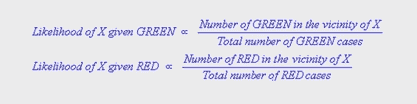
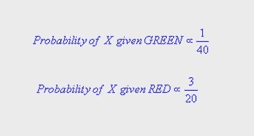
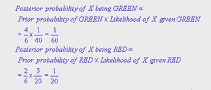

# 朴素贝叶斯分类器

> 原文：<https://www.edureka.co/blog/naive-bayes-classifier/>

[//www.youtube.com/embed/qpIHtF53b08](//www.youtube.com/embed/qpIHtF53b08)

## **朴素贝叶斯分类器**

基于贝叶斯定理，朴素贝叶斯分类器是一种具有强独立假设的简单概率分类器。它假设特定特征的存在与否与另一特征的存在与否无关。如果一个水果是红色的，圆形的，直径约为 4 英寸，它就可以被认为是苹果。即使这些特征依赖于另一个特征的存在，分类器也会考虑所有这些属性对水果是苹果的贡献。

## **例如**

上面是一个例子，对象分为绿色和红色。任务是对到达的新病例进行分类，并了解它们属于哪一类，即红色或绿色。

这里我们看到绿色物体的数量是红色物体的两倍，有理由相信这个新物体很可能与绿色而不是红色联系在一起。在贝叶斯理论中，它被称为先验概率。先验概率基于以前的经验，用于在实际发生之前预测结果。因此我们可以写

绿色的先验概率= 绿色物体的数量 = 40

对象总数 60

红色的先验概率= 红色物体的数量 = 20

对象总数 60

**确定先验概率**

我们现在准备对先验概率进行分类。如图所示，有一个白色物体(X)和一个围绕它的圆圈。该圆被称为 X 的附近。如前所述，新对象即白色对象可能属于绿色，因为它的数量大，但是在 X 的附近，附近的红色的数量比绿色多。由此我们计算出可能性:

可能性进一步指示 X 的类成员资格是红色的，因为在 X 的附近有更多的红色。根据贝叶斯分类，通过组合先验和可能性以获得后验概率来判断最终结果。

最后，我们将 X 分类为属于红色，因为它的后验概率很高。

有问题要问我们吗？在评论区提到它们，我们会给你回复。

**相关帖子:**

[关联规则挖掘与数据科学](https://www.edureka.co/blog/association-rule-mining/)

[应用 Hadoop 与数据科学](https://www.edureka.co/blog/applying-hadoop-with-data-science/)

[数据科学入门](https://www.edureka.co/data-science)