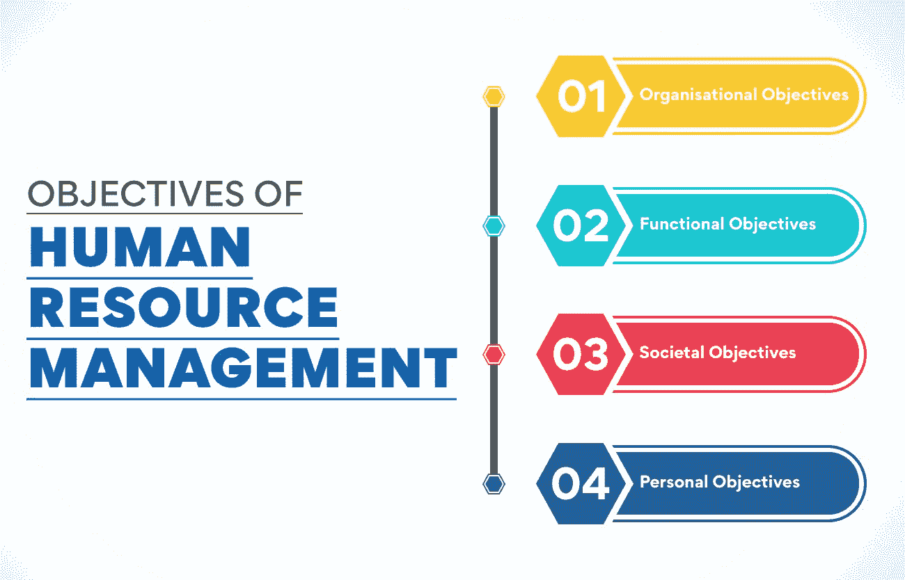
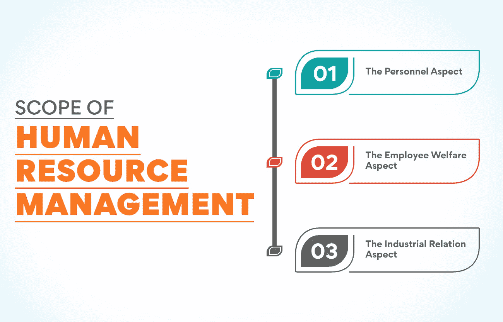

# 人力资源管理的目标和性质

> 原文：<https://www.edureka.co/blog/nature-of-human-resource-management/>

人力资本是现代商业的一个重要方面。这两个词将员工描述为对公司有益的资源或资产。然而，人们通常不那么简单，会有一堆个人和团体的需求。这就是人力资源管理的用武之地。人力资源管理是一种实践，涉及招聘，雇用，培训和管理一个组织的雇员。多年来，[人力资源管理](https://www.edureka.co/blog/role-of-human-resource-management-in-an-organization/) 的性质已经从其他管理领域下的一项职能演变为在整体业务战略中保持其关键支柱的地位。

*Human resource management is all about having the right people, with the right capabilities, in the right place, at the right time! ***Human resource management can be your ideal job if you like to approach and encourage people. The tasks of an HR manager do not include only hiring and firing. It also involves activities such as job design, [employee relations](https://www.edureka.co/blog/employee-relations), overseeing payroll, and managing staff benefits. To successfully carry out your duties, you must know the nature of human resource management and its objectives. However, first, let’s understand what human resource management is.

## **了解人力资源管理**

在当今竞争激烈的商业世界中，没有一个组织能够想象没有一支高效的员工团队或人力资源就能生存。为了留住这些高效的员工，有效地管理人力资源非常重要。人力资源管理被定义为在一个组织中获取、招聘和留住员工的过程。

人力资源管理在一个组织中为员工和公司的发展服务于多种基本目的。这对一个组织和它的员工都是至关重要的。对于一个组织来说，人力资源管理的目标是保持积极的工作文化，实现组织的目标。对于员工来说，人力资源管理为他们提供了实现组织目标的方向，激励他们在未来更高效地工作。

## **人力资源管理的本质**

人力资源管理将人们聚集在一个组织中。为什么？确保个人和组织的目标都能实现！人力资源管理的本质有以下特征 :-

**亦读:[人力资源管理的演变:过去与未来](https://www.edureka.co/blog/evolution-of-human-resource-management)**

*   **管理过程**

人力资源管理是管理的重要组成部分，包括计划、组织、人员配备、指导和控制人力资源以实现组织的成功。这是一个有效利用人力资源来实现组织目标的管理过程。

*   **艺术与科学并存**

人力资源管理是艺术和科学的混合体。它是一门艺术，因为它涉及人的创造性、知识、技能和天赋等定性属性。简单地说，人力资源管理是让他人有效地完成工作的艺术。人力资源管理是一门科学，因为它需要不同的科学技术来进行招聘、选拔、培训和评估员工等活动。

*   **无孔不入的力量**

人力资源管理是一个组织固有的一部分，在本质上是无处不在的。这意味着在所有商业和非商业企业中，人力资源管理存在于不同的管理职能领域，如财务、营销和生产。组织中从上到下的每个人都必须定期履行人力资源管理职能。

*   **改善员工关系**

*“In order to build a rewarding employee experience, you need to understand what matters most to your people.” – Julie Bevacqua.***Human resource management is concerned with building healthy relationships between employees at various organisational levels. Every individual has different needs, goals, and expectations. HRM deals with these individual factors and motivates employees to reach their maximum potential. Moreover, it creates an organisational culture that fosters learning and growth. 

*   **以人为本**

人力资源管理的本质是以人为本，与所有类型的组织都相关。它关系到从上到下的每一个员工。人力资源管理重视个人和群体。此外，它鼓励人们充分开发自己的潜力，实现个人和组织的目标。

*   **开发型**

组织中劳动力的发展对人力资源管理的本质至关重要。人力资源经理使用各种工具来帮助员工了解他们的优势并释放他们的潜力。定期培训计划可以提高员工的技能，从而使他们受益。此外，货币和非货币强化可以帮助人们保持动力，表现更好。

*   **面向行动**

虽然人力资源管理遵循规则和政策，但它的主要重点是行动和结果，而不是规则。人力资源经理强调为员工问题、紧张或争议提供有效解决方案的重要性。

*   **前瞻性**

在竞争激烈的商业环境中生存需要组织规划长期战略。人力资源管理是一种面向未来的方法，它评估人力资源需求，并确保所需人员在正确的时间出现在正确的地点。凭借人力资源管理的前瞻性本质，管理者通过激励、培训和发展为员工做好准备，以面对不断变化的商业环境中当前和未来的挑战。

*   **连续过程**

人力资源管理不是“一次性”的职能。相反，这是一个永无止境的过程，必须持续执行才能有效实现组织目标。它包括一系列的任务，首先是确定人力资源需求，然后是招聘、培训、绩效评估和考核。

*   **其他功能区的基础**

人力资源管理是所有其他管理职能领域的基础，如财务、生产和营销。这些部门的有效性取决于其人力资源管理的有效性。

*   **跨学科功能**

人力资源管理本质上是多学科的。人力资源经理利用不同学科的知识和输入来有效地管理员工队伍。人力资源管理的五大学科包括管理学、传播学、心理学、社会学和经济学。为了有效地管理人力资源，人们必须了解所有这些学科对人力资源管理的贡献。

如果你想得到你梦想中的人力资源管理工作或获得晋升，请参加我们的[人力资源管理研究生证书课程](https://www.edureka.co/highered/human-resourse-management-course-iim-shillong)。该课程将帮助你理解人力资源管理的本质。此外，你将获得有效管理人力资源所需的知识和技能。

## **人力资源管理的目标**

人力资源管理的主要目标是通过在正确的时间将人员安排在正确的位置来满足组织的人力资本需求。此外，它旨在实现最大限度的员工发展，并有助于实现组织目标。人力资源管理的四个主要[目标包括:-](https://www.edureka.co/blog/objectives-of-human-resource-management/)

*   **组织目标**

在一个组织中，人力资源管理的目标是保持一支有能力的员工队伍。怎么会？通过规划、招聘、选择、培训和发展人力资源来促进组织的成长、扩张和生存。

人力资源管理的另一个重要组织目标包括为其他部门提供便利，并帮助他们顺利运作。以行动为导向的人力资源管理有助于组织实现其目标。作为人力资源经理，你应该确保有效利用人力资源来帮助组织实现目标。

*   **功能目标**

人力资源管理负责组织内不同职能部门之间的协调。它组织和分配资源，以有效地实现业务目标。

人力资源管理的目标是为每个职能部门提供拥有所需技能和知识的员工。为了实现人力资源管理的这一本质，人力资源经理必须确保员工按时完成工作。此外，不断为员工提供机会并引导他们朝着组织的目标前进也很重要。

*   **社会目标**

人力资源管理部门负责确保组织的每个层面都符合社会的法律和道德标准。人力资源管理的活动应该对社会负责，满足社会的需要、要求和挑战。因此，人力资源经理必须确保可用资源用于社会福利。

为了实现这一目标，人力资源经理制定了满足员工心理、社会、道德和经济需求的计划。这些项目的一些例子包括平等机会、[薪酬和福利](https://www.edureka.co/blog/compensation-in-hrm)以及社区关系。通过实现员工的社会目标，人力资源管理旨在激励和留住高效的员工。

**也读作:[人力资源管理的关键基础](https://www.edureka.co/blog/fundamentals-of-human-resource-management/)**

*   **个人目标**

员工与组织的长期关系和承诺取决于他们实现个人目标的能力。因此，人力资源管理强调实现员工个人目标和增加他们对组织贡献的重要性。

为了防止员工绩效下降，人力资源经理必须帮助员工实现工作与生活的平衡。还应为他们提供充分的培训和关于他们表现的反馈。为什么？因为这有助于员工识别薄弱环节并加以纠正。

人力资源管理的其他一些目标如下:-

*   **培养更好的工作文化**

改善员工关系是人力资源管理的固有性质。员工关系最重要的一个方面是他们的工作环境。有效的人力资源管理需要发展促进更好的工作文化的战略。培养工作文化的一些例子包括发展和维护团队成员之间的健康关系，授权员工，以及采用快速入职流程。

*   **采用团队整合工具**

有效的团队协作是人力资源管理的主要目标之一。更高的生产率是组织中员工之间恰当联系的结果。你会问，如何实现这一点？通过确保不同企业级别的个人和团体之间的轻松沟通！因此，人力资源经理寻找工具或门户来提高数据可用性，使集成更加顺畅和容易。

*   **提高员工参与度**

虽然公司的每个部门都可以而且应该实施员工参与计划，但人力资源管理对于成功的员工参与措施至关重要。人力资源经理在组织内组织各种事件、活动和庆祝活动，这不仅有助于团队发展和员工参与，还能培养员工的信心。此外，提高员工参与度可以帮助人力资源经理影响员工的留任、福利和生产力。

*   **定义组织结构**

虽然重要，但为正确的任务雇用正确的人只是整个过程的一小部分。一旦雇员被雇佣，人力资源部门需要定义一个组织结构来培养雇员的技能。制造企业所需的组织结构与医院或学术机构有很大不同。HRM 负责识别在特定工作环境中可行的结构和实践。

现在你已经知道了人力资源管理的本质和组织中人力资源经理的目标，让我们来理解人力资源管理的范围。

## **人力资源管理的范围**

人力资源管理的范围很广。组织中每个大大小小的部门都需要人力资源，因此也需要人力资源管理。人力资源管理的[范围可以分为三个不同的方面:-](https://www.edureka.co/blog/scope-of-human-resource-management/)

*   **人事方面**

确保每个员工的个人成长是人力资源管理的本质，它可以间接影响组织的整体成长。这一方面涉及评估人力资源需求、招聘、甄选、安置、晋升、培训和发展、调动、奖励、薪酬、生产率、裁员、裁员等活动。

*   **员工福利方面**

目标是确保适当的工作条件和便利设施，如食堂、托儿所、午餐室、洗手间、住房、交通、娱乐设施等。，在工作场所。HRM 负责消除工作场所的危险，为员工提供工作安全、教育、健康和医疗服务等。

*   **劳资关系方面**

目标是维护组织的和平与和谐。怎么会？通过与工会互动，解决他们的不满，并解决争端！这方面包括工会与管理层的关系、协商、谈判、申诉行动和争端解决。

## **总结一下！**

人力资源管理在一个组织的平稳运行中起着不可或缺的作用。这是一个复杂的过程，需要人力资源经理每次都设计不同的解决方案。随着人力资源管理性质的不断演变，今天的管理者需要更多的耐心、谨慎的方法和外交态度来处理一个组织的人力资源。越来越多的公司意识到在正确的时间为正确的工作雇佣正确的人的重要性。

人力资源管理岗位呈上升趋势；因此，人们不断寻求变得更有能力和更专业。由于激烈的人力资源竞争，只有具备合适技能的合格人才能够在一个有发展机会的公司找到他们梦想的工作。用相关技能武装自己的最好方法？加入我们的人力资源管理研究生证书课程。该课程可以帮助你了解当前的人力资源趋势，并获得关键的人力资源技能。你还在等什么？立即注册！

## **更多信息:**

[什么是人力资源管理系统？](https://www.edureka.co/blog/human-resource-management-system/)

[人事管理与人力资源管理的区别](https://www.edureka.co/blog/difference-between-personnel-management-and-human-resource-management/)

[重点领域:人力资源管理](https://www.edureka.co/blog/human-resource-management-emphasis)

[制定有效人力资源战略的终极指南](https://www.edureka.co/blog/ultimate-guide-to-developing-an-effective-hr-strategy/)****