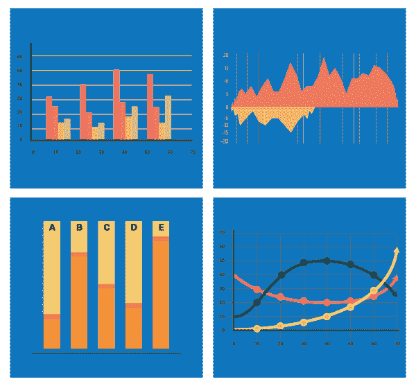

# 数据可视化的需求和优势

> 原文：<https://www.edureka.co/blog/needs-and-benefits-of-data-visualization/>

今天，我们看到数据可视化受到前所未有的欢迎。了解和理解它的组织喜欢它的存在。由于大数据是当今科技界的一个流行术语，涉及从金融到通信的各个行业，因此推动更好的业务决策是当务之急。因此，组织正在寻找更好的数据可视化工具，将他们的基本数据负载转化为更容易理解的内容。

## **需要智能数据可视化**

商业智能和数据分析应用程序的开发人员越来越多地使用先进的数据可视化技术来处理海量数据，帮助信息工作者更好地解释分析结果。

如今，企业正受到数据的狂轰滥炸，因此，有必要将数据转化为明智的业务决策。虽然大多数传统的商业智能工具面向市场分析师或少数决策者，但数据可视化被视为使商业分析可用于更广泛受众的一种方式。

数据可视化的交互式工具，如 Dygraphs、ZingChart、FusionCharts 和许多其他工具，可以更好地理解数据集的关系和趋势。这些工具最初是由组织开发的临时解决方案，用于解决一组特定数据中的特定问题，现在已经非常流行。因此，各公司竞相开发更好、更快的数据可视化工具，进而期望数据可视化是处理大数据的魔杖。

## **你的公司真的需要数据可视化吗？**

虽然成功案例利用了对数据可视化的需求，但数据分析师和程序员必须确保他们提出了正确的问题并使用了正确的方法，以便生成有价值的数据分析。毕竟，数据可视化不可能适合所有人。组织需要问自己是否真的需要这些工具。

数据可视化可能非常昂贵，尤其是涉及海量数据和复杂算法的时候。如果你卖的是简单问题的解决方案，数据可视化可能不值得花钱。例如，像可口可乐和雀巢这样的公司不需要交互式图形来解释他们的产品。如果你的组织卖的是想法而不是产品，那么也许你可以引入数据可视化。

另一方面，许多非政府组织和出版商以及其他专业公司已经接受了数据可视化。有一些金融服务机构采用了这些工具来帮助你密切关注你的资金流向。此外，向在线观众解释一个复杂的想法需要一定程度的个性化、细节和开放性，只有交互式可视化才能提供这些。

这些组织让他们的观众摆弄他们的数据，使他们的发现更有用、更有说服力。当然，这是底线，因为这样的体验必须给你的用户带来价值，希望以销售和推荐的形式给你的组织带来回报。

## **数据可视化的好处**

根据 IDC 的研究，到 2015 年底，全球数据生产的年增长率预计将是 2012 年的两倍。数据可视化工具和技术为管理人员和其他人提供了新的方法来显著提高他们掌握隐藏在数据中的信息的能力。

以下是数据可视化为决策者及其组织带来的一些好处:

**1。构建吸收信息的方式**

数据可视化使用户能够接收关于操作和业务条件的大量信息。它允许决策者看到多维数据集之间的联系，并通过使用热图、热图和其他丰富的图形表示提供了解释数据的新方法。使用可视化数据发现的组织更有可能找到他们需要的信息，然后最终比其他公司更有效率。

一项调查显示，使用可视化数据发现工具的经理比那些只依赖托管报告和仪表板的经理发现及时信息的可能性高 28%。此外，在使用可视化数据发现的公司中，48%的商业智能用户能够在大多数情况下找到他们需要的信息，而无需 IT 人员的任何帮助。

**2。将商业中的关系和模式可视化**

假设一家网络提供商公司正在查看他们的每月客户数据，他们看到一个条形图，显示该公司的净推广得分(NPS)在过去一个月中在该特定地区下降了 5 个点；数据表明，这个领域的客户满意度存在问题，但没有提供任何关于 NPS 下跌原因的见解。

这些是数据可视化的主要优势之一，使用户能够有效地看到运营条件和业务绩效之间的联系。在当今竞争激烈的商业环境中，找到这些数据之间的相关性非常重要。

通过提供业务和运营动态的多方面视图，数据可视化允许高级领导团队看到该特定区域的客户呼叫中心的首次联系解决率，该解决率最近有所下降，极大地影响了客户满意度。进行这种关联的能力使高管们能够识别问题的根本原因，并迅速采取行动解决问题。

**3。更快地顺应新兴趋势**

公司能够收集的关于客户和市场状况的大量数据可以为企业领导者提供关于新收入和商业机会的见解。使用数据可视化将使决策者能够跨多个数据集更有效地掌握客户行为和市场条件的变化。

企业领导人可以利用数据可视化看到，随着宏观经济状况的改善，不仅顾客在商店的支出增加，而且对购买现成食品的兴趣也越来越大。观察客户的情绪和其他数据可以发现，该公司正面临一个新的机遇，可以抢在竞争对手之前抓住新的商机。

**4。地理空间可视化**

最近在商业领域出现的另一个数据可视化领域是地理空间可视化。地理空间可视化的流行是由于许多网站提供网络服务，吸引了访问者的兴趣。这种类型的业务需要利用位置特定的信息，这些信息已经以客户邮政编码的形式存在于系统中，从而提供更好的日常分析体验。这种类型的可视化为图形增加了新的维度，并有助于更好地理解问题。

有问题要问我们吗？请在评论区提到它，我们会给你回复。

**相关帖子:**

[上手数据可视化用 Tableau](https://www.edureka.co/tableau-training-for-data-visualization)