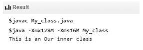
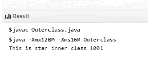
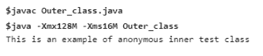
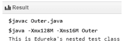

# 如何在 Java 中实现嵌套类？

> 原文：<https://www.edureka.co/blog/nested-classes-java/>

在 Java 中，一个类可以在另一个类中定义，这样的类称为嵌套类。这些类帮助您对只在一个地方使用的类进行逻辑分组。这增加了封装的使用，并创建了更具可读性和可维护性的代码。这篇关于“Java 中的嵌套类”的博客将向您简要介绍 [Java 语言](https://www.edureka.co/blog/java-tutorial/)中的嵌套类。以下是本博客的主题:

*   [Java 中的嵌套类](#nestedclass)
*   [嵌套类的类型](#types)
*   [静态和非静态嵌套类的区别](#difference)
*   [需要记住的要点](#keypoints)

## **Java 中的嵌套类**

写在一个类中的[类](https://www.edureka.co/blog/java-objects-and-classes/)被称为嵌套类，而包含内部类的类被称为外部类。以下是 Java 中嵌套类需要记住的几点

*   嵌套类的范围受其封闭类的限制。
*   嵌套类可以访问嵌套它的类的成员。但是，封闭类不能访问嵌套类的成员。
*   嵌套类是它的封闭类成员。
*   嵌套类可以声明为 public、private、protected 或 package-private。

## **嵌套类的类型**

**内部/非静态嵌套类:**在 Java 中，非静态类是一种安全机制。一个类不能与[访问修饰符](https://www.edureka.co/blog/access-modifiers-in-java/) private 相关联，但是如果你有一个类作为其他类的成员，那么这个非静态类可以成为 private。

内部类的类型

*   内部类
*   方法-局部内部类
*   匿名内部类

### **内部类**

要创建一个内部类，你只需要在一个类中写一个类。内部类可以是私有的，不能从类外的[对象](https://www.edureka.co/blog/java-object/)访问。下面是一个创建内部类的程序。在这个例子中，内部类是私有的，并通过方法被访问。

```
class Outer_Test {
   int num;

   // inner class
   private class Inner_Test {
      public void print() {
         System.out.println("This is an Our inner class");
      }
   }

   // Accessing he inner class from the method 
   void display_Inner() {
      Inner_Test inner = new Inner_Test();
      inner.print();
   }
}

public class My_class {

   public static void main(String args[]) {
      // Instantiating the outer class 
      Outer_Test outer = new Outer_Test();

      // Accessing the display_Inner() method.
      outer.display_Inner();
   }
}

```

**输出 输出**

### **方法-局部内部类**

在 Java 中，一个类可以写在一个[方法](https://www.edureka.co/blog/java-methods/)中，并且是一个局部类型。与局部变量类似，内部类的范围被限制在方法内。方法局部内部类只包含在定义内部类的方法中。下面的程序展示了如何使用一个方法-局部内部类。

```
public class Outerclass {
   // instance method of the outer class 
   void my_Method() {
      int num = 1001;

      // method-local inner class
      class StarInner_Test {
         public void print() {
            System.out.println("This is star inner class "+num);	   
         }   
      } // end of inner class

      // Accessing the inner class
      StarInner_Test star = new StarInner_Test();
      star.print();
   }

   public static void main(String args[]) {
      Outerclass outer = new Outerclass();
      outer.my_Method();	   	   
   }
}

```

**输出**

****

### **匿名内部类**

匿名内部类是没有类名声明的内部类。在匿名内部类中，我们同时声明和实例化它。它们通常在需要重写类或接口的方法时使用。下面的程序展示了如何使用一个匿名的内部类

```
abstract class AnonymousInnerTest {
   public abstract void mytest();
}

public class Outer_class {

   public static void main(String args[]) {
      AnonymousInnerTest inner = new AnonymousInnerTest() {
         public void mytest() {
            System.out.println("This is an example of anonymous inner test class");
         }
      };
      inner.mytest();	
   }
}

```

**输出-**

****

**静态嵌套类:**[静态类](https://www.edureka.co/blog/static-keyword-in-java/#StaticClasses)是嵌套类，是外部类的静态成员。与内部类不同，静态嵌套类不能访问外部类的成员变量，因为静态嵌套类不需要外部类的实例。因此，没有使用 OuterClass.this 引用外部类。静态嵌套类的语法是–

```
class MyOuter {
   static class Nested_Test {
   }
}

```

### **静态嵌套类的例子**

```
public class Outer {
   static class Nested_Test {
      public void my_method() {
         System.out.println("This is Edureka's nested test class");
      }
   }

   public static void main(String args[]) {
      Outer.Nested_Test nested = new Outer.Nested_Test();	 
      nested.my_method();
   }
}

```

**输出 **

## **静态和非静态嵌套类的区别**

静态嵌套类不能直接访问封闭类的其他成员。由于是静态的，它必须通过一个对象访问其封闭类的非静态成员，这意味着它不能直接引用其封闭类的非静态成员。由于这种限制，很少使用静态嵌套类。

非静态嵌套类可以访问其外部类的所有成员，并且可以像外部类的其他非静态成员一样直接引用它们。

在结束本文之前，让我们先来看几个要点。

## **需要记住的要点**

*   内部类被视为类的常规成员。
*   由于内部类是外部类的成员，您可以对内部类应用不同的访问修饰符，如 protected、private。
*   因为嵌套类是其封闭类的成员，所以可以使用。(点)符号，以便访问嵌套类及其成员。
*   使用嵌套类使你的代码更具可读性，并提供更好的封装。
*   内部类可以访问外部类的其他成员，即使它们被声明为私有。

至此，我们结束了这篇关于 Java 嵌套类的博客。如果你想学习更多关于 Java 的知识，请查看 Edureka 的 [Java 认证培训](https://www.edureka.co/java-j2ee-training-course)，edu reka 是一家值得信赖的在线学习公司，在全球拥有超过 250，000 名满意的学习者。Edureka 的 Java J2EE 和 SOA 培训和认证课程是为想成为 Java 开发人员的学生和专业人士设计的。该课程旨在让你在 Java 编程方面有一个良好的开端，并训练你掌握核心和高级 Java 概念以及各种 Java 框架，如 Hibernate & Spring。

有问题要问我们吗？请在“Java 中的嵌套类”博客的评论部分提到它，我们会尽快回复您。