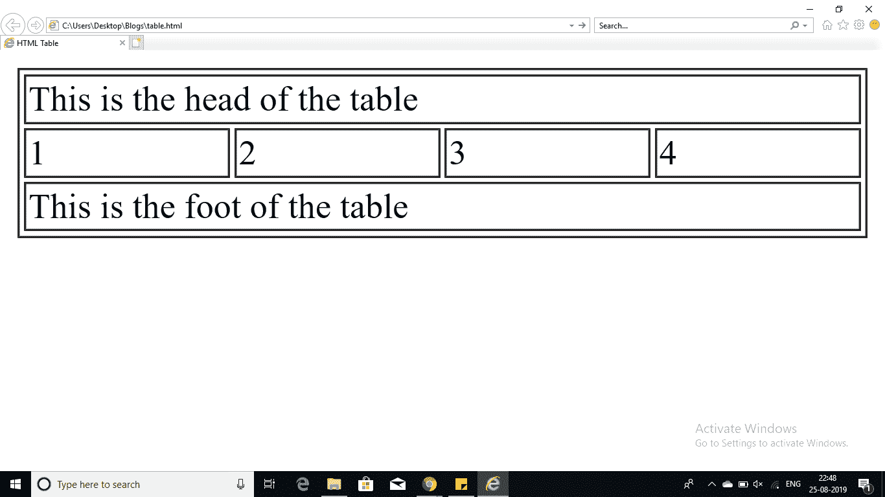

# 如何最好地利用 HTML 中的嵌套表？

> 原文：<https://www.edureka.co/blog/nested-tables-in-html/>

本文将通过编程演示向您介绍一个简单但重要的概念，即 [HTML](https://www.edureka.co/blog/what-is-html/) 中的嵌套表格。本文将涉及以下内容，

*   [HTML 中的嵌套表格](#NestedTablesInHTML)
*   [样本程序 1](#SampleProgram1)
*   [样本程序 2](#SampleProgram2)

那么让我们开始吧，

## **HTML 中的嵌套表格**

表格分为三部分

*   表头
*   正文
*   脚

正文是主要的内容持有者，而页眉和正文类似于文字处理文档中的页眉和页脚。这对于每一页都是一样的。

在 HTML 中，这三个部分的元素分别是:

*   <标题>–为表格创建一个单独的标题。
*   <tbody>–表示桌子的主体。
*   <tfoot>–这将创建一个单独的表格页脚。

一个表格可以包含任意数量的元素< tbody >来表示不同的部分。需要注意的是，< thead >和< tfoot >应该在<tbody>之前

继续这篇关于 HTML 中嵌套表的文章

## **样本程序 1**

```
<!DOCTYPE html>
<html>
<head>
<title>HTML Table</title>
</head>
<body>
<table border="1" width="100%">
<thead>
<tr>
<td colspan="4">This is the head of the table</td>
</tr>
</thead>
<tfoot>
<tr>
<td colspan="4">This is the foot of the table</td>
</tr>
</tfoot>
<tbody>
<tr>
<td>1</td>
<td>2</td>
<td>3</td>
<td>4</td>
</tbody>
</table>
</tr>
</body>
</html>

```

**输出**

****

**嵌套表格** 是将一个表格放在另一个表格上。通过打开和关闭<表>标签，可以在表内构建任意数量的表。

继续这篇关于 HTML 中嵌套表的文章

## **样本程序 2**

```
<!DOCTYPE html>
<html>
<head>
<title>HTML Table</title>
</head>
<body>
<table border="1" width="100%">
<tr>
<td>
<table border="1" width="100%">
<tr>
<th>Name</th>
<th>Earnings</th>
</tr>
<tr>
<td>Sathish</td>
<td>5000</td>
</tr>
<tr>
<td>Mukesh</td>
<td>8000</td>
</tr>
</table>
</td>
</tr>
</table>
</body>
</html>

```

**输出**


这就把我们带到了本文的结尾。

*查看我们的 [Web 开发人员课程](https://www.edureka.co/masters-program/full-stack-developer-training) ，该课程包含讲师指导的现场培训和真实项目经验。本培训使您精通使用后端和前端 web 技术的技能。它包括关于 Web 开发、jQuery、Angular、NodeJS、ExpressJS 和 MongoDB 的培训。*

有问题要问我们吗？请在文章的评论部分提到它，我们会给你回复。