# 关于亚马逊的网络负载平衡器，你所需要知道的

> 原文：<https://www.edureka.co/blog/network-load-balancer/>

如今的网站很快就像病毒一样传播开来，这样的应用程序需要做好最坏和最好的准备。在这篇博客中，我将讨论网络负载平衡器如何为各种流量准备应用程序。

我将在博客中讨论的话题:

*   [什么是弹性负载均衡器？](#WhatIsElasticLoadBalancer?)
*   [弹性负载平衡器的种类](#TypesOfElasticLoadBalancer)
*   [网络负载均衡器](#NetworkLoadBalancer)
*   [网络负载均衡器的特性](#FeaturesOfNetworkLoadBalancer)
*   [演示创建并演示网络负载均衡器的工作方式](#Demo)

## **什么是弹性负载均衡器？**

在进入什么是[弹性负载均衡器](https://www.edureka.co/blog/elastic-load-balancer-tutorial-application-load-balancer)之前，我们先用一个基于场景的例子来了解一下负载均衡 的概念。你走进一家零售店，拿起你需要买的东西，走向付款柜台。你看，有 3 个柜台是开放的，而且他们都排了很长的队。商店经理看到你和其他顾客变得烦躁。他决定打开另外两个柜台。现在，这三个计数器上的负载减少了，并最终分配给了五个计数器。这让顾客很开心，也减轻了收银员的工作量。这就是负载均衡的概念。


*Load balancing is efficiently distributing the incoming traffic across a group of backend servers. Amazon provides it’s very own service for load balancing called Elastic Load Balancer.*

## ****弹性负载平衡器的种类****

**AWS 提供了三种主要类型的负载平衡器。你可以选择一个最适合你的要求。**

### ****【经典负载均衡器(CLB)****

**这是最基本的负载平衡器形式，它在不同可用性区域的各种 EC2 实例之间分配传入流量。这增加了部署在 EC2 实例上的应用程序的容错能力。您可以随时根据需要在负载平衡器中添加和删除实例。弹性负载平衡器根据传入的流量(动态地)扩展负载平衡器。**

### ****应用负载均衡器(ALB)****

**应用负载平衡器在 OSI 模型的应用层(第七层)运行。您可以向负载平衡器添加侦听器。侦听器主要根据您定义的规则检查来自客户端和路由的连接请求。规则由条件、优先级和目标群体组成。因此，基本上，当侦听器发现客户端连接时，它会检查定义的条件和优先级，并将流量路由到目标组。**

**看看这篇博客吧，它解释了应用程序负载平衡器，并演示了它是如何工作的，这会给你一个更好的想法。**

### ****【NLB】**网络负载均衡器**

**网络负载平衡器在 OSI 模型的第四层，即传输层上运行。它能够每秒处理数百万个客户端请求。它最适合处理不稳定的传入流量。它的延迟非常低，因此被认为是最好和最有效的弹性负载平衡器之一。**

## ****网络负载均衡器****

**正如我前面提到的，网络负载平衡器在 OSI 模型的第四层上运行。它每秒可以处理数百万个客户端请求。它被认为是 AWS 提供的最好和最有效的负载平衡器。**

**与[应用负载均衡器](https://www.edureka.co/blog/application-load-balancer)一样，网络负载均衡器也由监听器组成，监听客户端的连接请求。此侦听器配置指定用于建立前端连接(客户端到网络负载平衡器)和后端连接(网络负载平衡器到实例)的端口和协议。一旦收到连接请求，网络负载平衡器就会分析用户定义的规则，并挑选一个目标组来路由客户端请求。网络负载平衡器通过打开监听程序配置中指定的端口来打开到所选目标的 TCP 连接。**

**您可以选择为网络负载平衡器启用可用性区域。当您这样做时，弹性负载平衡器会在该特定的可用性区域中创建一个负载平衡器节点。每个负载平衡器节点在特定的可用性区域中分发流量。如果为网络负载平衡器启用多个可用性区域，每个负载平衡器节点会在多个可用性区域中的注册目标之间分配流量。这称为跨区域负载平衡器。**

****

**网络负载平衡器使用哈希算法选择目标。此算法基于协议，源 IP，源端口，目的 IP，目的端口，TCP 序列号。因此，基本上，您的网络负载平衡器为您已启用的每个可用性区域创建一个网络接口，该可用性区域中的每个负载平衡器节点使用该网络接口来获取静态 IP 地址。**

## ****网络负载均衡器的特性****

**基于连接的负载平衡–TCP 流量到 EC2 实例、微服务、容器和 IP 地址等目标的负载平衡。**

****高可用性**–如果检测到不健康的目标，则停止路由到该不健康的目标，并根据启用的可用性区域开始路由到相同或不同可用性区域中的健康目标。**

****高吞吐量**——可以应对突发的不稳定流量模式。**

****低延迟**–为性能依赖延迟的应用提供极低的延迟。**

****保留源 IP 地址**–保留客户端 IP 地址。**

****静态 IP 支持**–自动为每个可用性区域提供一个静态 IP。这个静态 IP 可以被部署的应用程序用作负载平衡器的前端 IP。**

****弹性 IP 支持**–除了提供静态 IP，它还提供了为每个可用性区域分配弹性 IP 的选项。**

****健康检查**–支持应用程序和网络目标健康检查。**

****DNS 故障转移**–网络负载平衡器与 Route53 集成，因此，如果遇到任何不健康的目标，它会将流量重新路由到其他健康的目标。**

****与 AWS 服务的集成**–网络负载平衡器与其他 AWS 服务集成，如 AutoScaling、EC2 instances、CloudFormation、CodeDeploy 等。**

## ****Demo 创建并演示网络负载均衡器的工作方式****

**让我们通过创建网络负载平衡器并演示不同 EC2 实例之间的流量路由来了解它的工作原理。我将创建两个 EC2 实例，在两个上部署 Nginx web 服务器，一个显示为 *server1* ，另一个显示为 *server2* ，这样我们就可以区分两者。**

**让我们从创建一个网络负载平衡器开始。**

****步骤 1:** [创建两个 EC2 实例](https://www.edureka.co/community/37968/how-to-create-an-ec2-instance-in-aws-console)并将您的 EC2 实例与您的 cmder 或 putty 连接起来。**

****第二步:**现在您已经创建了 EC2 实例，让我们在它们上面安装 Nginx web 服务器。**

**在两个实例上执行以下命令来安装 Nginx:**

```
**$ sudo apt-get update
$ sudo apt install nginx
$ sudo ufw app list
$ sudo ufw allow 'Nginx HTTP'
$ sudo ufw status**
```

**这应该会给你一个显示活动状态的输出。**

****第三步:**现在，当你访问实例的公共 IP 时，你会看到一个页面，上面写着“欢迎使用 Nginx”。因为我们需要区分这两个服务器，所以让我们将显示改为“欢迎使用 Nginx–server 1”，将另一个显示改为“欢迎使用 Nginx–server 2”。**

**转到以下目录:**

```
**cd /var/www/html
sudo vi index.nginx-debian.html**
```

**在一个实例上将 H1 标签从“欢迎使用 Nginx”更改为“欢迎使用 Nginx–server 1 ”,在另一个实例上更改为“欢迎使用 Nginx–server 2”。**

****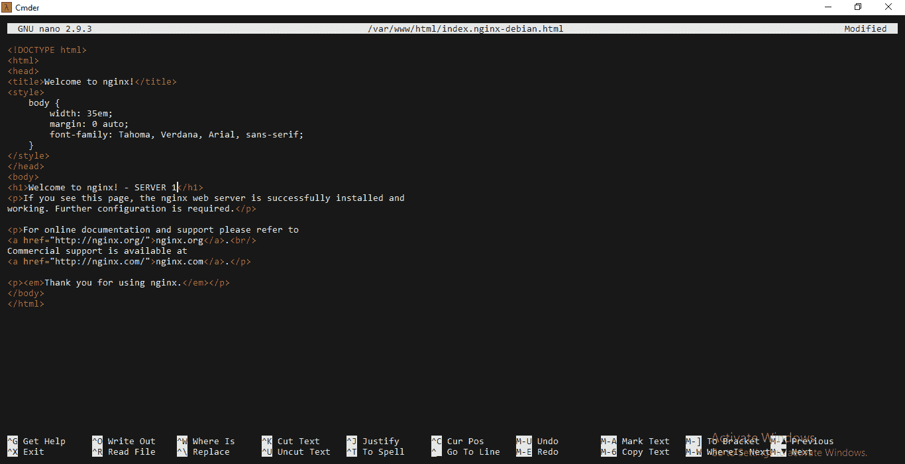****

****第四步:**让我们最后创建一个网络负载均衡器。**

**在导航窗格中的负载平衡下，选择**负载平衡器**。**

**选择**创建负载平衡器**。**

**在选择负载平衡器类型页面上，选择**创建网络负载平衡器****

**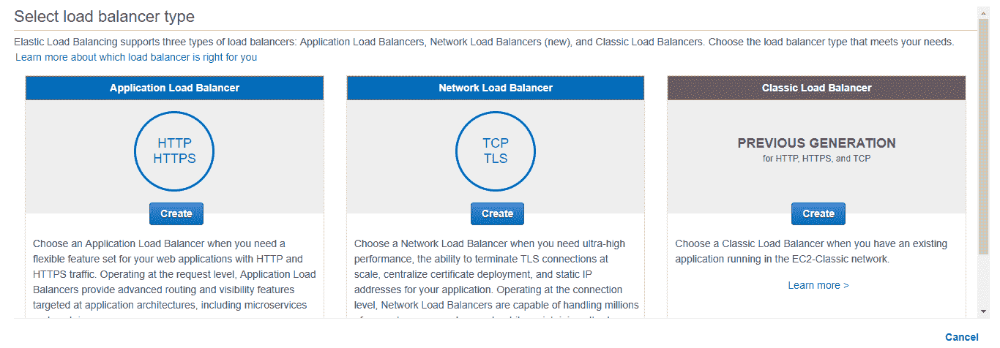**

**让我们**配置负载均衡器**。对于**名称**，键入您希望负载平衡器使用的名称。对于**方案**选择面向互联网或内部。在这种情况下，我选择了面向互联网。面向互联网基本上是通过互联网将来自客户端的请求路由到目标。**

**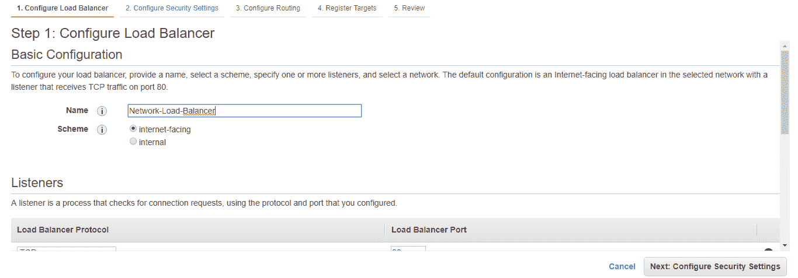**

**对于**侦听器**，默认情况下接受端口 80 上的 TCP 流量，我继续使用相同的默认侦听器配置。如果要添加另一个监听程序，可以选择添加监听程序。**

**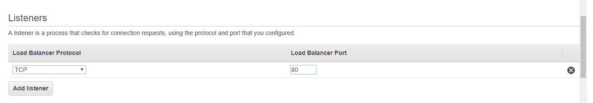**

**为了配置**可用性区域**，选择您用来创建 EC2 实例的 **VPC** 。如果您已经在不同的可用性区域中创建了实例，则选择这些可用性区域并为该特定可用性区域划分子网。**

**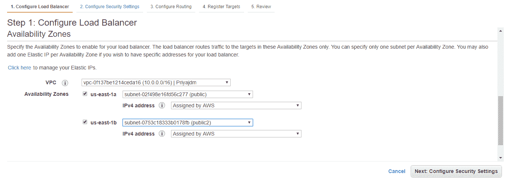**

**选择**下一步:配置安全设置。**你会看到如下图所示的警告。但这只是一个警告，你可以忽略它。**

**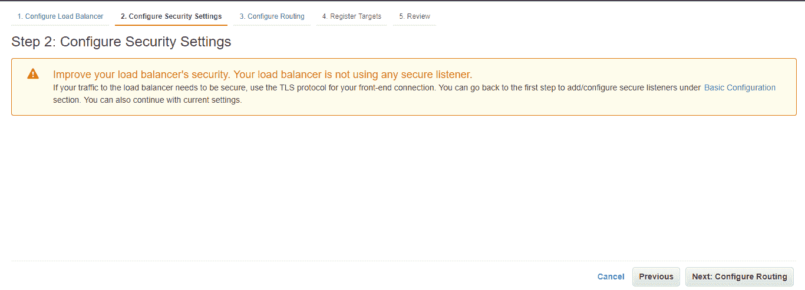**

**对于目标组，保持默认设置**新建目标组。****

**对于**名称**，输入您希望新目标群体使用的名称。**

**根据需要设置**协议**和**港口**。**

**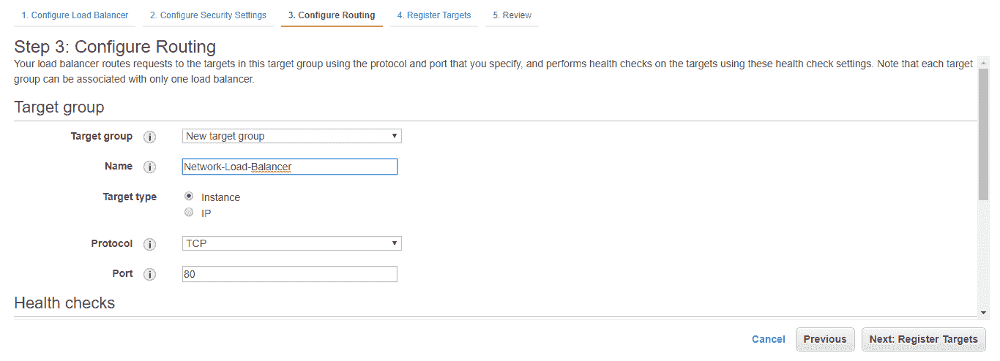**

**其余部分保留默认设置。**

**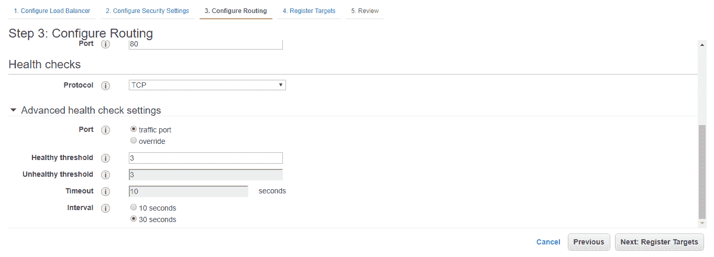**

**点击**下一步:注册目标。****

**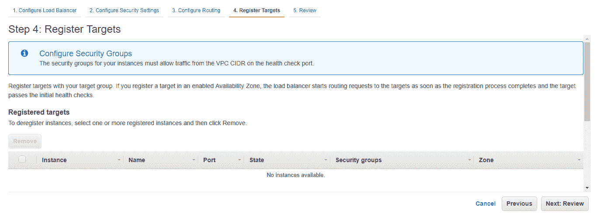**

**向目标群体注册您的实例，然后点击**下一步:查看。**检查您的负载平衡器，然后最后点击**创建。****

**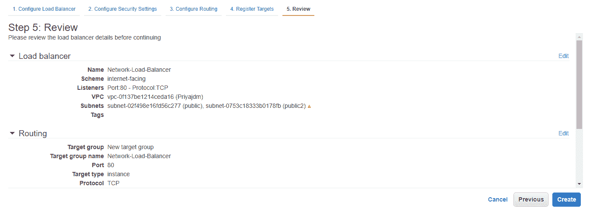**

**您将会看到您的负载平衡器正在进行配置。**

**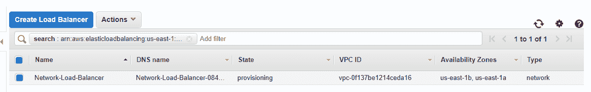**

**给它几分钟，你会看到它的状态是活动的。**

**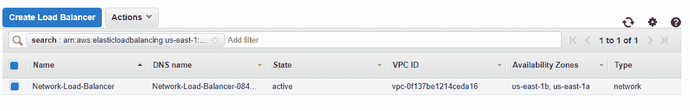**

**现在你已经创建了负载均衡器，让我们测试一下它是否工作正常。复制您的负载平衡器的 DNS 名称，并将其像 URL 一样粘贴到搜索引擎上。您应该会看到您的第一个实例的 Nginx 页面。**

**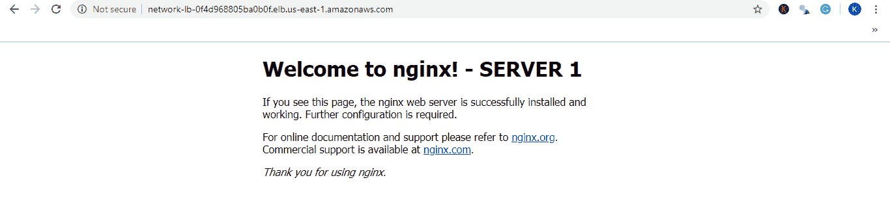**

**现在，您转到另一个浏览器，将相同的 DNS 名称粘贴为 URL，它应该会向您显示第二个实例的部署。**

**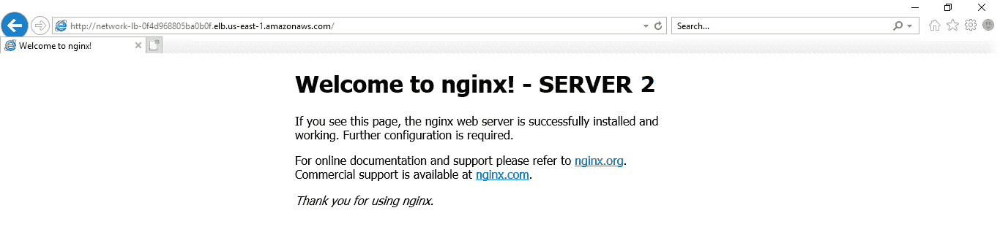**

**现在，您的两个 EC2 实例上的负载都将由这个负载平衡器处理。测试负载平衡器工作情况的另一种方法是关闭一个实例，并检查它的部署是否部署在负载平衡器的 DNS 上。**

**这个网络负载平衡器博客到此结束。我希望你们已经理解了亚马逊提供的这项令人惊叹的服务背后的概念。更多此类博客，请访问“ **[Edureka |博客](https://www.edureka.co/blog/)** ”。**

***如果您希望了解更多关于云计算的知识，并在云计算领域建立自己的事业，请查看我们的[云计算课程](https://www.edureka.co/cloud-computing-certification-courses)，该课程提供有讲师指导的现场培训和真实项目体验。本培训将帮助您深入了解云计算，并帮助您掌握这门学科。***

***有问题吗？请在评论区提及，我们会回复您**或**在[**edu reka | Community**](https://www.edureka.co/community)发布您的问题。在 Edureka 社区，我们有超过 100，000 名技术狂热分子随时准备提供帮助。***