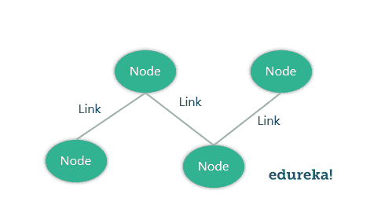
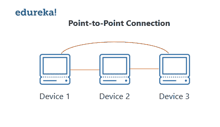
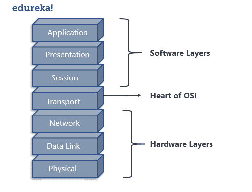
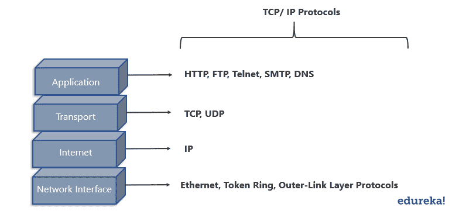
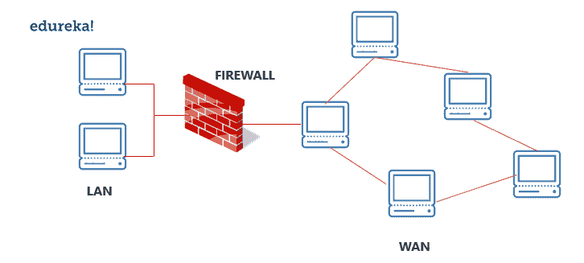
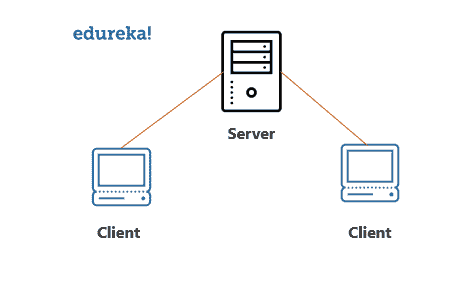

# 2023 年网络面试题怎么准备？

> 原文：<https://www.edureka.co/blog/interview-questions/networking-interview-questions/>

网络知识是每次面试最关键的要求。通常，这些问题看起来很简单，但是当你继续回答它们的时候却变得令人困惑。在这篇文章中，你将学习一些最重要的网络面试问题及其答案。

首先，这里有十个最重要的网络面试问题:

[Q1。区分路由器、集线器和交换机。](#shr) [Q2。什么是链接？](#link) [Q3。你说的节点是什么意思？](#node) [Q4。骨干网是什么意思？](#backbone) [Q5。什么是网络拓扑？](#networktopology) [Q6。解释什么是兰？](#lan) [Q7。什么是路由器？](#routers)T22【Q8】。什么是点对点网络？ [Q9。什么是 OSI 模型？](#osi) [Q10。简要介绍 OSI 模型中的每一层。](#osilayers)

## **Q1。区分路由器、集线器和交换机。**

| 中心 | 转换 | 路由器 |
| 连接两个或多个以太网设备 | 连接两个或多个局域网设备 | 可以连接设备或局域网和广域网 |
| 不执行过滤 | 在转发数据包之前对其进行过滤 | 高度配置以过滤和发送数据包 |
| 最不智能、最不昂贵、最不复杂 | 类似于集线器，但更有效 | 极其聪明和复杂 |

## **Q2。什么是链接？**

链接基本上是两台或多台计算机或设备之间的连接。它可以是任何东西，取决于它是物理连接还是无线连接。物理链路包括电缆、集线器、交换机等，无线链路包括无线接入点、路由器等。

## **Q3。你说的节点是什么意思？**

网络中的交叉点称为节点。节点可以在网络内发送或接收数据/信息。例如，如果两台计算机连接形成一个网络，则该网络中有 2 个节点。同样，万一有电脑，也会有三个节点等等。节点不必是计算机，它可以是任何通信设备，如打印机、服务器、调制解调器等。

## **Q4。骨干网是什么意思？**

在任何系统中，主干是支持所有其他组件的最主要组件。类似地，在网络中，主干网络是一种将它所属的网络的各个部分互连起来的网络，并且具有高容量的连接基础设施。

## **Q5。什么是网络拓扑？**

计算机网络的物理布局称为网络拓扑。它给出了网络中所有设备如何连接的设计。

| 类型 | 描述 |
| 总线拓扑 | 所有设备共享一条公共通信线路 |
| 星形布局 | 所有节点都连接到中央集线器设备 |
| 环形拓扑 | 每个节点恰好连接到另外两个节点 |
| 网状拓扑 | 每个节点都连接到一个或多个节点 |
| 树形拓扑(分层拓扑) | 类似于星型拓扑，继承了总线拓扑 |
| 菊花链拓扑 | 所有节点都是线性连接的 |
| 混合拓扑 | 节点以多种拓扑样式连接 |
| 点对点拓扑 | 连接两台主机，如计算机、服务器等 |

## **Q6。解释什么是兰？**

LAN 或局域网位于小型物理位置的设备之间的网络。它可以是无线的，也可以是有线的。一个局域网与另一个局域网的不同之处在于以下因素:

*   拓扑:网络中节点的排列
*   协议:指数据传输的规则
*   媒体:这些设备可以使用光纤、双绞线等连接

## **Q7。什么是路由器？**

路由器是在网络中传输数据包的设备。它主要执行网络中的流量导向功能。数据包可以是任何东西，如电子邮件、网页等。路由器位于两个或多个网络的交汇处或网关处。

路由器可以是独立设备，也可以是虚拟设备。独立路由器是传统设备，而虚拟路由器实际上是软件，其行为类似于物理路由器。

## **Q8。什么是点对点网络？**

点对点网络是指两个节点之间的物理连接。它可以在网络的任何设备之间，例如计算机、打印机等。

## ****

例如，正如您在上图中看到的，所有节点都相互连接，即设备 1 连接到设备 2 和设备 3，设备 2 连接到设备 3 和设备 1，设备 3 使用物理链路连接到设备 2 和设备 1。

## **Q9。什么是 OSI 模型？**

OSI 代表开放系统互连。它是一个概念模型，规范了电信的通信功能。它有 7 层，分别是:

1.  物理层
2.  数据链路层
3.  网路层
4.  传输层
5.  会话层
6.  表示层
7.  应用层

## ** Q10。简要介绍 OSI 模型中的每一层。**

| 图层名称 | 草案 | 描述 |
| 物理层 | 标志 | 通过物理链路传输原始数据位 |
| 数据链路层 | 基本框架 | 通过物理层连接的节点之间数据帧的可靠传输 |
| 网路层 | 小包裹 | 构建和管理包含多个节点的网络，包括寻址、路由和流量控制 |
| 传输层 | 段、数据报 | 网络不同点之间数据包的可靠传输 |
| 会话层 | 数据 | 管理沟通会话 |
| 表示层 | 数据 | 服务设备和应用程序之间的数据传输 |
| 应用层 | 数据 | 指定共享的通信协议和接口方法 |

要详细了解 Java 和 Python 中的网络编程，请参考以下博客:

*   [Java 中的套接字编程](https://www.edureka.co/blog/socket-programming-in-java/)
*   [Python 中的套接字编程](https://www.edureka.co/blog/socket-programming-python/)

## **Q11。匿名 FTP 是什么意思？**

匿名 FTP 是允许用户访问公共数据的一种方式。用户不需要向服务器表明自己的身份，必须匿名登录。

因此，如果你被要求使用匿名 ftp，确保你添加“匿名”代替你的用户 id。匿名 FTP 在向许多人分发大文件时非常有效，无需提供大量的用户名和密码组合。

## **Q12。网络的意义是什么？**

网络是不同设备之间的连接。这些设备使用物理或无线连接相互通信。物理连接包括双绞线、光纤和同轴电缆..无线网络可以借助无线电波、红外线波和微波等波来建立。网络基本上有多种用途，例如:

*   共享硬件设备，如打印机、输入设备等
*   以多种方式帮助沟通，如音频、视频、电子邮件、信息等
*   使用虚拟设备帮助共享数据和信息
*   他们也帮助分享安装在其他设备上的软件

## **Q13。子网掩码是什么意思？**

子网掩码是描述网络中可以使用的 IP 地址范围的数字。它们用于分配子网络或子网。这些子网是连接到互联网的各种局域网。

这个子网掩码基本上是一个 32 位的数字，它屏蔽 IP 地址，然后将 IP 地址分成两部分，即网络地址和主机地址。子网掩码是通过将所有网络位设置为“1”并将所有主机位设置为“0”来创建的。有两个网络地址不能分配给网络上的任何主机，即分配给网络和广播地址的“0”和“255 ”,这就是它们不能分配给任何主机的原因。

## **Q14。简要描述 TCP/ IP 模型。**

TCP/ IP 模型是 OSI 模型的压缩版本。与 OSI 模型不同，该模型包含 4 层，分别是:

1.  流程(应用层)
2.  主机到主机(传输层)
3.  互联网层(网络层)
4.  网络接入(物理层和数据链路层的组合)

** Q ** ** 15。OSI 模型和 TCP/ IP 模型有什么区别？**

| TCP/ IP 模型 | OSI 模型 |
| 有四层 | 有七层 |
| 更可靠 | 不太可靠 |
| 没有严格的界限 | 有严格的界限 |
| 水平方法 | 垂直方法 |

**Q16。什么是 UTP 电缆？**

UTP 电缆是由铜制成的 100 欧姆的电缆。它由 2-1800 非屏蔽双绞线组成，由非金属外壳包裹。这些扭结提供了对电噪声和电磁干扰的抗扰度。

**Q17。UTP 电缆的最大允许长度是多少？**

UTP 电缆的最大允许长度为 100 米。这包括 90 米长的实心电缆和 10 米长的标准接线电缆。

**Q18。解释什么是 HTTP，它使用哪个端口？**

HTTP 或超文本传输协议允许通过互联网进行通信。这个协议基本上定义了信息如何在万维网上传输和格式化。HTTP 是一种 TCP/ IP 协议，它使用端口号 80。

HTTP 协议的特征:

*   它是无连接的
*   不依赖于连接介质的类型
*   无国籍的

**Q19。什么是 NAT？**

NAT 代表网络地址转换。它通过更改在流量路由设备上传输的数据包的 IP 报头来处理将一个 IP 地址空间重新映射到另一个 IP 地址空间的问题。

## **Q20。什么是 TCP？**

TCP 或传输控制协议是一种面向连接的协议，它在通信设备之间建立并保持连接，直到双方完成消息交换。该协议决定了如何将应用程序数据分解成可通过网络传输的数据包。它还向网络层发送数据包和从网络层接收数据包，并负责流量控制等。

## **Q21。简单解释一下关于 UDP？**

UDP 或用户数据报协议用于在通过互联网连接的应用程序之间创建低延迟和容错通信。UDP 支持进程间通信，并通过数据报或消息进行通信。

## **Q22。区分 TCP 和 UDP。**

| 比较因素 | 传输控制协议（Transmission Control Protocol） | 用户数据报协议(User Datagram Protocol) |
| 关系 | 交换应用程序消息之前建立的连接 | 在交换应用程序消息之前没有建立连接 |
| 使用 | 对于需要更高可靠性和更低速度的应用 | 对于需要更快速度和更低可靠性的应用 |
| 应用层协议的使用 | 文件传输、电子邮件等 | 多媒体，DNS |
| 可靠性 | 消息将按顺序无误地传递 | 不保证消息将按顺序无误地传递 |
| 数据段 | 数据段按要求的顺序重新排列 | 所有片段都是独立的，因此没有固有的顺序规范 |
| 承认 | 收到确认 | 未收到 ACK |
| 流控制 | 具有拥塞控制机制 | 没有流量控制选项 |
| 检查错误 | 重新发送错误的段 | 丢弃错误的片段 |

## **Q23。RIP 是什么？**

RIP(路由信息协议)是一种动态路由协议。它使用跳数作为其主要度量来寻找源和目的地之间的最佳路径。它工作在应用层，AD(管理距离)值为 120。

## **Q24。解释什么是防火墙？**

防火墙是一种网络安全系统，用于根据一些预定义的规则来监视和控制网络流量。防火墙是第一道防线，在内部和外部网络之间建立屏障，以避免来自不受信任的外部网络的攻击。防火墙可以是硬件、软件或者两者兼有。

## ** Q25。解释什么是 NOS？**

网络操作系统(NOS)是一种设计用于支持网络上的工作站、数据库、个人计算机等的操作系统。操作系统的一些例子有 MAC OS X、Linux、Windows Server 2008 等。这些操作系统提供各种功能，例如处理器支持、多处理支持、认证、网络服务等。

## **Q26。** **解释什么是拒绝服务(DoS)？**

[拒绝服务](https://www.youtube.com/watch?v=PTJ6UZz1pPQ) (DoS)是一种由[黑客](https://www.edureka.co/blog/how-to-become-an-ethical-hacker/)或攻击者通过网络阻止合法用户访问数据的攻击。攻击者用不必要的请求淹没服务器，以使服务器过载，从而阻止合法用户访问其服务。

## **Q27。ASCII 的完整形式是什么？**

ASCII 代表美国信息交换标准代码。它是一种用于电子通信领域的字符编码标准。ASCII 码基本上代表文本。

## **Q28。什么是 IEEE？**

IEEE 代表**I**institute of**E**electrical 和**E**electronics**E**engineer。它是世界上最大的技术专业协会，致力于推进创新和技术卓越。

## **Q29。什么是 MAC 地址，为什么需要它？**

MAC 或媒体访问控制地址是分配给网络接口控制器(NIC)的计算机唯一编号。它是一个 48 位的数字，用来标识网络上的每台设备，也称为物理地址。MAC 地址被用作诸如以太网、Wi-Fi 等网络内通信的网络地址。

## **Q30。什么是捎带？**

在双向通信的数据分组传输期间，接收器在接收到数据分组之后向接收器发送确认(控制帧或 ACK)。然而，接收器不会立即发送确认，而是等待直到其网络层传入下一个数据包。然后，将 ACK 附加到传出的数据帧中。这种延迟 ACK 并将其附加到下一个输出数据帧的过程称为捎带。

## **Q31。解释什么是 DNS？**

DNS 或域名系统是通过互联网连接的设备的命名系统。它是一个分层的分散系统，将域名转换为数字 IP 地址，这是根据底层协议识别和定位设备所必需的。

所有连接到互联网的设备都有唯一的 IP 地址，用于在网络上定位它们。该过程包括将主机名转换成 IP 地址。例如，在用户想要加载某个网页(xyz.com)的情况下，该主机名被转换成计算机能够理解的 IP 地址，以便加载该网页。

## **Q32。区分域和工作组。**

| 领域 | 工作组 |
| 有一台或多台计算机充当服务器 | 所有计算机都是对等的 |
| 有一个中央数据库 | 每台计算机都有自己的数据库 |
| 计算机可以在不同的局域网上 | 所有的计算机都在同一个局域网上 |

## **Q33。什么是 OSPF？**

OSPF 主张开放最短路径优先。它基本上是一种路由协议，用于为通过互连网络传输的数据包寻找最佳路径。

## **Q34。往返时间是多少？**

往返时间或往返延迟时间是指发送信号和接收该信号的 ACK 所用的时间。

## **Q35。什么是 DHCP？**

DHCP 或动态主机配置协议是一种网络管理协议。它用于 UDP/IP 网络，自动为网络上的设备分配 IP 地址。这反过来减少了网络管理员手动分配 IP 地址的需要，从而减少了错误。

## **Q36。简单解释一下什么是 ICMP？**

ICMP 代表互联网控制消息协议，是互联网协议组的一部分。它基本上是 Internet 协议的支持协议，用于发送错误消息和与另一个 IP 地址通信成功或失败的信息。例如，如果服务不可用，则会报告错误。

## **Q37。什么是 Ping？**

ping 是一种计算机程序，用于测试主机的可达性，并检查是否可以接受 IP 网络上的请求。它的工作原理是向网络上的某台计算机发送 ICMP(互联网控制消息协议)回应，并等待它的回复。它也可用于故障排除。

## **Q38。光纤的优势是什么？**

光纤有许多优点，例如:

*   比其他金属电缆带宽更大
*   低功耗允许更长的传输距离
*   光缆不受电磁干扰
*   生产率较低
*   轻薄
*   光缆难以分接

## **Q39。什么是客户机/服务器网络？**

客户端/服务器网络是一种网络，其中一台计算机充当其他计算机的服务器。服务器通常比客户机更强大，并为客户机服务。

## ** Q40。在一个包含两台服务器和二十台工作站的网络中，哪里是安装防病毒程序的最佳位置？**

最好的解决办法是在网络中的所有计算机上安装防病毒软件。这将在一些恶意用户试图将病毒插入服务器或合法用户的情况下保护每个设备不受其他设备的影响。

## **Q41。你说的以太网是什么意思？**

以太网是一种用于 LAN、MAN 和 WAN 的网络技术，它使用电缆连接设备以传输数据。它在 OSI 模型的物理层和数据链路层提供服务。

## **Q42。什么是滑动？**

SLIP 代表串行线路互联网协议，允许用户使用调制解调器访问互联网。

## **Q43。CSMA CD 和 CSMA CA 有什么区别？**

| CSMA/ CD | CSMA/加州 |
| 碰撞后的效果 | 该效果发生在碰撞之前 |
| 最小化恢复时间 | 降低碰撞的可能性 |
| 通常用于有线网络 | 通常用于无线网络 |

## **Q44。简单解释一下什么是隧道模式？**

隧道模式用于加密整个 IP 数据包，包括报头和有效载荷。它主要用于站点到站点的 VPN 中，以保护安全网关、防火墙等之间的通信。

## **Q45。你说的 IPv6 是什么意思？**

IPv6 代表互联网协议版本 6，是互联网协议的最新版本。IP 地址长度为 128 位，解决了网络地址短缺的问题。

## **Q46。简单解释一下 RSA 算法。**

RSA 是一种用于保护数据传输安全的密码系统，以罗恩·里维斯特、阿迪·萨莫尔和莱恩·阿德曼的名字命名。该算法具有用于加密的公钥，而解密密钥保持安全或私有。加密密钥是使用两个大素数创建的，并与一个辅助值一起发布。任何人都可以利用这个公钥进行加密，但只有知道素数的人才能解密。然而，这种算法被认为是缓慢的，并且出于同样的原因，它不经常用于加密数据。

## **Q47。什么是编码器？**

编码器是将数据从一种格式转换成另一种格式的程序、电路或设备。编码器将模拟信号转换成数字信号。

## **Q48。什么是解码器？**

解码器是将编码数据转换成其实际格式的程序、电路或设备。解码器将数字信号转换成模拟信号。

## **Q49。什么是 sneakernet？**

Sneakernet 是通过物理移动介质传输电子信息的非正式术语，这种介质可以是任何东西，如软盘、USB 闪存、光盘等。

## **Q50。协议有哪些组成部分？**

协议是一组管理通信的规则。协议的关键要素如下:

| 名字 | 描述 |
| 句法 | 指数据的结构和格式 |
| 语义学 | 指每一部分比特的含义 |
| 时机 | 指应该何时发送和接收数据 |

这就把我们带到了这篇关于网络面试问题的文章的结尾。我希望你清楚已经与你分享的一切。 ***确保你尽可能多地练习，恢复你的经验。***

*有问题吗？请在这个“网络面试问题”博客的评论部分提出来，我们会尽快回复你。*

*要深入了解任何趋势技术及其各种应用，您可以注册参加实时 **[Edureka 在线培训](https://www.edureka.co/)** ，24/7 全天候支持和终身访问。*