# 神经网络教程-多层感知器

> 原文：<https://www.edureka.co/blog/neural-network-tutorial/>

## **神经网络教程:**

在 **[以前的博客](https://www.edureka.co/blog/perceptron-learning-algorithm/)** 中你读到过关于单个人工神经元叫做 **[感知器](https://www.edureka.co/blog/perceptron-learning-algorithm/)** 。在这个神经网络教程中，我们将向前迈出一步，讨论称为多层感知器(人工神经网络)的感知器网络。

在本神经网络教程中，我们将讨论以下主题:

*   单层感知器的局限性
*   什么是多层感知器(人工神经网络)？
*   人工神经网络如何工作？
*   用例

这篇关于神经网络的博客教程最后会包含一个用例。为了实现这个用例，我们将使用 TensorFlow。

现在，我将从讨论单层感知器的局限性开始。

## **单层感知器的局限性:**

嗯，有两大问题:

*   单层 Percpetrons 无法对非线性可分数据点进行分类。
*   涉及大量参数的复杂问题，单层感知器无法解决。

### **单层 Percpetrons 无法对非线性可分数据点进行分类**

让我们以异或门为例来理解这一点。请看下图:

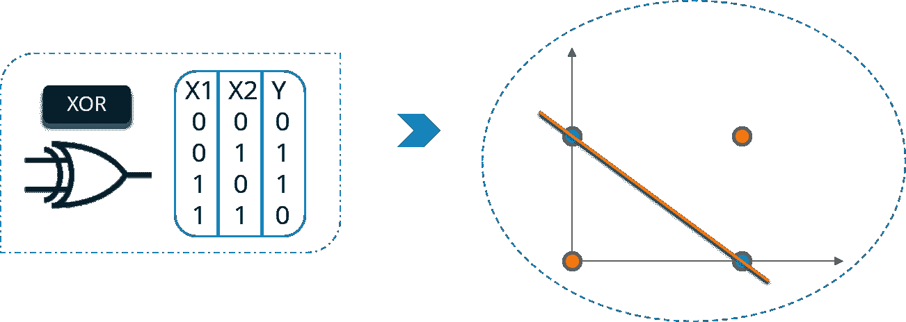

在这里，你不能用一条直线把高低点分开。但是，我们可以用两条直线把它分开。请看下图:

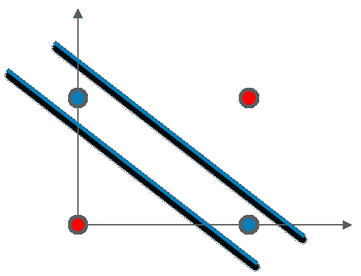

### **涉及大量参数的复杂问题，单层感知器无法解决:**

这里我也举个例子说明一下。

作为一家电子商务公司，你发现自己的销售额下降了。现在，你试着组建一个营销团队，销售产品以增加销售额。

营销团队可以通过各种方式营销您的产品，例如:

*   谷歌广告
*   个人邮件
*   相关网站上的销售广告
*   参考程序
*   博客等等。。。

考虑到所有可用的因素和选项，营销团队必须决定一个策略来进行最佳和有效的营销，但这项任务太复杂，人类无法分析，因为参数数量相当高。这个问题将不得不使用深度学习来解决。考虑下图:

他们既可以只用一种方式推销自己的产品，也可以使用多种方式。

每种方式都有不同的优点和缺点，他们必须关注各种因素和选项，例如:

将要发生的销售数量将取决于不同的分类输入、它们的子类和它们的参数。然而，仅仅通过一个神经元(感知器)不可能从如此多的输入及其子参数进行计算。

这就是为什么要用一个以上的神经元来解决这个问题。考虑下图:

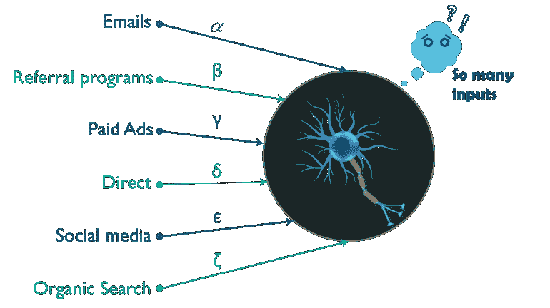

由于所有这些原因，单层感知器不能用于复杂的非线性问题。

接下来，在这篇神经网络教程中，我将关注多层感知器(MLP)。

## **什么是多层感知器？**

如你所知，我们的大脑是由数百万个神经元组成的，所以神经网络实际上只是感知器的组合，以不同的方式连接，并对不同的激活功能进行操作。

考虑下图:

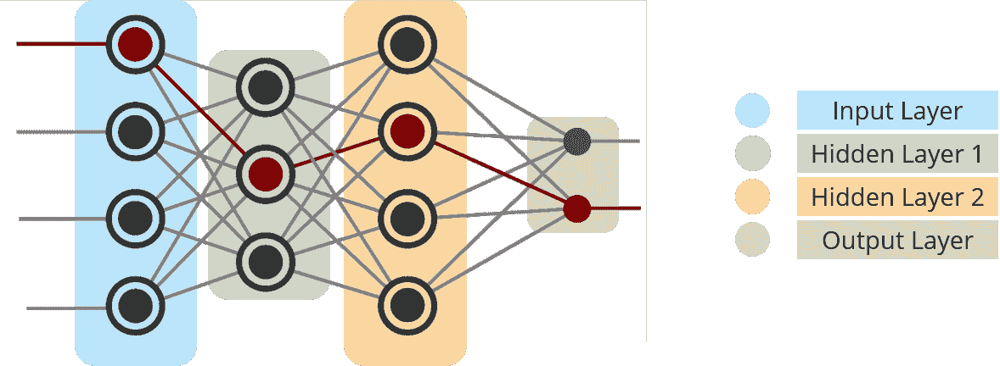

*   输入节点–输入节点向网络提供来自外部世界的信息，统称为“输入层”。任何输入节点都不执行任何计算——它们只是将信息传递给隐藏节点。
*   隐藏节点——隐藏节点与外界没有直接联系(因此得名“隐藏”)。它们执行计算并将信息从输入节点传输到输出节点。隐藏节点的集合形成了“隐藏层”。虽然网络只有一个输入图层和一个输出图层，但它可以有零个或多个隐藏图层。多层感知器有一个或多个隐藏层。
*   输出节点——输出节点统称为“输出层”,负责计算并将信息从网络传输到外部世界。

是的，你猜对了，我举个例子来解释一下——一个*人工神经网络*是如何工作的。

假设我们有一支足球队的数据，**切尔西**。该数据包含三列。最后一栏显示了切尔西是赢了比赛还是输了比赛。另外两栏大概是，上半场进球领先，下半场控球。控球时间是球队控球时间的百分比。所以，如果我说一个队在半场(45 分钟)有 50%的控球率，这意味着，这个队在 45 分钟里有 22.5 分钟有球。

| **上半场进球领先** | **下半场控球** | **赢了还是输了(1，0)？** |
| 0 | 80% | 1 |
| 0 | 35% | 0 |
| 1 | 42% | 1 |
| 2 | 20% | 0 |
| -1 | 75% | 1 |

最终结果列，可以有两个值 1 或 0，表示切尔西是否赢得了比赛。例如，我们可以看到，如果在上半场有 0 球领先，而在下半场切尔西有 80%的控球率，那么切尔西就赢了这场比赛。

现在，假设我们想预测切尔西是否会赢得这场比赛，如果上半场的进球领先优势是 2，下半场的控球率是 32%。

这是一个二元分类问题，多层感知器可以从给定的示例(训练数据)中学习，并在给定新数据点的情况下做出明智的预测。我们将在下面看到多层感知器如何学习这样的关系。

多层感知器学习的过程被称为 **[反向传播](https://www.edureka.co/blog/backpropagation/)** 算法，我推荐你去看看 **[反向传播](https://www.edureka.co/blog/backpropagation/)** 博客。

考虑下图:

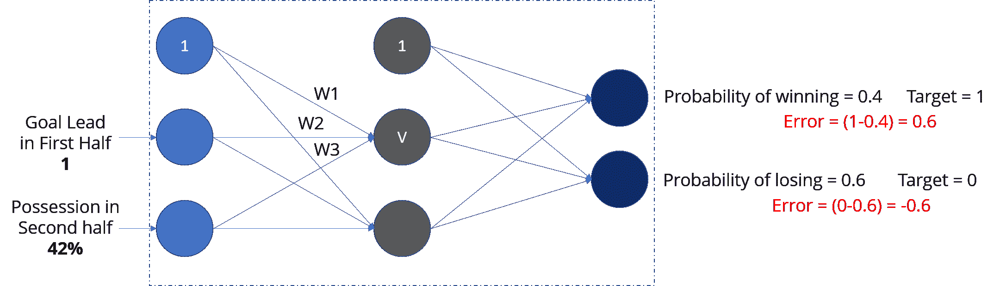

## **正向传播:**

这里，我们将向前传播，即计算输入的加权和并添加偏差。在输出层，我们将使用 softmax 函数来获得切尔西输赢的概率。

如果你注意到这张图，赢的概率是 0.4，输的概率是 0.6。但是，根据我们的数据，我们知道当上半场的进球领先是 1，下半场的控球率是 42%时，切尔西会赢。我们的网络做出了错误的预测。

如果我们看到误差(比较网络输出与目标)，它是 0.6 和-0.6。

### **反向传播和权重更新:**

我会推荐你参考 [**反向传播**](https://www.edureka.co/blog/backpropagation/) 博客。

我们计算输出节点的总误差，并使用反向传播通过网络传播这些误差，以计算*梯度*。然后，我们使用优化方法，例如*梯度下降*来‘调整’**网络中的所有**权重，目的是减少输出层的误差。

让我解释一下梯度下降优化器是如何工作的:

**Step–1:**首先我们计算误差，考虑下面的等式:

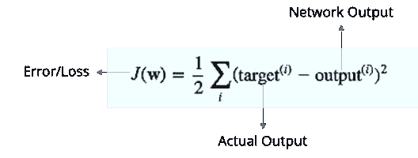  **步骤–2:**根据我们得到的误差，它将计算误差随重量变化的变化率。

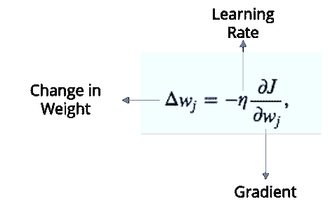

**第三步:**现在，基于这个重量的变化，我们将计算新的重量值。

如果我们现在再次向网络输入相同的例子，网络应该比以前表现得更好，因为权重现在已经被调整以最小化预测中的误差。考虑下面的例子，如图所示，与之前的[0.6，-0.4]相比，输出节点的误差现在减少到[0.2，-0.2]。这意味着我们的网络已经学会正确分类我们的第一个训练样本。

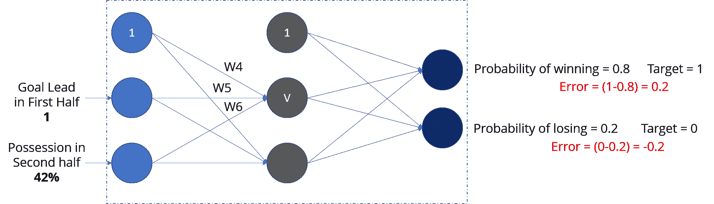

我们对数据集中的所有其他训练示例重复这一过程。然后，我们的网络据说已经*学会了*那些例子。

现在，我可以把输入馈入我们的网络了。如果我把上半场的进球领先数输入为 2，下半场的控球率输入为 32%，我们的网络将预测切尔西是否会赢得这场比赛。

在本神经网络教程中，我们将体验一些动手操作的乐趣。我将使用张量流来模拟一个多层神经网络。

## **用例:**

我们来看一下我们的问题陈述:

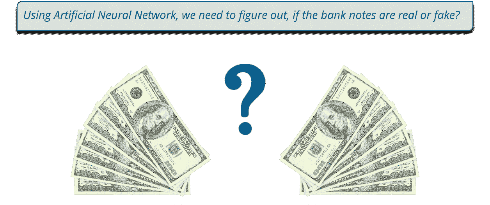

现在，让我们看看数据集，我们将用它来训练我们的网络。

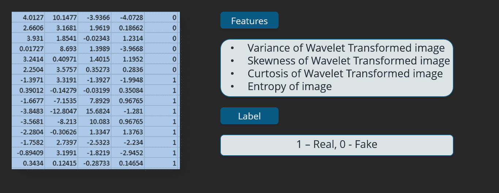

前四列是特征，最后一列是标签。

数据提取自从真的和伪造的钞票样样本中获取的图像。最终图像的像素为 400×400。由于物镜和到所研究物体灰度的距离，获得了分辨率约为 660 dpi 的照片。小波变换工具用于从图像中提取特征。

为了实现这个用例，我们将使用下面的流程图:

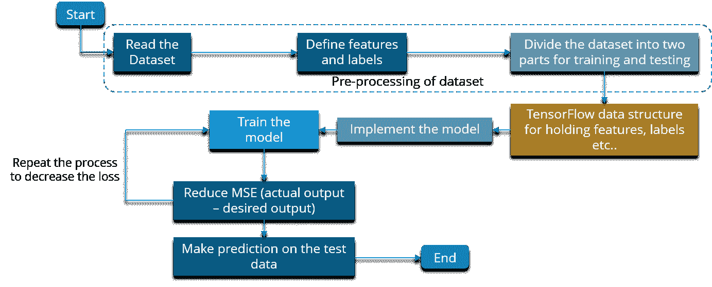

我们现在就执行:

```

import matplotlib.pyplot as plt
import tensorflow as tf
import numpy as np
import pandas as pd
from sklearn.preprocessing import LabelEncoder
from sklearn.utils import shuffle
from sklearn.model_selection import train_test_split

# Reading the dataset
def read_dataset():
    df = pd.read_csv("C:UsersSaurabhPycharmProjectsNeural Network Tutorialbanknote.csv")
    # print(len(df.columns))
    X = df[df.columns[0:4]].values
    y = df[df.columns[4]]

    # Encode the dependent variable
    Y = one_hot_encode(y)
    print(X.shape)
    return (X, Y)

# Define the encoder function.
def one_hot_encode(labels):
    n_labels = len(labels)
    n_unique_labels = len(np.unique(labels))
    one_hot_encode = np.zeros((n_labels, n_unique_labels))
    one_hot_encode[np.arange(n_labels), labels] = 1
    return one_hot_encode

# Read the dataset
X, Y = read_dataset()

# Shuffle the dataset to mix up the rows.
X, Y = shuffle(X, Y, random_state=1)

# Convert the dataset into train and test part
train_x, test_x, train_y, test_y = train_test_split(X, Y, test_size=0.20, random_state=415)

# Inpect the shape of the training and testing.
print(train_x.shape)
print(train_y.shape)
print(test_x.shape)

# Define the important parameters and variable to work with the tensors
learning_rate = 0.3
training_epochs = 100
cost_history = np.empty(shape=[1], dtype=float)
n_dim = X.shape[1]
print("n_dim", n_dim)
n_class = 2
model_path = "C:UsersSaurabhPycharmProjectsNeural Network TutorialBankNotes"

# Define the number of hidden layers and number of neurons for each layer
n_hidden_1 = 4
n_hidden_2 = 4
n_hidden_3 = 4
n_hidden_4 = 4

x = tf.placeholder(tf.float32, [None, n_dim])
W = tf.Variable(tf.zeros([n_dim, n_class]))
b = tf.Variable(tf.zeros([n_class]))
y_ = tf.placeholder(tf.float32, [None, n_class])

# Define the model
def multilayer_perceptron(x, weights, biases):

    # Hidden layer with RELU activationsd
    layer_1 = tf.add(tf.matmul(x, weights['h1']), biases['b1'])
    layer_1 = tf.nn.relu(layer_1)

    # Hidden layer with sigmoid activation
    layer_2 = tf.add(tf.matmul(layer_1, weights['h2']), biases['b2'])
    layer_2 = tf.nn.relu(layer_2)

    # Hidden layer with sigmoid activation
    layer_3 = tf.add(tf.matmul(layer_2, weights['h3']), biases['b3'])
    layer_3 = tf.nn.relu(layer_3)

    # Hidden layer with RELU activation
    layer_4 = tf.add(tf.matmul(layer_3, weights['h4']), biases['b4'])
    layer_4 = tf.nn.sigmoid(layer_4)

    # Output layer with linear activation
    out_layer = tf.matmul(layer_4, weights['out']) + biases['out']
    return out_layer

# Define the weights and the biases for each layer

weights = {
    'h1': tf.Variable(tf.truncated_normal([n_dim, n_hidden_1])),
    'h2': tf.Variable(tf.truncated_normal([n_hidden_1, n_hidden_2])),
    'h3': tf.Variable(tf.truncated_normal([n_hidden_2, n_hidden_3])),
    'h4': tf.Variable(tf.truncated_normal([n_hidden_3, n_hidden_4])),
    'out': tf.Variable(tf.truncated_normal([n_hidden_4, n_class]))
}
biases = {
    'b1': tf.Variable(tf.truncated_normal([n_hidden_1])),
    'b2': tf.Variable(tf.truncated_normal([n_hidden_2])),
    'b3': tf.Variable(tf.truncated_normal([n_hidden_3])),
    'b4': tf.Variable(tf.truncated_normal([n_hidden_4])),
    'out': tf.Variable(tf.truncated_normal([n_class]))
}

# Initialize all the variables

init = tf.global_variables_initializer()

saver = tf.train.Saver()

# Call your model defined
y = multilayer_perceptron(x, weights, biases)

# Define the cost function and optimizer
cost_function = tf.reduce_mean(tf.nn.softmax_cross_entropy_with_logits(logits=y, labels=y_))
training_step = tf.train.GradientDescentOptimizer(learning_rate).minimize(cost_function)

sess = tf.Session()
sess.run(init)

# Calculate the cost and the accuracy for each epoch

mse_history = []
accuracy_history = []

for epoch in range(training_epochs):
    sess.run(training_step, feed_dict={x: train_x, y_: train_y})
    cost = sess.run(cost_function, feed_dict={x: train_x, y_: train_y})
    cost_history = np.append(cost_history, cost)
    correct_prediction = tf.equal(tf.argmax(y, 1), tf.argmax(y_, 1))
    accuracy = tf.reduce_mean(tf.cast(correct_prediction, tf.float32))
    # print("Accuracy: ", (sess.run(accuracy, feed_dict={x: test_x, y_: test_y})))
    pred_y = sess.run(y, feed_dict={x: test_x})
    mse = tf.reduce_mean(tf.square(pred_y - test_y))
    mse_ = sess.run(mse)
    mse_history.append(mse_)
    accuracy = (sess.run(accuracy, feed_dict={x: train_x, y_: train_y}))
    accuracy_history.append(accuracy)

    print('epoch : ', epoch, ' - ', 'cost: ', cost, " - MSE: ", mse_, "- Train Accuracy: ", accuracy)

save_path = saver.save(sess, model_path)
print("Model saved in file: %s" % save_path)

#Plot Accuracy Graph
plt.plot(accuracy_history)
plt.xlabel('Epoch')
plt.ylabel('Accuracy')
plt.show()

# Print the final accuracy

correct_prediction = tf.equal(tf.argmax(y, 1), tf.argmax(y_, 1))
accuracy = tf.reduce_mean(tf.cast(correct_prediction, tf.float32))
print("Test Accuracy: ", (sess.run(accuracy, feed_dict={x: test_x, y_: test_y})))

# Print the final mean square error

pred_y = sess.run(y, feed_dict={x: test_x})
mse = tf.reduce_mean(tf.square(pred_y - test_y))
print("MSE: %.4f" % sess.run(mse))

```

一旦你运行这个代码，你将得到下面的输出:

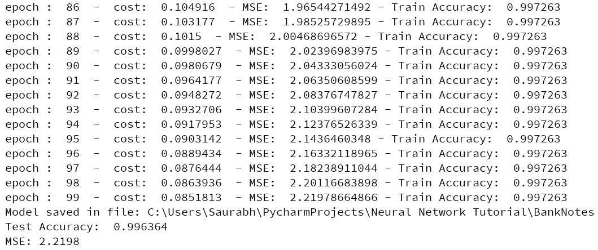

你可以注意到最终的准确率是 99.6364%，均方差是 2.2198。我们实际上可以通过增加纪元的数量来使它变得更好。

下面是历元与精度的关系图:

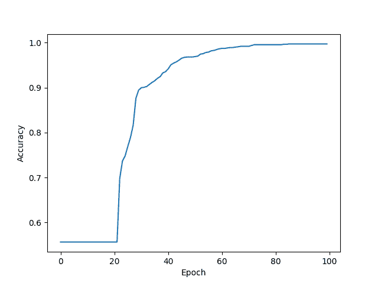

你可以看到，在每次迭代之后，精确度都在增加。

希望你喜欢阅读这篇神经网络教程。看看这个系列的其他博客:

***[什么是深度学习？【T6](https://www.edureka.co/blog/what-is-deep-learning)***

***[深度学习教程](https://www.edureka.co/blog/deep-learning-tutorial)***

***[张量流教程](https://www.edureka.co/blog/tensorflow-tutorial/)***

***[反向传播](https://www.edureka.co/blog/backpropagation/)***

在这篇神经网络教程之后，很快我将会就不同类型的神经网络——卷积神经网络和递归神经网络——撰写单独的博客。

*查看 Edureka 的* ***[深度学习与 TensorFlow 培训](https://www.edureka.co/ai-deep-learning-with-tensorflow/)*** *，edu reka 是一家值得信赖的在线学习公司，拥有遍布全球的 250，000 多名满意的学习者。Edureka 深度学习 TensorFlow 认证培训课程使用实时项目和任务以及 SoftMax 函数、自动编码器神经网络、受限玻尔兹曼机器(RBM)等概念，帮助学习者成为培训和优化基本和卷积神经网络的专家。*

*有问题吗？请在评论区提到它，我们会给你回复。*