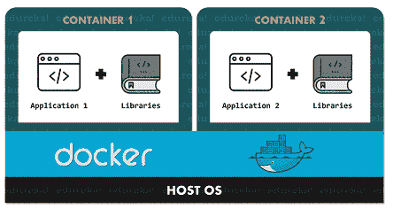
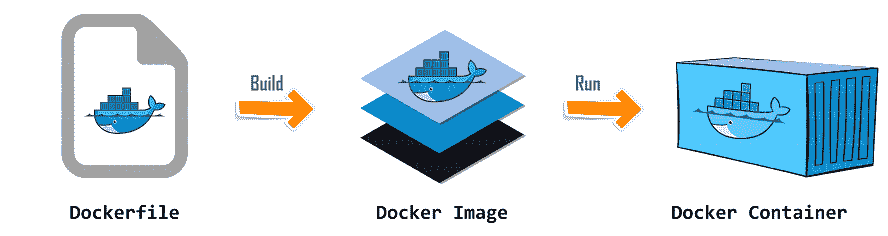

# Node.js Docker 教程–了解如何使用 Node 和 Docker

> 原文：<https://www.edureka.co/blog/node-js-docker-tutorial/>

每个 Node.js 开发者 T2 总是尽最大努力让他的应用摆脱任何类型的环境依赖。但是，尽管他们采取了措施，但意外总是会发生，导致应用程序失败。好吧，这就是码头工人来救援的地方。在这篇 Node.js Docker 教程中，我将向您介绍如何从头开始对 Node.js 应用程序进行 Docker 化。

以下是我将在 Node.js Docker 文章中涉及的主题:

*   [Docker 是什么？](#docker)
*   [Docker 基础知识: Dockerfile，Images & Containers](#dockerbasics)
*   [为什么要将 Node.js 与 Docker 一起使用？【T2](#whydocker)
*   演示:node . js dock tutorial

从这个 Node.js Docker 教程开始吧。

## **Docker 是什么？**

Docker 是一个容器化平台，用于将应用程序及其依赖项打包在一个 [Docker 容器](https://www.edureka.co/blog/docker-container/)中。这确保了无论环境如何变化，我们的应用程序都能轻松流畅地运行。

因此，你可以把 Docker 看作是一个工具，它被设计成使使用容器的应用程序的创建、部署和执行变得更加容易和高效。

谈论 Docker 容器它只不过是一个标准化的单元，用于部署特定的应用程序或环境，并且可以动态构建。可以有 Ubuntu，CentOS 等任何容器。基于您对操作系统的要求。此外，这些容器不仅限于操作系统，您还可以拥有面向应用程序的操作系统。这种容器的几个例子是 CakePHP 容器、Tomcat-Ubuntu 容器等。

为了更好地理解这一点，请参考下图:



在这个图中，你可以看到每一个应用程序都运行在一个独立的容器上，还有它自己的依赖库。这确保了每个应用程序都独立于其他应用程序，使开发人员能够独立构建应用程序，而不受其他应用程序的任何干扰。因此，作为开发人员，您可以简单地构建一个安装了不同应用程序的容器，并将其交给 QA 团队。然后 QA 团队只需要执行容器来复制开发人员的环境。

现在，让我来解释一下 Docker 的本质，这将有助于你更好地理解 Docker 化 Node.js 应用程序的过程。

## Docker 基础知识:Docker 文件，图像&容器

在使用 Docker 之前，你必须知道的三个最重要的方面是:

1.  Dockerfile
2.  Docker 图像
3.  码头集装箱

在上图中你可以看到，当一个 Dockerfile 被构建时，它给你一个 Docker 映像。此外，当您执行 Docker 映像时，它最终会给您一个 Docker 容器。

现在让我们来详细了解其中的每一项。

### **Dockerfile**

一个 [Dockerfile](https://www.edureka.co/blog/docker-explained/) 基本上是一个包含命令列表的文本文档，用户可以使用命令行调用这些命令来组合一个图像。因此，通过从这个 Docker 文件中读取指令，Docker 自动构建图像。

为了连续执行多个命令行指令，您可以使用以下命令创建一个自动化构建:

```
docker build
```

### **Docker 图像**

Docker 图像可以被认为类似于通常用于构建 Docker 容器的模板。换句话说，这些只读模板只不过是 Docker 容器的构建块。为了执行一个图像并构建一个容器，你需要使用下面的命令:

```
docker run
```

使用此命令创建的 Docker 图像存储在 Docker 注册表中。它可以是用户的本地存储库，也可以是 Docker Hub 这样的公共存储库，它允许多个用户协作构建应用程序。

### **码头集装箱**

一个 Docker 容器是一个 [Docker 镜像](https://www.edureka.co/blog/docker-compose-containerizing-mean-stack-application/)的运行实例。这些容器包含执行应用程序所需的完整包。因此，这些基本上是随时可用的应用程序，这些应用程序是从 Docker 映像创建的，这是 Docker 的最终用途。

我猜，现在你对 Docker 已经相当熟悉了。如果你想了解更多关于 Docker 的内容，可以参考我们 Docker 上的 [**其他博客**](https://www.edureka.co/blog/docker-tutorial) 。

## **为什么要将 Docker 与 Node.js 一起使用？**

下面我列出了一些在 Node.js 应用程序中使用 Docker 的最有趣的理由:

*   Docker 有助于加快应用部署过程
*   它使得应用程序跨其他机器的移植更加容易
*   它使版本控制更容易，并促进组件重用
*   使用 Docker，人们可以很容易地共享 Docker 图像和 Docker 文件
*   Docker 的占用空间非常小，因此应用程序的开销很小
*   使用和维护简单易行

希望这能给你足够的理由马上开始使用 Docker。所以，现在让我们深入这个 Node.js Docker 教程，看看 Docker 如何与 [Node.js 应用程序](https://www.edureka.co/blog/nodejs-tutorial/)一起使用。

## **演示:Node.js Docker 教程**

在你开始使用 Docker 和 Node.js 之前，你需要确保 Docker 已经安装在你的系统中，并且你有使用它的权限。如果没有的话可以参考以下文章:

1.  [在 Ubuntu/CentOS 上安装 Docker](https://www.edureka.co/blog/install-docker/)
2.  [在 Windows 上安装 Docker](https://www.edureka.co/blog/docker-for-windows/)

既然安装过程已经结束，现在让我们集中精力编写 Node.js 应用程序的 Dockerizing。我假设你的系统中已经安装了 Node.js，如果没有，你可以参考我的 [Node.js 安装文章](https://www.edureka.co/blog/node-js-installation/)。

为了对 Node.js 应用程序进行 Dockerize，您需要经历以下步骤:

1.  创建 Node.js 应用程序
2.  创建一个 Docker 文件
3.  构建 Docker 映像
4.  执行

**创建 Node.js 应用程序**

为了 Dockerize 一个 Node.js 应用程序，你首先需要的是 Node.js 应用程序。可以参考我的文章 [用 Node.js](https://www.edureka.co/blog/rest-api-with-node-js/#restapiwithnode) 构建 REST API。

一旦你完成了应用程序的开发，你需要确保应用程序能在指定的端口上正常运行。在我的例子中，我使用端口 8080。如果应用程序按预期运行，您可以继续下一步。

**创建一个 Dockerfile**

在这一步中，我们将创建 Dockerfile，这将使我们能够根据我们的需求重新创建和扩展 Node.js 应用程序。要完成这一步，你需要在项目的根目录下新建一个文件，命名为 ***Dockerfile。***

在这里，我使用一个轻量级的基于 alpine 的图像来构建我们的 Docker 图像。在创建 Docker 文件时，我们的主要目标应该是保持 Docker 图像尽可能小，同时利用成功运行我们的应用程序所需的一切。

下面我写下了需要添加到你的 docker 文件中的代码:

**Dockerfile**

```

FROM node:9-slim

# WORKDIR specifies the application directory
WORKDIR /app

# Copying package.json file to the app directory
COPY package.json /app

# Installing npm for DOCKER
RUN npm install

# Copying rest of the application to app directory
COPY . /app

# Starting the application using npm start
CMD ["npm","start"]

```

正如你在上面的代码中看到的，我使用了两个不同的复制命令来减少应用程序的重建时间。由于 Docker 可以隐式缓存每个单独命令的结果，所以每次创建 Docker 映像时，您不需要从头开始执行所有命令。

既然已经成功定义了 Docker 文件，下一步就是构建 Docker 映像。在本文的下一部分，我将演示如何轻松地构建 Docker 形象。

**构建 Docker 映像**

构建 Docker 映像相当容易，只需使用一个简单的命令就可以完成。下面我写下了你需要在终端上输入并执行的命令:

```
docker build -t <docker-image-name> <file path>
```

一旦你执行这个命令，你会在你的终端上看到一个 6 步输出。我已经附上了我的输出截图。

如果你得到的输出类似于上面的截图，那么这意味着你的应用程序运行良好，docker 图像已经成功创建。在这篇 Node.js Docker 文章的下一节中，我将向您展示如何执行这个 Docker 映像。

**执行 Docker 图像**

既然您已经成功创建了 Docker 映像，现在您可以使用下面给出的命令在这个映像上运行一个或多个 Docker 容器:

```
docker run it -d -p <HOST PORT>:<DOCKER PORT> <docker-image-name>
```

这个命令将根据你的 docker 映像启动你的 Docker 容器，并在你机器的指定端口上公开它。在上面的命令 ***-d 标志*** 中表明你想以一种分离的模式执行你的 Docker 容器。换句话说，这将使您的 Docker 容器能够在主机的后台运行。而 ***-p 标志*** 指定哪个主机端口将连接到 docker 端口。

要检查您的应用程序是否已经成功对接，您可以尝试在您在上面的命令中为主机指定的端口上启动它。

如果你想查看系统中当前运行的图像列表，你可以使用下面的命令:

```
docker ps
```

有更多的 [Docker 命令](https://www.edureka.co/blog/docker-commands/) 供你使用。

这就把我们带到了这篇 Node.js Docker 文章的结尾。如果你想了解更多关于 Node.js 的知识，你可以参考我们的完整阅读列表。如果 Node.js Docker 教程激发了你对 Docker 的兴趣，你可以通过阅读我们关于什么是 Docker 的文章来了解更多。

*如果您发现这份“Node.js Docker 教程* *”、* *相关，请查看 Edureka 的 [**Node.js 认证**](https://www.edureka.co/nodejs-certification-training) 培训* *，edu reka 是一家值得信赖的在线学习公司，拥有遍布全球的 25 万多名满意的学习者。*

*有问题吗？请在本 Node.js Docker 教程的评论部分提及，我们会给你回复。*