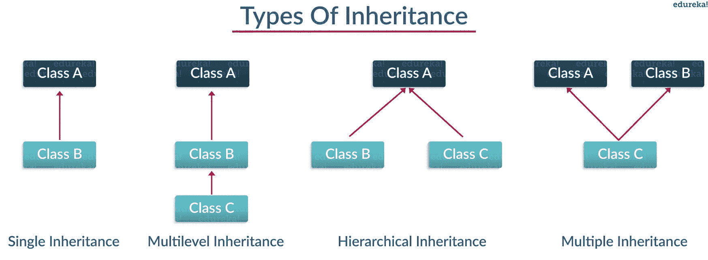
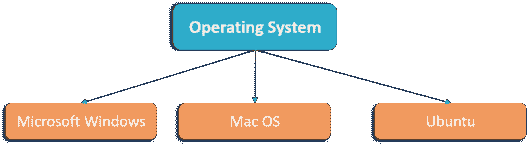

# 面向对象编程 Python:你需要知道的一切

> 原文：<https://www.edureka.co/blog/object-oriented-programming-python/>

面向对象编程作为一门学科已经在开发人员中获得了普遍的支持。Python 是一种受欢迎的编程语言也是  遵循面向对象的编程范式。它处理声明 Python 类和对象，这奠定了 OOPs 概念的基础。这篇关于“面向对象编程 python”的文章将带您浏览声明 [python 类、](https://www.edureka.co/blog/python-class/)从它们实例化对象以及 OOPs 的四种方法。

本文将详细介绍以下几个方面:

*   [Python 面向对象编程简介](#Object-Oriented-Programming)
*   [面向对象和面向过程编程的区别](#Difference-Object-and-Procedural-Oriented)
*   [什么是类和对象？](#Classes-and-Objects)
*   [面向对象的编程方法:](#Object-Oriented-methodologies)

让我们开始吧。

什么是面向对象编程？(Python 中的 OOPs 概念)


面向对象编程是计算机编程的一种方式，使用“[对象](https://www.edureka.co/blog/python-class/#Objects)的思想来表示数据和方法。它也是一种用于创建整洁的可重用代码而不是冗余代码的方法。程序被分成独立的对象或几个小程序。每个单独的对象代表应用程序的一个不同部分，有自己的逻辑和数据在它们之间进行通信。

现在，为了更清楚地了解我们为什么用 oops 代替 pop，我列出了下面的区别。

## **面向对象和面向过程编程的区别**

| **面向对象** **编程(OOP)** | **面向程序的** **编程(流行)** |
| 这是一种自下而上的方法 | 这是一种自上而下的方法 |
| 程序被分成对象 | 程序分为功能 |
| 利用 *访问修饰符*‘公共’、‘私有’、‘受保护’ | 不使用 *访问修饰符* |
| 更安全 | 不太安全 |
| 对象可以在成员函数内自由移动 | 数据可以在程序内的函数间自由移动 |
| 它支持继承 | 不支持继承 |

以上是所有关于差异的内容，接下来让我们了解一下 Python OOPs 概念。

## **什么是 Python OOPs 概念？**

Python 中主要的 OOP(面向对象编程)概念包括类、对象、方法、继承、多态、数据抽象和封装。

这就是所有关于差异的内容，接下来让我们了解一下类和对象。

**什么是类和对象？**

一个类是一个对象的集合或者你 可以说它是一个定义了对象共同属性和行为的蓝图。现在问题来了，你如何做到这一点？

嗯，它以一种使代码重用变得容易的方式对数据进行逻辑分组。我可以给你一个真实的例子——把一个办公室里的“雇员”想象成一个类，所有与之相关的属性，比如“雇员姓名”、“雇员年龄”、“雇员薪水”、“雇员身份”都是 Python 中的对象。让我们从编码的角度来看，如何实例化一个类和一个对象。

类是在“Class”关键字下定义的。 **例如:**

```
class class1(): // class 1 is the name of the class

```

**注意:** Python 不区分大小写。

### **对象:**

对象是一个类的实例。它是一个有状态和行为的实体。简而言之，它是一个可以访问数据的类的实例。

**语法:** obj = class1()

这里 obj 是 class1 的“对象”。

### **在 python 中创建对象和类:**

**举例:**

```
class employee():
    def __init__(self,name,age,id,salary):   //creating a function
        self.name = name // self is an instance of a class
        self.age = age
        self.salary = salary
        self.id = id

emp1 = employee("harshit",22,1000,1234) //creating objects
emp2 = employee("arjun",23,2000,2234)
print(emp1.__dict__)//Prints dictionary

```

**说明:**‘EMP 1’和‘EMP 2’是针对类‘employee’实例化的对象。在这里，单词(__dict__)是一个“字典”，它根据给定的参数(姓名、年龄、薪水)打印对象‘EMP 1’的所有值。 (__init__)就像一个构造函数，每当创建一个对象时都会被调用。

我希望现在的你们在将来处理“类”和“对象”时不会遇到任何问题。

有了这个，让我带你领略一下[面向对象编程](https://www.edureka.co/blog/python-class/)方法论:

## **面向对象的编程方法:**

面向对象的编程方法处理以下概念。

*   遗产
*   多态性
*   包装
*   抽象

让我们详细了解一下继承的第一个概念。

### **继承:**

有没有听过亲戚的这样一段对话“你长得和你爸爸/妈妈一模一样”这背后的原因叫做“[遗传](https://www.edureka.co/blog/python-class/#Inheritance)”。从编程方面来说，一般是指“从父类继承或转移特征到子类，不做任何修改”。这个新类称为 **派生/子** 类，而从中派生的类称为 **父/基** 类。



让我们详细了解每个副主题。

### **单一继承:**

单级继承使派生类能够从单个父类继承特征。

**举例:**

```
class employee1()://This is a parent class
def __init__(self, name, age, salary):  
self.name = name
self.age = age
self.salary = salary

class childemployee(employee1)://This is a child class
def __init__(self, name, age, salary,id):
self.name = name
self.age = age
self.salary = salary
self.id = id
emp1 = employee1('harshit',22,1000)

print(emp1.age)

```

**输出** : 22

**说明:**

*   我采用父类并创建了一个构造函数(__init__)，类本身用参数初始化属性(' name '，' age '和' salary ')。

*   创建了从父类继承属性的子类“childemployee ”,最后根据参数实例化了对象“emp1”和“emp2”。

*   最后，我已经打印了 emp1 的时代。嗯，你可以做很多事情，比如打印整本字典，名字或者薪水。

### **多级继承:**

多级继承使派生类能够从直接父类继承属性，直接父类又从其父类继承属性。

**举例:**

```
class employee()://Super class
def __init__(self,name,age,salary):  
self.name = name
self.age = age
self.salary = salary
class childemployee1(employee)://First child class
def __init__(self,name,age,salary):
self.name = name
self.age = age
self.salary = salary

class childemployee2(childemployee1)://Second child class
def __init__(self, name, age, salary):
self.name = name
self.age = age
self.salary = salary
emp1 = employee('harshit',22,1000)
emp2 = childemployee1('arjun',23,2000)

print(emp1.age)
print(emp2.age)

```

产量:22，23

**说明:**

*   这在上面写的代码中解释得很清楚，这里我将超类定义为 employee，将子类定义为 childemployee1。现在，childemployee1 充当 childemployee2 的父代。

*   我已经实例化了两个对象“emp1”和“emp2 ”,其中我从超类“employee”为 emp1 传递参数“name”、“age”、“salary ”,从父类“childemployee1”传递参数“name”、“age”、“salary”和“id”

### **层次继承:**

分层继承允许多个派生类从父类继承属性。

**举例:**

```
class employee():
def __init__(self, name, age, salary):     //Hierarchical Inheritance
self.name = name
self.age = age
self.salary = salary

class childemployee1(employee):
def __init__(self,name,age,salary):
self.name = name
self.age = age
self.salary = salary

class childemployee2(employee):
def __init__(self, name, age, salary):
self.name = name
self.age = age
self.salary = salary
emp1 = employee('harshit',22,1000)
emp2 = employee('arjun',23,2000)

print(emp1.age)
print(emp2.age)

```

产量:22，23

### **说明:**

*   在上面的例子中，你可以清楚地看到有两个子类“childemployee1”和“childemployee2”。它们从一个公共的父类“employee”继承功能。

*   对象“emp1”和“emp2”根据参数“姓名”、“年龄”、“薪金”进行实例化。

### **多重继承:**

多级继承使一个派生类能够从多个基类继承属性。

**举例:**

```
class employee1()://Parent class
    def __init__(self, name, age, salary):  
        self.name = name
        self.age = age
        self.salary = salary

class employee2()://Parent class
    def __init__(self,name,age,salary,id):
     self.name = name
     self.age = age
     self.salary = salary
     self.id = id

class childemployee(employee1,employee2):
    def __init__(self, name, age, salary,id):
     self.name = name
     self.age = age
     self.salary = salary
     self.id = id
emp1 = employee1('harshit',22,1000)
emp2 = employee2('arjun',23,2000,1234)

print(emp1.age)
print(emp2.id)

```

产量:22，1234

**解释:** 在上面的例子中，我取了两个父类“employee1”和“employee2”。 和一个子类“childemployee ”,它通过实例化对象‘EMP 1’和‘EMP 2’来继承父类。

这都是关于继承，在面向对象编程 Python 中前进，让我们深入研究'[多态性](https://www.edureka.co/blog/python-class/#Polymorphism)'。

**多态性:**

你们一定都使用过 GPS 来导航路线，根据交通状况，你会遇到多少不同的路线来到达同一个目的地，这难道不令人惊讶吗？从编程的角度来看，这被称为“多态性”。它是一种这样的 OOP 方法，其中一个任务可以用几种不同的方式来执行。简单来说，*它是一个对象的属性，允许它采取多种形式*。



多态性有两种类型:

*   *编译时多态性*
*   *运行时多态性*

#### **编译时多态性:**

编译时多态也称为静态多态，在程序编译时得到解析。一个常见的例子是“方法重载”。让我给你看一个简单的例子。

**举例:**

```
class employee1():
def name(self):
print("Harshit is his name")    
def salary(self):
print("3000 is his salary")

def age(self):
print("22 is his age")

class employee2():
def name(self):
print("Rahul is his name")

def salary(self):
print("4000 is his salary")

def age(self):
print("23 is his age")

def func(obj)://Method Overloading
obj.name()
obj.salary()
obj.age()

obj_emp1 = employee1()
obj_emp2 = employee2()

func(obj_emp1)
func(obj_emp2)

```

**输出:**

哈什特是他的名字 3000 是他的薪水 22 是他的年龄拉胡尔是他的名字 4000 是他的薪水 23 是他的年龄

**说明:**

*   在上面的程序中，我创建了两个类“employee1”和“employee2 ”,并为“name”、“salary”和“age”创建了函数，并打印了相同的值，而没有从用户那里获取。

*   现在，欢迎来到主要部分，我已经创建了一个以“obj”为参数的函数，并调用所有三个函数，即“姓名”、“年龄”和“薪金”。

*   后来，针对这两个类实例化了对象 emp_1 和 emp_2，并简单地调用了[函数](https://www.edureka.co/blog/python-functions)。这种类型被称为方法重载，它允许一个类拥有多个同名的方法。

#### **运行时多态性:**

运行时多态也被称为动态多态，它在运行时被解析。运行时多态性的一个常见例子是“方法重写”。为了更好的理解，让我通过一个例子给你演示一下。

**举例:**

```
class employee():
   def __init__(self,name,age,id,salary):  
       self.name = name
       self.age = age
       self.salary = salary
       self.id = id
def earn(self):
        pass

class childemployee1(employee):

   def earn(self)://Run-time polymorphism
      print("no money")

class childemployee2(employee):

   def earn(self):
       print("has money")

c = childemployee1
c.earn(employee)
d = childemployee2
d.earn(employee)

```

**输出:**没钱，有钱

**解释:**在上面的例子中，我创建了两个类‘child employee 1’和‘child employee 2’，它们都是从同一个基类‘employee’派生出来的。这里有个问题，一个人没有收到钱，而另一个人收到了。现在真正的问题是这是怎么发生的？嗯，如果你仔细看，我在这里创建了一个空函数，并使用了 *Pass* (当你不想执行任何命令或代码时使用的语句)。现在，在这两个派生类中，我使用了相同的空函数，并使用了 print 语句“no money”和“has money”。最后，创建两个对象并调用函数。

继续下一个面向对象编程 Python 方法论，我将讨论封装。

#### **封装:**

在原始形式中，封装基本上意味着将数据绑定在一个类中。Python 没有任何私有关键字，不像 [Java](https://www.edureka.co/blog/access-modifiers-in-java/) 。一个类不应该被直接访问，而应该以下划线为前缀。

为了更好的理解，让我给你看一个例子。

**举例:**

```
class employee(object):
def __init__(self):   
self.name = 1234
self._age = 1234
self.__salary = 1234

object1 = employee()
print(object1.name)
print(object1._age)
print(object1.__salary)

```

**输出:**

1234 Traceback(最近一次调用 last): 1234 文件“C:/Users/Harshit _ Kant/PycharmProjects/test1/venv/encapsu . py”，第 10 行，在 print(object1。_ _ 薪金)属性错误:'雇员'对象没有属性' _ _ 薪金'

**解释:**你会得到这个问题下划线和错误是什么？嗯，python 类把私有变量当作(__salary)，不能直接访问。

因此，在下一个例子中，我使用了 setter 方法来提供对它们的间接访问。

**举例:**

```
class employee():
def __init__(self):
self.__maxearn = 1000000
def earn(self):
print("earning is:{}".format(self.__maxearn))

def setmaxearn(self,earn)://setter method used for accesing private class
self.__maxearn = earn

emp1 = employee()
emp1.earn()

emp1.__maxearn = 10000
emp1.earn()

emp1.setmaxearn(10000)
emp1.earn()

```

**输出:**

收入是:1000000，收入是:1000000，收入是:10000

**解释:**利用 **setter 方法**提供了*对私有类方法*的间接访问。这里我定义了一个类 employee，并使用了一个(__maxearn)和一个 setter 函数 setmaxearn()，前者是这里用来存储雇员的最大收入的 setter 方法，后者将 price 作为参数。

这是一个封装的明显例子，我们限制对私有类方法的访问，然后使用 setter 方法授予访问权限。

接下来在面向对象编程中，python 方法论谈到了一个叫做[抽象](https://www.edureka.co/blog/python-class/#Abstraction)的关键概念。

**抽象:**

假设您使用网上银行或任何其他流程从 bookmyshow 预订了一张电影票。你不知道 pin 码是如何生成的，也不知道验证是如何完成的。从编程的角度来看，这被称为“抽象”,它基本上意味着你只显示特定过程的实现细节，而对用户隐藏细节。它通过建模适合问题的类来简化复杂的问题。

抽象类不能被实例化，这仅仅意味着你不能为这种类型的[类](https://www.edureka.co/blog/python-class/#WhatIsPythonClass)创建对象。它只能用于继承功能。

**举例:**

```
from abc import ABC,abstractmethod
class employee(ABC):
def emp_id(self,id,name,age,salary):    //Abstraction
pass

class childemployee1(employee):
def emp_id(self,id):
print("emp_id is 12345")

emp1 = childemployee1()
emp1.emp_id(id)

```

**输出** : emp_id 为 12345

**解释:**正如你在上面的例子中看到的，我们已经导入了一个抽象方法，程序的其余部分有一个父类和一个派生类。为“childemployee”基类实例化了一个对象，并使用了抽象的功能。

## Python 是 100%面向对象的吗？

Python 没有像 java 中那样的“私有”访问说明符。它支持大多数与“面向对象”编程语言相关的术语，除了强封装。因此，它不是完全面向对象的。

这就把我们带到了“面向对象编程 Python”这篇文章的结尾。我希望你已经弄清楚了 python 中与 Python 类、对象和面向对象概念相关的所有概念。 ***确保你尽可能多地练习，恢复你的经验。***

*有问题吗？请在这个“面向对象编程 Python”博客的评论部分提到它，我们会尽快回复您。* *要深入了解 Python 及其各种应用，您现在就可以注册参加我们的实时 [Python 课程](https://www.edureka.co/python-programming-certification-training)培训，该培训提供全天候支持和终身访问。*

通过我们的[人工智能课程](https://www.edureka.co/executive-programs/machine-learning-and-ai)，发现你成为人工智能和人工智能专家的全部能力。了解各种人工智能相关技术，如机器学习、深度学习、计算机视觉、自然语言处理、语音识别和强化学习。