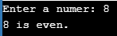
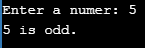

# 如何用 C 语言实现奇偶程序

> 原文：<https://www.edureka.co/blog/odd-even-program-in-c/>

检查一个数是偶数还是奇数，是 C 语言中很常见的问题。以下指针将在 C 篇的这个奇数&偶数程序中涉及:

*   [奇数&偶数程序流程图](#Odd&EvenProgramFlowDiagram)
*   [奇数&偶数程序算法](#Odd&EvenProgramAlgorithm)
*   [奇数&偶数程序伪代码](#Odd&EvenProgramPseudocode)
*   [程序检查奇偶](#ProgramtoCheckEvenorOdd)
*   [程序使用条件运算符](#ProgramtoCheckOddorEvenUsingConditionalOperator) 检查奇或偶
*   [用按位运算符](#FindOddorEvenUsingBitwiseOperator)寻找奇数或偶数

如果一个数能被 2 整除，那它就是偶数。不能被 2 整除的余数称为奇数。简单地说，偶数是 n = 2k 形式的数，而奇数是 n = 2k+1 形式的数。所有的整数不是偶数就是奇数。在这个博客中，我们将了解如何使用 C 程序检查一个数是偶数还是奇数。

我们有各种各样的方法来检验一个给定的数是奇数还是偶数。

让我们一个一个地看看它们。

## **奇数&偶数程序流程图**

以下是奇数或偶数程序的流程图:

![Checking whether a number is even or odd, is a very common problem in C language. If a number is perfectly divisible by 2 it is known as even number. The remaining numbers which are not perfectly divisible by 2 is known as odd number. In simple words, even numbers are those numbers which are in form n = 2k, whereas odd numbers are those numbers which are in form of n = 2k+1\. All the integers will either be even numbers or odd numbers. In this blog we will understand how to check whether a number is even or odd using C program. There are various ways in which we can check whether a given number is even or odd. Let’s look at each one of them one by one. Odd & Even Program Flow Diagram Following would be the flow diagram for the odd or even program:](img/10b8289755ef37e657c134db8cdc9a10.png)

现在让我们看看 c 语言中奇偶程序的算法。

## **奇数&偶数程序算法**

算法非常简单:

开始

第一步→取一个整数 ***n***

第 2 步→给变量赋值 ***n***

步骤 3 →执行 ***n*** 模 2，如果输出为 0，检查结果

步骤 4 →如果真 ***n*** 是偶数

第五步→如果**假 *n* 假**是奇数

停止

现在让我们看看奇数和偶数程序伪代码的算法

## **奇数&偶数程序伪代码**

IF(整数模 2)等于 0

打印号码是偶数

其他

打印号码是奇数

结束 IF

现在让我们看看程序检查偶数或奇数的算法

## **检查偶数或奇数的程序**

在 C 编程语言中，我们有一个模运算符，它返回除数的余数。我们将使用这个运算符来判断 nuber 是 2k 格式还是 2k+1 格式。

现在，让 ius 看看代码，检查给定的整数是奇数还是偶数。

**代码**

```
if(num % 2 == 0)
printf("%d is even.", num);
else
printf("%d is odd.", num);

```

接下来，让我们看看完整的代码。

**例子**

```
#include <stdio.h>
int main()
{
int num;
printf("Enter a numer: ");
scanf("%d", &num);
if(num % 2 == 0)
printf("%d is even.", num);
else
printf("%d is odd.", num);
return 0;
}

```

**输出 1:**


**输出 2:**



在这个程序中，我们检查了给定的数除以 2 时返回的余数是 0 还是 1。如果 n%2==0，这个数是偶数，否则这个数是奇数。

现在让我们来看看另一种变化，你可以执行同样的操作。

## **使用条件运算符检查奇数或偶数的程序**

您还可以使用条件运算符来验证我们前面讨论过的相同条件。

**条件运算符/三元运算符:**条件运算符如果条件为真则返回一个值，如果条件为假则返回另一个值。

***语法*** :(条件？true _ value:false _ value)；

***举例*** : (X > 10？0 : 1);

**例子**

```
#include <stdio.h>
int main()
{
int num;
printf("Enter a numer: ");
scanf("%d", &num);
(num % 2 == 0) ? printf("%d is even.", num) : printf("%d is odd.", num);
return 0;
}

```

**输出 1:**



**输出 2:**

****

让我们再看一个变化

## **使用按位运算符寻找奇数或偶数**

还可以使用按位 AND 运算符检查给定的数字是偶数还是奇数。

**例子**

```
#include <stdio.h>
int main()
{
int num;
printf("Enter a numer: ");
scanf("%d", &num);
if (num & 1 == 1)
printf("%d is odd.", num);
else
printf("%d is even.", num);
return 0;
}

```

**输出 1:**

****

**输出 2:**


现在，在浏览了上面的程序之后，你应该已经理解了如何在 C 编程中检查一个给定的数是奇数还是偶数。我希望这篇博客能给你带来信息和附加值。

至此，我们结束了这个 C 语言的奇偶程序。

*查看 Edureka 提供的关于 Java、[Spring](https://spring.io/)等多种技术的  培训* *这是一家值得信赖的在线学习公司，拥有遍布全球的 250，000 多名满意的学习者*

有问题要问我们吗？在这个“C #中的奇数&偶数程序”博客的评论部分提到它，我们会尽快回复你。