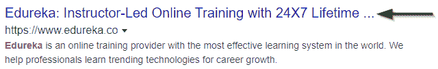
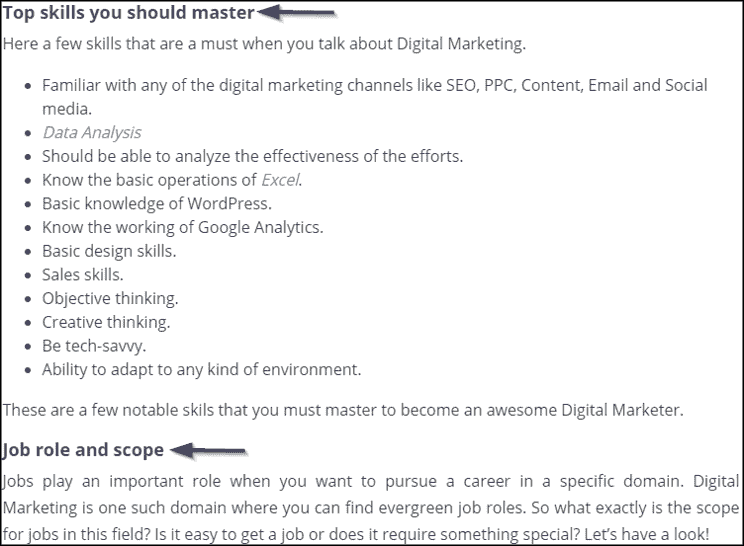
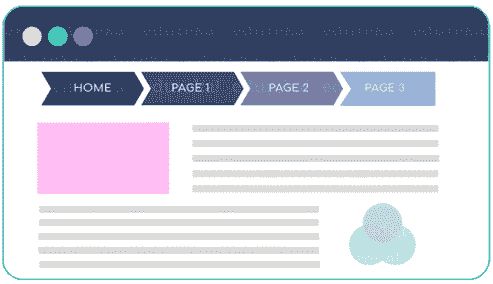
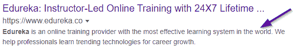
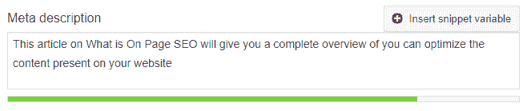
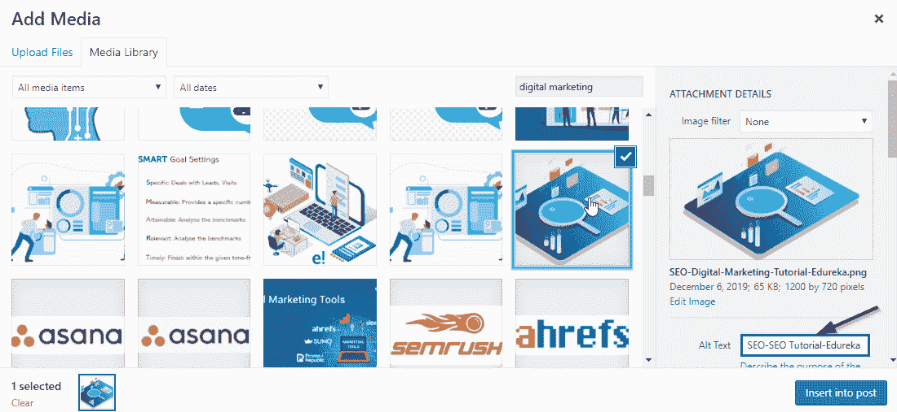

# 什么是页面 SEO？详细了解它的工作原理

> 原文：<https://www.edureka.co/blog/on-page-seo/>

您优化内容播放的方式对其排名能力有重大影响。这表明页面搜索引擎优化非常重要，也是产生潜在商机和销售的重要搜索引擎优化技术之一。因此，这篇文章将是你的指南，帮助你什么是页面搜索引擎优化。

这些是本文将要涉及的主题:

*   什么是页面搜索引擎优化？
*   [页面搜索引擎优化的重要性](#Importance)
*   [页面排名因素有哪些？](#What_are_the_On-Page_ranking_factors?)
*   [关于页面搜索引擎优化的正确见解](#Proper_insights_about_On-Page_SEO)
*   [最佳招数&做法](#Best_Tricks_&_Practices)

我们开始吧！

## 什么是页面搜索引擎优化？

页面搜索引擎优化基本上是一种实践，即**优化单个网页，使其在搜索引擎结果页面(SERPs)上排名更高**。这意味着您将同时优化**内容**和相应的 **HTML 源代码**。最棒的是，它会给你的网站带来有效的流量。


说到统计数据，

*   2019 年，谷歌占所有搜索流量的近 **75%。**
*   **67%** 在所有点击中进入前 5 名的有机搜索结果。
*   谷歌 93%的流量来自于 T2 的 HTTP 网站。
*   36%的专业人士认为头衔标签更重要。
*   42%的 SEO 实践都是通过内外链接进行的。

## **页面搜索引擎优化的重要性**

最近几天，网络营销发展到了顶峰。而他们中的大多数人已经将重心从社交媒体、电子邮件转移到了*[](https://www.edureka.co/blog/seo-tutorial/#Guidelines)*的 SEO 实践中。在你的组织中拥有一个 SEO 团队已经成为一种需要，而不是一种要求。

有些人认为 SEO 已经死了，但事实完全不同。搜索引擎优化更加活跃，最近也帮了大忙。除非你优化了你的站点内容，否则你不能把它放在搜索引擎结果页面上。你的网站排名越高，流量和销售额就越多。


随着全球估计有 460 亿人接触到，[数字营销](https://www.edureka.co/blog/what-is-digital-marketing/)正滑向程序化广告，超过 **85%的广告将被自动化**。这意味着，时间管理是有序的，也更少的劳动力。所以，为了让你的网站看起来吸引人和精彩，页面搜索引擎优化被使用。

## **页面排名因素有哪些？**

无论你的内容有多好，如果你不包含 SEO 技术，它也不会排名靠前。让你的网页在 SERPs 上排名靠前是一件轻而易举的事情。所以，让我们深入这篇文章，了解影响页面排名的因素。

### **1。标题标签**

标题标签对你在 SERPs 上的排名贡献很大。标题标签是一个指定网站标题的 HTML 元素。它总是显示在 SERPs 上的文本，是一个可点击的标题。

代码示例

```
<head>
<title>What is On-Page SEO? </title>
</head>
```

有标题标签有什么意义？为什么用？

#### **为什么标题标签？**

标题标签是你的组织的第一印象。这是浏览者看你网站的方式。标题标签主要用于:

*   观众可以在搜索引擎上看到你的内容
*   **网络浏览器:**保存您的内容，避免获得更多与关键字相关的结果
*   **社交媒体网络**:社交网络中的识别



上图显示了标题标签对查看者的可见性。您可以**在标题中添加您相应的关键字**，并在您的页面内容中包含相同的内容。一定要确保，

*   你检查了标题标签的长度
*   不要在 SEO 标题中添加过多的关键词
*   总是有一个独特的标题
*   在标题的开头添加重要的关键词
*   打造你的品牌。在标题的末尾加上你公司的名字

### **2。标题/标题**

标题用于将更多的注意力吸引到你将要讨论的主题上。这些基本上都是用来**突出某个特定话题**的。



### **3。页面内容**

创建一个令人印象深刻的内容，并添加现成的想法来即兴创作你的网页，肯定会帮助观众了解你的业务和你所创建的内容的质量。

**链接**另一篇文章或一个网页对你和外部帖子都有好处。甚至反向链接也会给你的网站带来大量的流量。**内部和外部链接**也有助于提高你网站的排名。

因此，有必要创建包含您的关键字的内容，并尽可能将它们包含在内。但是，不要过度填充你的关键词。

**添加相关图片**并尝试在替代文本中包含关键字。

#### **样本模板**

*   文章最少 300-1200 字。
*   尽量在内容中多使用图片。最少可以添加 3-10 个图像。
*   突出副标题。尽量让它更有抓地力，更脆。
*   链接是必须的。为内容添加相应的内部和外部链接。
*   整理你的内容，试着把它做成一个表格，因为它能吸引浏览者更多的注意力。

## **关于页面搜索引擎优化的正确见解**

### **研究**

在构建你的内容之前，试着分析和构建你想要传达的故事情节。然后以一种真实的方式对它们进行分类，并加以阐述。

*   看看其他在 SERP 上排名的网站是如何提供内容并以更好的方式实现的。
*   **添加相关图像**。知道添加什么图像和在哪里添加。
*   正确使用关键词也很重要。除非你想使用像 ***黑帽 SEO*** 这样的快捷方式来提高你的网页排名，否则不要试图填充更多的关键词。
*   研究大量能证明你正在做的事情的统计数据。

### **关键词分析**

关键词是你内容的**基石**。你越关注你的关键词，你能添加的内容就越多，网站的参与度就越高。

*   **在谷歌上搜索搜索同义词**:在内容中集中包括你的关键词及其同义词。
*   **添加建议关键词**:你越能在一个屋檐下获得所有关键词，你就越能在那些关键词上排名。

所以，总的来说，拥有页面搜索引擎优化可以帮助你推广你的产品，也可以活跃在像 *[【脸书】](https://www.facebook.com/edurekaIN/)**[insta gram](https://www.instagram.com/edureka_learning/)**[Twitter](https://twitter.com/edurekain)**[LinkedIn](https://www.linkedin.com/company/edureka)*等平台上。

继续，让我们来谈谈页面搜索引擎优化的最佳技巧。

## **最佳招数&做法**

页面搜索引擎优化有点棘手，需要很多关注。因此，了解一些简单的方法肯定会成为你的救星。

1.  #### **Bread crumbs**

面包屑是**链接，帮助您跟踪用户当前正在查看的页面的路径**。这些是出现在页面顶部附近的，并且**反映了你网站的结构**。



但是，为什么这是必需的，这些是如何影响 SEO 的？

让我们来了解如何。

#### **可用性**

面包屑不仅能帮助用户追踪他们的路径，还能帮助他们给出相似的页面。这些有助于减少那些降低网站跳出率的负面因素。

*   它有助于用户理解布局。
*   允许用户浏览您的网站。
*   面包屑提供了对内容的更好理解。

#### **如何利用面包屑提高页面 SEO？**

*   仅在必要时使用面包屑。
*   将它们放在网页的顶部。
*   总是从主页开始，然后从连续的页面开始。
*   尽量不要链接到当前页面。
*   将它们风格化，使它们吸引人，但不是吸引人的中心。
*   你的面包屑是你的第二导航。它们永远不应该取代主导航。
*   在面包屑中包含完整的导航路径。跳过一个级别会让用户感到困惑。
*   不要在标题中使用面包屑。

2.  Meta description

元描述是一个 HTML 标签。



这概括了你想向你的客户或潜在客户传达的内容。



你写的任何文章的元描述都是这样的。使用 target 关键字对此进行优化是一项任务，长度也应该在 155 个字符以内。

3.  #### **Image and alternative text**

就你的内容而言，相应的**图片也会增加你网站的流量**。更具体地说，**在 alt 标签**中添加关键词。这将有助于您的图像在搜索引擎上排名。

*   alt 标签在图像名称中是非常重要的。
*   所有图像都应该使用适当的 alt 标签。
*   alt 标签不仅对搜索引擎有好处，而且对可访问性也有好处。
*   单词之间使用**–(破折号)**。尽量减少下划线的使用。



### **最佳实践**

*   在开头添加你的**焦点关键词。**
*   总是有一个**独特的标题和描述**。
*   尝试在 URL 中包含您的关键字。
*   优化您的纸张加载速度。
*   有相应的**入站和出站链接。**
*   **贴吧长内容。**
*   **添加带 Alt 标签的图片**。

至此，我们来结束这篇关于 ***什么是页面内 SEO 的文章。*** 我希望你们都清楚这个博客的主题。如果你对这个话题有任何疑问，欢迎在下面的评论区提出来。

*如果你想注册一个完整的[数字营销认证课程](https://www.edureka.co/digital-marketing)，Edureka 有一个特别策划的[数字营销研究生课程](https://www.edureka.co/post-graduate/digital-marketing-certification)，它将帮助你获得各种数字媒体方面的专业知识，如关键词规划、搜索引擎优化、社交媒体营销、[搜索引擎营销](https://www.edureka.co/blog/seo-tutorial/)、电子邮件营销、联盟营销和谷歌分析。*